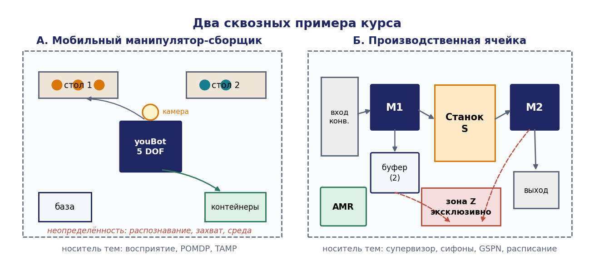
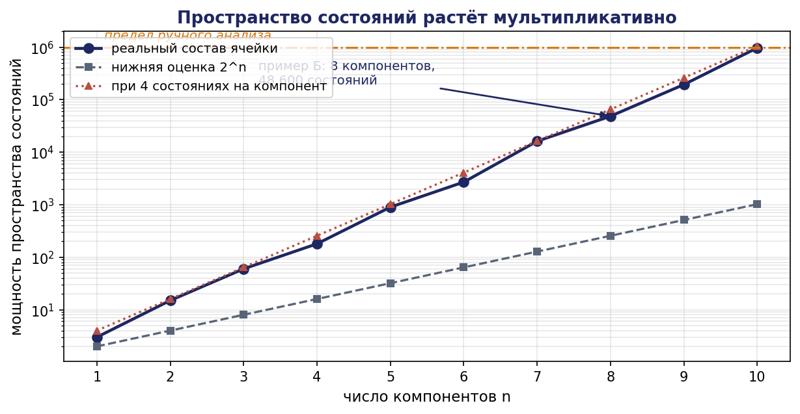
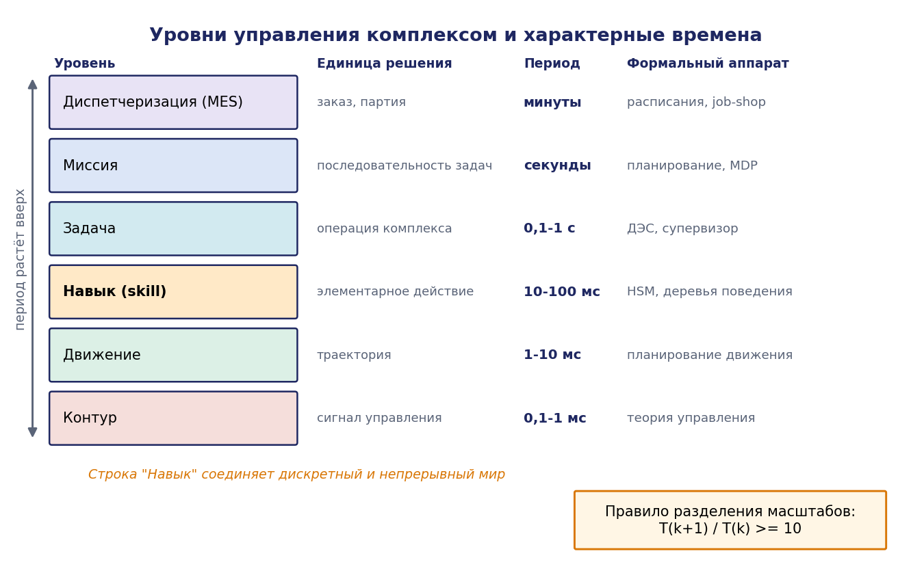
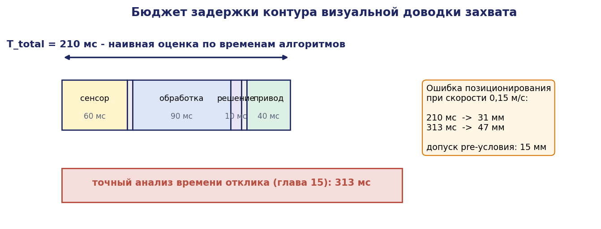
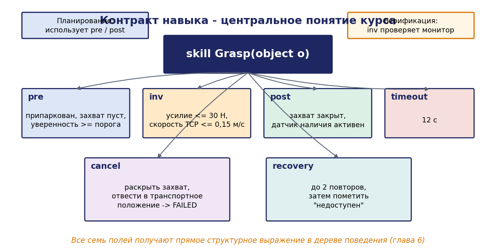
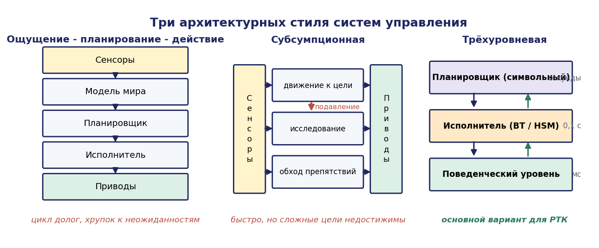
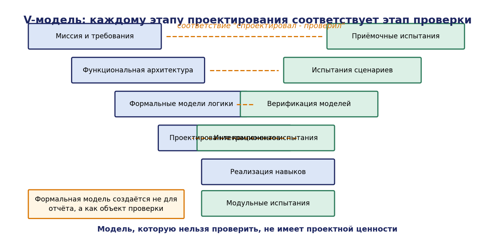

# Глава 1. Робототехнический комплекс как объект проектирования

## 1.1. Введение: почему комплекс — это не «робот, только больше»

Курс «Управление робототехническими комплексами» начинается там, где заканчивается курс управления отдельным роботом. Пока речь идёт об одном манипуляторе, выполняющем заданную последовательность операций, задача управления сводится к хорошо изученной цепочке: описать кинематику, синтезировать регуляторы приводов, спланировать траекторию, обеспечить требуемую точность отработки. Все компоненты этой цепочки имеют строгую математическую постановку, а инженерная работа состоит в грамотном применении известных методов.

Ситуация качественно меняется, когда объектом управления становится комплекс: мобильный робот с манипулятором, самостоятельно объезжающий помещение и собирающий предметы; производственная ячейка, в которой два промышленных манипулятора, обрабатывающий центр, конвейер и транспортный робот совместно выполняют технологический процесс. Каждая из этих систем состоит из компонентов, управление которыми по отдельности хорошо изучено, но их совместная работа порождает класс задач, не сводящийся к сумме задач подсистем.

Три обстоятельства делают комплекс самостоятельным объектом проектирования.

Первое — **параллелизм и разделяемые ресурсы**. Компоненты работают одновременно, конкурируя за пространство, оснастку, заготовки, зарядные станции, полосу пропускания сети. Локально корректное поведение каждого компонента не гарантирует корректности системы: два робота, каждый из которых безупречно выполняет свою программу, могут навсегда заблокировать друг друга, удерживая разные ресурсы и ожидая освобождения чужого.

Второе — **дискретная логика поверх непрерывной динамики**. Регулятор привода работает в непрерывном времени и оценивается по устойчивости и качеству переходного процесса. Логика миссии работает в дискретном событийном времени и оценивается по совершенно другим критериям: отсутствию тупиков, достижимости целевых состояний, гарантированной реакции на отказ. Комплекс требует согласования этих двух миров, и именно на их стыке возникает большинство аварий.

Третье — **неопределённость и отказы как штатная часть модели**. Одиночный манипулятор в клетке работает в детерминированной обстановке. Комплекс работает там, где заготовка может отсутствовать, захват может сорваться, распознавание может ошибиться, робот может выйти из строя, а человек может войти в рабочую зону. Проект, не описывающий эти сценарии, не является проектом комплекса.

Настоящая глава задаёт рамку: вводит терминологию, показывает источники сложности количественно, описывает иерархию уровней управления и характерные времена, разбирает основные архитектурные стили систем управления РТК, формулирует требования как проверяемые свойства и, наконец, даёт карту курса — таблицу соответствия «инженерный вопрос → формальная модель → глава пособия».

## 1.2. Терминология и классификация

### 1.2.1. Робот, ячейка, комплекс, линия

Терминология в отечественной и зарубежной литературе не унифицирована, поэтому зафиксируем определения, которыми пользуется курс.

**Промышленный робот** — автоматически управляемый, перепрограммируемый манипулятор с числом степеней подвижности не менее трёх, программируемый по трём и более осям, стационарный либо подвижный (определение ISO 8373). Ключевые слова — «перепрограммируемый» и «многоцелевой»: специализированный автомат с жёсткой циклограммой роботом не является.

**Роботизированная технологическая ячейка** (robotic cell, роботизированный технологический комплекс в узком смысле) — совокупность одного или нескольких роботов и обслуживаемого ими технологического оборудования, объединённых общей системой управления и выполняющих законченную технологическую операцию. Ячейка имеет физическую границу — ограждение, световой барьер, зону сканирования — и определённый интерфейс с внешним миром: вход заготовок, выход изделий, сигналы верхнего уровня.

**Робототехнический комплекс (РТК)** — система, объединяющая роботов, технологическое и вспомогательное оборудование, сенсорные подсистемы, вычислительные средства, сеть передачи данных, средства обеспечения безопасности и человека-оператора, предназначенная для автоматизированного выполнения совокупности задач. РТК может состоять из одной ячейки, но в общем случае включает несколько ячеек, транспортную подсистему и уровень диспетчеризации.

**Автоматизированная (гибкая производственная) линия** — последовательность ячеек, связанных транспортной системой, реализующая полный технологический маршрут изготовления изделия. Гибкость означает возможность переналадки на другую номенклатуру без изменения состава оборудования.

Различие между роботом и комплексом не количественное, а качественное, и его удобно фиксировать через понятие **границы ответственности за корректность**. Для робота корректность определяется относительно его собственной программы: если траектория отработана с заданной точностью, робот исправен. Для комплекса корректность определяется относительно технологического процесса и не может быть проверена ни на одном компоненте по отдельности.

### 1.2.2. Два сквозных примера курса

Всё пособие построено вокруг двух примеров, к которым последовательно применяются вводимые модели. Их выбор не случаен: они покрывают два наиболее востребованных класса РТК и обладают взаимно дополняющими свойствами.


**Пример А: мобильный манипулятор-сборщик.** Мобильная платформа с всенаправленными (меканум) колёсами несёт манипулятор с пятью степенями подвижности и двухпальцевый захват. На платформе установлены лидар для локализации, камера RGB-D на кисти манипулятора для распознавания и оценки положения предметов, датчики одометрии. Робот работает в помещении с известной планировкой, где на нескольких столах расставлены предметы разного типа. Миссия: обнаружить предметы, определить их тип, взять предметы заданных типов и доставить в соответствующие приёмные зоны, обеспечив завершение работы за отведённое время и возврат на базу.

Этот пример нагружен неопределённостью: распознавание ненадёжно, захват срывается, положение предмета известно с ошибкой, планировка может измениться. Он служит основным носителем тем восприятия, планирования при неопределённости, TAMP и деревьев поведения.

**Пример Б: производственная ячейка.** Ячейка состоит из входного конвейера, двух промышленных манипуляторов $M_1$ и $M_2$, обрабатывающего центра (станка) $S$, буферного накопителя B на две позиции, выходного конвейера и автономного транспортного робота (AMR), доставляющего паллеты между ячейкой и складом. Общими ресурсами являются зона перегрузки $Z$, доступная одновременно только одному манипулятору, и сам станок. Технологический маршрут: заготовка снимается $M_1$ со входного конвейера, помещается в буфер или сразу в станок, обрабатывается, извлекается $M_2$ и передаётся на выходной конвейер; готовые изделия периодически вывозятся AMR.

Этот пример нагружен параллелизмом и ресурсными конфликтами. Он служит основным носителем тем супервизорного синтеза, структурного анализа сетей Петри, тупиков, оценки пропускной способности, расписаний и координации нескольких роботов.




### 1.2.3. Классификация РТК по признакам, влияющим на выбор моделей

Инженерная классификация полезна лишь тогда, когда каждый её признак меняет проектное решение. Приведённые ниже пять признаков влияют на выбор формального аппарата.

**По характеру среды**: структурированная (положение оборудования и заготовок известно с точностью до допуска), частично структурированная (известна планировка, но не положение объектов), неструктурированная. Структурированная среда позволяет работать с дискретной моделью напрямую; частично структурированная требует слоя восприятия и планирования при неопределённости.

**По числу активных единиц**: одна, несколько (2–10), много (десятки и более). Переход от одной к нескольким требует явного управления ресурсами и координации; переход к «много» делает централизованные методы неприменимыми и выводит на распределённые протоколы.

**По жёсткости технологического маршрута**: жёсткий (последовательность операций фиксирована), маршрутно-гибкий (операция может выполняться разными единицами оборудования), полностью гибкий. Жёсткий маршрут описывается циклограммой; гибкий требует планирования и диспетчеризации.

**По уровню связанности с человеком**: полностью огороженный, с зонированным доступом, коллаборативный. Последний вариант радикально меняет требования безопасности и вводит нормативные ограничения на скорость, усилие и давление.

**По требованиям к времени реакции**: мягкое реальное время (пропуск дедлайна снижает качество), твёрдое (пропуск дедлайна — отказ). Второе требует анализа планируемости и оценки WCET.

## 1.3. Источники сложности: количественная оценка

Слово «сложный» в названии главы должно иметь измеримый смысл. Ниже показано, что сложность комплекса растёт не линейно с числом компонентов, и это обстоятельство определяет весь дальнейший выбор методов.

### 1.3.1. Комбинаторный рост пространства состояний

Пусть комплекс состоит из $n$ компонентов, каждый из которых описывается конечным автоматом с множеством состояний $X_i, i = 1, \ldots, n$. Если компоненты работают асинхронно и не имеют общих переменных, состояние системы есть кортеж $(x_1, \ldots, x_n)$, и множество состояний композиции есть декартово произведение:


```math
X = X_1 \times X_2 \times \ldots \times X_n, \quad \lvert X\rvert = \prod_{i=1}^{n} \lvert X_i\rvert
```

**Утверждение 1.1 (экспоненциальный рост).** Если $\lvert X_i\rvert \ge 2$ для всех $i$, то $\lvert X\rvert \ge 2^n$.

Доказательство очевидно из формулы произведения. Практический смысл менее очевиден. Рассмотрим пример Б. Даже при грубой дискретизации: входной конвейер — 3 состояния (пуст, деталь готова, заблокирован), $M_1$ — 5 состояний (свободен, движется к конвейеру, берёт, движется к цели, кладёт), станок — 4 состояния (пуст, загружен, обрабатывает, готово), буфер — 3 состояния (0, 1, 2 детали), $M_2$ — 5 состояний, выходной конвейер — 3, AMR — 6, зона $Z$ — 3 (свободна, занята $M_1$, занята $M_2$). Произведение:

$\lvert X\rvert = 3 \cdot 5 \cdot 4 \cdot 3 \cdot 5 \cdot 3 \cdot 6 \cdot 3 = 48\ 600$

Пятьдесят тысяч состояний для ячейки, которую человек описывает одной фразой. При добавлении второго станка и третьего манипулятора счёт идёт на миллионы. Ни нарисовать, ни проверить вручную такой автомат невозможно.

Отсюда следуют три стратегии, которым посвящён модуль I пособия:

- **композиция вместо построения**: система не рисуется целиком, а собирается операцией синхронной композиции из моделей компонентов (глава 2);
- **синтез вместо проектирования**: логика управления не пишется человеком, а вычисляется из модели оборудования и спецификации запретов (глава 3);
- **структурный анализ вместо перебора**: свойства проверяются по структуре модели, без построения полного пространства состояний (глава 4).




### 1.3.2. Параллелизм и чередования

Комбинаторный взрыв состояний — лишь половина проблемы. Вторая половина — число возможных **порядков** событий. Если $n$ компонентов независимо выполняют по $k$ шагов, число различных чередований (interleavings) равно мультиномиальному коэффициенту:

```math
N = (n\cdot k)! / (k!)^n
```

Для $n = 3$ компонентов по $k = 4$ шага: $N = 12!/(4!)^3 = 479\ 001\ 600 / 13\ 824 = 34\ 650$. Ошибка, проявляющаяся лишь при одном конкретном чередовании из тридцати четырёх тысяч, при тестировании не воспроизводится и не диагностируется. Такие дефекты — гейзенбаги — не устраняются отладкой, они устраняются либо доказательством их невозможности, либо структурным запретом.

Это принципиальный аргумент в пользу формальных методов в проектировании РТК: тестирование параллельной системы обнаруживает наличие ошибок, но никогда не подтверждает их отсутствие.

### 1.3.3. Разделяемые ресурсы и тупики

Классический пример: два манипулятора, каждому для выполнения операции нужны оснастка A и зона $Z$. $M_1$ захватывает A и запрашивает $Z; M_2$ захватывает $Z$ и запрашивает A. Система переходит в состояние, из которого нет исходящих переходов, — **тупик** (deadlock).

Условия возникновения тупика (Коффман, 1971) выполняются одновременно:

1. взаимное исключение — ресурс не может использоваться двумя процессами одновременно;
2. удержание и ожидание — процесс удерживает ресурс, запрашивая следующий;
3. отсутствие вытеснения — ресурс не отбирается принудительно;
4. круговое ожидание — существует цикл процессов, каждый из которых ждёт ресурс, удерживаемый следующим.

Все четыре условия в РТК выполняются естественным образом: физическую зону нельзя разделить, робот не может «отдать» деталь в воздухе, отобрать оснастку у работающего робота нельзя. Значит, тупики в комплексе — не экзотика, а норма, требующая явного противодействия. Глава 4 показывает, как выразить причину тупика структурно (через пустеющие сифоны сети Петри) и как синтезировать политику, гарантирующую его отсутствие.

### 1.3.4. Неопределённость

Источники неопределённости в РТК удобно классифицировать по месту возникновения:

| Источник | Пример в примере А | Пример в примере Б | Модель |
|---|---|---|---|
| Сенсорный шум | ошибка оценки позы предмета | датчик присутствия детали | вероятностная оценка состояния |
| Ошибка классификации | предмет отнесён не к тому типу | — | матрица ошибок, порог доверия |
| Недетерминизм исполнения | захват сорвался | деталь перекосило в патроне | стохастический переход |
| Изменчивость среды | предмет переставлен | заготовка отсутствует | перепланирование |
| Отказ компонента | отказ привода | отказ станка | режимы деградации |

Наличие неопределённости означает, что детерминированная модель — это модель номинального сценария, а не системы. Проект РТК обязан включать отказные сценарии, и именно они, а не номинальный цикл, определяют структуру исполнительной логики.

### 1.3.5. Гетерогенность и интеграция

Компоненты комплекса поставляются разными производителями, программируются на разных языках, имеют разные интерфейсы, разные представления времени и разные единицы измерения. Значительная часть проектных ошибок возникает не внутри компонентов, а на их стыках: несогласованные системы координат, разные единицы, разное понимание момента времени, к которому относится измерение, разные соглашения об инициализации и о поведении при потере связи.

Инженерный вывод: **интерфейс — это проектный артефакт**, требующий такого же явного описания, как и алгоритм. Для каждого интерфейса фиксируются: источник, приёмник, тип данных, единицы, система координат, частота, допустимая задержка, поведение при отсутствии данных, поведение при разрыве связи.

## 1.4. Уровни управления и характерные времена

### 1.4.1. Иерархия

Управление комплексом организуется иерархически: каждый уровень принимает решения в своём масштабе времени и своей системе понятий, передавая вниз задание, а вверх — состояние и результат.


| Уровень | Единица решения | Горизонт | Период | Формальный аппарат |
|---|---|---|---|---|
| Диспетчеризация (MES) | заказ, партия | часы — смена | минуты | расписания, job-shop |
| Миссия | последовательность задач | минуты — часы | секунды | планирование задач, MDP |
| Задача | операция комплекса | десятки секунд | 0,1–1 с | дискретно-событийные модели, супервизор |
| Навык (skill) | элементарное действие | секунды | 10–100 мс | иерархические автоматы, BT |
| Движение | траектория | секунды | 1–10 мс | планирование движения |
| Контур | сигнал управления | миллисекунды | 0,1–1 мс | теория автоматического управления |

Строка «Навык» — ключевая для курса. Навык есть единица, соединяющая дискретный и непрерывный мир: сверху он выглядит как атомарное действие с предусловием и эффектом, снизу — как замкнутый контур управления с критерием завершения.




### 1.4.2. Правило разделения масштабов времени

Иерархия работоспособна при выполнении условия разделения масштабов времени: период уровня $k$ должен быть существенно меньше характерного времени изменения задания, приходящего с уровня k+1. Эмпирическое инженерное правило:

```math
T_{k+1} / T_k \ge 10
```

Нарушение этого условия приводит к тому, что верхний уровень перепланирует быстрее, чем нижний успевает отработать задание, и система входит в режим «дребезга» решений — постоянного переключения без достижения цели. Это одна из типовых проектных ошибок: планировщик миссии, вызываемый с частотой контура управления, не улучшает поведение, а разрушает его.

### 1.4.3. Бюджет задержки контура

Для любого контура «сенсор → обработка → решение → привод» суммарная задержка складывается из составляющих:


```math
T_{\mathrm{total}} = T_{\mathrm{sens}} + T_{\mathrm{comm}} + T_{\mathrm{proc}} + T_{\mathrm{dec}} + T_{\mathrm{comm}}' + T_{\mathrm{act}}
```

Требование к контуру формулируется как ограничение $T_{\mathrm{total}} \le T_{\max}$, где $T_{\max}$ определяется физикой задачи. Для контура объезда препятствия мобильным роботом:

```math
T_{\max} = (d_{\mathrm{detect}} - d_{\mathrm{safe}}) / v - v / (2\cdot a_{\max})
```

где $d_{\mathrm{detect}}$ — дальность обнаружения, $d_{\mathrm{safe}}$ — минимальная безопасная дистанция, $v$ — скорость движения, $a_{\max}$ — максимальное замедление. Второе слагаемое учитывает тормозной путь.

**Числовой пример.** Лидар обнаруживает препятствие на $d_{\mathrm{detect}} = 5$ м, требуемая безопасная дистанция $d_{\mathrm{safe}} = 0{,}3$ м, скорость $v = 1{,}2$ м/с, замедление $a_{\max} = 1{,}5$ м/с². Тогда:

```math
T_{\max} = (5 - 0{,}3)/1{,}2 - 1{,}2/(2\cdot 1{,}5) = 3{,}917 - 0{,}4 = 3{,}52 \text{ с }
```

Запас велик, и контур можно строить на программном уровне. Если же скорость поднять до $v = 3$ м/с при том же лидаре:

```math
T_{\max} = (5 - 0{,}3)/3 - 3/3 = 1{,}567 - 1{,}0 = 0{,}567 \text{ с }
```

Запас сократился в шесть раз, и теперь задержка сети и время обработки облака точек становятся критичными. При $v = 4{,}5$ м/с получаем $T_{\max} = 1{,}044 - 1{,}5 < 0$, то есть **задача не решается ни при какой скорости вычислений** — требуется либо более дальнобойный сенсор, либо ограничение скорости. Это типичный пример того, как проектное ограничение выводится из арифметики, а не из опыта.

Такое рассуждение — обязательный элемент проекта комплекса. Глава 15 разворачивает его до полной модели планируемости.




## 1.5. Архитектурные стили систем управления РТК

Архитектура определяет, как функции распределены между компонентами и как эти компоненты взаимодействуют. Исторически сложилось несколько стилей, каждый из которых был ответом на недостатки предыдущего.

### 1.5.1. Иерархическая архитектура «ощущение — планирование — действие»

Классическая схема (sense–plan–act, SPA), доминировавшая до середины 1980-х годов: сенсорные данные собираются в единую модель мира, планировщик строит по ней полный план, исполнитель отрабатывает план по шагам.

Достоинства: концептуальная ясность, возможность доказательства оптимальности плана, естественная поддержка сложных задач.

Недостатки, обнаруженные на практике: цикл «восприятие → модель → план» слишком долог для реакции на внезапные изменения; ошибка в модели мира распространяется на весь план; система хрупка к неожиданностям. Классический контрпример — робот Shakey, тратящий минуты на планирование перемещения через комнату.

### 1.5.2. Реактивная и субсумпционная архитектура

Р. Брукс (1986) предложил отказаться от единой модели мира: поведение робота складывается из слоёв простых правил «условие → действие», работающих параллельно и напрямую связывающих сенсоры с приводами. Слои упорядочены по приоритету, верхние подавляют (subsume) нижние.

Достоинства: минимальная задержка реакции, устойчивость к неточностям модели, простота реализации.

Недостатки: невозможность формулировать и достигать сложные составные цели, отсутствие явного представления задачи, трудность верификации при большом числе слоёв, непредсказуемость эмерджентного поведения.

### 1.5.3. Трёхуровневая архитектура

Компромисс, ставший фактическим стандартом для автономных РТК (3T, ATLANTIS, LAAS, CLARAty). Три уровня:

- **Планировщик (deliberative layer)** — работает с символьным представлением, строит план на горизонте задачи, период секунды и более;
- **Исполнитель (executive / sequencing layer)** — разворачивает план в последовательность навыков, следит за условиями, обрабатывает исключения, период десятки—сотни миллисекунд;
- **Поведенческий/функциональный уровень (reactive layer)** — замкнутые контуры и элементарные поведения, период единицы миллисекунд.

Исполнитель является ключевым и наиболее сложным элементом: именно он реализует дискретную логику миссии. Исторически исполнитель писали как конечный автомат (RAP, PRS, SMACH); современная практика использует деревья поведения. Модуль I пособия посвящён именно этому уровню.

### 1.5.4. Компонентно-навыковая архитектура

Современный подход, ориентированный на промышленную интеграцию: система собирается из компонентов с явно описанными интерфейсами, а поведение выражается через **навыки** — параметризованные действия с формальным контрактом:


```math
\mathit{skill} = \langle \mathit{name}, \mathit{params}, \mathit{pre}, \mathit{inv}, \mathit{post}, \mathit{timeout}, \mathit{cancel}, \mathit{recovery}\rangle
```

где pre — предусловие (при каких условиях навык может быть запущен), inv — инвариант (что должно оставаться истинным во время выполнения), post — постусловие (что гарантируется при успешном завершении), timeout — предельная длительность, cancel — процедура прерывания, recovery — реакция на отказ.

Контракт навыка — центральное понятие всего курса. Он делает возможным и планирование (планировщик оперирует pre/post), и верификацию (инварианты проверяются монитором), и композицию (навыки соединяются деревом поведения), и оценку безопасности (recovery определяет поведение при отказе).




### 1.5.5. Сравнение стилей

| Критерий | SPA | Субсумпция | Трёхуровневая | Компонентно-навыковая |
|---|---|---|---|---|
| Задержка реакции | высокая | минимальная | низкая на нижнем уровне | низкая |
| Сложные цели | да | нет | да | да |
| Верифицируемость | плана — да, системы — нет | низкая | средняя | высокая при формальных контрактах |
| Масштабируемость | низкая | средняя | высокая | высокая |
| Порог входа | средний | низкий | высокий | высокий |
| Пригодность для РТК | ограниченно | только вспомогательный слой | основной вариант | основной вариант |


Практический вывод для проекта курса: базовой архитектурой принимается трёхуровневая с компонентно-навыковой организацией исполнительного уровня, с обязательным независимым защитным слоем (глава 9 и глава 16).




### 1.5.6. Принцип независимости защитного слоя

Отдельно выделим принцип, который проходит через всё пособие и является ключевым отличием инженерного проекта от исследовательского прототипа:

**Защитные функции не должны зависеть от планировщика, от системы восприятия и от каналов связи.**

Обоснование: планировщик может выдать некорректный план, нейросетевой детектор может ошибиться произвольным образом (и, в отличие от классического алгоритма, не даёт оценки собственной ошибки), сеть может разорваться. Если останов при появлении человека в зоне реализуется через цепочку «камера → детектор → планировщик → команда останова», то отказ любого звена этой цепочки приводит к аварии. Правильная реализация — независимый аппаратный или сертифицированный программный контур с собственным датчиком (световой барьер, сканер безопасности), не проходящий через интеллектуальные компоненты.

## 1.6. Жизненный цикл и модельно-ориентированное проектирование

### 1.6.1. V-модель применительно к РТК

Проект комплекса удобно организовывать по V-модели, где каждому этапу декомпозиции слева соответствует этап проверки справа:


| Слева (проектирование) | Справа (проверка) |
|---|---|
| Миссия и требования заказчика | Приёмочные испытания |
| Функциональная архитектура | Испытания сценариев |
| Формальные модели логики | Верификация моделей (model checking) |
| Проектирование компонентов | Интеграционные испытания |
| Реализация навыков | Модульные испытания |

Существенно, что строке «Формальные модели логики» соответствует строка «Верификация моделей». Это означает: формальная модель создаётся не для отчёта, а как объект, к которому применяется проверка. Модель, которую нельзя проверить, не имеет проектной ценности.




### 1.6.2. Модельно-ориентированное проектирование

Модельно-ориентированный подход (MBSE) состоит в том, что центральным артефактом проекта является не документ, а модель, из которой документы, код и тесты порождаются автоматически или полуавтоматически. Для РТК это означает наличие связной цепочки моделей:

требования (структурированный текст, LTL) → функциональная архитектура (SysML/IDEF0) → дискретно-событийная модель (автоматы, сети Петри) → исполнительная логика (BT/HSM) → код → тесты

Каждый переход в этой цепочке либо автоматизируем (синтез супервизора, генерация монитора из формулы LTL, кодогенерация), либо проверяем (соответствие реализации модели проверяется трассами).

Для описания функциональной архитектуры в отечественной практике распространены диаграммы IDEF0 (функция с входом, выходом, управлением и механизмом), в международной — SysML (диаграммы блоков, внутренние блоки, деятельности, состояний, требований). Для целей курса достаточно IDEF0 или блочных диаграмм SysML; выбор нотации менее важен, чем строгость описания интерфейсов.

## 1.7. Требования как проверяемые свойства

### 1.7.1. Критерий качества требования

Требование пригодно для инженерной работы, если оно допускает однозначную процедуру проверки. Формально: требование $R$ задано корректно, если определены

- **наблюдаемая величина** — что именно измеряется;
- **условия наблюдения** — при каком состоянии системы и среды;
- **процедура измерения** — как получается значение;
- **критерий** — допустимая область значений;
- **последствие нарушения** — что считается отказом.

Сравним формулировки:

*Плохо:* «Робот должен надёжно распознавать детали.» Не определены ни метрика, ни условия, ни порог.

*Хорошо:* «При освещённости 200–800 лк и расстоянии до детали 0,3–1,0 м доля верно классифицированных деталей на контрольной выборке из 200 предъявлений составляет не менее 0,95 при доле ложных срабатываний не более 0,02; нарушение порога классифицируется как отказ подсистемы восприятия и переводит комплекс в режим запроса оператора.»

### 1.7.2. Классификация свойств: безопасность и живость

Фундаментальное разделение, восходящее к Лампорту, различает два класса свойств.

**Свойство безопасности (safety)**: «ничего плохого никогда не происходит». Формально — свойство, нарушение которого обнаруживается на конечном префиксе трассы. Примеры: «зона $Z$ никогда не занята двумя роботами одновременно»; «скорость в присутствии человека не превышает 0,25 м/с».

**Свойство живости (liveness)**: «нечто хорошее в конце концов происходит». Формально — свойство, которое не может быть нарушено на конечном префиксе: для любого конечного префикса существует продолжение, на котором свойство выполняется. Примеры: «каждая поступившая заготовка в конце концов покидает ячейку»; «запрос на обслуживание в конце концов удовлетворяется».

**Теорема 1.1 (Альперн и Шнайдер, 1985).** Всякое свойство трасс представимо как пересечение некоторого свойства безопасности и некоторого свойства живости.

Практический смысл теоремы для проектировщика: любое требование к комплексу может и должно быть разложено на безопасностную и живостную составляющие, и эти составляющие проверяются принципиально разными средствами. Безопасность проверяется мониторингом во время исполнения (нарушение видно в момент возникновения); живость мониторингом не проверяется в принципе — она проверяется анализом модели либо аппроксимируется ограничением по времени («в течение 60 с» превращает свойство живости в свойство безопасности).

Это объясняет, почему в проекте РТК недостаточно мониторов: отсутствие тупиков и голодания — свойства живости, и они устанавливаются анализом модели (главы 3, 4, 7), а не наблюдением за работающей системой.

### 1.7.3. Трассируемость

Матрица трассируемости связывает каждое требование с моделью, в которой оно выражено, с тестом, который его проверяет, и с артефактом, подтверждающим результат:

| Требование | Формализация | Модель | Проверка | Артефакт | Остаточный риск |
|---|---|---|---|---|---|
| R1: зона $Z$ эксклюзивна | $G \neg(z_1 \wedge z_2)$ | сеть Петри ячейки | $P$-инвариант + монитор | отчёт анализа, лог | отказ датчика присутствия |
| R2: деталь доходит до выхода | $G$(вход → F выход) | автомат ячейки | model checking | контрпример отсутствует | блокировка при отказе станка |

Матрица заполняется с первого занятия и является одним из основных артефактов сквозного проекта.

## 1.8. Карта курса: какая модель отвечает на какой вопрос

Главная методическая идея пособия: формальная модель вводится не как самоцель, а как ответ на конкретный инженерный вопрос, который иначе не имеет ответа. Таблица ниже — карта всего курса.

| Инженерный вопрос | Аппарат | Глава |
|---|---|---|
| Как из моделей единиц оборудования получить модель ячейки? | синхронная композиция автоматов | 2 |
| Как получить логику управления, а не рисовать её вручную? | супервизорный синтез Рамаджа–Вонэма | 3 |
| Почему ячейка встала и как гарантировать, что не встанет? | сифоны, ловушки, инварианты сетей Петри | 4 |
| Сколько деталей в час даст линия и где узкое место? | GSPN, временные сети, max-plus | 5 |
| Как описать миссию из 40 состояний и не утонуть? | statecharts, деревья поведения | 6 |
| Как проверить требование, а не понадеяться на тесты? | LTL/CTL, model checking | 7 |
| Как получить контроллер прямо из формулировки миссии? | синтез по LTL, GR(1) | 8 |
| Как совместить дискретную логику с непрерывным контуром безопасно? | гибридные автоматы, мониторы, CBF | 9 |
| Как из цели получить последовательность действий? | PDDL, HTN, STN | 10 |
| Что делать, если символьный план геометрически невыполним? | TAMP | 11 |
| Как решать, когда данные неполны и ненадёжны? | MDP, POMDP | 12 |
| Как распределить задачи и развести роботов без столкновений? | MRTA, аукционы, MAPF | 13 |
| Как составить производственное расписание? | job-shop, FJSP, диаграмма Гантта | 14 |
| Уложится ли система в дедлайны? | RM/EDF, WCET, анализ загрузки | 15 |
| Что произойдёт при отказе и допустимо ли это? | FMEA, FTA, FDIR, ISO 13849 | 16 |
| Как доказать, что комплекс готов к сдаче? | V&V, цифровой двойник, матрица трассируемости | 17 |

## 1.9. Разбор: постановка задачи для сквозного проекта

Продемонстрируем применение материала главы к примеру А, доведя постановку до состояния, пригодного для дальнейшей формализации.

**Шаг 1. Миссия.** «За время не более 15 минут собрать со столов все предметы типов „болт" и „гайка" и разложить их в контейнеры соответствующего типа, после чего вернуться на базу.»

**Шаг 2. Границы системы.** Внутри системы: мобильная платформа, манипулятор, захват, лидар, камера, бортовой вычислитель, программное обеспечение. Вне системы: планировка помещения, столы, предметы, контейнеры, оператор, сеть питания. Интерфейсы: команда пуска от оператора, сигнал аварийного останова, отчёт о выполнении.

**Шаг 3. Декомпозиция миссии на задачи.**
- обследовать столы и построить список обнаруженных предметов;
- для каждого предмета целевого типа: подъехать, взять, довезти, положить;
- вернуться на базу и сформировать отчёт.

**Шаг 4. Выделение навыков.** Из задач извлекаются навыки с контрактами. Пример контракта:

```
skill Grasp(object o)
  params:  o.pose (кадр map), o.type, подход сверху
  pre:     робот припаркован у стола, |pose_error| ≤ 15 мм,
           захват пуст, o распознан с уверенностью ≥ 0.8
  inv:     усилие захвата ≤ 30 Н,
           локоть манипулятора вне зоны стола,
           скорость TCP ≤ 0.15 м/с
  post:    захват закрыт, датчик наличия объекта активен,
           o зарегистрирован как «в захвате»
  timeout: 12 с
  cancel:  раскрыть захват, отвести манипулятор в транспортное
           положение, вернуть FAILED
  recovery: до 2 повторов с уточнением позы;
           затем пометить o как «недоступен» и продолжить миссию
```

**Шаг 5. Требования как проверяемые свойства.**

| № | Требование | Класс | Формализация |
|---|---|---|---|
| R1 | Манипулятор не движется при движении базы | безопасность | $G \neg(\text{base_moving} \wedge \text{arm_moving})$ |
| R2 | Захваченный предмет не теряется до укладки | безопасность | G(held → held U placed) |
| R3 | Каждый обнаруженный целевой предмет либо уложен, либо помечен недоступным | живость | $G(\mathit{detected} \to F(\mathit{placed} \vee \mathit{unreachable}))$ |
| R4 | Миссия завершается за 15 мин | безопасность (с таймером) | $G(\mathit{start} \to F_{\le 900\text{ с }} \mathit{done})$ |
| R5 | При аварийном останове движение прекращается за 0,5 с | безопасность | $G(\mathit{estop} \to F_{\le 0{,}5\text{ с }} \mathit{stopped})$ |

**Шаг 6. Бюджет задержки.** Для контура захвата: обновление позы предмета камерой $T_{\mathrm{sens}} = 60$ мс, передача $T_{\mathrm{comm}} = 5$ мс, обработка изображения $T_{\mathrm{proc}} = 90$ мс, решение $T_{\mathrm{dec}} = 10$ мс, отработка приводом $T_{\mathrm{act}} = 40$ мс. Итого $T_{\mathrm{total}} = 205$ мс. При скорости сближения TCP 0,15 м/с ошибка позиционирования из-за задержки составит $0{,}15 \cdot 0{,}205 \approx 31$ мм, что превышает допуск pre-условия в 15 мм. Вывод: либо снизить скорость сближения до 0,07 м/с, либо перейти на визуальную сервоуправление с предсказанием. Это проектное решение, полученное арифметикой на этапе постановки, а не отладкой на роботе.

Заметим, что уже на этапе постановки задачи, до введения какого-либо формального аппарата, из требований и арифметики получены три нетривиальных проектных решения: ограничение скорости сближения, необходимость независимого контура аварийного останова и необходимость обработки случая «предмет недоступен» в логике миссии.

## 1.10. Выводы

1. Комплекс отличается от робота качественно: параллелизмом, разделяемыми ресурсами, стыком дискретной и непрерывной динамики, обязательным учётом неопределённости и отказов.
2. Пространство состояний комплекса растёт экспоненциально с числом компонентов, а число чередований — факториально. Это делает ручное проектирование и тестирование логики принципиально недостаточными и обосновывает применение композиции, синтеза и структурного анализа.
3. Иерархия уровней управления работоспособна при разделении масштабов времени не менее чем на порядок; бюджет задержки контура рассчитывается и служит источником проектных ограничений.
4. Базовая архитектура РТК — трёхуровневая с компонентно-навыковым исполнительным уровнем; контракт навыка $\langle \mathit{pre}, \mathit{inv}, \mathit{post}, \mathit{timeout}, \mathit{cancel}, \mathit{recovery}\rangle$ является центральным проектным понятием курса.
5. Защитные функции проектируются независимо от планировщика, восприятия и сети.
6. Требование пригодно для работы только как проверяемое свойство; всякое свойство раскладывается на безопасность и живость, которые проверяются принципиально разными средствами.

## 1.11. Контрольные вопросы

1. Приведите пример системы, содержащей промышленный робот, но не являющейся РТК, и обоснуйте.
2. Оцените мощность пространства состояний для примера Б при добавлении второго станка и третьего манипулятора. Во сколько раз она вырастет?
3. Почему тестирование не может подтвердить отсутствие ошибок в параллельной системе? Приведите оценку числа чередований для 4 компонентов по 3 шага.
4. Какие из условий Коффмана можно нарушить в производственной ячейке технически, а какие — нет? Что из этого следует для стратегии борьбы с тупиками?
5. Сформулируйте требование «робот должен быстро реагировать на препятствие» как проверяемое свойство.
6. Отнесите к безопасности или живости: (а) «два робота никогда не входят в зону одновременно»; (б) «заготовка не задерживается в буфере более 5 минут»; (в) «система в конце концов обрабатывает все заказы». Обоснуйте.
7. Почему монитор времени исполнения не может проверить свойство живости?
8. Рассчитайте $T_{\max}$ для контура объезда при $d_{\mathrm{detect}} = 8$ м, $d_{\mathrm{safe}} = 0{,}5$ м, $v = 2$ м/с, $a_{\max} = 2$ м/с².
9. Какая максимальная скорость движения допустима в условиях предыдущей задачи, если суммарная задержка контура составляет 0,4 с?
10. Приведите пример нарушения принципа независимости защитного слоя и предложите исправление.

## 1.12. Задачи

**Задача 1.1.** Ячейка состоит из конвейера (3 состояния), робота (6), станка (4) и буфера на 3 позиции. Постройте оценку мощности пространства состояний. Сколько бит требуется для кодирования состояния? Оцените объём памяти для хранения графа достижимости при 20 байтах на состояние.

**Задача 1.2.** Для примера Б выпишите все разделяемые ресурсы и для каждого укажите, какие из условий Коффмана для него выполняются.

**Задача 1.3.** Составьте контракт навыка `MoveTo(pose)` для мобильной платформы примера А, включая инвариант безопасности, таймаут и процедуру восстановления при недостижимости цели.

**Задача 1.4.** Постройте бюджет задержки для контура «лидар → локализация → планировщик локальных траекторий → привод» при периодах: лидар 10 Гц, локализация 20 мс, планировщик 50 мс, привод 5 мс. Какова максимальная безопасная скорость при $d_{\mathrm{detect}} = 4$ м и $a_{\max} = 1{,}2$ м/с²?

**Задача 1.5.** Сформулируйте пять требований к примеру Б в виде проверяемых свойств, отнесите каждое к безопасности или живости и заполните для них матрицу трассируемости.

## 1.13. Литература к главе

1. Носков В. П., Рубцов И. В. Управление роботами и робототехническими комплексами. — М.: МГТУ им. Н. Э. Баумана.
2. Ющенко А. С., Зенкевич С. Л. Основы управления манипуляционными роботами. — М.: МГТУ им. Н. Э. Баумана, 2004.
3. Siciliano B., Khatib O. (eds.) Springer Handbook of Robotics. 2nd ed. — Springer, 2016. Ch. 12 «Robotic Systems Architectures and Programming».
4. Brooks R. A. A Robust Layered Control System for a Mobile Robot // IEEE Journal of Robotics and Automation. — 1986. — Vol. 2, No. 1. — P. 14–23.
5. Gat E. On Three-Layer Architectures // Artificial Intelligence and Mobile Robots. — AAAI Press, 1998.
6. Alpern B., Schneider F. B. Defining Liveness // Information Processing Letters. — 1985. — Vol. 21, No. 4. — P. 181–185.
7. Coffman E. G., Elphick M. J., Shoshani A. System Deadlocks // ACM Computing Surveys. — 1971. — Vol. 3, No. 2. — P. 67–78.
8. ISO 8373:2021. Robotics — Vocabulary.
9. Bøgh S., Nielsen O. S., Pedersen M. R. et al. Does your robot have skills? // Proc. of the 43rd International Symposium on Robotics, 2012.
