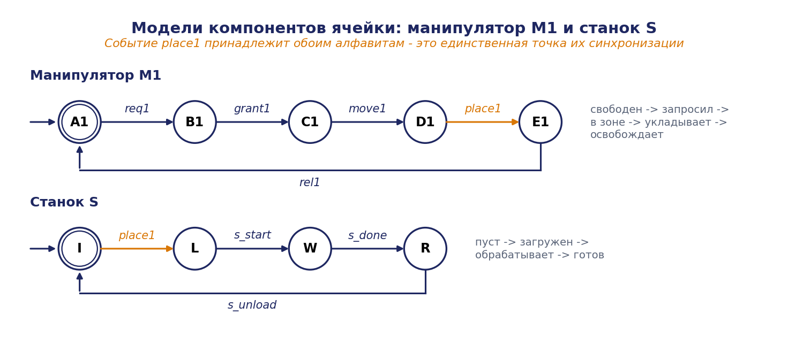
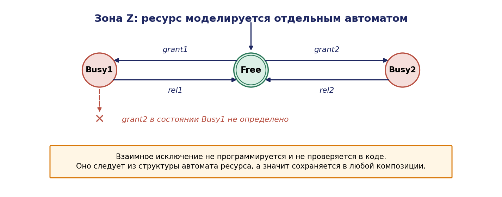
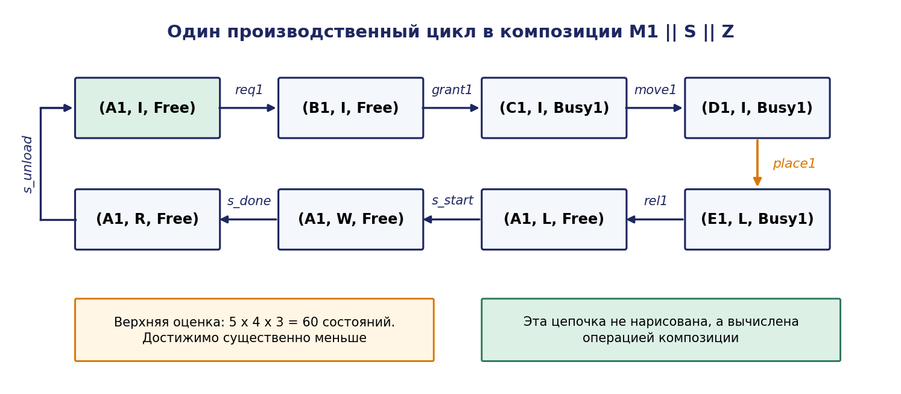
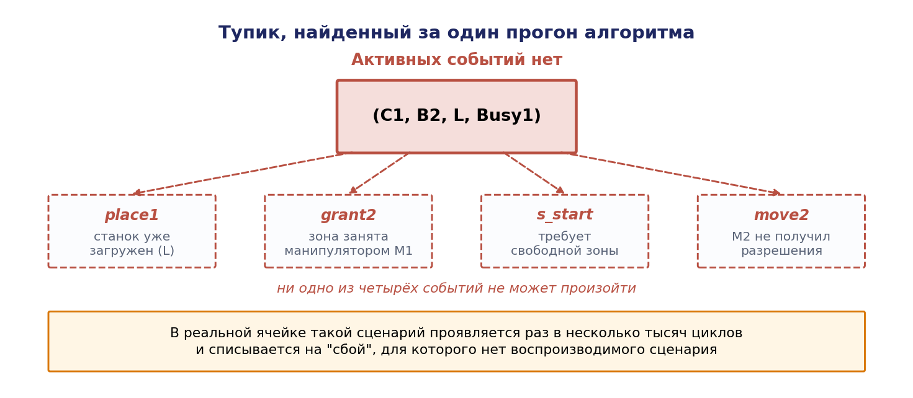
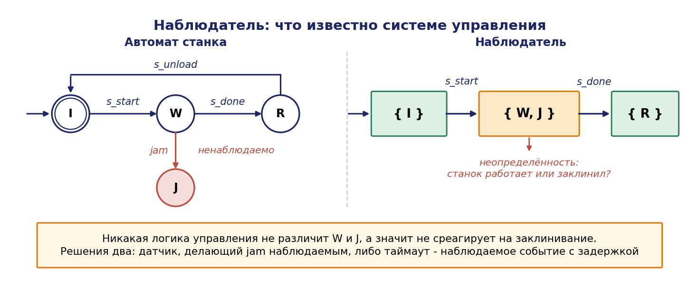

# Глава 2. Дискретно-событийные системы: языки, автоматы, композиция

## 2.1. Введение: зачем нужен отдельный формализм

Базовый курс теории автоматов рассматривает конечный автомат как преобразователь входного слова в выходное: автомат Мили, автомат Мура, таблица переходов, минимизация. Такой взгляд достаточен для проектирования устройства, но недостаточен для проектирования комплекса. Причина в том, что комплекс не «принимает вход и выдаёт выход» — он **порождает поведение**, и вопрос проектировщика ставится иначе: какие последовательности событий физически возможны в системе, какие из них допустимы технологически, и как ограничить систему так, чтобы возможными остались только допустимые.

Формализм, отвечающий на эти вопросы, — теория **дискретно-событийных систем** (discrete event systems, DES). Он был развит в 1980-х годах в работах П. Рамаджа и У. М. Вонэма, К. Кассандраса и С. Лафортюна и сегодня составляет теоретическую основу проектирования логики управления производственными системами.

Сдвиг точки зрения состоит в следующем.

| Базовый курс КА | Теория ДЭС |
|---|---|
| Автомат преобразует слово | Автомат порождает язык |
| Вопрос: какой выход при данном входе? | Вопрос: какие трассы возможны? |
| Основная операция: минимизация | Основные операции: композиция, проекция, синтез |
| Модель — устройство | Модель — процесс, ограничиваемый супервизором |
| Один автомат | Много взаимодействующих автоматов |

Практическая ценность этого сдвига проявляется немедленно. Модель ячейки из примера Б содержит десятки тысяч состояний (глава 1), и нарисовать её вручную невозможно. Но её и не нужно рисовать: она **вычисляется** операцией композиции из моделей отдельных единиц оборудования, каждая из которых имеет 3–6 состояний и умещается на четверти страницы. Именно эта возможность — собирать сложное из простого формально корректным способом — делает теорию ДЭС инженерным инструментом, а не академическим упражнением.

Настоящая глава вводит аппарат, на котором построены главы 3 и 4: язык системы, автомат как его генератор, свойства достижимости и неблокируемости, операции композиции и проекции, работа при частичной наблюдаемости и диагностика отказов.

## 2.2. События, трассы, языки

### 2.2.1. Событие и алфавит

**Событием** называется мгновенное изменение, значимое для управления и различимое системой. Событие атомарно (не имеет длительности), мгновенно (не имеет внутренней структуры) и наблюдается как факт, а не как процесс.

Примеры событий в примере Б: `start_M1` (манипулятор $M_1$ начал движение), `pick_done_M1` ($M_1$ завершил захват), `part_arrived` (деталь поступила на входной конвейер), `machine_done` (станок завершил обработку), `fail_M2` (отказ манипулятора $M_2$).

Обратим внимание на существенную тонкость: «манипулятор перемещается» — не событие, а состояние; событиями являются «начал перемещаться» и «закончил перемещаться». Типовая ошибка проектирования состоит в смешении этих категорий, приводящем к моделям, в которых невозможно выразить длительность и прерывание операции.

Конечное множество событий $\Sigma$ называется **алфавитом** системы.

### 2.2.2. Трассы и язык

**Трассой** (словом, строкой) $s$ называется конечная последовательность событий $s = \sigma_1\sigma_2\ldots \sigma_n, \sigma_i \in \Sigma$. Длина трассы обозначается $\lvert s\rvert$; пустая трасса обозначается $\varepsilon, \lvert \varepsilon \rvert = 0$. Множество всех конечных трасс над $\Sigma$ обозначается $\Sigma^{*}$ (замыкание Клини).

**Языком** над алфавитом $\Sigma$ называется произвольное подмножество $L \subseteq \Sigma^{*}$.

Язык — это математический объект, которым описывается поведение системы: $L$ есть множество всех последовательностей событий, которые система способна породить.

Трасса $u$ называется **префиксом** трассы $s$, если существует трасса $v$ такая, что $s = uv$. Обозначение: $u \le s$.

**Префиксным замыканием** языка $L$ называется язык

```math
\overline{L} = \lbrace u \in \Sigma^{*} : \exists v \in \Sigma^{*}, uv \in L \rbrace
```

то есть множество всех префиксов всех трасс языка $L$. Язык называется **префиксно-замкнутым**, если $L = \overline{L}$.

Физический смысл: поведение реальной системы всегда префиксно-замкнуто — если система может выполнить трассу $s$, то она прошла через все её префиксы. Языки, не являющиеся префиксно-замкнутыми, используются для описания **заданий** (задача считается выполненной только по завершении полной трассы).

### 2.2.3. Пример

Рассмотрим упрощённую модель станка с алфавитом $\Sigma = \lbrace \mathit{start}, \mathit{done}, \mathit{fail}, \mathit{repair} \rbrace$. Возможное поведение описывается языком

```math
L = \lbrace \varepsilon, \mathit{start}, \mathit{start}\cdot \mathit{done}, \mathit{start}\cdot \mathit{fail}, \mathit{start}\cdot \mathit{fail}\cdot \mathit{repair}, \mathit{start}\cdot \mathit{done}\cdot \mathit{start}, \ldots \rbrace
```

Этот язык префиксно-замкнут. Язык завершённых производственных циклов

```math
L_m = \lbrace(\mathit{start}\cdot \mathit{done})^n : n \ge 1 \rbrace
```

префиксно-замкнутым не является: трасса `start` принадлежит $\overline{L}_m$, но не $L_m$, поскольку цикл не завершён.

## 2.3. Автомат как генератор языка

### 2.3.1. Определение

**Детерминированным конечным автоматом** (генератором) называется шестёрка

```math
G = (X, \Sigma, f, \Gamma, x_0, X_m)
```

где

- $X$ — конечное множество состояний;
- $\Sigma$ — конечный алфавит событий;
- $f : X \times \Sigma \to X$ — частичная функция переходов;
- $\Gamma : X \to 2^{\Sigma}$ — функция активных событий, $\Gamma(x) = \lbrace \sigma \in \Sigma : f(x, \sigma) \text{ определена } \rbrace$;
- $x_0 \in X$ — начальное состояние;
- $X_m \subseteq X$ — множество маркированных (целевых, завершающих) состояний.

Существенное отличие от определения из базового курса — **частичность** функции переходов. В теории ДЭС недоопределённость $f$ не является дефектом модели: она означает, что событие $\sigma$ физически не может произойти в состоянии $x$. Станок, находящийся в состоянии «простаивает», не может породить событие `done`. Добавление «ловушки» (dead state), как это делается при минимизации автоматов-акцепторов, здесь не только не нужно, но и вредно: оно скрывает информацию о физической невозможности события.

Функция переходов расширяется на трассы обычным образом:

$f(x, \varepsilon) = x, \quad f(x, s\sigma) = f(f(x, s), \sigma)$, если обе части определены.

### 2.3.2. Порождаемый и маркированный языки

**Порождаемый язык** автомата $G$:

```math
L(G) = \lbrace s \in \Sigma^{*} : f(x_0, s) \text{ определена } \rbrace
```

**Маркированный язык** автомата $G$:

```math
L_m(G) = \lbrace s \in L(G) : f(x_0, s) \in X_m \rbrace
```

По построению $L(G)$ префиксно-замкнут и $L_m(G) \subseteq L(G)$.

Интерпретация: $L(G)$ — всё, что система может сделать; $L_m(G)$ — те трассы, которые соответствуют завершению осмысленной задачи (обработан комплект, выполнен заказ, робот вернулся на базу).

### 2.3.3. Достижимость и коаккуратность

Состояние $x \in X$ **достижимо**, если $\exists s \in \Sigma^{*}: f(x_0, s) = x$. Автомат достижим (accessible), если все его состояния достижимы. Операция $\mathrm{Ac}(G)$ удаляет недостижимые состояния; она не меняет ни $L(G)$, ни $L_m(G)$.

Состояние $x$ **коаккуратно** (coaccessible), если из него достижимо маркированное состояние: $\exists s \in \Sigma^{*}: f(x, s) \in X_m$. Автомат коаккуратен, если коаккуратны все его состояния. Операция CoAc(G) удаляет некоаккуратные состояния; она не меняет $L_m(G)$, но в общем случае уменьшает $L(G)$.

Автомат называется **обрезанным** (trim), если он одновременно достижим и коаккуратен: $\mathrm{Trim}(G) = \mathrm{CoAc}(\mathrm{Ac}(G))$.

### 2.3.4. Блокировка

Это центральное понятие главы, не имеющее аналога в базовом курсе.

**Определение 2.1.** Автомат $G$ называется **неблокирующим** (nonblocking), если

```math
\overline{L}_m(G) = L(G)
```

и **блокирующим** в противном случае.

Содержательно: система неблокирующая, если из любого достижимого состояния можно завершить задачу. Блокировка означает существование трассы, после которой завершение принципиально невозможно.

Различают два вида блокировки:

- **тупик (deadlock)**: достигнуто состояние $x \notin X_m$ с $\Gamma(x) = \varnothing$ — ни одно событие невозможно, система стоит;
- **живой замок (livelock, блокирующий цикл)**: достигнуто множество состояний, образующее цикл, из которого нет выхода к маркированным состояниям — система работает, но задача никогда не будет завершена.

Второй вид опаснее первого: тупик виден оператору немедленно (всё остановилось), а живой замок проявляется как «система работает, но продукция не выходит», и его диагностика без формальной модели крайне трудна.

**Теорема 2.1 (критерий неблокируемости).** Автомат $G$ является неблокирующим тогда и только тогда, когда всякое достижимое состояние $G$ коаккуратно.

*Доказательство.*

(⇐) Пусть всякое достижимое состояние коаккуратно. Возьмём произвольную $s \in L(G)$. Тогда $x = f(x_0, s)$ определено и достижимо, следовательно коаккуратно, то есть существует $t \in \Sigma^{*}$ с $f(x, t) \in X_m$. Тогда $st \in L_m(G)$, значит $s \in \overline{L}_m(G)$. Получили $L(G) \subseteq \overline{L}_m(G)$. Обратное включение $\overline{L}_m(G) \subseteq L(G)$ верно всегда, поскольку $L(G)$ префиксно-замкнут и $L_m(G) \subseteq L(G)$. Следовательно, $\overline{L}_m(G) = L(G)$.

(⇒) Пусть $G$ неблокирующий, и пусть $x$ — достижимое состояние, $x = f(x_0, s)$ для некоторой $s \in L(G)$. Так как $L(G) = \overline{L}_m(G)$, то $s \in \overline{L}_m(G)$, то есть существует $t$ с $st \in L_m(G)$. Тогда $f(x, t) = f(x_0, st) \in X_m$, значит $x$ коаккуратно. ∎

**Следствие 2.1.** Проверка неблокируемости выполняется за время $O(\lvert X\rvert + \lvert \delta \rvert)$, где $\lvert \delta \rvert$ — число переходов: достаточно построить множество достижимых состояний (поиск в ширину от $x_0$) и множество коаккуратных состояний (поиск в ширину от $X_m$ по обратным дугам) и проверить включение первого во второе.

Это важный практический результат: свойство, которое невозможно проверить тестированием, проверяется линейным алгоритмом — при условии, что модель построена. Ограничение состоит в том, что $\lvert X\rvert$ для комплекса экспоненциально велико; способам обхода этого ограничения посвящены главы 4 и 7.

### 2.3.5. Пример: станок с отказом

Рассмотрим станок $S$ с алфавитом $\Sigma_S = \lbrace \text{s_start}, \text{s_done}, \text{s_fail}, \text{s_repair} \rbrace$ и состояниями:

- I — простаивает (начальное, маркированное);
- $W$ — работает;
- $F$ — отказ.

Переходы: $f(I, \text{s_start}) = W, f(W, \text{s_done}) = I, f(W, \text{s_fail}) = F, f(F, \text{s_repair}) = I$.

Автомат достижим и коаккуратен (из $F$ достижимо $I \in X_m$ через $\text{s_repair}$), следовательно неблокирующий.

Изменим модель: пусть после отказа ремонт невозможен, то есть переход $\text{s_repair}$ отсутствует. Тогда $F$ не коаккуратно, автомат блокирующий, и трасса `s_start·s_fail` выводит систему в состояние, из которого задача не может быть завершена. Формальная модель немедленно выявляет то, что в неформальном описании выглядело как «ну, отказ так отказ».

Практический вывод: **любой сценарий отказа должен иметь в модели путь возврата в маркированное состояние**, иначе система формально блокирующая. Если физического пути возврата нет, маркированным должно быть объявлено безопасное состояние отказа — то есть проектировщик обязан явно признать «остановлено оператором» допустимым завершением, а не делать вид, что отказа не бывает.

## 2.4. Операции над языками и автоматами

### 2.4.1. Естественная проекция

Пусть $\Sigma_s \subseteq \Sigma$ — подалфавит. **Естественная проекция** $P : \Sigma^{*} \to \Sigma_s^{*}$ определяется рекурсивно:

```math
\begin{gathered} P(\varepsilon) = \varepsilon \cr P(\sigma) = \sigma, \text{ если } \sigma \in \Sigma_s \cr P(\sigma) = \varepsilon, \text{ если } \sigma \in \Sigma \setminus \Sigma_s \cr P(s\sigma) = P(s)\cdot P(\sigma) \end{gathered}
```

Проекция стирает из трассы события, не входящие в подалфавит. Она используется в двух ролях: для описания частичной наблюдаемости (наблюдатель видит только $\Sigma_o \subseteq \Sigma$) и для описания локального взгляда компонента на общую систему.

**Обратная проекция** $P^{-1} : 2^{\Sigma_s^{*}} \to 2^{\Sigma^{*}}$ определяется как

```math
P^{-1}(L) = \lbrace s \in \Sigma^{*} : P(s) \in L \rbrace
```

Обратим внимание на асимметрию: $P$ действует на трассы, $P^{-1}$ — на языки; $P^{-1}(P(L)) \supseteq L$, причём включение обычно строгое. Эта потеря информации при проектировании и есть математическое выражение того, что «наблюдатель не всё видит».

**Свойства проекции.** Для языков $L, L_1, L_2$:

1. $P(L_1 \cup L_2) = P(L_1) \cup P(L_2)$;
2. $P(L_1 \cap L_2) \subseteq P(L_1) \cap P(L_2)$, причём включение может быть строгим;
3. $P^{-1}(L_1 \cap L_2) = P^{-1}(L_1) \cap P^{-1}(L_2)$;
4. если $L$ префиксно-замкнут, то $P(L)$ префиксно-замкнут.

Строгость включения в свойстве 2 показывается примером: $\Sigma = \lbrace a, b \rbrace, \Sigma_s = \lbrace a \rbrace, L_1 = \lbrace ab \rbrace, L_2 = \lbrace ba \rbrace$. Тогда $P(L_1) = P(L_2) = \lbrace a \rbrace$, значит $P(L_1) \cap P(L_2) = \lbrace a \rbrace$, тогда как $L_1 \cap L_2 = \varnothing$ и $P(\varnothing) = \varnothing$.

### 2.4.2. Произведение (полная синхронизация)

**Произведением** автоматов $G_1 = (X_1, \Sigma_1, f_1, \Gamma_1, x_{01}, X_{m1})$ и $G_2 = (X_2, \Sigma_2, f_2, \Gamma_2, x_{02}, X_{m2})$ называется автомат

```math
G_1 \times G_2 = \mathrm{Ac}(X_1 \times X_2, \Sigma_1 \cap \Sigma_2, f, \Gamma, (x_{01}, x_{02}), X_{m1} \times X_{m2})
```

с функцией переходов

```math
f((x_1, x_2), \sigma) = (f_1(x_1, \sigma), f_2(x_2, \sigma)), \text{ если } \sigma \in \Gamma_1(x_1) \cap \Gamma_2(x_2), \text{ и не определена иначе. }
```

В произведении события происходят только совместно. Языки:

```math
L(G_1 \times G_2) = L(G_1) \cap L(G_2), \quad L_m(G_1 \times G_2) = L_m(G_1) \cap L_m(G_2)
```

Произведение применяется, когда оба автомата описывают ограничения на одно и то же поведение (например, модель системы и спецификация над общим алфавитом).

### 2.4.3. Параллельная композиция

Это основная операция моделирования комплекса. В отличие от произведения, она допускает независимую работу компонентов по их частным событиям.

**Определение 2.2.** Параллельной композицией автоматов $G_1$ и $G_2$ называется автомат

```math
G_1 \parallel G_2 = \mathrm{Ac}(X_1 \times X_2, \Sigma_1 \cup \Sigma_2, f, \Gamma, (x_{01}, x_{02}), X_{m1} \times X_{m2})
```

где

```math
f((x_1, x_2), \sigma) = \begin{cases} (f_1(x_1, \sigma), f_2(x_2, \sigma)), & \text{ если } \sigma \in \Gamma_1(x_1) \cap \Gamma_2(x_2) \cr (f_1(x_1, \sigma), x_2), & \text{ если } \sigma \in \Gamma_1(x_1) \text{ и } \sigma \notin \Sigma_2 \cr (x_1, f_2(x_2, \sigma)), & \text{ если } \sigma \in \Gamma_2(x_2) \text{ и } \sigma \notin \Sigma_1 \cr \text{ не определена в остальных случаях } & \end{cases}
```

Правило читается так: **общие события синхронизируются, частные события происходят независимо**. Если событие принадлежит алфавитам обоих автоматов, оно может произойти только тогда, когда разрешено в обоих; если событие принадлежит алфавиту одного автомата, второй его «не замечает».

Именно общие события являются каналом взаимодействия компонентов. Проектирование модели ячейки сводится в значительной степени к правильному выбору общих событий: слишком мало общих событий — компоненты не координируются; слишком много — модель переусложнена и теряет модульность.

**Теорема 2.2 (язык параллельной композиции).** Пусть $P_1 : (\Sigma_1 \cup \Sigma_2)^{*} \to \Sigma_1^{*}$ и $P_2 : (\Sigma_1 \cup \Sigma_2)^{*} \to \Sigma_2^{*}$ — естественные проекции. Тогда

```math
\begin{gathered} L(G_1 \parallel G_2) = P_1^{-1}(L(G_1)) \cap P_2^{-1}(L(G_2)) \cr L_m(G_1 \parallel G_2) = P_1^{-1}(L_m(G_1)) \cap P_2^{-1}(L_m(G_2)) \end{gathered}
```

*Доказательство* (для $L$; для $L_m$ рассуждение аналогично с добавлением условия маркированности).

Обозначим $\Sigma = \Sigma_1 \cup \Sigma_2$. Докажем по индукции по длине трассы $s \in \Sigma^{*}$ эквивалентность:

```math
f((x_{01}, x_{02}), s) \text{ определена } \iff f_1(x_{01}, P_1(s)) \text{ определена и } f_2(x_{02}, P_2(s)) \text{ определена },
```

причём в этом случае $f((x_{01}, x_{02}), s) = (f_1(x_{01}, P_1(s)), f_2(x_{02}, P_2(s)))$.

*База.* $s = \varepsilon$. Обе части определены и равны $(x_{01}, x_{02}); P_1(\varepsilon) = P_2(\varepsilon) = \varepsilon$.

*Шаг.* Пусть утверждение верно для $s$, и рассмотрим $s\sigma$. Обозначим $(x_1, x_2) = f((x_{01}, x_{02}), s)$, что по предположению индукции равно $(f_1(x_{01}, P_1(s)), f_2(x_{02}, P_2(s)))$.

Разберём три случая.

1. $\sigma \in \Sigma_1 \cap \Sigma_2$. По определению $f, f((x_1,x_2), \sigma)$ определена $\iff \sigma \in \Gamma_1(x_1)$ и $\sigma \in \Gamma_2(x_2) \iff f_1(x_1,\sigma)$ и $f_2(x_2,\sigma)$ определены. При этом $P_1(s\sigma) = P_1(s)\sigma$ и $P_2(s\sigma) = P_2(s)\sigma$, значит $f_1(x_{01}, P_1(s\sigma)) = f_1(x_1, \sigma)$ и аналогично для второго. Эквивалентность и равенство компонент выполнены.

2. $\sigma \in \Sigma_1 \setminus \Sigma_2$. Тогда $f((x_1,x_2), \sigma)$ определена $\iff \sigma \in \Gamma_1(x_1)$. При этом $P_1(s\sigma) = P_1(s)\sigma, P_2(s\sigma) = P_2(s)$. Условие «$f_2(x_{02}, P_2(s\sigma))$ определена» выполняется автоматически (это то же условие, что для $s$). Эквивалентность выполнена, компоненты равны $(f_1(x_1,\sigma), x_2)$.

3. $\sigma \in \Sigma_2 \setminus \Sigma_1$ — симметрично случаю 2.

Индукция завершена. Теперь:

```math
s \in L(G_1 \parallel G_2) \iff f((x_{01},x_{02}), s) \text{ определена } \iff P_1(s) \in L(G_1) \text{ и } P_2(s) \in L(G_2) \iff s \in P_1^{-1}(L(G_1)) \text{ и } s \in P_2^{-1}(L(G_2)). \blacksquare
```

**Следствие 2.2 (частные случаи).**
- Если $\Sigma_1 = \Sigma_2$, то $P_1$ и $P_2$ тождественны и $G_1 \parallel G_2 = G_1 \times G_2, L = L(G_1) \cap L(G_2)$.
- Если $\Sigma_1 \cap \Sigma_2 = \varnothing$, то композиция есть полное чередование (shuffle): все перемежения независимых трасс.

**Свойства операции.** Параллельная композиция коммутативна и ассоциативна с точностью до изоморфизма состояний:

```math
G_1 \parallel G_2 \cong G_2 \parallel G_1, \quad(G_1 \parallel G_2) \parallel G_3 \cong G_1 \parallel(G_2 \parallel G_3)
```

Ассоциативность принципиальна для инженерной практики: модель ячейки из $n$ компонентов записывается как $G = G_1 \parallel G_2 \parallel \ldots \parallel G_n$ без указания порядка, и результат не зависит от последовательности сборки. При этом **промежуточные** результаты от порядка зависят сильно, и грамотный выбор порядка композиции (сначала сильно связанные компоненты) на порядки сокращает пиковый размер промежуточных автоматов.

### 2.4.4. Оценка размера композиции

**Утверждение 2.1.** $\lvert X(G_1 \parallel G_2)\rvert \le \lvert X_1\rvert \cdot \lvert X_2\rvert$, причём оценка достигается при $\Sigma_1 \cap \Sigma_2 = \varnothing$ и достижимости всех пар.

Для $n$ компонентов: $\lvert X\rvert \le \prod\lvert X_i\rvert$. Операция Ac, входящая в определение композиции, обычно существенно сокращает результат: синхронизация по общим событиям делает многие комбинации недостижимыми. Именно поэтому реальный размер модели ячейки оказывается на 1–2 порядка меньше произведения мощностей — но всё ещё слишком большим для ручной работы.

## 2.5. Пример: сборка модели производственной ячейки

Построим модель фрагмента ячейки из примера Б: манипулятор $M_1$, станок $S$ и зона перегрузки $Z$ как разделяемый ресурс.

### 2.5.1. Модели компонентов

**Манипулятор $M_1$.** Алфавит $\Sigma_{M1} = \lbrace \mathit{req}_1, \mathit{grant}_1, \mathit{move}_1, \mathit{place}_1, \mathit{rel}_1 \rbrace$:


| Состояние | Смысл | Активные события |
|---|---|---|
| $A_1$ (нач., марк.) | свободен | $\mathit{req}_1$ |
| $B_1$ | запросил зону | $\mathit{grant}_1$ |
| $C_1$ | в зоне, перемещает | $\mathit{move}_1$ |
| $D_1$ | укладывает деталь | $\mathit{place}_1$ |
| $E_1$ | завершает, освобождает | $\mathit{rel}_1 \to A_1$ |

Переходы: $A_1 \xrightarrow{\mathit{req}_1} B_1 \xrightarrow{\mathit{grant}_1} C_1 \xrightarrow{\mathit{move}_1} D_1 \xrightarrow{\mathit{place}_1} E_1 \xrightarrow{\mathit{rel}_1} A_1$. Пять состояний.

**Станок $S$.** Алфавит $\Sigma_S = \lbrace \mathit{place}_1, \text{s_start}, \text{s_done}, \text{s_unload} \rbrace$:

| Состояние | Смысл |
|---|---|
| I (нач., марк.) | пуст |
| $L$ | загружен |
| $W$ | обрабатывает |
| $R$ | готов к выгрузке |

Переходы: $I \xrightarrow{\mathit{place}_1} L \xrightarrow{\text{s_start}} W \xrightarrow{\text{s_done}} R \xrightarrow{\text{s_unload}} I$. Четыре состояния.

Заметим: событие `place₁` принадлежит алфавитам обоих автоматов. Это и есть точка синхронизации — манипулятор может выполнить укладку только тогда, когда станок готов её принять, и наоборот.

**Зона $Z$ (ресурс).** Алфавит $\Sigma_Z = \lbrace \mathit{grant}_1, \mathit{rel}_1, \mathit{grant}_2, \mathit{rel}_2 \rbrace$:

| Состояние | Смысл |
|---|---|
| Free (нач., марк.) | свободна |
| $\mathrm{Busy}_1$ | занята $M_1$ |
| $\mathrm{Busy}_2$ | занята $M_2$ |

Переходы: $\mathrm{Free} \xrightarrow{\mathit{grant}_1} \mathrm{Busy}_1 \xrightarrow{\mathit{rel}_1} \mathrm{Free}; \mathrm{Free} \xrightarrow{\mathit{grant}_2} \mathrm{Busy}_2 \xrightarrow{\mathit{rel}_2} \mathrm{Free}$. Три состояния.

Модель ресурса — важный методический приём: физический объект, не являющийся активным устройством (зона, оснастка, слот буфера), моделируется отдельным автоматом, синхронизирующимся с потребителями по событиям захвата и освобождения. Взаимное исключение при этом возникает автоматически из структуры автомата ресурса: из $\mathrm{Busy}_1$ событие $\mathit{grant}_2$ невозможно.






### 2.5.2. Композиция

Верхняя оценка размера: $5 \cdot 4 \cdot 3 = 60$ состояний. Фактически достижимых — существенно меньше. Проследим цепочку от начального состояния $(A_1, I, \mathrm{Free})$:


```math
(A_1, I, \mathrm{Free}) \xrightarrow{\mathit{req}_1} (B_1, I, \mathrm{Free}) \xrightarrow{\mathit{grant}_1} (C_1, I, \mathrm{Busy}_1) \xrightarrow{\mathit{move}_1} (D_1, I, \mathrm{Busy}_1) \xrightarrow{\mathit{place}_1} (E_1, L, \mathrm{Busy}_1) \xrightarrow{\mathit{rel}_1} (A_1, L, \mathrm{Free}) \xrightarrow{\text{s_start}} (A_1, W, \mathrm{Free}) \xrightarrow{\text{s_done}} (A_1, R, \mathrm{Free}) \xrightarrow{\text{s_unload}} (A_1, I, \mathrm{Free})
```

При добавлении второго манипулятора $M_2$ (5 состояний, события $\mathit{req}_2, \mathit{grant}_2, \mathit{unload}_2 = \text{s_unload}, \mathit{rel}_2$) верхняя оценка становится $5\cdot 4\cdot 3\cdot 5 = 300$, а достижимая часть — порядка 40–60 состояний. Это уже вполне обозримо для машины, но не для человека с карандашом.




### 2.5.3. Проверка неблокируемости и первый содержательный результат

Применим следствие 2.1 к композиции $M_1 \parallel M_2 \parallel S \parallel Z$, где оба манипулятора требуют зону $Z$, но $M_2$ дополнительно требует, чтобы станок был в состоянии $R$.


Рассмотрим достижимое состояние $(C_1, B_2, L, \mathrm{Busy}_1)$: $M_1$ находится в зоне и намерен уложить деталь в станок, но станок уже загружен (L) — событие `place₁` заблокировано; одновременно $M_2$ ждёт зону, а зона занята $M_1$; станок не может перейти в $W$, если для `s_start` требуется освобождение зоны (типичное технологическое ограничение — при работе станка зона должна быть свободна). В таком состоянии активных событий нет: **тупик**.

Формальная модель выявила его за один прогон алгоритма, тогда как в реальной ячейке этот сценарий может проявиться раз в несколько тысяч циклов и будет списан на «сбой».

Возможные исправления: (а) сделать `place₁` возможным только при I (добавить проверку в предусловие — но тогда $M_1$ не должен занимать зону, пока станок занят); (б) ввести буфер; (в) синтезировать супервизор, автоматически запрещающий опасные комбинации, — путь, к которому мы переходим в главе 3.

Обратим внимание: вариант (а) — это ручное «латание» модели, и на ячейке из десяти компонентов такое латание неизбежно порождает новые тупики в других местах. Именно поэтому нужен синтез.




## 2.6. Борьба с комбинаторным взрывом

Три подхода применяются на практике; все три используются в дальнейших главах.

### 2.6.1. Модульность

Вместо построения монолитной композиции $G = G_1 \parallel \ldots \parallel G_n$ система рассматривается как набор модулей, а свойства проверяются локально с последующим переносом на всю систему. Модульный супервизорный синтез (глава 3) строит по одному супервизору на каждое ограничение, что даёт $n$ небольших супервизоров вместо одного гигантского.

Ограничение: локальная корректность модулей не всегда влечёт глобальную. Условия, при которых влечёт (неконфликтность модулей), формулируются в главе 3.

### 2.6.2. Абстракция

Из модели удаляются события, несущественные для проверяемого свойства, — формально применяется проекция. Если проекция обладает свойством наблюдательной согласованности (observer property), проверка на абстрагированной модели даёт корректный вывод для исходной. Это позволяет сокращать модель на порядки.

Свойство наблюдателя формулируется так: проекция $P : \Sigma^{*} \to \Sigma_s^{*}$ обладает свойством наблюдателя для языка $L$, если для всех $s \in L$ и всех $t \in \Sigma_s^{*}$ таких, что $P(s)t \in P(L)$, существует $u \in \Sigma^{*}$ с $P(u) = t$ и $su \in L$. Содержательно: всякое продолжение, видимое на уровне абстракции, реализуемо на исходном уровне.

### 2.6.3. Символьное представление

Множество состояний кодируется булевыми переменными, а функции переходов — булевыми формулами; операции достижимости выполняются над упорядоченными бинарными решающими диаграммами (BDD). Практически это позволяет работать с системами в $10^{20}$ состояний и более. Символьный анализ подробно рассматривается в главе 7 в контексте model checking.

## 2.7. Частичная наблюдаемость и наблюдатель

### 2.7.1. Постановка

В реальном комплексе не все события наблюдаемы. Алфавит разбивается на два непересекающихся подмножества:

```math
\Sigma = \Sigma_o \cup \Sigma_{uo}, \quad \Sigma_o \cap \Sigma_{uo} = \varnothing
```

где $\Sigma_o$ — наблюдаемые события (те, о которых система управления получает сигнал), $\Sigma_{uo}$ — ненаблюдаемые (внутренние переходы оборудования, срывы захвата без датчика, дрейф параметров).

Управляющая система видит проекцию $P(s)$ фактической трассы $s$ и должна на основании этого сделать вывод о текущем состоянии объекта. Вывод, вообще говоря, неоднозначен: одной наблюдаемой трассе соответствует множество возможных состояний.

### 2.7.2. Построение наблюдателя

**Оценкой состояния** после наблюдаемой трассы $t \in \Sigma_o^{*}$ называется множество

```math
B(t) = \lbrace f(x_0, s) : s \in L(G), P(s) = t \rbrace
```

Оценка вычисляется автоматом-наблюдателем Obs(G), состояниями которого являются подмножества $X$. Построение полностью аналогично детерминизации недетерминированного автомата с $\varepsilon$-переходами, где роль $\varepsilon$ играют ненаблюдаемые события.

Определим **$\varepsilon$-замыкание** (unobservable reach) множества $S \subseteq X$:

```math
\mathrm{UR}(S) = \lbrace x' \in X : \exists x \in S, \exists u \in \Sigma_{uo}^{*}, f(x, u) = x' \rbrace
```

Тогда наблюдатель $\mathrm{Obs}(G) = (Q, \Sigma_o, \delta, q_0)$ строится так:

- $q_0 = \mathrm{UR}(\lbrace x_0 \rbrace)$;
- $\delta(q, \sigma) = \mathrm{UR}(\lbrace f(x, \sigma) : x \in q, \sigma \in \Gamma(x) \rbrace)$ для $\sigma \in \Sigma_o$, если результат непуст;
- $Q$ — множество достижимых подмножеств.

**Теорема 2.3 (корректность наблюдателя).** Для всякой $t \in P(L(G))$ выполняется $\delta(q_0, t) = B(t)$.

*Доказательство* — индукция по $\lvert t\rvert$. База: $t = \varepsilon$. $B(\varepsilon) = \lbrace f(x_0, s) : P(s) = \varepsilon \rbrace = \lbrace f(x_0, u) : u \in \Sigma_{uo}^{*} \rbrace = \mathrm{UR}(\lbrace x_0 \rbrace) = q_0$.

Шаг. Пусть $\delta(q_0, t) = B(t)$. Рассмотрим $t\sigma, \sigma \in \Sigma_o$. По определению,

```math
B(t\sigma) = \lbrace f(x_0, s') : s' \in L(G), P(s') = t\sigma \rbrace.
```

Всякая такая $s'$ однозначно представима в виде $s' = s \sigma u$, где $P(s) = t$ и $u \in \Sigma_{uo}^{*}$ (последнее вхождение $\sigma$ разделяет трассу; всё после него ненаблюдаемо). Тогда

```math
f(x_0, s') = f(f(f(x_0, s), \sigma), u),
```

где $f(x_0, s) \in B(t) = \delta(q_0, t)$. Пробегая все $s$ с $P(s) = t$ и все допустимые $u$, получаем в точности $\mathrm{UR}(\lbrace f(x, \sigma) : x \in \delta(q_0,t) \rbrace) = \delta(\delta(q_0,t), \sigma) = \delta(q_0, t\sigma). \blacksquare$

**Утверждение 2.2 (оценка сложности).** $\lvert Q\rvert \le 2^{\lvert X\rvert}$, и эта оценка достижима.

Экспоненциальный рост наблюдателя — принципиальное препятствие. Инженерный вывод прямой и важный: **состав наблюдаемых событий есть проектное решение, а не данность**. Добавление датчика, делающего событие наблюдаемым, может сократить наблюдатель на порядки и превратить неразрешимую задачу управления в разрешимую. Проектирование сенсорной оснастки ячейки должно выполняться совместно с проектированием логики, а не до него.

### 2.7.3. Пример

Пусть станок имеет ненаблюдаемое событие `jam` (заклинивание заготовки) — датчика нет. Состояния: I, W, R, J (заклинило). Наблюдаемые: s_start, s_done, s_unload.


После наблюдаемой трассы `s_start` оценка состояния есть $B(\text{s_start}) = \mathrm{UR}(\lbrace W \rbrace) = \lbrace W, J \rbrace$: система не знает, работает станок или заклинил. Никакая логика управления не может различить эти случаи, а значит, не может корректно среагировать на заклинивание.

Два решения: добавить датчик (сделать `jam` наблюдаемым) либо добавить наблюдаемое событие `timeout`, косвенно различающее ситуации. Второе решение — типовой инженерный приём: таймаут превращает ненаблюдаемое событие в наблюдаемое с задержкой. Именно поэтому таймаут входит в обязательный состав контракта навыка (глава 1).




## 2.8. Диагностируемость отказов

### 2.8.1. Постановка

Отказ моделируется как ненаблюдаемое событие $\sigma_f \in \Sigma_{uo}$. Вопрос: можно ли по наблюдаемой трассе за конечное число шагов достоверно установить, что отказ произошёл?

**Определение 2.3 (диагностируемость).** Язык $L$ диагностируем относительно проекции $P$ и события отказа $\sigma_f$, если существует $n \in \mathbb{N}$ такое, что для всякой трассы $s \in L$, содержащей $\sigma_f$, и всякого продолжения $t$ с $\lvert t\rvert \ge n, st \in L$, выполняется: всякая трасса $w \in L$ с $P(w) = P(st)$ содержит $\sigma_f$.

Содержательно: не позже чем через $n$ событий после отказа наблюдение однозначно свидетельствует об отказе.

### 2.8.2. Диагностёр и критерий

**Диагностёром** называется наблюдатель, состояния которого дополнены метками: каждому состоянию $x$ в оценке сопоставляется метка $N$ (отказа не было ни на одном пути, ведущем в $x$ с данным наблюдением) или $Y$ (отказ был). Состояние диагностёра называется **неопределённым**, если содержит и Y-, и $N$-помеченные элементы.

**Теорема 2.4 (критерий диагностируемости).** Язык $L(G)$ диагностируем относительно $P$ и $\sigma_f$ тогда и только тогда, когда в диагностёре не существует цикла, все состояния которого неопределённы и которому соответствует цикл в $G$, содержащий хотя бы один переход по событию из $\Sigma_{uo}$ после отказа.

Такой цикл называется **неопределённым циклом**. Его существование означает: система может неограниченно долго порождать наблюдения, совместимые как с отказом, так и с его отсутствием.

*Идея доказательства.* Достаточность: при отсутствии неопределённых циклов всякий путь в диагностёре за конечное число шагов (не более числа состояний диагностёра) покидает множество неопределённых состояний, что и даёт искомое $n$. Необходимость: если неопределённый цикл существует, то для любого $n$ найдётся достаточно длинное продолжение, остающееся в цикле, и наблюдение не различит трассы с отказом и без него, что противоречит определению. ∎

### 2.8.3. Инженерный смысл

Проверка диагностируемости отвечает на вопрос, который в проекте комплекса обычно задают слишком поздно: **достаточно ли установленных датчиков, чтобы обнаружить данный отказ?** Если язык не диагностируем, никакое усовершенствование алгоритма диагностики не поможет — информации физически нет, и требуется изменение состава сенсоров.

Это делает анализ диагностируемости частью проектирования сенсорной подсистемы, а не частью отладки. Связь с главой 16 (FMEA и FDIR) прямая: для каждого отказа из таблицы FMEA должна быть указана либо наблюдаемая сигнатура, либо признание отказа необнаружимым с соответствующей оценкой риска.

## 2.9. Методика построения ДЭС-модели комплекса

Обобщим практические правила, вытекающие из материала главы.

**Правило 1. Один компонент — один автомат.** Каждая физическая единица (робот, станок, конвейер) и каждый разделяемый ресурс (зона, оснастка, слот буфера) получают собственный автомат. Не объединяйте компоненты в один автомат «для простоты» — это уничтожает модульность.

**Правило 2. События — переходы, а не состояния.** «Робот движется» — состояние; событиями являются «начал» и «завершил». Каждой продолжительной операции соответствуют минимум два события.

**Правило 3. Взаимодействие — только через общие события.** Если два компонента должны координироваться, у них должно быть общее событие. Если общих событий нет, компоненты в модели полностью независимы, каким бы ни было физическое положение дел.

**Правило 4. Ресурс моделируется явно.** Взаимное исключение не «подразумевается», а выражается автоматом ресурса с состояниями Free/Busy и событиями захвата/освобождения.

**Правило 5. Маркированные состояния соответствуют завершению задачи.** Обычно это состояния «всё в исходном положении, цикл завершён». От выбора $X_m$ напрямую зависит смысл понятия блокировки.

**Правило 6. Отказы включаются в модель с самого начала.** Модель без отказов описывает не систему, а её номинальный режим, и любые выводы о её корректности относятся только к этому режиму.

**Правило 7. Наблюдаемость фиксируется явно.** Для каждого события указывается, наблюдаемо оно или нет; ненаблюдаемые события проверяются на диагностируемость.

**Правило 8. Проверяйте неблокируемость после каждой композиции.** Это дешёвая (линейная) проверка, обнаруживающая структурные ошибки на ранней стадии.

## 2.10. Инструментальная поддержка

Для практической работы с моделями ДЭС применяются:

- **Supremica** (Швеция) — синтез и верификация супервизоров, эффективные символьные алгоритмы, графический редактор, экспорт моделей; основной инструмент семинара 2;
- **DESUMA / UMDES** (Мичиганский университет) — библиотека операций над ДЭС, включая наблюдатели и диагностёры;
- **TCT** (Университет Торонто, группа Вонэма) — классический инструмент супервизорного синтеза;
- **libFAUDES** (Эрланген) — открытая библиотека C++ для ДЭС;
- собственная реализация на Python — операции композиции, Ac/CoAc и проверки неблокируемости реализуются десятками строк и полезны для понимания.

Приведём эталонную реализацию параллельной композиции, используемую в семинарах:

```python
def parallel(G1, G2):
    """G = (X, Sigma, f, x0, Xm); f: dict[(x, sigma)] -> x'"""
    Sigma = G1.Sigma | G2.Sigma
    shared = G1.Sigma & G2.Sigma
    x0 = (G1.x0, G2.x0)
    X, f = {x0}, {}
    frontier = [x0]
    while frontier:
        (a, b) = frontier.pop()
        for s in Sigma:
            na = G1.f.get((a, s))
            nb = G2.f.get((b, s))
            if s in shared:
                if na is None or nb is None:
                    continue
                nxt = (na, nb)
            elif s in G1.Sigma:
                if na is None:
                    continue
                nxt = (na, b)
            else:
                if nb is None:
                    continue
                nxt = (a, nb)
            f[((a, b), s)] = nxt
            if nxt not in X:
                X.add(nxt)
                frontier.append(nxt)
    Xm = {(a, b) for (a, b) in X if a in G1.Xm and b in G2.Xm}
    return DES(X, Sigma, f, x0, Xm)


def nonblocking(G):
    """Проверка неблокируемости по следствию 2.1."""
    # обратные дуги
    back = {}
    for (x, s), y in G.f.items():
        back.setdefault(y, set()).add(x)
    coacc, frontier = set(G.Xm), list(G.Xm)
    while frontier:
        y = frontier.pop()
        for x in back.get(y, ()):
            if x not in coacc:
                coacc.add(x)
                frontier.append(x)
    return G.X <= coacc, G.X - coacc   # (флаг, блокирующие состояния)
```

Функция `nonblocking` возвращает не только флаг, но и множество блокирующих состояний — именно оно является отладочным артефактом, из которого восстанавливается сценарий тупика.

## 2.11. Выводы

1. Дискретно-событийная модель описывает не преобразование входа в выход, а порождаемый системой язык; это смещение точки зрения делает возможным анализ свойств комплекса.
2. Автомат-генератор задаёт два языка: $L(G)$ — всё возможное поведение, $L_m(G)$ — завершённые задачи. Их соотношение определяет свойство неблокируемости.
3. Неблокируемость эквивалентна коаккуратности всех достижимых состояний и проверяется за линейное время — но требует построенной модели.
4. Модель комплекса не рисуется, а вычисляется параллельной композицией моделей компонентов; общие события являются каналом взаимодействия, а ресурсы моделируются явными автоматами.
5. Язык композиции описывается формулой $L(G_1 \parallel G_2) = P_1^{-1}(L_1) \cap P_2^{-1}(L_2)$, что даёт строгую основу для модульного анализа.
6. Частичная наблюдаемость обрабатывается наблюдателем, размер которого экспоненциален; состав датчиков поэтому является проектным решением, влияющим на разрешимость задачи управления.
7. Диагностируемость отказа проверяется формально и определяет достаточность сенсорной оснастки — до, а не после изготовления комплекса.

## 2.12. Контрольные вопросы

1. Почему в теории ДЭС функция переходов частичная, и почему добавление состояния-ловушки нежелательно?
2. В чём различие между $L(G)$ и $L_m(G)$? Приведите систему, где $\overline{L}_m(G) \subsetneq L(G)$, и объясните физический смысл.
3. Чем живой замок опаснее тупика с точки зрения эксплуатации?
4. Сформулируйте и докажите критерий неблокируемости.
5. Чем параллельная композиция отличается от произведения? Когда они совпадают?
6. Докажите, что $P(L_1 \cap L_2) \subseteq P(L_1) \cap P(L_2)$, и приведите пример строгого включения.
7. Как моделируется разделяемый ресурс и почему взаимное исключение возникает «само собой»?
8. Почему размер наблюдателя может быть экспоненциальным? Как это влияет на проектирование сенсорной подсистемы?
9. Что означает неопределённый цикл в диагностёре с инженерной точки зрения?
10. Почему таймаут можно рассматривать как способ сделать ненаблюдаемое событие наблюдаемым?

## 2.13. Задачи

**Задача 2.1.** Постройте автоматы для конвейера (события `arrive`, `take`), робота (`take`, `move`, `drop`) и приёмного стола (`drop`, `remove`). Выполните параллельную композицию вручную. Сколько состояний в верхней оценке и сколько достижимо фактически?

**Задача 2.2.** Для системы из задачи 2.1 объявите маркированным состояние «конвейер пуст, робот свободен, стол пуст». Является ли система неблокирующей? Если нет, найдите блокирующее состояние и предложите исправление.

**Задача 2.3.** Двум роботам требуются два ресурса $R_1$ и $R_2$ в противоположном порядке. Постройте модель (4 автомата) и найдите тупик. Затем измените модель, введя единый порядок захвата ресурсов, и докажите отсутствие тупика.

**Задача 2.4.** Пусть $\Sigma = \lbrace a, b, c \rbrace, \Sigma_o = \lbrace a, c \rbrace$, а автомат имеет состояния $1 \xrightarrow{a} 2 \xrightarrow{b} 3 \xrightarrow{c} 4$ и $1 \xrightarrow{a} 5 \xrightarrow{c} 6$. Постройте наблюдатель. Какова оценка состояния после наблюдения `a`? После `ac`?

**Задача 2.5.** Реализуйте на Python операции `parallel`, `accessible`, `coaccessible` и `nonblocking`. Проверьте их на модели ячейки из раздела 2.5. Выведите множество блокирующих состояний и восстановите по нему сценарий тупика.

**Задача 2.6.** Для модели станка с ненаблюдаемым событием `jam` постройте диагностёр. Диагностируем ли отказ? Какое минимальное изменение состава наблюдаемых событий делает его диагностируемым?

**Задача 2.7.** Докажите ассоциативность параллельной композиции с точностью до изоморфизма состояний.

**Задача 2.8.** Постройте полную ДЭС-модель ячейки примера Б ($M_1, M_2, S, B, Z$, конвейеры) программно и определите фактическое число достижимых состояний. Сравните с верхней оценкой.

## 2.14. Литература к главе

1. Cassandras C. G., Lafortune S. Introduction to Discrete Event Systems. 3rd ed. — Springer, 2021. Ch. 2–3.
2. Wonham W. M., Cai K. Supervisory Control of Discrete-Event Systems. — Springer, 2019. Ch. 2.
3. Hopcroft J., Motwani R., Ullman J. Introduction to Automata Theory, Languages, and Computation. 3rd ed. — Pearson, 2006.
4. Sampath M., Sengupta R., Lafortune S. et al. Diagnosability of Discrete-Event Systems // IEEE Transactions on Automatic Control. — 1995. — Vol. 40, No. 9. — P. 1555–1575.
5. Åkesson K., Fabian M., Flordal H., Malik R. Supremica — An Integrated Environment for Verification, Synthesis and Simulation of Discrete Event Systems // Proc. WODES, 2006.
6. Wong K. C., Wonham W. M. On the Computation of Observers in Discrete-Event Systems // Discrete Event Dynamic Systems. — 2004. — Vol. 14. — P. 55–107.
