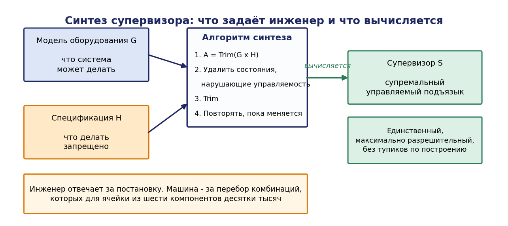
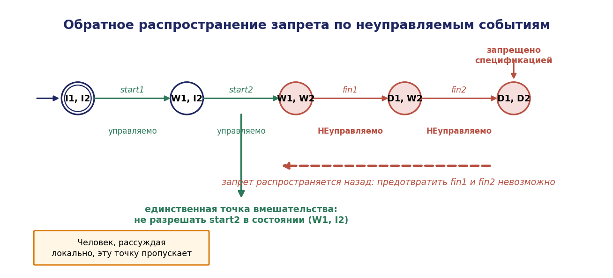
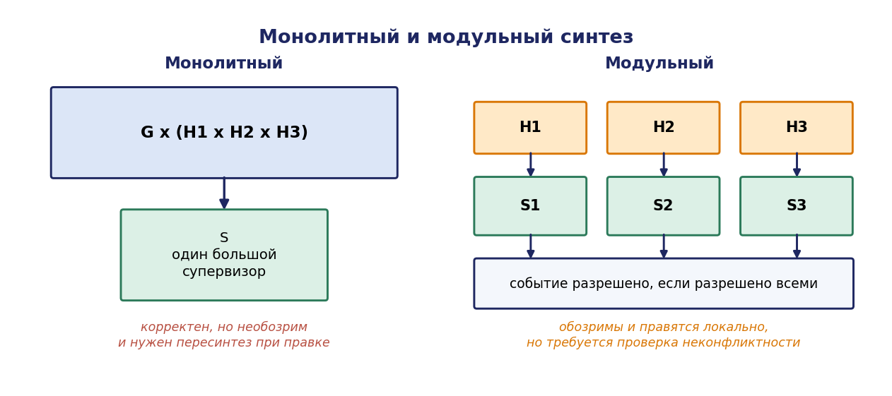

# Глава 3. Супервизорное управление: синтез логики по спецификации

## 3.1. Введение: почему логику нельзя писать вручную

В главе 2 показано, что модель производственной ячейки собирается композицией моделей компонентов и содержит десятки тысяч состояний. Возникает естественный вопрос: как для такой системы получить управляющую логику?

Традиционный инженерный ответ — написать её. Технолог описывает циклограмму, программист реализует её на языке релейной логики или в виде конечного автомата, наладчик доводит до работоспособного состояния. У этого способа есть два принципиальных дефекта.

**Первый: корректность не гарантирована и не проверяема.** Написанная вручную логика правильна ровно настолько, насколько её автор сумел учесть все сочетания состояний. Для системы с $5\cdot 10^4$ состояний это заведомо невозможно, поэтому дефекты обнаруживаются в эксплуатации в виде редких «сбоев», для которых нет воспроизводимого сценария.

**Второй: изменения разрушают корректность.** Добавление ещё одного робота или изменение технологического маршрута требует пересмотра всей логики, потому что новое ограничение взаимодействует со всеми ранее учтёнными. Практический опыт показывает, что после трёх-четырёх итераций «латания» логика ячейки становится неподдерживаемой.

Теория супервизорного управления, предложенная П. Дж. Рамаджем и У. М. Вонэмом в 1982–1987 годах, даёт принципиально иной ответ: **логику управления не пишут, её вычисляют**. Проектировщик описывает две вещи — что оборудование может делать (модель $G$) и что делать запрещено (спецификация $K$) — а алгоритм синтеза строит супервизор $S$, который максимально разрешает поведение, не нарушая спецификации.

Слово «максимально» здесь ключевое и составляет главный результат теории: среди всех корректных супервизоров существует единственный наименее ограничительный, и он вычислим. Это означает, что синтезированная логика не просто корректна — она не запрещает ничего лишнего, то есть не снижает производительность сверх необходимого.

Настоящая глава излагает теорию Рамаджа–Вонэма в объёме, достаточном для практического применения: управляемость событий, определение и свойства супервизора, теорема о существовании, супремальный управляемый подъязык и алгоритм его вычисления с доказательством сходимости, модульный и децентрализованный синтез, случай частичной наблюдаемости.

## 3.2. Управляемые и неуправляемые события

### 3.2.1. Ключевое различение

Это понятие отсутствует в базовом курсе теории автоматов и является основным вкладом теории ДЭС в инженерную практику.

Алфавит событий разбивается на два непересекающихся подмножества:

```math
\Sigma = \Sigma_c \cup \Sigma_{uc}, \quad \Sigma_c \cap \Sigma_{uc} = \varnothing
```

- **$\Sigma_c$ — управляемые события**: те, наступление которых система управления может предотвратить. Обычно это команды: «начать движение», «закрыть захват», «запустить обработку», «открыть шлюз».
- **$\Sigma_{uc}$ — неуправляемые события**: те, наступление которых предотвратить невозможно. Это отказы, завершения операций, поступления извне, действия человека: «операция завершена», «сработал концевой выключатель», «привод отказал», «деталь поступила», «оператор нажал кнопку».

Различение имеет прямой физический смысл. Супервизор способен **не выдать команду**, но не способен **отменить факт**. Он может не запускать станок, но не может помешать станку сломаться; может не отправлять робота в зону, но не может остановить деталь, уже поступившую на конвейер.

### 3.2.2. Типичные ошибки классификации

Практика показывает три устойчивые ошибки, каждая из которых приводит к неработоспособному проекту.

**Ошибка 1: объявление отказа управляемым.** «Мы просто запретим отказ привода» — модель, в которой `fail` $\in \Sigma_c$, синтезируется прекрасно, но синтезированный супервизор неосуществим: он опирается на возможность предотвратить то, что предотвратить нельзя.

**Ошибка 2: объявление завершения операции управляемым.** Событие `move_done` наступает тогда, когда робот доехал. Супервизор не может «не разрешить» роботу доехать. Управляемым является `move_start`, а не `move_done`.

**Ошибка 3: игнорирование действий человека.** Нажатие кнопки, открытие двери, вход в зону — неуправляемые события. Логика, синтезированная в предположении, что оператор «не будет» этого делать, некорректна.

Правило, покрывающее подавляющее большинство случаев: **управляемы начала действий, неуправляемы их завершения, отказы и внешние воздействия**.

### 3.2.3. Пример

Для ячейки из примера Б:

| Событие | Класс | Обоснование |
|---|---|---|
| $\mathit{req}_1, \mathit{req}_2$ | $\Sigma_c$ | запрос ресурса выдаётся управляющей программой |
| $\mathit{grant}_1, \mathit{grant}_2$ | $\Sigma_c$ | выдача разрешения — решение супервизора |
| $\mathit{move}_1, \mathit{move}_2$ | $\Sigma_c$ | команда на перемещение |
| $\text{s_start}$ | $\Sigma_c$ | команда пуска станка |
| $\mathit{place}_1, \text{s_unload}$ | $\Sigma_c$ | команды укладки и выгрузки |
| $\text{s_done}$ | $\Sigma_{uc}$ | завершение обработки наступает само |
| $\text{part_arrived}$ | $\Sigma_{uc}$ | поступление детали не контролируется ячейкой |
| fail_M1, fail_M2, s_fail | $\Sigma_{uc}$ | отказы |
| estop | $\Sigma_{uc}$ | нажатие оператором |
| $\mathit{rel}_1, \mathit{rel}_2$ | $\Sigma_{uc}$ | освобождение ресурса по завершении операции |

Обратим внимание на `rel₁`: освобождение зоны происходит по завершении движения робота, и супервизор не может «удерживать» зону занятой — это не его решение. Классификация освобождения ресурса как неуправляемого события существенно влияет на результат синтеза.

## 3.3. Супервизор и управляемая система

### 3.3.1. Определение супервизора

**Супервизором** для системы $G$ называется отображение

```math
S : L(G) \to 2^{\Sigma}
```

сопоставляющее каждой наблюдённой трассе множество **разрешённых** событий.

Супервизор называется **допустимым** (admissible), если он никогда не запрещает неуправляемые события:

```math
\forall s \in L(G): \quad \Sigma_{uc} \cap \Gamma_G(f(x_0,s)) \subseteq S(s)
```

Иными словами, всё, что физически возможно и неуправляемо, обязано быть разрешено. Это формализация тезиса «супервизор не может отменить факт».

### 3.3.2. Управляемая система

Система под управлением супервизора обозначается S/G («$S$ управляет $G$») и порождает язык L(S/G), определяемый рекурсивно:

1. $\varepsilon \in L(S/G)$;
2. $s\sigma \in L(S/G) \iff s \in L(S/G), s\sigma \in L(G)$ и $\sigma \in S(s)$.

Маркированный язык управляемой системы:

```math
L_m(S/G) = L(S/G) \cap L_m(G)
```

Супервизор называется **неблокирующим**, если $\overline{L}_m(S/G) = L(S/G)$: под его управлением система из любого достижимого состояния способна завершить задачу.

### 3.3.3. Постановка задачи синтеза

Дано: система $G$ и **спецификация** — язык $E \subseteq \Sigma^{*}$, описывающий допустимое поведение (либо, эквивалентно, автомат-спецификация $H$ с $L_m(H) = E$).

Требуется: найти допустимый неблокирующий супервизор $S$ такой, что

```math
L_m(S/G) \subseteq E \cap L_m(G)
```

и при этом $L_m(S/G)$ максимален по включению среди всех таких языков.

Требование максимальности отражает инженерное соображение: тривиальный супервизор, запрещающий всё ($S(s) = \varnothing$ для всех $s$), формально корректен и совершенно бесполезен. Нужен наименее ограничительный супервизор — тот, который запрещает ровно столько, сколько необходимо.

## 3.4. Управляемость языка и теорема о существовании

### 3.4.1. Определение управляемости

**Определение 3.1.** Язык $K \subseteq L(G)$ называется **управляемым** относительно $L(G)$ и $\Sigma_{uc}$, если

```math
\overline{K} \cdot \Sigma_{uc} \cap L(G) \subseteq \overline{K}
```

Расшифруем. Условие означает: если $s$ — префикс некоторой трассы из $K$ (то есть система под управлением может оказаться в этой точке), $\sigma$ — неуправляемое событие, и трасса $s\sigma$ физически возможна в $G$, то $s\sigma$ обязана оставаться в префиксном замыкании $K$.

Содержательно: **из любого достижимого состояния управляемой системы всякое физически возможное неуправляемое событие не выводит за пределы допустимого поведения**.

Управляемость — это условие реализуемости спецификации. Оно проверяется формально и в неудачном случае немедленно указывает на дефект проекта: спецификация требует предотвратить то, что предотвратить нельзя.

### 3.4.2. Основная теорема

**Теорема 3.1 (Рамадж, Вонэм, 1987).** Пусть $\varnothing \ne K \subseteq L(G), K$ префиксно-замкнут. Существует допустимый супервизор $S$ с $L(S/G) = K$ тогда и только тогда, когда $K$ управляем относительно $L(G)$ и $\Sigma_{uc}$.

*Доказательство.*

**Необходимость.** Пусть существует допустимый $S$ с $L(S/G) = K$. Возьмём $s \in \overline{K} = K$ ($K$ замкнут) и $\sigma \in \Sigma_{uc}$ с $s\sigma \in L(G)$. Так как $s \in L(S/G)$ и $S$ допустим, а $\sigma$ неуправляемо и активно в $G$ после $s$, то $\sigma \in S(s)$. По определению L(S/G) отсюда $s\sigma \in L(S/G) = K = \overline{K}$. Значит, $\overline{K}\Sigma_{uc} \cap L(G) \subseteq \overline{K}$.

**Достаточность.** Пусть $K$ управляем. Построим супервизор явно:

```math
S(s) = \lbrace \sigma \in \Sigma : s\sigma \in K \rbrace \quad \text{ для } s \in K, \quad S(s) = \varnothing \text{ для } s \notin K.
```

*Допустимость.* Пусть $s \in K$ и $\sigma \in \Sigma_{uc} \cap \Gamma_G(f(x_0,s))$, то есть $s\sigma \in L(G)$. По управляемости $s\sigma \in \overline{K} = K$, следовательно $\sigma \in S(s)$. Допустимость выполнена.

*Равенство языков.* Индукцией по длине трассы покажем $L(S/G) = K$.

Включение $L(S/G) \subseteq K$. База: $\varepsilon \in K$ ($K$ непуст и замкнут). Шаг: пусть $s \in L(S/G) \cap K$ и $s\sigma \in L(S/G)$. По определению L(S/G) имеем $\sigma \in S(s)$, то есть $s\sigma \in K$.

Включение $K \subseteq L(S/G)$. База: $\varepsilon \in L(S/G)$. Шаг: пусть $s \in K \cap L(S/G)$ и $s\sigma \in K$. Тогда $s\sigma \in L(G)$ (так как $K \subseteq L(G)$) и $\sigma \in S(s)$ по построению, значит $s\sigma \in L(S/G). \blacksquare$

Теорема даёт точный критерий: спецификация реализуема тогда и только тогда, когда она управляема. Но что делать, если спецификация неуправляема? Именно на этот вопрос отвечает следующий раздел, и именно он делает теорию практически применимой.

## 3.5. Супремальный управляемый подъязык

### 3.5.1. Постановка

Пусть спецификация $E$ неуправляема. Тогда точно реализовать её невозможно. Естественная замена — найти наибольшее подмножество $E$, которое реализуемо. Обозначим класс всех управляемых подъязыков:

$C(E) = \lbrace K \subseteq E : K \text{ управляем относительно } L(G) \text{ и } \Sigma_{uc} \rbrace$

Вопрос: существует ли в $C(E)$ наибольший элемент?

### 3.5.2. Замкнутость относительно объединения

**Лемма 3.1.** Класс $C(E)$ замкнут относительно произвольных объединений: если $K_i \in C(E)$ для $i \in I$, то $K = \cup_{i\in I} K_i \in C(E)$.

*Доказательство.* Очевидно $K \subseteq E$. Проверим управляемость. Заметим сначала, что префиксное замыкание перестановочно с объединением: $(\cup K_i\overline{)} = \cup \overline{K}_i$. Действительно, $u \in(\cup K_i\overline{)} \iff \exists v: uv \in \cup K_i \iff \exists i \exists v: uv \in K_i \iff \exists i: u \in \overline{K}_i$.

Теперь возьмём $s \in \overline{K} = \cup \overline{K}_i$ и $\sigma \in \Sigma_{uc}$ с $s\sigma \in L(G)$. Тогда $s \in \overline{K}_j$ для некоторого $j$. По управляемости $K_j$ имеем $s\sigma \in \overline{K}_j \subseteq \overline{K}. \blacksquare$

**Теорема 3.2 (существование супремального элемента).** Класс $C(E)$ непуст (содержит $\varnothing$) и имеет наибольший элемент

```math
K^{\uparrow} = \sup C(E) = \cup \lbrace K : K \in C(E) \rbrace
```

называемый **супремальным управляемым подъязыком** языка $E$ относительно $L(G)$ и $\Sigma_{uc}$. Обозначение: $K^{\uparrow} = \sup C(E, L(G), \Sigma_{uc})$.

*Доказательство.* Пустой язык управляем тривиально ($\overline{\varnothing} = \varnothing$, и условие выполняется вакуумно), значит $C(E) \ne \varnothing$. По лемме 3.1 объединение всех элементов $C(E)$ принадлежит $C(E)$, и оно по построению содержит любой элемент класса. ∎

Это центральный результат теории. Его инженерное значение: **для любой, даже нереализуемой, спецификации существует единственное наилучшее приближение снизу, и оно определено однозначно** — то есть результат синтеза не зависит от искусства проектировщика.

### 3.5.3. Алгоритм вычисления

Теорема 3.2 доказывает существование, но не даёт способа вычисления: объединение по всем управляемым подъязыкам — не алгоритм. Вычислительное решение даётся итеративной процедурой удаления «плохих» состояний.


Пусть система задана автоматом $G$, а спецификация — автоматом $H$ (для простоты пусть $E = L_m(H)$ и $H$ определён над тем же алфавитом). Построим автомат-произведение

```math
G_0 = G \times H
```

состояния которого суть пары (x, y). Далее итеративно удаляем состояния, нарушающие управляемость или неблокируемость.

**Алгоритм 3.1 (синтез супервизора).**

```
Вход: G = (X, Σ, f, x0, Xm), H = (Y, Σ, g, y0, Ym), Σ_uc ⊆ Σ
Выход: автомат супервизора S (или сообщение о пустом результате)

1.  A ← Trim(G × H)                      // достижимая и коаккуратная часть
2.  повторять
3.      // (а) удаление состояний, нарушающих управляемость
4.      Bad_c ← { (x,y) ∈ A :
                  ∃ σ ∈ Σ_uc, f(x,σ) определена,
                  но переход по σ из (x,y) отсутствует в A }
5.      A ← A \ Bad_c
6.      // (б) восстановление достижимости и коаккуратности
7.      A ← Trim(A)
8.  пока A изменяется
9.  если A = ∅ то «спецификация нереализуема»
10. иначе вернуть S = A
```

Шаг 4 — сердцевина алгоритма. Состояние (x, y) объявляется плохим, если в физической системе из $x$ возможно неуправляемое событие $\sigma$, а разрешённое поведение (текущее A) этого перехода не содержит. Такое состояние недопустимо: попав в него, супервизор не сможет предотвратить выход за пределы спецификации.

Шаг 7 обязателен: удаление состояний может сделать другие состояния недостижимыми (что безвредно) или некоаккуратными (что означает блокировку и требует их удаления). Удаление некоаккуратных состояний, в свою очередь, может породить новые нарушения управляемости — поэтому цикл повторяется.

**Теорема 3.3 (корректность и сходимость алгоритма 3.1).** Алгоритм завершается не более чем за $\lvert X\rvert \cdot \lvert Y\rvert$ итераций внешнего цикла, и результирующий автомат A удовлетворяет $L_m(A) = \sup C(E \cap L_m(G))$.

*Доказательство.*

*Сходимость.* На каждой итерации внешнего цикла множество состояний A либо не изменяется (цикл завершается), либо строго уменьшается. Так как $\lvert A\rvert \le \lvert X\rvert \cdot \lvert Y\rvert$ конечно и не возрастает, число итераций не превосходит $\lvert X\rvert \cdot \lvert Y\rvert$.

*Монотонность.* Обозначим $A_k$ — значение A после $k$-й итерации. Построим индукцией доказательство того, что supC содержится в $A_k$ для всех $k$, то есть алгоритм не удаляет «нужных» состояний.

База: $\sup C(E \cap L_m(G)) \subseteq E \cap L_m(G) = L_m(\mathrm{Trim}(G \times H)) = L_m(A_0)$.

Шаг: пусть $K^{\uparrow} = \sup C \subseteq L_m(A_k)$ в смысле соответствия трасс состояниям. Покажем, что ни одно состояние, достижимое трассой из $\overline{K}^{\uparrow}$, не удаляется на шаге k+1.

Пусть (x,y) достижимо трассой $s \in \overline{K}^{\uparrow}$ и предположим, что оно попало в $\mathrm{Bad}_c$: существует $\sigma \in \Sigma_{uc}$ с $s\sigma \in L(G)$, но перехода в $A_k$ нет. Так как $s \in \overline{K}^{\uparrow}$ и $K^{\uparrow}$ управляем, то $s\sigma \in \overline{K}^{\uparrow}$. По предположению индукции трасса $s\sigma$ ведёт в состояние $A_k$, что противоречит отсутствию перехода. Значит, $(x,y) \notin \mathrm{Bad}_c$.

Аналогично, если (x,y) удаляется операцией Trim как некоаккуратное, то из него недостижимо маркированное состояние $A_k$; но $s \in \overline{K}^{\uparrow}$ означает существование продолжения $t$ с $st \in K^{\uparrow} \subseteq L_m(A_k)$, то есть маркированное состояние достижимо — противоречие.

*Максимальность и управляемость результата.* По условию завершения цикла в A нет состояний из $\mathrm{Bad}_c$, то есть для всякого достижимого $s \in L(A)$ и всякого $\sigma \in \Sigma_{uc}$ с $s\sigma \in L(G)$ переход существует в A: значит $L(A) = \overline{L}_m(A)$ управляем. Кроме того, A обрезан, следовательно неблокирующий, и $L_m(A) \subseteq E \cap L_m(G)$. Вместе с доказанным включением $K^{\uparrow} \subseteq L_m(A)$ и определением $K^{\uparrow}$ как наибольшего управляемого подъязыка получаем $L_m(A) = K^{\uparrow}. \blacksquare$

**Сложность.** Внешний цикл выполняется не более $\lvert X\rvert \cdot \lvert Y\rvert$ раз, каждая итерация требует $O(\lvert X\rvert \cdot \lvert Y\rvert \cdot \lvert \Sigma \rvert)$ операций, что даёт полиномиальную оценку $O(\lvert X\rvert^2\cdot \lvert Y\rvert^2\cdot \lvert \Sigma \rvert)$. На практике число итераций мало (единицы), и доминирует стоимость построения произведения. Основное ограничение — размер $\lvert X\rvert$, экспоненциальный по числу компонентов, что делает символьную реализацию (BDD) практически необходимой для реальных ячеек.




### 3.5.4. Реализация супервизора

Результат синтеза — автомат $S$. Управление осуществляется так: супервизор поддерживает своё текущее состояние, синхронно отслеживая наблюдаемые события системы; в каждом состоянии $q$ множество разрешённых событий равно $\Gamma_S(q)$. Управляемые события, не входящие в $\Gamma_S(q)$, не выдаются в качестве команд.

Существенно, что **супервизор является автоматом, а не программой с условиями**: его реализация тривиальна (таблица переходов и таблица разрешений), и корректность реализации проверяется сравнением с моделью, а не рассуждениями о коде.

## 3.6. Разбор примера: синтез для производственной ячейки

Проведём полный синтез для фрагмента примера Б, чтобы показать, что алгоритм даёт нетривиальный и содержательный результат.

### 3.6.1. Модель системы

Рассмотрим два манипулятора и зону $Z$. Каждый манипулятор $M_i (i = 1, 2)$ описывается автоматом с тремя состояниями:

- $I_i$ — простаивает (начальное, маркированное);
- $W_i$ — работает в зоне;
- $D_i$ — завершает, выводит инструмент.

Переходы: $I_i \xrightarrow{\mathit{start}_i} W_i \xrightarrow{\mathit{fin}_i} D_i \xrightarrow{\mathit{out}_i} I_i$.

Классификация: $\mathit{start}_i \in \Sigma_c$ (команда пуска), $\mathit{fin}_i \in \Sigma_{uc}$ (операция завершается сама), $\mathit{out}_i \in \Sigma_{uc}$ (вывод инструмента — механически завершаемое движение, прервать которое нельзя).

Система: $G = M_1 \parallel M_2$. Состояния — пары; $\lvert X\rvert = 9$.

### 3.6.2. Спецификация

Технологическое требование: манипуляторы не должны одновременно находиться в зоне. Формально запрещены состояния, в которых оба манипулятора не в состоянии I. Точнее, будем считать, что робот занимает зону в состояниях $W$ и D (инструмент ещё внутри). Спецификация запрещает пары ($W_1$ или $D_1$) $\times$ ($W_2$ или $D_2$).

### 3.6.3. Наивное решение и его дефект

Наивная реализация: «не запускать второй манипулятор, пока первый не вернулся в I». Проверим, достаточно ли этого.

Рассмотрим состояние $(I_1, I_2)$, допустимое. Супервизор разрешает $\mathit{start}_1$. Система переходит в $(W_1, I_2)$. Здесь супервизор запрещает $\mathit{start}_2$ — правильно. Далее $\mathit{fin}_1$ (неуправляемо) $\to(D_1, I_2)$, затем $\mathit{out}_1$ (неуправляемо) $\to(I_1, I_2)$. Всё корректно.

Теперь пусть по недосмотру спецификация задана слабее: запрещено только одновременное пребывание в $W$ (то есть $(W_1, W_2)$), а состояние $(W_1, D_2)$ считается допустимым (например, проектировщик решил, что «выводящий инструмент робот зоне не мешает»). Рассмотрим состояние $(D_1, I_2)$: супервизор разрешает $\mathit{start}_2$, система переходит в $(D_1, W_2)$. Далее возможно неуправляемое $\mathit{fin}_2 \to(D_1, D_2)$ — допустимо по ослабленной спецификации. Но из $(W_1, I_2)$ супервизор мог разрешить... — проверим критическое место: состояние $(D_1, W_2)$ допустимо, но из него неуправляемое событие $\mathit{out}_1$ ведёт в $(I_1, W_2)$ — тоже допустимо. Проблем нет.

Рассмотрим другое ослабление, показывающее суть управляемости. Пусть спецификация запрещает только $(D_1, D_2)$ — состояние, в котором оба выводят инструмент. Проверим управляемость. Состояние $(W_1, W_2)$ допустимо спецификацией. Из него возможны неуправляемые $\mathit{fin}_1$ и $\mathit{fin}_2$. Событие $\mathit{fin}_1$ ведёт в $(D_1, W_2)$ — допустимо; затем неуправляемое $\mathit{fin}_2$ ведёт в $(D_1, D_2)$ — **запрещено**, но предотвратить это невозможно: оба события неуправляемы.

Следовательно, спецификация неуправляема, и алгоритм 3.1 удалит состояние $(D_1, W_2)$ как нарушающее управляемость, затем — $(W_1, W_2)$, поскольку из него неуправляемое $\mathit{fin}_1$ ведёт в удалённое состояние. В итоге супервизор запретит $\mathit{start}_2$ уже в состоянии $(W_1, I_2)$, то есть **автоматически выведет ограничение, которое человек должен был бы додумать сам**.

Это и есть главный практический эффект теории: алгоритм распространяет ограничение «назад по неуправляемым событиям», обнаруживая точку, в которой ещё можно вмешаться. Человек, рассуждающий локально, эту точку систематически пропускает.

### 3.6.4. Формулировка правила

Обобщим полученное наблюдение.


**Правило обратного распространения.** Если состояние $q$ запрещено, то запрещёнными оказываются и все состояния, из которых $q$ достижимо по трассе, состоящей только из неуправляемых событий. Формально, множество «плохих» состояний замкнуто относительно неуправляемого обратного достижения:

```math
\mathrm{Bad}^{*} = \lbrace q : \exists u \in \Sigma_{uc}^{*}, f(q, u) \in \mathrm{Bad} \rbrace
```

Именно вычисление Bad* составляет содержание шагов 4–5 алгоритма 3.1, а необходимость повторения цикла возникает из взаимодействия этого замыкания с требованием неблокируемости.




## 3.7. Модульный супервизорный синтез

### 3.7.1. Мотивация

Монолитный синтез требует построения $G \times H$ целиком, что для реальной ячейки невозможно. Модульный подход: спецификация раскладывается на несколько простых ограничений $E_1, \ldots, E_m$, для каждого синтезируется свой супервизор $S_1, \ldots, S_m$, и они работают совместно — событие разрешено, если разрешено всеми.


Совместная работа выражается как

```math
L(S/G) = L(S_1/G) \cap \ldots \cap L(S_m/G)
```

Преимущества очевидны: каждый $S_j$ строится над малым фрагментом системы (только компоненты, затрагиваемые ограничением $E_j$), результат обозрим и легко модифицируется при изменении одного из требований.




### 3.7.2. Проблема конфликта

Модульный подход имеет ограничение: **совокупность неблокирующих супервизоров может оказаться блокирующей**. Каждый супервизор по отдельности гарантирует возможность завершения задачи, но их совместное действие может привести в состояние, из которого завершение невозможно.

**Определение 3.2.** Языки $K_1, \ldots, K_m$ называются **неконфликтующими** (nonconflicting), если

```math
\overline{K_1 \cap \ldots \cap K_m} = \overline{K}_1 \cap \ldots \cap \overline{K}_m
```

Содержательно: всякая трасса, являющаяся префиксом в каждом из языков по отдельности, является префиксом и в их пересечении. Нарушение равенства означает существование трассы, после которой каждый супервизор «считает», что задача может быть завершена, но совместно завершить её нельзя.

**Теорема 3.4 (модульный синтез).** Пусть $S_j$ — неблокирующие супервизоры с $L_m(S_j/G) = K_j$, каждый $K_j$ управляем. Если языки $K_1, \ldots, K_m$ неконфликтующие, то совместный супервизор $S = S_1 \wedge \ldots \wedge S_m$ допустим, неблокирующий и $L_m(S/G) = K_1 \cap \ldots \cap K_m$.

*Доказательство.*

*Допустимость.* Пусть $s \in L(S/G) = \cap \overline{K}_j$ и $\sigma \in \Sigma_{uc}$ с $s\sigma \in L(G)$. Тогда $s \in \overline{K}_j$ для каждого $j$, и по управляемости $K_j$ имеем $s\sigma \in \overline{K}_j$ для каждого $j$, следовательно $s\sigma \in \cap \overline{K}_j = L(S/G)$, то есть $\sigma$ разрешено совместным супервизором.

*Управляемость пересечения.* Доказано в предыдущем абзаце: $(\cap \overline{K}_j)\cdot \Sigma_{uc} \cap L(G) \subseteq \cap \overline{K}_j$.

*Неблокируемость.* Требуется $\overline{L}_m(S/G) = L(S/G)$, то есть $(\cap K_j\overline{)} = \cap \overline{K}_j$. Это в точности условие неконфликтности. ∎

Обратно, если языки конфликтуют, совместный супервизор блокирует, и модульный подход в чистом виде неприменим: требуется либо координатор (дополнительный супервизор, разрешающий конфликт), либо частичный переход к монолитному синтезу для конфликтующих подсистем.

### 3.7.3. Проверка неконфликтности

Проверка выполняется построением произведения автоматов, представляющих $K_j$, и проверкой неблокируемости результата (следствие 2.1). Это дешевле полного монолитного синтеза, поскольку строится произведение супервизоров, а не системы со спецификацией, и супервизоры обычно существенно меньше системы.

Практическая рекомендация: **разлагайте спецификацию на ограничения, затрагивающие непересекающиеся группы ресурсов**. Такие ограничения почти всегда неконфликтны. Конфликты возникают, когда два ограничения регулируют доступ к одному и тому же набору ресурсов в разных порядках — это признак того, что ограничения следует объединить в одно и синтезировать монолитно.

## 3.8. Децентрализованное управление

### 3.8.1. Постановка

В территориально распределённом комплексе (несколько ячеек, парк AMR) единый супервизор нереализуем: нет узла, наблюдающего все события и выдающего все команды. Вместо этого имеется $n$ локальных супервизоров, каждый из которых наблюдает свой подалфавит $\Sigma_{o,i} \subseteq \Sigma$ и управляет своим подалфавитом $\Sigma_{c,i} \subseteq \Sigma_c$.

Решение принимается по правилу конъюнкции: событие разрешено, если разрешено всеми супервизорами, способными его контролировать.

### 3.8.2. Соуправляемость

**Определение 3.3.** Язык $K$ соуправляем (co-observable) относительно $L(G)$, проекций $P_i$ и алфавитов управления $\Sigma_{c,i}$, если для всякой трассы $s \in \overline{K}$ и всякого $\sigma \in \Sigma_c$ с $s\sigma \in L(G) \setminus \overline{K}$ существует индекс $i$ такой, что $\sigma \in \Sigma_{c,i}$ и

```math
\forall s' \in \overline{K}: P_i(s') = P_i(s) \implies s'\sigma \notin \overline{K}
```

Содержательно: если событие нужно запретить, то найдётся хотя бы один локальный супервизор, который, опираясь только на своё наблюдение, способен принять решение о запрете, не рискуя запретить его в ситуации, где оно допустимо.

**Теорема 3.5.** Существует децентрализованный супервизор, реализующий $K$, тогда и только тогда, когда $K$ управляем и соуправляем.

Соуправляемость проверяема, но существенно дороже управляемости: базовый алгоритм имеет сложность, полиномиальную по произведению размеров локальных наблюдателей, то есть экспоненциальную по размеру системы.

### 3.8.3. Инженерное следствие

Если спецификация не соуправляема, децентрализованное решение невозможно **при данном распределении датчиков и исполнительных механизмов**. Варианты действий: расширить наблюдаемость одного из локальных супервизоров (добавить датчик или канал связи), передать часть управляющих полномочий, либо ввести обмен информацией между супервизорами.

Это даёт формальный критерий для проектного вопроса «сколько связи нужно между ячейками» — вопрос, который обычно решается интуитивно и приводит либо к избыточной, либо к недостаточной интеграции.

## 3.9. Синтез при частичной наблюдаемости

### 3.9.1. Наблюдаемость языка

При $\Sigma_o \subsetneq \Sigma$ супервизор принимает решения на основании проекции $P(s)$, а не самой трассы. Условие реализуемости усложняется.

**Определение 3.4.** Язык $K$ наблюдаем (observable) относительно L(G), P и $\Sigma_c$, если для всех $s, s' \in \overline{K}$ с $P(s) = P(s')$ и всех $\sigma \in \Sigma_c$:

```math
s\sigma \in \overline{K} \wedge s'\sigma \in L(G) \implies s'\sigma \in \overline{K}
```

Содержательно: если две трассы неразличимы для наблюдателя, то решение о разрешении события должно быть для них одинаковым; спецификация не должна требовать разного поведения в неразличимых ситуациях.

**Теорема 3.6.** Существует допустимый супервизор с частичным наблюдением, реализующий $K$, тогда и только тогда, когда $K$ управляем и наблюдаем.

### 3.9.2. Отсутствие супремального элемента

Здесь возникает принципиальное отличие от случая полного наблюдения.

**Утверждение 3.1.** Класс наблюдаемых подъязыков **не** замкнут относительно объединения; супремальный наблюдаемый подъязык в общем случае не существует.

*Контрпример.* $\Sigma = \lbrace a, b, \sigma \rbrace, \Sigma_o = \lbrace a, b \rbrace$? Возьмём $\Sigma_o = \varnothing$ (ничего не наблюдается) и $\Sigma_c = \lbrace \sigma \rbrace$. Пусть $L(G) = \lbrace \varepsilon, a, b, a\sigma, b\sigma \rbrace$ — то есть после ненаблюдаемого $a$ или $b$ возможно управляемое $\sigma$. Пусть $K_1 = \lbrace \varepsilon, a, b, a\sigma \rbrace$ и $K_2 = \lbrace \varepsilon, a, b, b\sigma \rbrace$. Каждый из них наблюдаем: в $K_1$ решение «разрешить $\sigma$» одинаково для... — проверим. Для $K_1$: трассы $a$ и $b$ неразличимы $(P(a) = P(b) = \varepsilon)$. Требуется: если $a\sigma \in \overline{K}_1$ и $b\sigma \in L(G)$, то $b\sigma \in \overline{K}_1$. Но $b\sigma \notin K_1$ — значит $K_1$ **не** наблюдаем. Скорректируем пример.

Возьмём $\Sigma = \lbrace a, b, \sigma_a, \sigma_b \rbrace, \Sigma_o = \varnothing, \Sigma_c = \lbrace \sigma_a, \sigma_b \rbrace, L(G) = \lbrace \varepsilon, a, b, a\sigma_a, a\sigma_b, b\sigma_a, b\sigma_b \rbrace$. Пусть $K_1 = \lbrace \varepsilon, a, b, a\sigma_a, b\sigma_a \rbrace$ (всегда выбираем $\sigma_a$) и $K_2 = \lbrace \varepsilon, a, b, a\sigma_b, b\sigma_b \rbrace$ (всегда $\sigma_b$). Каждый наблюдаем: решение не зависит от неразличимой истории. Их объединение $K_1 \cup K_2$ содержит и $a\sigma_a$, и $a\sigma_b$, и $b\sigma_a$, и $b\sigma_b$ — оно наблюдаемо, но пусть спецификация $E$ запрещает одновременное присутствие обеих ветвей после одной и той же истории (например, требует детерминированного выбора). Тогда $K_1$ и $K_2$ — максимальные наблюдаемые подъязыки $E$, они несравнимы, и наибольшего элемента нет. ∎

Инженерное следствие: при частичной наблюдаемости **оптимальное решение неединственно**, и проектировщик обязан сделать выбор между несколькими максимальными вариантами. Это качественно усложняет задачу.

### 3.9.3. Нормальность как практическая замена

Для восстановления единственности вводится более сильное условие.

**Определение 3.5.** Язык $K$ нормален относительно $L(G)$ и $P$, если

```math
\overline{K} = P^{-1}(P(\overline{K})) \cap L(G)
```

**Утверждение 3.2.** Нормальность влечёт наблюдаемость; класс нормальных подъязыков замкнут относительно объединения, и супремальный нормальный подъязык supN(E) существует и вычислим.

Нормальность требует, чтобы принадлежность трассы допустимому поведению определялась исключительно её проекцией. Это сильнее необходимого (наблюдаемость допускает использование информации об управляемости), но зато даёт единственный вычислимый ответ.

Практическая схема, применяемая в инженерных задачах: если $\Sigma_{uc} \subseteq \Sigma_o$ (все неуправляемые события наблюдаемы — типичная ситуация, поскольку отказы и завершения обычно снабжены датчиками), то supN(E) даёт корректный и близкий к оптимальному супервизор. Это условие является хорошим проектным ориентиром при выборе состава датчиков.

## 3.10. Практическая методика синтеза

Обобщим последовательность действий для проекта комплекса.

**Шаг 1. Построить модели компонентов.** По правилам главы 2: один компонент — один автомат, ресурсы моделируются явно, отказы включены.

**Шаг 2. Классифицировать события.** Каждое событие отнести к $\Sigma_c$ или $\Sigma_{uc}$ и к $\Sigma_o$ или $\Sigma_{uo}$. Классификация фиксируется в таблице и проходит проверку: для каждого управляемого события указывается механизм, которым его можно предотвратить; для каждого наблюдаемого — датчик или программный источник сигнала.

**Шаг 3. Сформулировать спецификации.** Каждое технологическое или безопасностное ограничение — отдельный автомат-спецификация над минимально необходимым подалфавитом. Типовые шаблоны:

| Шаблон | Формулировка | Автомат |
|---|---|---|
| Взаимное исключение | ресурс $R$ используется не более чем одним потребителем | 1 + n состояний |
| Ёмкость буфера | число деталей в B не превышает $k$ | k+1 состояний |
| Порядок операций | операция $b$ только после $a$ | 2 состояния |
| Запрет состояния | комбинация (x, y) недостижима | произведение с удалением |
| Приоритет | при конфликте предпочитается $i$ | зависит от постановки |

**Шаг 4. Синтезировать модульно.** По одному супервизору на спецификацию, каждый — над своим фрагментом системы.

**Шаг 5. Проверить неконфликтность.** Построить произведение супервизоров и проверить неблокируемость. При конфликте объединить конфликтующие спецификации и синтезировать монолитно.

**Шаг 6. Проверить реализуемость.** Убедиться, что синтезированный супервизор не пуст. Пустой результат означает противоречивость спецификаций либо ошибку в классификации событий — на практике второе встречается чаще.

**Шаг 7. Проанализировать ограничительность.** Сравнить $L_m(S/G)$ с $L_m(G)$: какие полезные сценарии оказались запрещены? Если синтезированный супервизор чрезмерно ограничителен, причина обычно в излишне сильной спецификации или в консервативной классификации событий как неуправляемых.

**Шаг 8. Реализовать.** Экспортировать автомат супервизора в исполняемую форму (таблица переходов + таблица разрешений). Реализация не должна содержать логики сверх таблиц.

## 3.11. Границы применимости

Честное изложение метода требует указания его ограничений.

**Размер модели.** Явное построение произведения ограничено примерно $10^6-10^7$ состояниями. Символьные (BDD) реализации в Supremica поднимают границу на несколько порядков, но она остаётся конечной.

**Отсутствие времени.** Классическая теория не оперирует длительностями: она отвечает на вопрос «возможно ли», но не «успеет ли». Временные расширения (timed DES) существуют, но заметно сложнее; на практике временные требования проверяют отдельно (главы 7 и 15).

**Отсутствие данных.** Модель оперирует событиями, а не значениями. Условия вида «если деталь тяжелее 5 кг» требуют либо дискретизации (событие `heavy_part`), либо перехода к расширенным автоматам с переменными (EFA).

**Консервативность.** Супремальный управляемый подъязык максимален среди управляемых, но может оказаться существенно меньше желаемого поведения, если спецификация или классификация событий неудачны. Это не дефект метода, а честное отображение физических ограничений системы.

**Предположение о корректности модели.** Все гарантии относятся к модели, а не к оборудованию. Если модель компонента не соответствует его реальному поведению, синтезированный супервизор корректен относительно неправильной модели. Отсюда — необходимость валидации моделей (глава 17).

## 3.12. Выводы

1. Различение управляемых и неуправляемых событий — центральное понятие теории; управляемы начала действий, неуправляемы завершения, отказы и внешние воздействия.
2. Спецификация реализуема точно тогда и только тогда, когда она управляема: неуправляемое событие не должно выводить систему за пределы допустимого поведения.
3. Для любой спецификации существует единственный супремальный управляемый подъязык — наилучшее реализуемое приближение; он вычисляется алгоритмом итеративного удаления состояний, сходящимся за конечное число шагов.
4. Синтез автоматически распространяет ограничения назад по цепочкам неуправляемых событий, обнаруживая точки вмешательства, которые человек при локальном рассуждении систематически пропускает.
5. Модульный синтез даёт обозримые супервизоры, но требует проверки неконфликтности; децентрализованный требует соуправляемости и даёт формальный критерий достаточности связи между узлами.
6. При частичной наблюдаемости супремальный элемент в общем случае не существует; практическая замена — супремальный нормальный подъязык, вычислимый при условии наблюдаемости всех неуправляемых событий.

## 3.13. Контрольные вопросы

1. Почему событие «операция завершена» неуправляемо? Приведите пример проектной ошибки, вызванной противоположным допущением.
2. Сформулируйте условие управляемости и объясните его физический смысл.
3. Докажите необходимость управляемости в теореме 3.1.
4. Почему тривиальный супервизор, запрещающий всё, формально корректен? Какое требование его исключает?
5. Докажите, что класс управляемых подъязыков замкнут относительно объединения. Где в доказательстве используется префиксное замыкание?
6. Объясните, почему в алгоритме 3.1 необходим внешний цикл, а не однократное удаление плохих состояний.
7. Что означает «обратное распространение по неуправляемым событиям»? Приведите пример из примера Б.
8. Когда модульный синтез даёт блокирующий результат? Как это обнаружить?
9. Почему при частичной наблюдаемости не существует супремального наблюдаемого подъязыка?
10. Какое условие на состав датчиков делает нормальность практически приемлемой заменой наблюдаемости?

## 3.14. Задачи

**Задача 3.1.** Два робота используют общий ресурс. События: $\mathit{req}_i, \mathit{grant}_i$ (управляемые), $\mathit{use}_i, \mathit{rel}_i$ (неуправляемые). Постройте модели, спецификацию взаимного исключения и синтезируйте супервизор вручную. Сколько состояний в результате?

**Задача 3.2.** В задаче 3.1 объявите $\mathit{grant}_i$ неуправляемым. Что изменится в результате синтеза? Дайте физическую интерпретацию.

**Задача 3.3.** Проверьте управляемость спецификации «станок не запускается при открытой двери», если события: `open_door`, `close_door` (неуправляемые, оператор), `s_start` (управляемое). Является ли спецификация «дверь не открывается во время работы» управляемой?

**Задача 3.4.** Ячейка: конвейер, робот, станок, буфер на 2 позиции. Спецификации: (а) буфер не переполняется; (б) станок не загружается, будучи занятым; (в) робот не берёт с пустого конвейера. Синтезируйте три модульных супервизора и проверьте их неконфликтность.

**Задача 3.5.** Реализуйте алгоритм 3.1 на Python поверх кода композиции из главы 2. Проверьте на задаче 3.4 и сравните результат с монолитным синтезом.

**Задача 3.6.** Постройте пример, в котором два неблокирующих супервизора совместно дают блокировку. Минимальное число состояний?

**Задача 3.7.** Для примера А (мобильный манипулятор) сформулируйте спецификацию «манипулятор не движется при движении базы» как автомат и синтезируйте супервизор. Какие события следует считать неуправляемыми и почему?

**Задача 3.8.** В модели с ненаблюдаемым событием `slip` (проскальзывание в захвате) проверьте наблюдаемость спецификации «не начинать движение с грузом при проскальзывании». Что нужно изменить, чтобы спецификация стала реализуемой?

## 3.15. Литература к главе

1. Ramadge P. J., Wonham W. M. Supervisory Control of a Class of Discrete Event Processes // SIAM Journal on Control and Optimization. — 1987. — Vol. 25, No. 1. — P. 206–230.
2. Ramadge P. J., Wonham W. M. The Control of Discrete Event Systems // Proceedings of the IEEE. — 1989. — Vol. 77, No. 1. — P. 81–98.
3. Wonham W. M., Cai K. Supervisory Control of Discrete-Event Systems. — Springer, 2019.
4. Cassandras C. G., Lafortune S. Introduction to Discrete Event Systems. 3rd ed. — Springer, 2021. Ch. 3.
5. Lin F., Wonham W. M. On Observability of Discrete-Event Systems // Information Sciences. — 1988. — Vol. 44, No. 3. — P. 173–198.
6. Rudie K., Wonham W. M. Think Globally, Act Locally: Decentralized Supervisory Control // IEEE Transactions on Automatic Control. — 1992. — Vol. 37, No. 11. — P. 1692–1708.
7. Feng L., Wonham W. M. Supervisory Control Architecture for Discrete-Event Systems // IEEE Transactions on Automatic Control. — 2008. — Vol. 53, No. 6. — P. 1449–1461.
8. Malik R., Åkesson K., Flordal H., Fabian M. Supremica — An Efficient Tool for Large-Scale Discrete Event Systems // IFAC-PapersOnLine. — 2017. — Vol. 50, No. 1. — P. 5794–5799.
