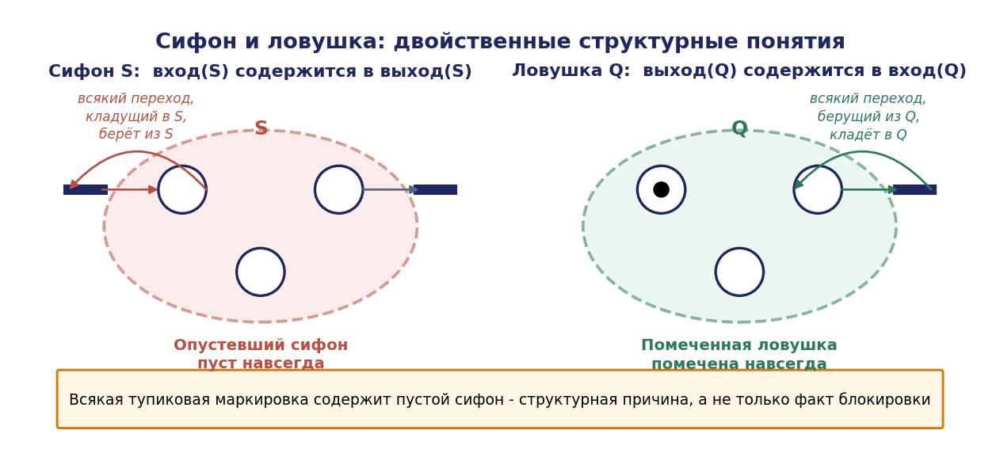
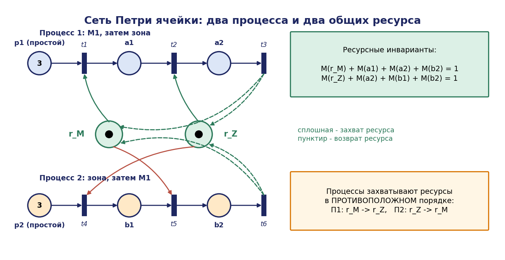
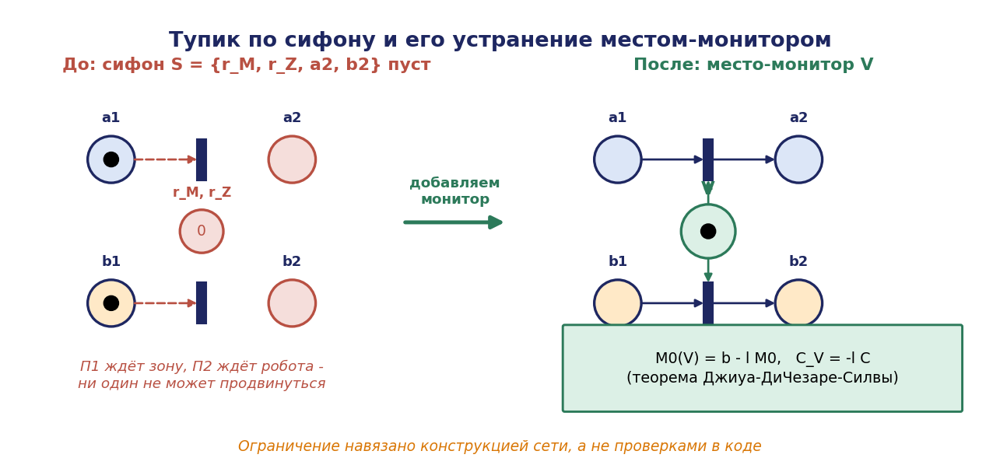

# Глава 4. Структурный анализ сетей Петри и беступиковое распределение ресурсов

## 4.1. Введение: что даёт сеть Петри сверх автомата

Базовый курс вводит сеть Петри как графическую нотацию для описания параллельных процессов: позиции, переходы, фишки, правило срабатывания. На этом уровне сеть Петри выглядит как удобный способ рисовать то, что можно нарисовать и автоматом, и вопрос «зачем нужен второй формализм» остаётся без убедительного ответа.

Ответ состоит в следующем. Автомат представляет состояние системы **явно** — как элемент множества $X$. Сеть Петри представляет состояние **структурно** — как распределение фишек по позициям, то есть как вектор $M \in \mathbb{N}^{\lvert P\rvert}$. Это различие имеет далеко идущие последствия.

Пусть ячейка содержит 5 однотипных паллет, каждая из которых может находиться в одном из 4 мест. Автоматное описание требует $4^5 = 1024$ состояний. Сеть Петри требует 4 позиций и вектора маркировки — структура сети не зависит от числа паллет вовсе, число фишек является параметром. Модель, компактная по построению, допускает **алгебраический анализ**: свойства системы выводятся из матрицы инцидентности линейно-алгебраическими методами, без построения множества состояний.

Именно это делает сети Петри незаменимыми при проектировании РТК. Три главных вопроса, на которые они отвечают структурно:

1. **Ограниченность.** Не переполнится ли буфер? Ответ даётся $P$-инвариантами — без перебора состояний.
2. **Взаимное исключение.** Гарантировано ли, что зона занята не более чем одним роботом? Ответ — тот же $P$-инвариант, доказывающий инвариантное соотношение для всех достижимых маркировок сразу.
3. **Отсутствие тупиков.** Может ли ячейка встать? Ответ даётся анализом сифонов, и, что принципиально важно, анализ не только обнаруживает тупик, но и **указывает его структурную причину** — конкретное множество позиций, опустошение которого необратимо.

Настоящая глава излагает структурный аппарат: уравнение состояния, инварианты, сифоны и ловушки, теорию систем распределения ресурсов и синтез беступиковых политик. Нотация предполагается известной из базового курса и повторяется кратко.

## 4.2. Определения и обозначения

### 4.2.1. Сеть и система

**Сетью Петри** называется четвёрка $N = (P, T, F, W)$, где

- $P = \lbrace p_1, \ldots, p_m \rbrace$ — конечное множество позиций (мест);
- $T = \lbrace t_1, \ldots, t_n \rbrace$ — конечное множество переходов, $P \cap T = \varnothing, P \cup T \ne \varnothing$;
- $F \subseteq(P \times T) \cup(T \times P)$ — отношение инцидентности (дуги);
- $W : F \to \mathbb{N}^+$ — кратности дуг.

Сеть называется **ординарной**, если $W(f) = 1$ для всех дуг.

**Маркировкой** называется вектор $M : P \to \mathbb{N}, M \in \mathbb{N}^{m}$. Пара $(N, M_0)$ называется **системой сети Петри**.

Для узла $x \in P \cup T$ обозначаем предмножество и постмножество:

```math
\bullet x = \lbrace y : (y, x) \in F \rbrace, \quad x\bullet = \lbrace y : (x, y) \in F \rbrace
```

Для множества $S \subseteq P: \bullet S = \cup_{p\in S} \bullet p, S\bullet = \cup_{p\in S} p\bullet$.

### 4.2.2. Правило срабатывания

Переход $t$ **разрешён** (enabled) при маркировке $M$, обозначение M[t⟩, если

```math
\forall p \in \bullet t: M(p) \ge W(p, t)
```

Срабатывание $t$ переводит $M$ в $M'$, обозначение $M[t\rangle M'$:

```math
M'(p) = M(p) - W(p, t) + W(t, p)
```

где $W(p,t) = 0$, если $(p,t) \notin F$, и аналогично для $W(t,p)$.

Множество маркировок, достижимых из $M_0$, обозначается $R(N, M_0)$.

### 4.2.3. Матрица инцидентности

**Матрицей инцидентности** сети называется матрица $C \in \mathbb{Z}^{m\times n}$:

```math
C = C^+ - C^-, \quad C^-[p, t] = W(p, t), \quad C^+[p, t] = W(t, p)
```

Столбец $C[\cdot, t]$ описывает изменение маркировки при срабатывании $t$.

Для последовательности срабатываний $\sigma = t_{i1} t_{i2} \ldots t_{ik}$ **вектором Париха** (счётчиком срабатываний) называется $\vec{\sigma} \in \mathbb{N}^n$, где $\vec{\sigma}[t]$ — число вхождений $t$ в $\sigma$.

**Теорема 4.1 (уравнение состояния).** Если $M_0[\sigma \rangle M$, то

```math
M = M_0 + C \cdot \vec{\sigma}
```

*Доказательство.* Индукция по длине $\sigma$. При $\lvert \sigma \rvert = 0$ равенство тривиально. Пусть $M_0[\sigma \rangle M'[t\rangle M$ и по предположению $M' = M_0 + C\cdot \vec{\sigma}$. Тогда для каждой позиции $p$:

```math
M(p) = M'(p) - W(p,t) + W(t,p) = M'(p) + C[p,t]
```

Векторно: $M = M' + C\cdot e_t = M_0 + C\cdot(\vec{\sigma} + e_t) = M_0 + C\cdot(\sigma t\vec{)}$, где $e_t$ — единичный вектор. ∎

**Замечание (важное).** Уравнение состояния даёт **необходимое, но не достаточное** условие достижимости. Существование неотрицательного целого решения $x$ уравнения $M = M_0 + \mathrm{Cx}$ не гарантирует существования реальной последовательности срабатываний: уравнение не учитывает, что промежуточные маркировки должны быть неотрицательны и переходы разрешены.

*Контрпример.* Сеть с двумя позициями $p_1, p_2$ и двумя переходами: $t_1$ забирает фишку из $p_1$ и кладёт в $p_2, t_2$ — наоборот. $M_0 = (0, 0)$. Рассмотрим $x = (1, 1)^T$: тогда $M = M_0 + \mathrm{Cx} = (0{,}0) + ((-1+1), (1-1))^T = (0{,}0)$. Уравнение выполнено, но ни один переход не разрешён при $M_0$, и последовательность нереализуема.

Такие решения называются **ложными (spurious)**. Их существование — фундаментальное ограничение линейно-алгебраического анализа: из уравнения состояния можно получать необходимые условия (то есть доказывать невозможность), но не достаточные.

Это ограничение работает в нужную сторону: **для доказательства свойств безопасности** («переполнение невозможно», «двойной захват невозможен») достаточно необходимых условий, и линейная алгебра даёт строгие доказательства. Для свойств живости необходимых условий недостаточно, и там применяются сифоны.

## 4.3. Инварианты

### 4.3.1. P-инварианты

**Определение 4.1.** Вектор $y \in \mathbb{Z}^{m}, y \ne 0$, называется **$P$-инвариантом** (инвариантом мест, place invariant), если

```math
y^T \cdot C = 0
```

$P$-инвариант называется неотрицательным, если $y \ge 0$, и минимальным, если его носитель $\lVert y\rVert = \lbrace p : y(p) \ne 0 \rbrace$ не содержит собственно носителя другого $P$-инварианта, а компоненты взаимно просты.

**Теорема 4.2 (закон сохранения).** Пусть $y$ — $P$-инвариант. Тогда для всякой $M \in R(N, M_0)$:

```math
y^T \cdot M = y^T \cdot M_0
```

*Доказательство.* Пусть $M_0[\sigma \rangle M$. По теореме $4.1, M = M_0 + C\vec{\sigma}$. Умножая слева на $y^T$:

```math
y^TM = y^TM_0 + y^TC\vec{\sigma} = y^TM_0 + 0\cdot \vec{\sigma} = y^TM_0 \blacksquare
```

Теорема утверждает: взвешенная сумма фишек по позициям носителя инварианта **постоянна на всём множестве достижимых маркировок**. Это доказательство свойства сразу для всех состояний, полученное решением однородной системы линейных уравнений — то есть за полиномиальное время, без построения графа достижимости.

### 4.3.2. Следствия для проектирования

**Следствие 4.1 (ограниченность).** Если существует неотрицательный $P$-инвариант $y$ с $y(p) > 0$, то позиция $p$ ограничена, причём

```math
\forall M \in R(N, M_0): M(p) \le \lfloor(y^TM_0) / y(p) \rfloor
```

*Доказательство.* Из $y \ge 0$ и $y^TM = y^TM_0$ следует $y(p)\cdot M(p) \le y^TM = y^TM_0$, откуда $M(p) \le y^TM_0 / y(p)$; целочисленность даёт округление вниз. ∎

**Следствие 4.2 (взаимное исключение).** Пусть позиции $p_{\mathrm{use},1}, \ldots, p_{\mathrm{use},k}$ означают «потребитель $i$ использует ресурс $R$», а $p_R$ — «ресурс свободен». Если существует $P$-инвариант

```math
M(p_R) + \Sigma_i M(p_{\mathrm{use},i}) = 1
```

то в любой достижимой маркировке ресурс используется не более чем одним потребителем.

*Доказательство.* Все слагаемые неотрицательны и целочисленны, сумма равна 1, значит не более одного слагаемого равно 1, остальные нули. ∎

Это и есть строгое доказательство взаимного исключения — не рассуждение «мы поставили семафор», а математическое утверждение о всех достижимых состояниях. Причём если такого инварианта не существует, взаимное исключение не гарантировано, и это обнаруживается решением линейной системы, а не тестированием.

### 4.3.3. Вычисление инвариантов

Множество $P$-инвариантов есть ядро левого умножения на C, то есть решение системы $C^Ty = 0$ над $\mathbb{Z}$. Для практики требуются **минимальные неотрицательные** инварианты, вычисляемые алгоритмом Фаркаша (метод исключения):

**Алгоритм 4.1 (Фаркаш).**

```
Вход: C ∈ ℤ^{m×n}
Выход: множество минимальных неотрицательных P-инвариантов

A ← [ C | I_m ]                    // приписываем единичную матрицу справа
для j = 1 .. n:                    // по столбцам исходной C
    R⁺ ← строки A с A[·, j] > 0
    R⁻ ← строки A с A[·, j] < 0
    R⁰ ← строки A с A[·, j] = 0
    A' ← R⁰
    для каждой пары (r⁺, r⁻) ∈ R⁺ × R⁻:
        s ← |A[r⁻, j]| · r⁺ + |A[r⁺, j]| · r⁻      // линейная комбинация,
                                                    // обнуляющая столбец j
        s ← s / gcd(s)
        если носитель s минимален среди уже найденных:
            A' ← A' ∪ {s}
    A ← A'
вернуть правые m столбцов строк A
```

Сложность в худшем случае экспоненциальна (число минимальных инвариантов может расти экспоненциально), но для сетей, моделирующих РТК, где инварианты соответствуют физическим законам сохранения (число деталей, число паллет, ёмкость ресурса), их количество мало и вычисление быстро.

### 4.3.4. T-инварианты

**Определение 4.2.** Вектор $x \in \mathbb{Z}^n, x \ne 0$, называется **$T$-инвариантом**, если $C \cdot x = 0$.

Из уравнения состояния немедленно: если $M_0[\sigma \rangle M$ и $\vec{\sigma}$ есть $T$-инвариант, то $M = M_0$. То есть $T$-инвариант описывает потенциально **циклическое** поведение — последовательность срабатываний, возвращающую систему в исходную маркировку.

**Следствие 4.3.** Необходимым условием обратимости (возможности вернуться в $M_0$ из любой достижимой маркировки) и повторяемости производственного цикла является существование неотрицательного $T$-инварианта, покрывающего все переходы: $x > 0$.

Если некоторый переход не входит в носитель ни одного неотрицательного $T$-инварианта, он не может участвовать в повторяющемся цикле — это структурный признак «мёртвой» или одноразовой операции, часто указывающий на ошибку моделирования.

$T$-инварианты имеют прямую производственную интерпретацию: каждый минимальный $T$-инвариант соответствует одному законченному технологическому маршруту, а его компоненты — числу срабатываний каждой операции за цикл. В главе 5 они используются для расчёта пропускной способности.

## 4.4. Свойства поведения

Зафиксируем терминологию.

**Ограниченность.** Позиция p k-ограничена, если $\forall M \in R(N,M_0)$: $M(p) \le k$. Сеть ограничена, если ограничены все позиции; безопасна (safe), если 1-ограничена.

**Живость перехода.** Переход $t$ жив, если $\forall M \in R(N,M_0) \exists M' \in R(N,M)$: $M'[t$⟩. Переход мёртв при $M$, если не существует достижимой из $M$ маркировки, при которой он разрешён.

**Живость сети.** Сеть жива, если живы все её переходы. Живость — сильное свойство: она означает, что никакая операция никогда не станет навсегда невыполнимой.

**Тупик (deadlock).** Маркировка $M$ называется тупиковой (мёртвой), если ни один переход не разрешён при $M$. Сеть свободна от тупиков (deadlock-free), если ни одна достижимая маркировка не тупиковая.

**Обратимость.** Сеть обратима, если $\forall M \in R(N,M_0)$: $M_0 \in R(N,M)$.

Соотношения: живость $\implies$ отсутствие тупиков (обратное неверно). Живость и обратимость независимы в общем случае.

**Различие живости и отсутствия тупиков** существенно для практики. Ячейка, свободная от тупиков, но не живая, работает бесконечно, однако некоторая операция при этом никогда не выполняется — например, робот $M_2$ навсегда исключён из цикла. Внешне линия функционирует, но продукция определённого типа не выпускается. Это тот самый «живой замок» из главы 2, и обнаруживается он только анализом.

## 4.5. Сифоны и ловушки

### 4.5.1. Определения

**Определение 4.3.** Непустое множество позиций $S \subseteq P$ называется **сифоном** (siphon, structural deadlock), если


```math
\bullet S \subseteq S\bullet
```

то есть всякий переход, кладущий фишку в $S$, обязательно берёт фишку из $S$.

**Определение 4.4.** Непустое множество позиций $Q \subseteq P$ называется **ловушкой** (trap), если

```math
Q\bullet \subseteq \bullet Q
```

то есть всякий переход, забирающий фишку из $Q$, обязательно кладёт фишку в $Q$.

Определения двойственны: сифон в сети $N$ есть ловушка в сети с обращёнными дугами.




### 4.5.2. Основные теоремы

**Теорема 4.3 (свойство сифона).** Пусть $S$ — сифон. Если $M(S) := \sum_{p\in S} M(p) = 0$ при некоторой достижимой $M$, то $M'(S) = 0$ для всех $M' \in R(N, M)$. Иными словами, **опустевший сифон остаётся пустым навсегда**.

*Доказательство.* Достаточно доказать для одного шага. Пусть $M(S) = 0$ и $M[t\rangle M'$. Покажем $M'(S) = 0$.

Если $t \notin \bullet S$ ($t$ не кладёт фишек в $S$), то $t$ не увеличивает маркировку позиций $S$, и из $M(S) = 0, M'(p) \le M(p)$ для $p \in S$ следует $M'(S) = 0$ (маркировка неотрицательна).

Если $t \in \bullet S$, то по определению сифона $t \in S\bullet$, то есть существует позиция $p' \in S$ с $(p', t) \in F$. Для срабатывания $t$ требуется $M(p') \ge W(p',t) \ge 1$, что противоречит $M(S) = 0$. Значит, при $M(S) = 0$ ни один переход из •S не разрешён, и первый случай исчерпывает все возможности. ∎

**Теорема 4.4 (свойство ловушки).** Пусть $Q$ — ловушка. Если $M_0(Q) > 0$, то $M(Q) > 0$ для всех $M \in R(N, M_0)$. **Помеченная ловушка остаётся помеченной навсегда.**

*Доказательство.* Достаточно доказать для одного шага. Пусть $M(Q) > 0$ и $M[t\rangle M'$. Если $t \notin Q\bullet$ , то $t$ не забирает фишек из $Q$, и $M'(Q) \ge M(Q) > 0$. Если $t \in Q\bullet$, то по определению ловушки $t \in \bullet Q$, то есть $t$ кладёт хотя бы одну фишку в некоторую позицию $Q$. Тогда

```math
M'(Q) = M(Q) - \sum_{p\in Q} W(p,t) + \sum_{p\in Q} W(t,p)
```

Для ординарной сети: $t$ забирает не более чем по одной фишке из каждой позиции $Q \cap \bullet t$ и кладёт хотя бы одну в $Q$. Более аккуратно: поскольку $t$ разрешён, $M(p) \ge W(p,t)$ для всех $p \in \bullet t$; после срабатывания фишки, взятые из $Q$, компенсируются как минимум одной фишкой, положенной в $Q$, поэтому $M'(Q) \ge 1 > 0. \blacksquare$

*Замечание.* Для сетей общего вида (с кратными дугами) утверждение теоремы 4.4 требует дополнительного условия на кратности; в приложениях к РТК используются ординарные сети, где формулировка верна в приведённом виде.

**Теорема 4.5 (структурная причина тупика).** Пусть $(N, M_0)$ — ординарная сеть Петри и $M$ — тупиковая маркировка. Тогда множество пустых при $M$ позиций содержит непустой сифон, пустой при $M$.

*Доказательство.* Обозначим $E = \lbrace p \in P : M(p) = 0 \rbrace$. Так как $M$ тупиковая, всякий переход $t$ имеет хотя бы одну входную позицию из $E$ (иначе $t$ был бы разрешён). Множество $E$ непусто (иначе все позиции помечены и, если сеть содержит хотя бы один переход с непустым предмножеством, он разрешён; случай сети без переходов тривиален).

Построим сифон $S \subseteq E$ следующим итеративным сужением. Положим $S_0 = E$. Итеративно: если существует переход $t \in \bullet S_k$, не принадлежащий $S_k\bullet$, то есть $t$ кладёт фишку в $S_k$, но не берёт ни одной фишки из $S_k$, — удалим из $S_k$ все позиции $p \in t\bullet \cap S_k$, положив $S_{k+1} = S_k \setminus(t\bullet \cap S_k)$. Процесс конечен, так как множество строго убывает.

Покажем, что процесс не может опустошить множество. Так как $M$ — тупик, каждый переход $t$ имеет входную позицию в $E$. Рассмотрим предельное множество $S = S_K$, на котором процесс останавливается. По построению всякий переход из •S принадлежит S•, то есть $S$ — сифон, если $S \ne \varnothing$.

Непустота $S$: предположим противное. Тогда все позиции $E$ были удалены. Каждое удаление позиции $p$ происходило из-за перехода $t$, который кладёт в $p$, но не берёт из текущего $S_k$. Однако $t$, как всякий переход, имеет входную позицию $q \in E$. Если $q$ ещё принадлежала $S_k$, то $t \in S_k\bullet$ и удаление не производилось бы; значит, $q$ была удалена ранее. Это порождает бесконечную цепочку «удаление $p$ обусловлено более ранним удалением $q$», что невозможно для конечного множества при корректном порядке — формально применяется индукция по порядку удаления, показывающая, что первая удалённая позиция не могла быть удалена. Противоречие. Следовательно, $S \ne \varnothing$.

Наконец, $S \subseteq E$, значит $M(S) = 0. \blacksquare$

Теорема 4.5 имеет прямое инженерное значение: **если ячейка встала, причиной является конкретное множество позиций — сифон, который опустел**. Это множество вычисляется структурно, до запуска системы, и указывает, какие ресурсы в совокупности исчерпались. Диагностика тупика превращается из гадания в чтение результата анализа.

### 4.5.3. Условие Коммонера

**Теорема 4.6 (Коммонер).** Если каждый сифон сети содержит ловушку, помеченную при $M_0$, то сеть свободна от тупиков.

*Доказательство.* Предположим противное: существует достижимая тупиковая маркировка $M$. По теореме 4.5 существует сифон $S$ с $M(S) = 0$. По условию $S$ содержит ловушку $Q \subseteq S$, помеченную при $M_0$. По теореме $4.4, M(Q) > 0$. Но $Q \subseteq S$ и $M(S) = 0$ влечёт $M(Q) = 0$. Противоречие. ∎

**Теорема 4.7 (Коммонер–Хак, для сетей свободного выбора).** Для сетей свободного выбора (free-choice nets) сеть жива тогда и только тогда, когда каждый сифон содержит помеченную ловушку.

Сеть называется сетью свободного выбора, если для любых двух переходов $t_1, t_2$ с $\bullet t_1 \cap \bullet t_2 \ne \varnothing$ выполняется $\bullet t_1 = \bullet t_2$ и все эти дуги имеют кратность 1. Содержательно: конфликт между переходами всегда «чистый» — либо переходы конкурируют за одну и ту же полную совокупность ресурсов, либо не конкурируют вовсе.

Теорема 4.7 даёт **полный структурный критерий живости** для важного класса сетей, проверяемый без построения графа достижимости. К сожалению, сети, моделирующие РТК с разделяемыми ресурсами, свойством свободного выбора, как правило, не обладают: именно смешение конкуренции за разные ресурсы и порождает тупики. Для таких сетей развита отдельная теория, изложенная ниже.

## 4.6. Системы распределения ресурсов

### 4.6.1. Класс S³PR

Производственные системы с разделяемыми ресурсами моделируются специальным классом сетей, для которого получены сильные результаты.


**Определение $4.5 (S^3\mathrm{PR}, \mathrm{Ezpeleta} et al., 1995)$.** Система простых последовательных процессов с ресурсами (Systems of Simple Sequential Processes with Resources) есть сеть Петри, полученная объединением $k$ подсетей вида

```math
N_i = (P_{A_i} \cup \lbrace p_i^0 \rbrace \cup P_{R_i}, T_i, F_i)
```

где

- $p_i^0$ — **позиция простоя** (idle place) процесса $i$, содержащая начальный запас заданий;
- $P_{A_i}$ — **операционные позиции** (activity places): каждая означает «процесс $i$ выполняет операцию $j$»;
- $P_{R_i} \subseteq P_R$ — **ресурсные позиции**, общие для разных процессов;
- каждая операционная позиция требует ровно один ресурс, удерживаемый на время операции;
- рабочий процесс без ресурсов есть простой цикл через $p_i^0$ (строго последовательный маршрут).

Начальная маркировка: $M_0(p_i^0) = n_i$ (число заданий), $M_0(r) = C(r) > 0$ для ресурсов (ёмкость), $M_0(p) = 0$ для операционных позиций.

Структура $S^3\mathrm{PR}$ точно соответствует производственной ячейке: изделие проходит последовательность операций, каждая из которых требует захвата ресурса (робота, станка, зоны), причём ресурс удерживается до перехода к следующей операции. Это порождает классическую схему «удержание и ожидание» из главы 1.




### 4.6.2. Ресурсные инварианты

**Утверждение 4.1.** В сети $S^3\mathrm{PR}$ для каждого ресурса $r$ существует минимальный $P$-инвариант $y_r$ с

```math
M(r) + \sum_{p \in H(r)} M(p) = C(r)
```

где $H(r)$ — множество операционных позиций, использующих ресурс $r$.

Это прямое обобщение следствия 4.2: полное число экземпляров ресурса постоянно и распределено между «свободным» состоянием и операциями, его удерживающими. Ресурсные инварианты вычисляются структурно и немедленно доказывают ограниченность всех операционных позиций.

### 4.6.3. Критерий живости

**Определение 4.6.** Сифон $S$ называется **недостаточно помеченным** (insufficiently marked, «плохим»), если существует достижимая маркировка $M$ с

```math
M(S) = 0
```

Для $S^3\mathrm{PR}$ сифоны, содержащие ресурсные позиции, называются строгими минимальными сифонами (SMS).

**Теорема 4.8 (Ezpeleta, Colom, Martinez, 1995).** Система $S^3\mathrm{PR}$ с приемлемой начальной маркировкой жива тогда и только тогда, когда ни один строгий минимальный сифон не может стать пустым, то есть для всякого SMS S и всякой достижимой $M$ выполняется $M(S) > 0$.

Теорема сводит проверку живости сложной производственной системы к анализу конечного (хотя и потенциально большого) множества структурных объектов. Существенно, что каждый «плохой» сифон является **конструктивным указанием**: он перечисляет ресурсы, совместное исчерпание которых блокирует систему, а значит указывает, какое именно ограничение нужно наложить.

### 4.6.4. Пример: тупик в ячейке

Построим сеть для фрагмента примера Б: два процесса, два ресурса.

Процесс 1 (деталь типа A): захватить робота $M_1 \to$ занять зону Z → освободить $M_1 \to$ освободить $Z$.
Процесс 2 (деталь типа B): занять зону Z → захватить робота $M_1 \to$ освободить Z → освободить $M_1$.

Позиции: $p_1^0, p_2^0$ (простой), $a_1, a_2$ (операции процесса 1), $b_1, b_2$ (операции процесса 2), $r_M$ (робот, $C = 1$), $r_Z$ (зона, $C = 1$).

Структура:
- $a_1$ требует $r_M; a_2$ требует $r_M$ и $r_Z$;
- $b_1$ требует $r_Z; b_2$ требует $r_Z$ и $r_M$.

Ресурсные инварианты:

```math
\begin{gathered} M(r_M) + M(a_1) + M(a_2) + M(b_2) = 1 \cr M(r_Z) + M(a_2) + M(b_1) + M(b_2) = 1 \end{gathered}
```

Рассмотрим маркировку $M^{*}: M(a_1) = 1, M(b_1) = 1, M(r_M) = 0, M(r_Z) = 0$, остальные операционные позиции пусты. Она достижима (процесс 1 захватил робота, процесс 2 захватил зону). При $M^{*}$ процесс 1 хочет перейти в $a_2$, для чего нужна зона — недоступна; процесс 2 хочет перейти в $b_2$, для чего нужен робот — недоступен. **Тупик.**

Найдём сифон. Рассмотрим $S = \lbrace r_M, r_Z, a_2, b_2 \rbrace$. Проверим условие $\bullet S \subseteq S\bullet$:

- переход, кладущий фишку в $r_M$ (освобождение робота), происходит из $a_2$ или из $a_1$ — если из $a_1$, он берёт фишку из $a_1 \notin S$. Уточним структуру: пусть освобождение робота в процессе 1 происходит при выходе из $a_2$, а в процессе 2 — при выходе из $b_2$. Тогда все переходы, кладущие в $r_M$, берут из $a_2$ или $b_2 \subseteq S$;
- переходы, кладущие в $r_Z$, берут из $a_2$ или $b_2 \subseteq S$;
- переход, кладущий в $a_2$, берёт из $a_1$ и $r_Z; r_Z \in S$;
- переход, кладущий в $b_2$, берёт из $b_1$ и $r_M; r_M \in S$.

Условие выполнено: $S$ — сифон. При $M^{*}$ имеем $M^{*}(S) = M^{*}(r_M) + M^{*}(r_Z) + M^{*}(a_2) + M^{*}(b_2) = 0 + 0 + 0 + 0 = 0$. Сифон пуст, и по теореме 4.3 останется пустым навсегда — переходы, ведущие в $a_2$ и $b_2$, никогда более не сработают. Живость нарушена.

Структурный анализ не только обнаружил тупик, но и назвал его причину: **совместное исчерпание робота и зоны при том, что процессы захватывают их в противоположном порядке**.

## 4.7. Синтез беступиковой политики

Обнаружив «плохой» сифон, нужно предотвратить его опустошение. Существуют три подхода, различающиеся по разрешительности и стоимости.

### 4.7.1. Предотвращение через места-мониторы

Метод, восходящий к работе Ezpeleta и др.: для каждого строгого минимального сифона $S$ добавляется **позиция-монитор** $V_S$ с дугами, обеспечивающими выполнение неравенства


```math
\sum_{p \in S} M(p) \ge 1
```

Формально накладывается обобщённое ограничение взаимного исключения (Generalized Mutual Exclusion Constraint, GMEC) вида

```math
\sum_{p \in P} l(p)\cdot M(p) \le \beta
```

Реализация GMEC монитором даётся конструкцией Джиуа–ДиЧезаре–Силвы:

**Теорема 4.9 (реализация GMEC).** Ограничение $l^TM \le \beta$ реализуется добавлением позиции V с начальной маркировкой $M_0(V) = \beta - l^TM_0$ и строкой матрицы инцидентности

```math
C_V = - l^T \cdot C
```

*Доказательство.* По построению вектор $y = (l, 1)^T$ (компонента 1 соответствует V) удовлетворяет $y^TC_{\mathrm{new}} = l^TC + C_V = l^TC - l^TC = 0$, то есть является $P$-инвариантом расширенной сети. По теореме 4.2:

```math
l^TM + M(V) = l^TM_0 + M_0(V) = l^TM_0 + \beta - l^TM_0 = \beta
```

Из $M(V) \ge 0$ следует $l^TM \le \beta$ для всех достижимых маркировок. ∎

Это красивый и практически важный результат: **ограничение навязывается конструкцией сети, а не проверками в коде**. Монитор физически соответствует счётчику разрешений (семафору с ёмкостью), а его начальная маркировка вычисляется по формуле.

Для сифона $S$ ограничение имеет вид $\sum_{p \in S_A} M(p) \le M_0(S) - 1$, где $S_A$ — операционные позиции сифона: оно не позволяет всем ресурсам сифона оказаться захваченными одновременно.

**Свойства метода.** Гарантирует живость, но, вообще говоря, **не максимально разрешителен**: монитор может запретить безопасные состояния. Кроме того, добавление мониторов может породить новые сифоны, требующие новых мониторов, — процесс итеративен и в худшем случае даёт большое число мониторов.




### 4.7.2. Избегание через банкирский алгоритм

Альтернатива: не запрещать состояния структурно, а проверять безопасность каждого запроса ресурса в реальном времени. Классический банкирский алгоритм Дейкстры, адаптированный к производственным системам.

Состояние называется **безопасным**, если существует такой порядок завершения всех активных процессов, при котором каждому из них хватит ресурсов.

**Алгоритм 4.2 (проверка безопасности).**

```
Вход: Available[1..m]         — свободные экземпляры каждого ресурса
      Alloc[1..k][1..m]       — выделено процессу i
      Need[1..k][1..m]        — ещё потребуется процессу i до завершения
Выход: безопасно / небезопасно

Work ← Available
Finish[1..k] ← false
повторять
    найти i: Finish[i] = false и Need[i] ≤ Work  (покомпонентно)
    если найден:
        Work ← Work + Alloc[i]      // процесс завершится и вернёт ресурсы
        Finish[i] ← true
пока такой i находится
вернуть (все Finish[i] = true)
```

Запрос ресурса удовлетворяется только если результирующее состояние безопасно. Сложность одной проверки $O(k^2\cdot m)$.

**Сравнение подходов.**

| Критерий | Мониторы (предотвращение) | Банкир (избегание) |
|---|---|---|
| Момент решения | этап проектирования | время исполнения |
| Требуется знание Need | нет | да, заранее |
| Вычислительная стоимость исполнения | нулевая | $O(k^2m)$ на запрос |
| Разрешительность | обычно консервативнее | максимальная в классе |
| Верифицируемость | полная (структурная) | требует доверия к реализации |
| Динамическое изменение маршрутов | требует пересинтеза | поддерживается |

Инженерный вывод: для жёсткой ячейки с фиксированной номенклатурой предпочтительны мониторы (проверяемо, бесплатно в исполнении); для гибкой системы с изменяющимися маршрутами — банкирский алгоритм.

### 4.7.3. Упорядочивание ресурсов

Простейшее решение, применимое, когда допустимо ограничить порядок захвата: ввести полный порядок на ресурсах и требовать, чтобы каждый процесс захватывал ресурсы строго в возрастающем порядке.

**Утверждение 4.2.** При соблюдении единого порядка захвата кругового ожидания не возникает, следовательно тупик невозможен.

*Доказательство.* Предположим, есть цикл ожидания: процесс $\pi_1$ удерживает $r_1$ и ждёт $r_2, \pi_2$ удерживает $r_2$ и ждёт $r_3, \ldots, \pi_k$ удерживает $r_k$ и ждёт $r_1$. По правилу упорядоченного захвата, если $\pi_i$ удерживает $r_i$ и запрашивает $r_{i+1}$, то $r_i < r_{i+1}$. Пройдя по циклу, получим $r_1 < r_2 < \ldots < r_k < r_1$, то есть $r_1 < r_1$ — противоречие. ∎

Это устраняет четвёртое условие Коффмана структурно. Стоимость — потеря гибкости: технологический маршрут обязан следовать порядку ресурсов, что не всегда возможно физически.

В примере из раздела 4.6.4 достаточно потребовать, чтобы оба процесса захватывали ресурсы в порядке $(r_M, r_Z)$. Тогда процесс 2 должен сначала взять робота, а потом зону — тупик исчезает. Проверьте: это изменение технологического маршрута, и оно должно быть согласовано с технологом, а не введено программистом молча.

## 4.8. Вычислительная сложность и инструменты

### 4.8.1. Сложность

| Задача | Сложность |
|---|---|
| Вычисление P/T-инвариантов | полиномиальная (но число минимальных инвариантов может быть экспоненциальным) |
| Проверка ограниченности | EXPSPACE |
| Достижимость маркировки | разрешима; недавно доказана Ackermann-полнота |
| Живость | EXPSPACE-трудна |
| Существование пустого сифона | NP-полна |
| Перечисление минимальных сифонов | экспоненциально по числу сифонов |

Эти оценки объясняют структуру практической методики: сначала применяются дешёвые линейно-алгебраические методы (инварианты), затем — структурные (сифоны) и лишь в крайнем случае — перебор пространства состояний, обычно на редуцированной модели.

### 4.8.2. Инструменты

- **TINA** (Тулуза) — анализ сетей, инварианты, граф достижимости, временные сети; поддерживает LTL-проверку;
- **PIPE** — открытый редактор и анализатор, удобен для обучения, вычисляет инварианты, строит граф достижимости, поддерживает GSPN;
- **CPN Tools** — цветные и временные сети, симуляция, анализ пространства состояний;
- **Snoopy** — редактор с поддержкой различных классов сетей;
- **LoLA** — высокопроизводительный верификатор больших сетей;
- **INA** — классический анализатор структурных свойств, включая сифоны и ловушки.

Для семинара 3 рекомендуется связка PIPE (быстрый анализ инвариантов) + собственная реализация поиска сифонов, поскольку самостоятельная реализация даёт понимание, недостижимое при нажатии кнопки.

Поиск минимальных сифонов реализуется как задача выполнимости или полным перебором для небольших сетей:

```python
from itertools import combinations

def is_siphon(net, S):
    """S — множество позиций. Условие: •S ⊆ S•"""
    pre_S  = {t for p in S for t in net.pre_of_place(p)}   # переходы, кладущие в S
    post_S = {t for p in S for t in net.post_of_place(p)}  # переходы, берущие из S
    return pre_S <= post_S

def minimal_siphons(net, max_size=None):
    P = list(net.places)
    found = []
    n = max_size or len(P)
    for k in range(1, n + 1):
        for S in combinations(P, k):
            S = set(S)
            if not is_siphon(net, S):
                continue
            if any(f < S for f in found):     # не минимален
                continue
            found.append(S)
    return found

def bad_siphons(net, M0):
    """Сифоны, которые могут опустеть: необходимое условие —
       сифон не содержит помеченной ловушки."""
    out = []
    for S in minimal_siphons(net):
        if not contains_marked_trap(net, S, M0):
            out.append(S)
    return out
```

## 4.9. Методика структурного анализа ячейки

**Шаг 1. Построить сеть по технологическому маршруту.** Каждой операции — операционная позиция, каждому переходу между операциями — переход сети, каждому ресурсу — ресурсная позиция с ёмкостью $C(r)$.

**Шаг 2. Вычислить $P$-инварианты.** Убедиться, что для каждого ресурса получен ожидаемый инвариант сохранения; отсутствие такого инварианта означает ошибку моделирования (ресурс где-то «теряется» или «размножается»).

**Шаг 3. Доказать ограниченность и взаимное исключение.** По следствиям 4.1 и 4.2. Зафиксировать в отчёте: какие свойства безопасности доказаны и какими инвариантами.

**Шаг 4. Вычислить $T$-инварианты.** Проверить, что каждый технологический маршрут представлен минимальным $T$-инвариантом и что все переходы покрыты. Непокрытые переходы — признак ошибки.

**Шаг 5. Найти минимальные сифоны.** Для каждого проверить, содержит ли он помеченную ловушку. Если да — сифон безопасен (теоремы 4.4, 4.6). Если нет — сифон потенциально опасен.

**Шаг 6. Для опасных сифонов синтезировать ограничения.** Либо мониторы по теореме 4.9, либо упорядочивание ресурсов, либо банкирский алгоритм.

**Шаг 7. Повторить анализ на расширенной сети.** Добавление мониторов меняет структуру и может породить новые сифоны.

**Шаг 8. Задокументировать остаточные риски.** Какие свойства доказаны, какие проверены перебором на ограниченной модели, какие приняты на веру.

## 4.10. Связь с супервизорным управлением

Материал глав 3 и 4 решает одну задачу двумя способами, и полезно понимать их соотношение.

| Аспект | Супервизорный синтез (гл. 3) | Структурный анализ (гл. 4) |
|---|---|---|
| Представление состояния | явное (множество $X$) | структурное (вектор $M$) |
| Основной результат | супремальный управляемый подъязык | инварианты, сифоны, мониторы |
| Масштабируемость | ограничена размером $X$ | лучше, параметрична по числу фишек |
| Оптимальность | доказанно максимальная разрешительность | обычно консервативна |
| Диагностичность | контрпример-трасса | указание причины (сифон) |
| Учёт неуправляемых событий | встроен в теорию | требует расширения (управляемые/неуправляемые переходы) |

Практическая рекомендация: **структурный анализ применяется для ресурсных конфликтов и вопросов ёмкости, супервизорный синтез — для логических и последовательностных ограничений**. Существуют объединённые подходы (супервизорное управление сетями Петри с GMEC), где мониторы синтезируются с учётом неуправляемости переходов.

## 4.11. Выводы

1. Сеть Петри представляет состояние структурно, что делает возможным алгебраический анализ без построения пространства состояний и делает модель параметричной по числу однотипных объектов.
2. Уравнение состояния даёт необходимое условие достижимости; его недостаточность (ложные решения) означает, что линейная алгебра доказывает невозможность, но не возможность — что достаточно для свойств безопасности.
3. $P$-инварианты доказывают ограниченность и взаимное исключение сразу для всех достижимых маркировок за полиномиальное время; $T$-инварианты выявляют технологические циклы.
4. Сифон, однажды опустевший, пуст навсегда; помеченная ловушка помечена навсегда. Всякий тупик содержит пустой сифон — это даёт структурную причину, а не только факт блокировки.
5. Для сетей свободного выбора условие «каждый сифон содержит помеченную ловушку» эквивалентно живости; для систем распределения ресурсов класса $S^3\mathrm{PR}$ живость эквивалентна невозможности опустошения строгих минимальных сифонов.
6. Беступиковая политика синтезируется тремя способами: места-мониторы (структурно, дёшево в исполнении, консервативно), банкирский алгоритм (максимально разрешителен, требует знания потребностей), упорядочивание ресурсов (просто, но ограничивает маршруты).

## 4.12. Контрольные вопросы

1. Почему уравнение состояния даёт лишь необходимое условие достижимости? Приведите пример ложного решения.
2. Докажите, что взвешенная сумма по $P$-инварианту постоянна на всех достижимых маркировках.
3. Как из $P$-инварианта получить границу ёмкости буфера?
4. Дайте определения сифона и ловушки. В чём их двойственность?
5. Докажите, что опустевший сифон остаётся пустым.
6. Сформулируйте и объясните теорему о том, что тупиковая маркировка содержит пустой сифон. Почему этот результат ценен для диагностики?
7. Почему условие Коммонера достаточно, но в общем случае не необходимо для отсутствия тупиков?
8. Что такое строгий минимальный сифон и почему он играет центральную роль в теории $S^3\mathrm{PR}$?
9. Сравните три метода борьбы с тупиками по разрешительности и стоимости исполнения.
10. Почему добавление места-монитора может породить новый сифон?

## 4.13. Задачи

**Задача 4.1.** Постройте сеть Петри для ячейки: конвейер → робот → станок → робот → выходной стол, с буфером на 2 позиции. Выпишите матрицу инцидентности.

**Задача 4.2.** Для сети из задачи 4.1 вычислите все минимальные $P$-инварианты. Какие физические законы сохранения им соответствуют? Докажите, что буфер не переполняется.

**Задача 4.3.** Вычислите $T$-инварианты для той же сети. Сколько различных технологических циклов представлено? Все ли переходы покрыты?

**Задача 4.4.** Постройте сеть для примера из раздела 4.6.4 и найдите все минимальные сифоны программно. Для каждого проверьте наличие помеченной ловушки.

**Задача 4.5.** Для «плохого» сифона из задачи 4.4 постройте место-монитор по теореме 4.9. Выпишите его начальную маркировку и дуги. Проверьте, что тупик устранён.

**Задача 4.6.** Три процесса, три ресурса, каждый процесс требует два ресурса. Постройте конфигурацию, приводящую к тупику. Устраните тупик упорядочиванием ресурсов и докажите отсутствие кругового ожидания.

**Задача 4.7.** Реализуйте банкирский алгоритм и примените его к системе из задачи 4.6. Сравните множество допустимых состояний с решением на мониторах: какое из них разрешительнее и на сколько состояний?

**Задача 4.8.** Докажите утверждение 4.2 (упорядочивание ресурсов исключает тупик) и укажите, какое из условий Коффмана оно нарушает.

**Задача 4.9.** Постройте сеть Петри для полной ячейки примера Б ($M_1, M_2, S$, буфер, зона Z, AMR) и выполните полный анализ по методике раздела 4.9. Оформите отчёт: доказанные инварианты, найденные сифоны, введённые ограничения, остаточные риски.

## 4.14. Литература к главе

1. Murata T. Petri Nets: Properties, Analysis and Applications // Proceedings of the IEEE. — 1989. — Vol. 77, No. 4. — P. 541–580.
2. Ezpeleta J., Colom J. M., Martinez J. A Petri Net Based Deadlock Prevention Policy for Flexible Manufacturing Systems // IEEE Transactions on Robotics and Automation. — 1995. — Vol. 11, No. 2. — P. 173–184.
3. Li Z., Zhou M. Deadlock Resolution in Automated Manufacturing Systems: A Novel Petri Net Approach. — Springer, 2009.
4. Giua A., DiCesare F., Silva M. Generalized Mutual Exclusion Constraints on Nets with Uncontrollable Transitions // Proc. IEEE SMC, 1992. — P. 974–979.
5. Desel J., Esparza J. Free Choice Petri Nets. — Cambridge University Press, 1995.
6. Reisig W. Understanding Petri Nets. — Springer, 2013.
7. Dijkstra E. W. Cooperating Sequential Processes. — Technological University Eindhoven, 1965.
8. Zhou M., Venkatesh K. Modeling, Simulation and Control of Flexible Manufacturing Systems: A Petri Net Approach. — World Scientific, 1999.
