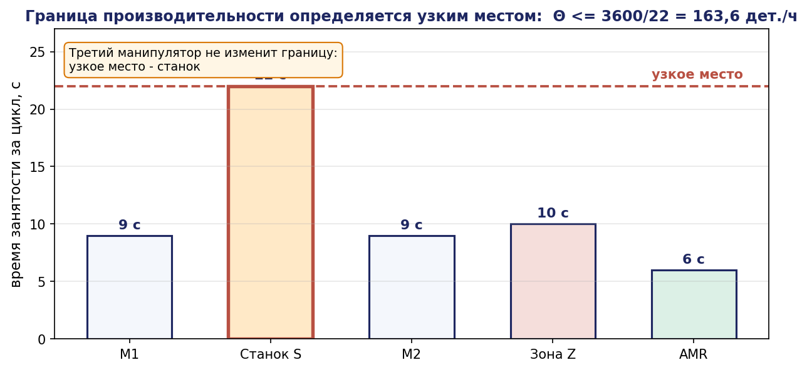
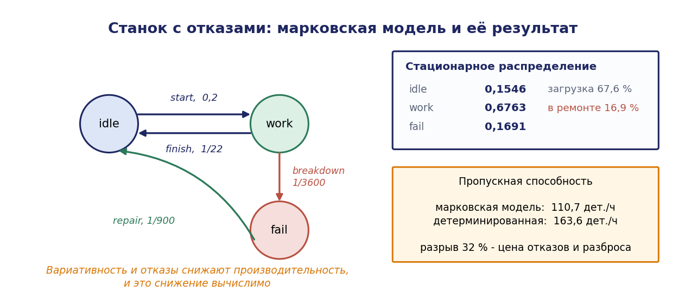
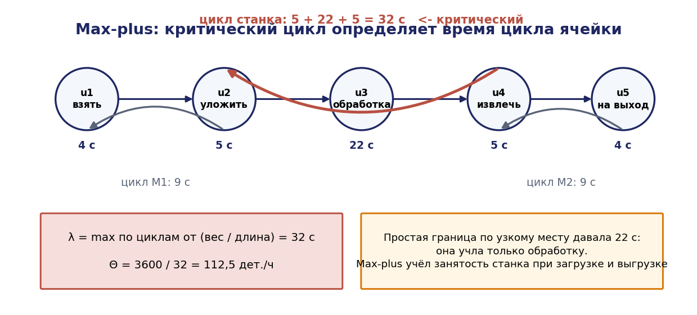
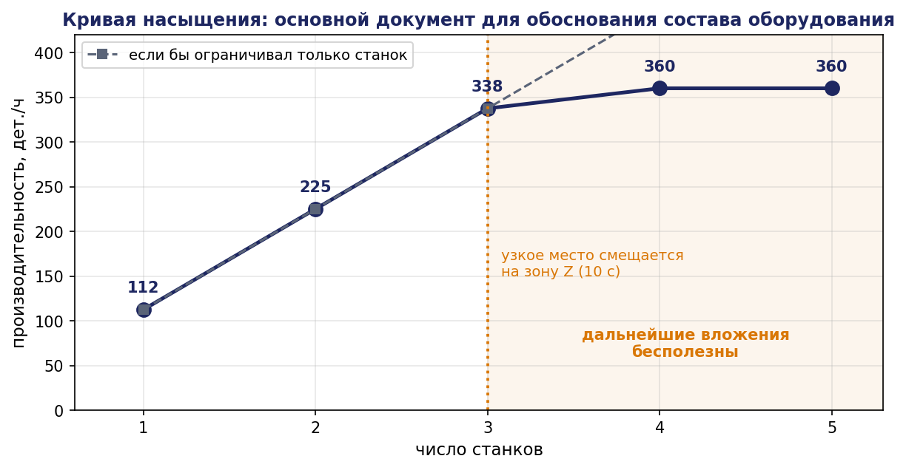
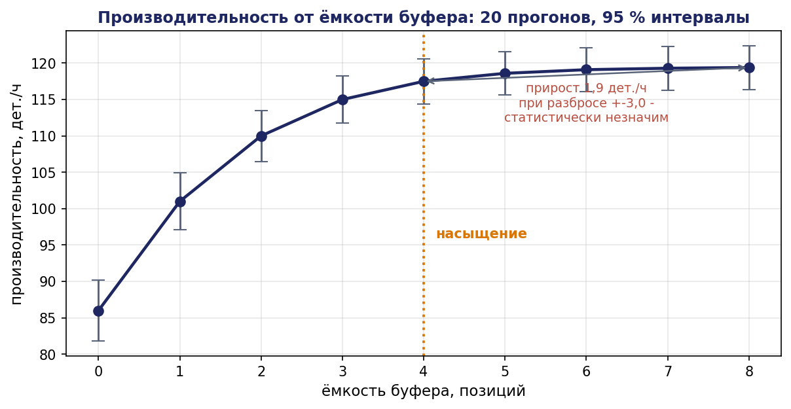

# Глава 5. Расширенные сети Петри и оценка производительности комплекса

## 5.1. Введение: от «возможно ли» к «сколько и когда»

Главы 3 и 4 отвечали на качественные вопросы: возможен ли тупик, гарантировано ли взаимное исключение, реализуема ли спецификация. Ответы имели вид «да/нет» и не содержали времени. Между тем заказчик комплекса задаёт вопросы иного рода: сколько деталей в час даст линия, где находится узкое место, окупится ли второй манипулятор, какова должна быть ёмкость буфера, сколько паллет нужно запустить в оборот.

Ответы на эти вопросы требуют расширения аппарата в трёх направлениях.

**Данные.** Ординарная сеть Петри не различает фишки: она может выразить «в буфере три детали», но не «в буфере две детали типа A и одна типа B». Введение типов приводит к цветным сетям.

**Время.** Классическая сеть описывает порядок событий, но не длительности. Введение времени срабатывания приводит к временным сетям.

**Случайность.** Реальные длительности не детерминированы, отказы происходят случайно. Введение вероятностных распределений приводит к стохастическим сетям, тесно связанным с цепями Маркова.

Настоящая глава излагает эти расширения, а также два самостоятельных инструмента количественной оценки: аппарат max-plus алгебры, дающий точное время цикла для детерминированных повторяющихся процессов, и имитационное моделирование дискретных событий, применяемое там, где аналитика невозможна.

## 5.2. Цветные сети Петри

### 5.2.1. Мотивация

Пусть ячейка обрабатывает детали трёх типов, каждый из которых требует своего маршрута. Ординарная сеть требует утроить все позиции и переходы; при пяти типах и десяти операциях сеть становится нечитаемой, а её структура — избыточно повторяющейся.

Цветная сеть (Coloured Petri Net, CPN, К. Йенсен, 1981) устраняет это дублирование: фишки получают значения («цвета»), позиции — типы, дуги — выражения, определяющие, какие именно фишки перемещаются.

### 5.2.2. Определение

**Определение 5.1.** Цветной сетью Петри называется кортеж

```math
\mathrm{CPN} = (\Sigma_C, P, T, A, N, C, G, E, I)
```

где

- $\Sigma_C$ — конечное множество непустых типов (цветовых множеств);
- P, T, A — множества позиций, переходов и дуг, $P \cap T = \varnothing$;
- $N : A \to(P \times T) \cup(T \times P)$ — функция узлов;
- $C : P \to \Sigma_C$ — функция цвета, приписывающая каждой позиции тип;
- G : T → Expr — охранное выражение (guard), булева функция от переменных перехода;
- E : A → Expr — выражение дуги, значение которого есть мультимножество над $C(p)$;
- I : P → Expr — функция начальной маркировки.

**Маркировкой** называется функция, сопоставляющая каждой позиции $p$ мультимножество элементов типа $C(p)$.

**Привязкой** (binding) перехода $t$ называется присваивание значений всем переменным, входящим в его охранное выражение и выражения инцидентных дуг. Переход разрешён при привязке $b$, если $G(t)\langle b\rangle$ истинно и для каждой входной дуги $a$ маркировка позиции содержит мультимножество $E(a)\langle b\rangle$.

### 5.2.3. Пример

Ячейка обрабатывает детали типов A и B. Тип: `colset PART = with A | B;`

Позиция `buffer` типа PART. Переход `machine` с переменной `p : PART`, охраной `[p = A orelse p = B]`, входной дугой `1'p` из `buffer` и выходной дугой `1'p` в `done`.

Одна позиция и один переход описывают то, для чего ординарной сети потребовалось бы по две позиции и по два перехода. При добавлении типа C структура сети **не меняется вовсе** — меняется только определение цветового множества.

Более содержательный пример — маршрутизация:

```
colset PART   = with A | B | C;
colset ROUTE  = list STATION;
var    p      : PART;
var    r      : ROUTE;

переход next_op:
   guard  [ r <> [] ]
   вход   (p, r)      из  in_progress
   выход  (p, tl r)   в   in_progress
   выход  (hd r)      в   request_station
```

Здесь маршрут детали хранится в самой фишке, и одна структура сети обслуживает произвольное число различных технологических маршрутов. Такая модель прямо соответствует гибкой производственной системе.

### 5.2.4. Развёртка и эквивалентность

**Теорема 5.1 (развёртка).** Всякая цветная сеть Петри с конечными цветовыми множествами эквивалентна некоторой ординарной сети Петри (её развёртке, unfolding), причём эквивалентность понимается как изоморфизм графов достижимости.

*Идея построения.* Каждой паре (p, c), где $p \in P, c \in C(p)$, сопоставляется позиция развёртки. Каждой паре (t, b), где $b$ — допустимая привязка $t$, сопоставляется переход развёртки с дугами, определяемыми значениями выражений дуг при привязке $b$. Соответствие маркировок очевидно; сохранение отношения срабатывания проверяется непосредственно по определениям. ∎

**Следствие 5.1.** Все результаты глав 4 (инварианты, сифоны, критерии живости) применимы к цветным сетям через развёртку.

Практическая ценность теоремы двоякая. С одной стороны, она гарантирует, что цветная сеть не «сильнее» обычной: выразительность та же, выигрыш — в компактности записи. С другой — она указывает предел: размер развёртки растёт как произведение мощностей цветовых множеств, и при больших типах анализ через развёртку становится невозможным. Для таких случаев развиты методы прямого анализа цветных сетей (символьные инварианты, редукция по симметрии).

### 5.2.5. Инженерное применение

Цветные сети — основной инструмент моделирования гибких производственных систем, где:

- изделия разных типов проходят разные маршруты;
- ресурсы обладают атрибутами (робот с определённым захватом, паллета с определённым приспособлением);
- требуется отслеживать историю и идентификацию изделий;
- нужно моделировать данные наряду с потоком управления.

При этом важно помнить: чем больше данных перенесено в цвета, тем меньше остаётся структурного анализа. Полезное правило — **держать в цветах то, что не влияет на конфликты и ресурсы, и в структуре то, что влияет**.

## 5.3. Временные сети Петри

### 5.3.1. Способы введения времени

Существует несколько несовпадающих способов приписать сети время, и их смешение — источник ошибок.

**$T$-временные сети (timed transitions).** Каждому переходу $t$ приписана длительность $d(t) \ge 0$. Срабатывание не мгновенно: при разрешении фишки изымаются из входных позиций, а помещаются в выходные спустя $d(t)$. Это модель занятости ресурса на время операции — наиболее естественная для производственных систем.

**$P$-временные сети.** Длительность приписана позициям: фишка, попавшая в позицию $p$, становится доступной для срабатывания лишь спустя $d(p)$. Модель времени пребывания (транспортировка, выдержка, остывание).

**Интервальные сети (Merlin, 1974).** Каждому переходу приписан интервал [a(t), b(t)]. Переход, ставший разрешённым в момент $\tau$, обязан сработать не ранее $\tau + a(t)$ и не позднее $\tau + b(t)$, если остаётся разрешённым. Эта модель выражает неопределённость длительности и используется для верификации временных требований.

Для оценки производительности применяются $T$-временные и стохастические сети; для проверки дедлайнов — интервальные сети и временные автоматы (глава 7).

### 5.3.2. Детерминированные T-временные сети

Пусть все длительности детерминированы. Тогда поведение сети полностью определено (при разрешении конфликтов некоторой политикой), и производительность вычисляется точно.

Для сети, состоящей из циклических процессов, ключевой характеристикой является **время цикла** — интервал между двумя последовательными завершениями одного и того же изделия в установившемся режиме. Аналитический расчёт времени цикла даётся max-plus алгеброй (раздел 5.6).

### 5.3.3. Пример: расчёт по T-инвариантам

Простая, но полезная оценка производительности получается из $T$-инвариантов и загрузки ресурсов.


Пусть $x$ — минимальный $T$-инвариант, описывающий один производственный цикл, и $d(t)$ — длительность перехода $t$. Тогда для каждого ресурса $r$ суммарное время его занятости за один цикл:

```math
\tau(r) = \sum_{t \in T(r)} x(t) \cdot d(t)
```

где $T(r)$ — переходы, требующие ресурса $r$. Если ресурс имеет $C(r)$ экземпляров, то минимально возможное время цикла ограничено снизу:

```math
T_{\mathrm{cycle}} \ge \max_r \quad \tau(r) / C(r)
```

**Утверждение 5.1 (граница по узкому месту).** Пропускная способность системы не превосходит

```math
\Theta \le 1 / \max_r (\tau(r) / C(r))
```

*Доказательство.* За время $T$ система выполняет не более $\Theta \cdot T$ циклов. Каждый цикл требует $\tau(r)$ единиц времени работы ресурса $r$, а суммарный доступный ресурс за время $T$ равен $C(r)\cdot T$. Следовательно, $\Theta \cdot T\cdot \tau(r) \le C(r)\cdot T$ для каждого $r$, откуда $\Theta \le C(r)/\tau(r)$ для всех $r$, то есть $\Theta \le \min_r C(r)/\tau(r). \blacksquare$

Ресурс, на котором достигается минимум, называется **узким местом** (bottleneck). Эта простая оценка часто оказывается достижимой и даёт первый ответ на вопрос заказчика.

**Числовой пример (пример Б).** Длительности операций за один цикл обработки детали:

| Ресурс | Операции | Время за цикл, с | Экземпляров |
|---|---|---|---|
| Манипулятор $M_1$ | взять с конвейера 4 с, уложить в станок 5 с | 9 | 1 |
| Станок $S$ | обработка 22 с | 22 | 1 |
| Манипулятор $M_2$ | извлечь 5 с, положить на конвейер 4 с | 9 | 1 |
| Зона $Z$ | занята при укладке 5 с и извлечении 5 с | 10 | 1 |
| AMR | вывоз паллеты (1 на 10 деталей) 60 с | 6 | 1 |

Границы: 9, 22, 9, 10, 6. Узкое место — станок, $T_{\mathrm{cycle}} \ge 22$ с, $\Theta \le 163{,}6$ детали в час.

Проверим вывод о втором манипуляторе: добавление третьего манипулятора не изменит границу, поскольку узким местом является станок. Второй станок даст $\tau(S)/C(S) = 22/2 = 11$ с, и новым узким местом станет зона $Z$ (10 с) — точнее, максимум из 9, 11, 9, 10, 6, то есть 11 с, $\Theta \le 327$ деталей в час. Дальнейшее удвоение станков упрётся в зону $Z$ при 10 с.

Это рассуждение — типовой пример инженерного вывода, получаемого за пять минут из структуры модели и таблицы длительностей, до какого-либо программирования.




## 5.4. Стохастические сети Петри

### 5.4.1. Определение и связь с цепями Маркова

**Определение 5.2.** Стохастической сетью Петри (SPN) называется пара $(N, \Lambda)$, где $N$ — сеть Петри, а $\Lambda : T \to \mathbb{R}^+$ приписывает каждому переходу интенсивность $\lambda(t)$: задержка срабатывания разрешённого перехода распределена экспоненциально с параметром $\lambda(t)$.

Экспоненциальное распределение выбрано не произвольно: оно единственное непрерывное распределение, обладающее свойством отсутствия последействия, что и обеспечивает марковость.

**Теорема 5.2 (изоморфизм с цепью Маркова).** Для ограниченной SPN процесс маркировок $\lbrace M(\tau), \tau \ge 0 \rbrace$ является цепью Маркова с непрерывным временем (CTMC), пространством состояний которой служит множество достижимых маркировок $R(N, M_0)$, а инфинитезимальный генератор $Q$ определяется как

```math
\begin{gathered} Q[M_i, M_j] = \sum \lbrace \lambda(t) : M_i[t\rangle M_j \rbrace, \quad i \ne j \cr Q[M_i, M_i] = - \sum_{j \ne i} Q[M_i, M_j] \end{gathered}
```

*Доказательство.* Пусть система находится в маркировке $M_i$, и пусть $E(M_i)$ — множество разрешённых при ней переходов. Остаточные времена всех разрешённых переходов независимы и экспоненциальны с параметрами $\lambda(t)$ (по свойству отсутствия последействия — независимо от того, сколько времени переход уже разрешён). Время до первого срабатывания есть минимум независимых экспоненциальных величин:

```math
\tau_i = \min_{t \in E(M_i)} \tau_t, \quad \tau_i \sim \mathrm{Exp}(\sum_{t \in E(M_i)} \lambda(t))
```

Вероятность того, что первым сработает именно $t$:

```math
P(t) = \lambda(t) / \sum_{t' \in E(M_i)} \lambda(t')
```

Так как распределение остаточного времени не зависит от прошлого, а следующая маркировка определяется только текущей маркировкой и сработавшим переходом, процесс марковский. Интенсивность перехода из $M_i$ в $M_j$ есть сумма интенсивностей всех переходов, ведущих из $M_i$ в $M_j$, что и даёт указанный генератор. ∎

### 5.4.2. Стационарное распределение и показатели

Если CTMC неприводима (что эквивалентно обратимости сети) и конечна, существует единственное стационарное распределение $\pi$, находимое из системы

```math
\pi \cdot Q = 0, \quad \Sigma_i \pi_i = 1
```

Через $\pi$ вычисляются все интересующие показатели.

**Вероятность условия.** Для любого предиката $\psi$ над маркировками:

```math
P(\psi) = \sum_{M : \psi(M)} \pi(M)
```

**Среднее число фишек в позиции:**

```math
E[M(p)] = \sum_M \pi(M) \cdot M(p)
```

**Пропускная способность перехода** (throughput) — среднее число срабатываний в единицу времени:

```math
\Theta(t) = \lambda(t) \cdot \sum_{M : M[t\rangle} \pi(M) = \lambda(t) \cdot P(t \text{ разрешён })
```

**Загрузка ресурса** $r$ с ёмкостью $C(r)$:

```math
U(r) = (C(r) - E[M(r)]) / C(r)
```

**Закон Литтла.** Для стационарного потока среднее число заявок в системе, интенсивность потока и среднее время пребывания связаны соотношением

```math
L = \Theta \cdot W
```

где $L = E$[число деталей в системе], $\Theta$ — пропускная способность, $W$ — среднее время пребывания. Закон позволяет получить среднее время изготовления, не вычисляя его напрямую:

```math
W = L / \Theta
```

Это соотношение справедливо при весьма общих условиях (не требует марковости) и является одним из самых полезных инструментов оценки производственной системы.

### 5.4.3. Обобщённые стохастические сети (GSPN)

Чистая SPN неудобна тем, что все переходы имеют ненулевую длительность, тогда как многие переходы модели логические (выбор маршрута, проверка условия) и должны быть мгновенными.

**Определение 5.3.** В обобщённой стохастической сети Петри (GSPN) множество переходов разбито на два класса:

- **временные** (timed) переходы $T_t$ с экспоненциальными задержками $\lambda(t)$;
- **мгновенные** (immediate) переходы $T_i$, срабатывающие без задержки; конфликты между ними разрешаются весами $w(t)$ с вероятностями $w(t)/\Sigma w$.

Мгновенные переходы имеют приоритет над временными.

Маркировки делятся на два класса:

- **осязаемые** (tangible) — те, при которых разрешены только временные переходы; в них система проводит положительное время;
- **исчезающие** (vanishing) — те, при которых разрешён хотя бы один мгновенный переход; время пребывания равно нулю.

**Анализ GSPN** выполняется построением вложенной цепи Маркова с последующим исключением исчезающих состояний. Пусть матрица переходов вложенной DTMC разбита на блоки

```math
U = \begin{pmatrix} U_{vv} & U_{vt} \cr U_{tv} & U_{tt} \end{pmatrix}
```

где индексы $v$ и $t$ относятся к исчезающим и осязаемым состояниям. Тогда матрица переходов редуцированной цепи только по осязаемым состояниям:

```math
U' = U_{tt} + U_{tv} \cdot(I - U_{vv})^{-1} \cdot U_{vt}
```

Обратимость матрицы $(I - U_{vv})$ гарантируется отсутствием бесконечных циклов из мгновенных переходов — условие, которое проектировщик обязан обеспечить (циклы мгновенных переходов — ошибка моделирования, означающая мгновенную бесконечную активность).

### 5.4.4. Численный пример

Рассмотрим станок с отказами. Позиции: `idle` (простаивает), `work` (обрабатывает), `fail` (в ремонте). Переходы:


- `start`: $\mathit{idle} \to \mathit{work}, \lambda_1 = 0{,}2 c^{-1}$ (в среднем 5 с ожидания детали);
- `finish`: $\mathit{work} \to \mathit{idle}, \lambda_2 = 1/22 \approx 0{,}04545 c^{-1}$ (обработка 22 с);
- `breakdown`: $\mathit{work} \to \mathit{fail}, \lambda_3 = 1/3600 c^{-1}$ (наработка на отказ 1 час работы);
- `repair`: $\mathit{fail} \to \mathit{idle}, \lambda_4 = 1/900 c^{-1}$ (ремонт 15 минут).

Пространство состояний: три маркировки $M_1 = \mathit{idle}, M_2 = \mathit{work}, M_3 = \mathit{fail}$. Генератор:

```math
Q = \begin{pmatrix} -0{,}2 & 0{,}2 & 0 \cr 0{,}04545 & -(0{,}04545+0{,}000278) & 0{,}000278 \cr 0{,}001111 & 0 & -0{,}001111 \end{pmatrix}
```

Решаем $\pi Q = 0$ с нормировкой. Из первого столбца:

```math
-0{,}2\cdot \pi_1 + 0{,}04545\cdot \pi_2 + 0{,}001111\cdot \pi_3 = 0
```

Из третьего столбца:

```math
0{,}000278\cdot \pi_2 - 0{,}001111\cdot \pi_3 = 0 \implies \pi_3 = 0{,}25\cdot \pi_2
```

Подставляя в первое:

```math
\begin{gathered} -0{,}2\cdot \pi_1 + 0{,}04545\cdot \pi_2 + 0{,}001111\cdot 0{,}25\cdot \pi_2 = 0 \cr 0{,}2\cdot \pi_1 = (0{,}04545 + 0{,}000278)\cdot \pi_2 = 0{,}045728\cdot \pi_2 \cr \pi_1 = 0{,}22864\cdot \pi_2 \end{gathered}
```

Нормировка: $\pi_1 + \pi_2 + \pi_3 = \pi_2\cdot(0{,}22864 + 1 + 0{,}25) = 1{,}47864\cdot \pi_2 = 1$

```math
\pi_2 = 0{,}6763, \quad \pi_1 = 0{,}1546, \quad \pi_3 = 0{,}1691
```

Показатели:

- коэффициент использования станка $U = \pi_2 = 67{,}6 \text{%}$;
- доля времени в ремонте = 16,9 % — существенно больше ожидаемого; причина в том, что 15-минутный ремонт при наработке 1 час работы даёт значительную долю простоя;
- пропускная способность $\Theta = \lambda_2\cdot \pi_2 = 0{,}04545 \cdot 0{,}6763 = 0{,}03074$ дет./с = **110,7 деталей в час**.

Сравним с детерминированной оценкой раздела 5.3.3, дававшей 163,6 дет./ч. Разница в 32 % обусловлена отказами и случайностью, не учтёнными в детерминированной модели. Именно поэтому производственную оценку нельзя строить только на номинальных длительностях: **вариативность и отказы систематически снижают производительность, и это снижение вычислимо**.

Проверим влияние сокращения ремонта до 5 минут $(\lambda_4 = 1/300): \pi_3 = (0{,}000278/0{,}003333)\cdot \pi_2 = 0{,}0834\cdot \pi_2$; нормировка даёт $\pi_2 = 1/(0{,}22864 + 1 + 0{,}0834) = 0{,}7620; \Theta = 0{,}04545\cdot 0{,}7620 = 0{,}03463$ дет./с = **124,7 дет./ч**. Сокращение времени ремонта втрое даёт +12,6 % производительности — количественное обоснование инвестиции в оперативность обслуживания.




## 5.5. Ограничения марковских моделей

Экспоненциальное распределение длительности операции — сильное и обычно неверное допущение: время обработки детали на станке имеет малую дисперсию и распределено скорее нормально или детерминировано, а экспоненциальное распределение имеет коэффициент вариации, равный единице.

Три способа обойти это ограничение:

**Фазовые распределения.** Детерминированную или малодисперсную длительность аппроксимируют цепочкой из $k$ последовательных экспоненциальных фаз (распределение Эрланга), для которого коэффициент вариации равен $1/\sqrt{k}$. При $k = 10$ получается неплохое приближение детерминированной длительности ценой десятикратного роста числа состояний.

**Немарковские сети (DSPN, MRSPN).** Допускаются детерминированные и общие распределения; анализ существенно сложнее и в большинстве случаев требует численных методов.

**Имитационное моделирование.** Универсальный выход, обсуждаемый в разделе 5.7.

Инженерная рекомендация: марковская модель применяется для быстрой оценки и анализа чувствительности («что будет, если ремонт вдвое быстрее»), а окончательные цифры получаются имитацией. Марковская модель, в отличие от имитации, даёт точные соотношения и позволяет проводить аналитическую оптимизацию.

## 5.6. Max-plus алгебра и точный расчёт времени цикла

### 5.6.1. Мотивация

Для детерминированных повторяющихся процессов (а это типичная производственная линия) существует изящный и точный аппарат, дающий время цикла в замкнутой форме — max-plus алгебра.

Идея исходит из наблюдения: если операция может начаться лишь после завершения нескольких предшествующих, то момент её начала есть **максимум** моментов их завершения, а момент завершения есть **сумма** момента начала и длительности. Заменив в линейной алгебре сложение на максимум, а умножение на сложение, получаем формализм, в котором такие системы описываются линейными уравнениями.

### 5.6.2. Алгебраическая структура

Рассмотрим множество $\mathbb{R}_{\max} = \mathbb{R} \cup \lbrace -\infty \rbrace$ с операциями

```math
a \oplus b = \max(a, b), \quad a \otimes b = a + b
```

**Утверждение 5.2.** $(\mathbb{R}_{\max}, \oplus, \otimes)$ есть коммутативное идемпотентное полукольцо (диоид) с нейтральными элементами $\varepsilon = -\infty$ для $\oplus$ и $e = 0$ для $\otimes$.

*Проверка.* Ассоциативность и коммутативность обеих операций очевидны. Дистрибутивность: $a \otimes(b \oplus c) = a + \max(b,c) = \max(a+b, a+c) = (a\otimes b) \oplus(a\otimes c)$. Нейтральность: $\max(a, -\infty) = a, a + 0 = a$. Поглощение: $a \otimes \varepsilon = a + (-\infty) = -\infty = \varepsilon$. Идемпотентность: $a \oplus a = a. \blacksquare$

Отсутствие обратного элемента по $\oplus$ (идемпотентность несовместима с группой) означает, что это именно полукольцо, а не поле: «вычитания» нет.

Матричные операции определяются обычным образом:

```math
(A \otimes B)[i,j] = \oplus_k (A[i,k] \otimes B[k,j]) = \max_k (A[i,k] + B[k,j])
```

### 5.6.3. Линейное представление производственной системы

Пусть $x_i(k)$ — момент $k$-го начала (или завершения) операции $i$. Для системы с фиксированной структурой связей уравнения имеют вид

```math
x(k+1) = A \otimes x(k)
```

где A[i,j] = длительность связи от операции $j$ к операции $i$, если связь существует, и $\varepsilon$ иначе.

**Пример.** Линия из трёх станций, каждая передаёт деталь следующей; длительности $d_1 = 4, d_2 = 7, d_3 = 5$ с; между станциями нет буферов (станция не может принять деталь, пока не освободила предыдущую).

$x_1(k+1) = \max(x_1(k) + d_1, x_2(k) + d_2)$
$x_2(k+1) = \max(x_1(k+1) + d_1, x_3(k) + d_3)$ — в матричной форме требует приведения к стандартному виду; для простоты рассмотрим циклическую структуру:

```math
A = \begin{pmatrix} 4 & \varepsilon & 5 \cr 4 & 7 & \varepsilon \cr \varepsilon & 7 & 5 \end{pmatrix}
```

### 5.6.4. Собственное значение и время цикла

**Определение 5.4.** Число $\lambda \in \mathbb{R}$ называется собственным значением матрицы A в max-plus алгебре, если существует вектор $v \ne(\varepsilon,\ldots,\varepsilon)$ с

```math
A \otimes v = \lambda \otimes v, \quad \text{ то есть } \quad \max_j (A[i,j] + v_j) = \lambda + v_i \quad \text{ для всех } i
```

**Теорема 5.3 (Кюнингем-Грин, 1962).** Всякая неприводимая матрица A над $\mathbb{R}_{\max}$ имеет единственное собственное значение $\lambda$, равное максимальному среднему весу цикла в соответствующем взвешенном орграфе:

```math
\lambda = \max_{C \text{ — } \text{ цикл }} (w(C) / \lvert C\rvert)
```

где $w(C)$ — сумма весов дуг цикла, $\lvert C\rvert$ — число дуг.

*Идея доказательства.* Существование: строится через степени матрицы $A\otimes^k$ и показывается, что рост элементов асимптотически линеен с коэффициентом $\lambda$. Единственность следует из неприводимости: сильная связность графа не допускает двух различных асимптотических скоростей. Равенство $\lambda$ максимальному среднему весу цикла получается из представления $A\otimes^k[i,j]$ как максимального веса пути длины $k$ из $j$ в $i$: при больших $k$ такой путь обязан многократно проходить по циклу с максимальным средним весом. ∎

**Инженерный смысл.** Собственное значение $\lambda$ есть **время цикла установившегося режима**: в стационарном режиме $x_i(k+1) = x_i(k) + \lambda$, то есть все операции повторяются с периодом $\lambda$. Цикл, на котором достигается максимум, есть **критический цикл** — он и определяет производительность. Все прочие циклы имеют запас.

Это точный аналог понятия критического пути в сетевом планировании, но для повторяющихся, а не однократных процессов.

### 5.6.5. Вычисление: алгоритм Карпа

**Теорема 5.4 (Карп, 1978).** Максимальное среднее значение цикла в графе с $n$ вершинами вычисляется по формуле

```math
\lambda = \max_{i} \min_{0 \le k \le n-1} (D_n(i) - D_k(i)) / (n - k)
```

где $D_k(i)$ — максимальный вес пути длины ровно $k$ из фиксированной вершины $s$ в вершину $i$ ($\varepsilon$, если такого пути нет).

Алгоритм требует $O(n\cdot m)$ операций, где $m$ — число дуг: вычисляются n+1 векторов $D_k$ динамическим программированием, затем берётся указанный максимин.

```python
NEG = float('-inf')

def max_cycle_mean(A):
    """A[i][j] — вес дуги j -> i (NEG, если дуги нет). Граф неприводим."""
    n = len(A)
    # D[k][i] — макс. вес пути длины k из вершины 0 в i
    D = [[NEG] * n for _ in range(n + 1)]
    D[0][0] = 0.0
    for k in range(1, n + 1):
        for i in range(n):
            best = NEG
            for j in range(n):
                if A[i][j] != NEG and D[k - 1][j] != NEG:
                    best = max(best, D[k - 1][j] + A[i][j])
            D[k][i] = best
    lam = NEG
    for i in range(n):
        if D[n][i] == NEG:
            continue
        worst = float('inf')
        for k in range(n):
            if D[k][i] == NEG:
                continue
            worst = min(worst, (D[n][i] - D[k][i]) / (n - k))
        lam = max(lam, worst)
    return lam
```

### 5.6.6. Разбор: расчёт цикла ячейки

Применим аппарат к примеру Б. Операции и их длительности:


| Операция | Обозначение | Длительность, с | Предшественники |
|---|---|---|---|
| Взять с конвейера | $u_1$ | 4 | освобождение $M_1$ от прошлой детали |
| Уложить в станок | $u_2$ | 5 | $u_1$, освобождение станка |
| Обработка | $u_3$ | 22 | $u_2$ |
| Извлечь из станка | $u_4$ | 5 | $u_3$, освобождение $M_2$ |
| Уложить на выход | $u_5$ | 4 | $u_4$ |

Ограничения ресурсов порождают циклы в графе:

- цикл станка: $u_2 \to u_3 \to u_4 \to$ (станок свободен) $\to u_2$ следующей детали. Вес: 5 + 22 + 5 = 32, длина 3? В max-plus учитывается вес цикла в единицах времени и число «тактов» изделия; при одной детали в станке цикл проходится за один такт, поэтому средний вес цикла = 32/1 = 32 с;
- цикл манипулятора $M_1: u_1 \to u_2 \to$ ($M_1$ свободен) $\to u_1$. Вес 4 + 5 = 9, один такт: 9 с;
- цикл манипулятора $M_2: u_4 \to u_5 \to$ ($M_2$ свободен) $\to u_4$. Вес 5 + 4 = 9 с;
- цикл зоны $Z$ (занята при $u_2$ и $u_4$): 5 + 5 = 10 с.

Критический цикл — станок: **$\lambda = 32$ с**, то есть 112,5 деталей в час.

Обратим внимание: детерминированная оценка по узкому месту (раздел 5.3.3) давала 22 с, поскольку учитывала только чистое время обработки. Max-plus учёл, что станок занят также во время укладки и извлечения, — и это правильный ответ, если робот работает «в станке». Если же конструкция позволяет манипуляторам работать с деталью вне станка (загрузка через паллету-спутник), цикл станка сокращается до 22 с, и это **проектное решение стоимостью 45 % производительности**, полученное расчётом, а не измерением на готовой линии.

Добавим буфер и второй станок: два станка дают цикл 32/2 = 16 с, новое узкое место — зона $Z$ (10 с) и манипуляторы (9 с), значит $\lambda = 16$ с, $\Theta = 225$ дет./ч. Третий станок: 32/3 = 10,67 с, узкое место — зона $Z$ с 10 с, $\lambda = 10{,}67$ с, $\Theta = 337$ дет./ч. Четвёртый станок уже не даст выигрыша сверх зоны: $\lambda \ge 10$ с. Получена **кривая насыщения** — основной документ для обоснования состава оборудования.






## 5.7. Имитационное моделирование дискретных событий

### 5.7.1. Когда аналитика недостаточна

Аналитические методы требуют либо детерминированности (max-plus), либо экспоненциальности (SPN/GSPN). Реальная система обычно не удовлетворяет ни тому, ни другому: длительности имеют произвольные распределения, дисциплины обслуживания сложны, приоритеты динамические, отказы коррелированы. В этих случаях применяется имитационное моделирование.

### 5.7.2. Механизм продвижения времени

Стандартная схема — **моделирование по событиям** (event-driven simulation): поддерживается календарь будущих событий, упорядоченный по времени; на каждом шаге извлекается ближайшее событие, модельное время скачком переводится на его момент, обрабатываются последствия, планируются новые события.

```python
import heapq, random

class Sim:
    def __init__(self):
        self.t = 0.0
        self.cal = []          # очередь с приоритетом: (время, счётчик, обработчик)
        self.seq = 0

    def schedule(self, delay, handler):
        self.seq += 1
        heapq.heappush(self.cal, (self.t + delay, self.seq, handler))

    def run(self, t_end):
        while self.cal and self.cal[0][0] <= t_end:
            self.t, _, handler = heapq.heappop(self.cal)
            handler(self)
```

Ключевое свойство: время продвигается скачками между событиями, а не равномерным шагом. Для системы, где события редки относительно горизонта моделирования, выигрыш в скорости составляет порядки.

### 5.7.3. Статистическая корректность

Имитация даёт случайный результат, и его интерпретация требует статистической аккуратности. Три обязательных элемента:


**Отбрасывание переходного периода.** Показатели установившегося режима вычисляются после выхода системы на стационар. Момент выхода определяется графически (правило Уэлча) или по критериям стационарности.

**Доверительный интервал.** Прогон повторяется $n$ раз с разными начальными значениями генератора; для среднего значения $\overline{X}$ строится интервал

```math
\overline{X} \pm t_{n-1, 1-\alpha /2} \cdot s / \sqrt{n}
```

Единственный прогон, каким бы длинным он ни был, доверительного интервала не даёт — это самая частая ошибка в студенческих отчётах.

**Общие случайные числа.** При сравнении конфигураций используется один и тот же поток случайных чисел, что резко снижает дисперсию разности и позволяет обнаружить различие меньшим числом прогонов.

**Числовой пример.** Сравниваются две конфигурации ячейки; по 10 прогонов дают средние $\Theta_1 = 118{,}4$ дет./ч $(s_1 = 6{,}2)$ и $\Theta_2 = 124{,}9$ дет./ч $(s_2 = 5{,}8)$. Разность 6,5 дет./ч. Стандартная ошибка разности при независимых прогонах: $\sqrt{6{,}2^2/10 + 5{,}8^2/10} = \sqrt{3{,}844 + 3{,}364} = 2{,}685$. Отношение 6,5/2,685 = 2,42 при $t_0{,}_{975} \approx 2{,}10$ (18 степеней свободы) — различие значимо. Если бы разность составила 4 дет./ч, отношение 1,49 < 2,10, и вывод «вторая конфигурация лучше» был бы статистически необоснован.

Такой расчёт обязателен в отчёте по семинару: **вывод о превосходстве конфигурации без доверительного интервала не принимается**.




## 5.8. Инструменты

| Инструмент | Класс моделей | Назначение |
|---|---|---|
| CPN Tools | цветные, временные | моделирование и анализ производственных систем |
| GreatSPN | GSPN, SWN | численный анализ стационарных характеристик |
| TimeNET | DSPN, немарковские | системы с детерминированными длительностями |
| PIPE | обычные, GSPN | учебный анализ, инварианты |
| SimPy (Python) | имитация | процессно-ориентированное моделирование |
| Scilab Max-Plus toolbox | max-plus | расчёт собственных значений |

Для семинара 3 рекомендуется связка: аналитическая оценка вручную (границы по узкому месту и max-plus), затем проверка имитацией на SimPy с построением доверительных интервалов.

## 5.9. Методика количественной оценки комплекса

**Шаг 1. Оценка сверху по узкому месту.** По утверждению 5.1, за пять минут и без модели. Даёт порядок величины и указывает критический ресурс.

**Шаг 2. Точное время цикла для детерминированного режима.** Max-plus, критический цикл. Показывает, какое улучшение даёт устранение узкого места.

**Шаг 3. Кривая насыщения.** Пересчёт для 1, 2, 3, … экземпляров критического ресурса. Определяет экономически осмысленный состав оборудования.

**Шаг 4. Учёт отказов и вариативности.** GSPN или имитация. Даёт реалистичный прогноз, обычно на 20–35 % ниже детерминированного.

**Шаг 5. Определение ёмкости буферов.** Анализ чувствительности: производительность как функция ёмкости буфера. Как правило, наблюдается быстрое насыщение — буфер сверх 3–5 позиций редко даёт выигрыш.

**Шаг 6. Проверка закона Литтла.** Согласованность $L, \Theta, W$ — контроль корректности модели. Нарушение соотношения означает ошибку в модели или в сборе статистики.

**Шаг 7. Доверительные интервалы и анализ чувствительности.** Какие параметры влияют на результат сильнее всего? Именно они требуют точного измерения на реальном оборудовании.

## 5.10. Выводы

1. Цветные сети устраняют дублирование структуры при моделировании многономенклатурного производства; их выразительность не превышает выразительности обычных сетей (теорема о развёртке), выигрыш — в компактности и читаемости.
2. Время вводится в сеть несколькими несовпадающими способами; для оценки производительности применяются $T$-временные и стохастические сети, для проверки дедлайнов — интервальные.
3. Простая граница по узкому месту $\Theta \le \min_r C(r)/\tau(r)$ даёт первую оценку производительности до какого-либо моделирования.
4. Стохастическая сеть Петри изоморфна цепи Маркова с непрерывным временем; стационарное распределение даёт загрузку, пропускную способность и, через закон Литтла, среднее время изготовления.
5. Марковская модель систематически занижает производительность по сравнению с детерминированной оценкой; разница количественно выражает влияние вариативности и отказов.
6. Max-plus алгебра даёт точное время цикла детерминированной повторяющейся системы как максимальное среднее значение цикла графа; критический цикл указывает объект для улучшения.
7. Имитационное моделирование универсально, но требует статистической дисциплины: отбрасывание переходного периода, повторные прогоны, доверительные интервалы, общие случайные числа.

## 5.11. Контрольные вопросы

1. Что даёт цветная сеть по сравнению с обычной и что она не даёт?
2. Почему теорема о развёртке одновременно обнадёживает и ограничивает?
3. Перечислите три способа введения времени в сеть Петри и укажите, для каких задач каждый предназначен.
4. Выведите границу производительности по узкому месту.
5. Почему в SPN используется именно экспоненциальное распределение? Что было бы при равномерном?
6. Что такое исчезающая маркировка и почему циклы мгновенных переходов недопустимы?
7. Сформулируйте закон Литтла и объясните, как им проверять корректность модели.
8. Почему $(\mathbb{R}_{\max}, \oplus, \otimes)$ не является полем?
9. Каков физический смысл собственного значения матрицы в max-plus алгебре?
10. Почему единственный длинный прогон имитации не заменяет нескольких коротких?

## 5.12. Задачи

**Задача 5.1.** Постройте цветную сеть для ячейки, обрабатывающей три типа деталей с разными маршрутами. Оцените размер развёртки.

**Задача 5.2.** Для ячейки с длительностями: подача 3 с, захват 4 с, обработка 18 с, выгрузка 4 с, транспортировка 6 с (все ресурсы в одном экземпляре) вычислите границу производительности и укажите узкое место.

**Задача 5.3.** Постройте SPN для станка с отказами при $\lambda_{\mathrm{start}} = 0{,}25, \lambda_{\mathrm{finish}} = 1/18, \lambda_{\mathrm{fail}} = 1/2400, \lambda_{\mathrm{repair}} = 1/600$. Найдите стационарное распределение и пропускную способность.

**Задача 5.4.** Для задачи 5.3 постройте зависимость пропускной способности от времени ремонта в диапазоне 5–60 минут. При каком значении дальнейшее сокращение перестаёт быть выгодным?

**Задача 5.5.** Составьте max-plus модель линии из четырёх станций с длительностями 6, 9, 7, 5 с без буферов. Вычислите время цикла алгоритмом Карпа. Как изменится результат при добавлении буфера на 1 позицию между второй и третьей станциями?

**Задача 5.6.** Реализуйте алгоритм Карпа и проверьте его на задаче 5.5. Выведите критический цикл.

**Задача 5.7.** Постройте имитационную модель ячейки примера Б на SimPy с нормально распределёнными длительностями (коэффициент вариации 0,15) и отказами. Выполните 20 прогонов, постройте доверительный интервал для пропускной способности и сравните с аналитической оценкой.

**Задача 5.8.** Для модели задачи 5.7 постройте зависимость производительности от ёмкости буфера (0–8 позиций). Где наступает насыщение? Обоснуйте статистически.

**Задача 5.9.** Проверьте закон Литтла на данных имитации задачи 5.7: измерьте $L, \Theta, W$ независимо и оцените невязку.

## 5.13. Литература к главе

1. Jensen K., Kristensen L. M. Coloured Petri Nets: Modelling and Validation of Concurrent Systems. — Springer, 2009.
2. Marsan M. A., Balbo G., Conte G., Donatelli S., Franceschinis G. Modelling with Generalized Stochastic Petri Nets. — Wiley, 1995.
3. Baccelli F., Cohen G., Olsder G. J., Quadrat J.-P. Synchronization and Linearity: An Algebra for Discrete Event Systems. — Wiley, 1992.
4. Heidergott B., Olsder G. J., van der Woude J. Max Plus at Work. — Princeton University Press, 2006.
5. Karp R. M. A Characterization of the Minimum Cycle Mean in a Digraph // Discrete Mathematics. — 1978. — Vol. 23, No. 3. — P. 309–311.
6. Merlin P., Farber D. Recoverability of Communication Protocols // IEEE Transactions on Communications. — 1976. — Vol. 24, No. 9. — P. 1036–1043.
7. Law A. M. Simulation Modeling and Analysis. 5th ed. — McGraw-Hill, 2015.
8. Little J. D. C. A Proof for the Queuing Formula L = λW // Operations Research. — 1961. — Vol. 9, No. 3. — P. 383–387.
