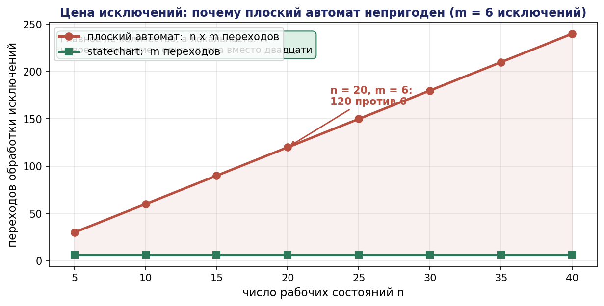
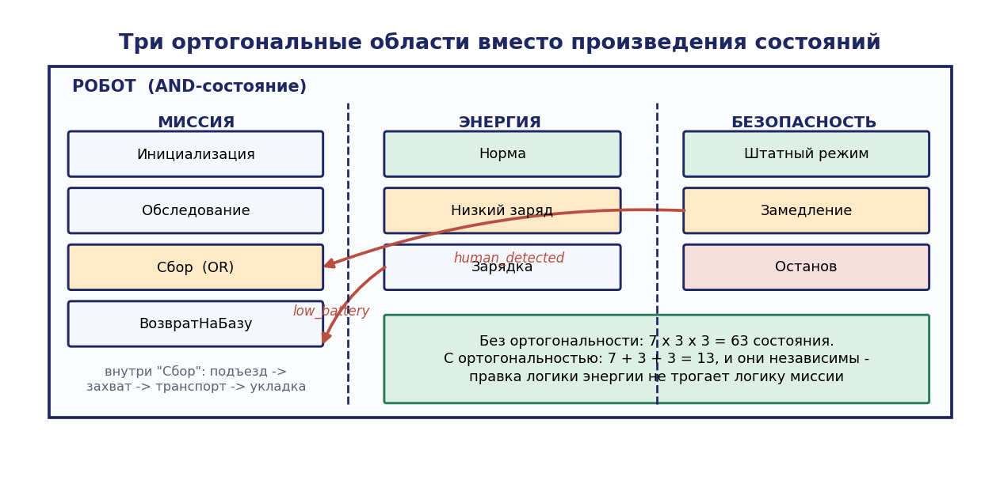
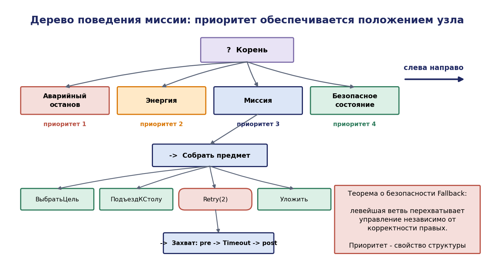
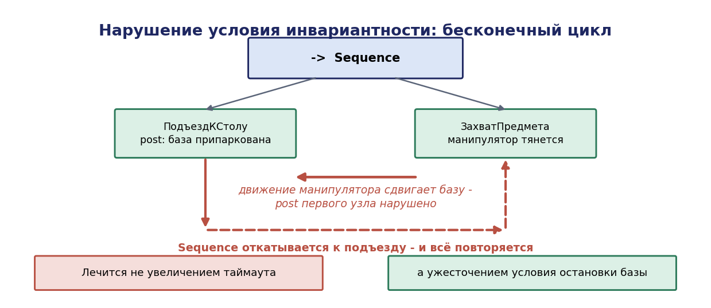

# Глава 6. Иерархические автоматы и деревья поведения

## 6.1. Введение: где плоский автомат перестаёт работать

Конечный автомат — естественная первая модель исполнительной логики миссии. Состояния соответствуют этапам («еду к столу», «беру предмет», «везу»), переходы — их завершению. Для учебного примера из пяти состояний модель прозрачна и работает.

Проблема возникает при добавлении обработки исключений — то есть при переходе от учебного примера к реальному проекту.

### 6.1.1. Количественная оценка проблемы

Пусть логика миссии содержит $n$ рабочих состояний. Добавим обработку $m$ исключительных ситуаций, каждая из которых может возникнуть в любом состоянии: разряд аккумулятора, аварийный останов, потеря локализации, срыв захвата, появление человека в зоне, отказ связи.


В плоском автомате каждое исключение требует перехода из каждого состояния:

$\lvert \delta_{\mathrm{exceptions}}\rvert = n \cdot m$

При $n = 20$ и $m = 6$ это 120 дополнительных переходов — сверх примерно 25 рабочих. Диаграмма становится нечитаемой, а главное — **добавление одного нового исключения требует внесения $n$ изменений**, каждое из которых может быть пропущено. Практика показывает, что пропущенные переходы обработки исключений — самый распространённый класс дефектов исполнительной логики.

Хуже того: после обработки исключения нужно вернуться туда, откуда произошёл выход. Плоский автомат не имеет памяти о том, откуда пришёл, поэтому требуется либо дублирование состояний обработки (по одному на каждое рабочее состояние, что даёт $n\cdot m$ состояний), либо введение вспомогательных переменных — то есть фактический отказ от чисто автоматной модели.




### 6.1.2. Два ответа

Исторически сложились два решения этой проблемы.

**Иерархические автоматы (statecharts)**, предложенные Д. Харелом в 1987 году, вводят вложенность состояний: переход, исходящий из составного состояния, наследуется всеми вложенными. Тогда одно исключение требует одного перехода вместо $n$, и число переходов падает с $n\cdot m$ до $m$.

**Деревья поведения (behavior trees)**, пришедшие из индустрии компьютерных игр в начале 2000-х и формализованные в робототехнике в 2010-х, идут дальше: они делают структуру логики древовидной и опрашиваемой, обеспечивая реактивность и модульность на уровне композиции, а не на уровне переходов.

Настоящая глава излагает оба формализма, доказывает их основные свойства и даёт критерии выбора.

## 6.2. Иерархические автоматы (statecharts)

### 6.2.1. Три расширения Харела

Харел определил statecharts формулой:

**statecharts = конечные автоматы + иерархия + параллелизм + широковещание**

**Иерархия (OR-состояния).** Состояние может быть составным: содержать вложенную машину состояний, из которых система в каждый момент находится ровно в одном. Переход, исходящий из составного состояния, срабатывает независимо от того, в каком вложенном состоянии находится система.

**Параллелизм (AND-состояния).** Состояние может содержать несколько ортогональных областей, работающих одновременно; система находится одновременно во всех областях. Это позволяет описать независимые аспекты поведения (движение, манипуляция, диагностика) без построения произведения состояний.

**Широковещание.** Событие, порождённое в одной области, видимо во всех остальных, что даёт механизм координации ортогональных областей.

### 6.2.2. Формальное определение

**Определение 6.1.** Statechart есть кортеж $\mathrm{SC} = (S, \mathit{type}, \rho, \mathit{default}, \Sigma, \delta, \mathrm{Act})$, где

- $S$ — конечное множество состояний;
- type : S → {BASIC, OR, AND} — тип состояния;
- $\rho : S \to 2^{S}$ — функция вложенности (дочерние состояния); $\rho(s) = \varnothing$ для BASIC;
- $\mathit{default} : S_{OR} \to S$ — состояние по умолчанию для каждого OR-состояния;
- $\Sigma$ — алфавит событий;
- $\delta \subseteq S \times \Sigma \times \mathrm{Guard} \times \mathrm{Act} \times S$ — переходы с охраной и действием;
- Act — множество действий, включая entry/exit/do-действия состояний.

**Конфигурацией** называется максимальное множество состояний, в которых система находится одновременно; конфигурация строится по правилам: корень входит; для OR-состояния в конфигурацию входит ровно одно дочернее; для AND-состояния — все дочерние.

**Приоритет переходов.** Если переход возможен из вложенного и из объемлющего состояния одновременно, обычно (в семантике UML) приоритет отдаётся **внутреннему** переходу; в исходной семантике Харела — внешнему. Это различие является источником трудноуловимых ошибок при переносе моделей между инструментами, и его следует фиксировать явно в проектной документации.

### 6.2.3. Псевдосостояние истории

Псевдосостояние **истории** (history, обозначается $H$) запоминает последнее активное вложенное состояние. При входе в составное состояние через $H$ система возвращается туда, где была прервана, а не в состояние по умолчанию.

Различают поверхностную (H) и глубокую (H*) историю: первая восстанавливает состояние на один уровень вложенности, вторая — на всю глубину.

Это в точности решает проблему возврата после обработки исключения, сформулированную в разделе 6.1.1: обработчик заряда аккумулятора завершается переходом в $H$, и миссия продолжается с прерванного места, без каких-либо вспомогательных переменных.

### 6.2.4. Количественный выигрыш

**Утверждение 6.1.** Пусть логика содержит $n$ рабочих состояний, из которых $m$ исключительных ситуаций требуют одинаковой реакции. Плоский автомат требует $n\cdot m$ переходов обработки; statechart с одним объемлющим состоянием требует $m$ переходов.

*Доказательство.* Непосредственно из семантики: переход, исходящий из OR-состояния, применим в любой конфигурации, содержащей это состояние, то есть заменяет $n$ переходов из вложенных состояний. ∎

Для приведённого выше примера: 120 переходов против 6. Существеннее количественного выигрыша качественный: **добавление нового исключения требует одного изменения вместо двадцати**, и это изменение локально.

### 6.2.5. Ортогональные области: пример

Для примера А (мобильный манипулятор) естественно выделить три ортогональные области:


```
РОБОТ (AND)
├── ОБЛАСТЬ «МИССИЯ» (OR)
│   ├── Инициализация
│   ├── Обследование
│   ├── Сбор  (OR)
│   │   ├── ПодъездКСтолу
│   │   ├── Захват
│   │   ├── Транспортировка
│   │   └── Укладка
│   └── ВозвратНаБазу
├── ОБЛАСТЬ «ЭНЕРГИЯ» (OR)
│   ├── Норма
│   ├── Низкий заряд     → событие low_battery
│   └── Зарядка
└── ОБЛАСТЬ «БЕЗОПАСНОСТЬ» (OR)
    ├── Штатный режим
    ├── Замедление       (человек в зоне наблюдения)
    └── Останов          (аварийный останов)
```

Три области работают одновременно и координируются широковещательными событиями: переход области «Энергия» в состояние «Низкий заряд» порождает событие, вызывающее в области «Миссия» переход в «ВозвратНаБазу» с сохранением истории.

Заметим, что без ортогональности пришлось бы строить произведение: 4 состояния миссии (при развёрнутом «Сборе» — 7) × 3 состояния энергии × 3 состояния безопасности = 63 состояния вместо 7 + 3 + 3 = 13. Экономия структурная, а не только графическая: изменение логики энергопотребления не затрагивает логику миссии.




### 6.2.6. Ограничения statecharts

**Семантическая неоднозначность.** Существует более двух десятков различных формальных семантик statecharts, различающихся приоритетами, обработкой одновременных событий, микрошагами и порядком выполнения действий. Модель, корректная в одном инструменте, может вести себя иначе в другом.

**Слабая композиционность.** Соединить два независимо разработанных statechart в один нетривиально: широковещательные события создают неявные связи, и подмашины не являются самостоятельными единицами.

**Переходы как глобальные связи.** Переход соединяет произвольные состояния, в том числе пересекая границы вложенности. Это позволяет строить корректные, но неструктурированные модели, эквивалент оператора goto.

Именно последние два ограничения и мотивировали переход робототехники к деревьям поведения.

## 6.3. Деревья поведения: определение и семантика

### 6.3.1. Основная идея

Дерево поведения — направленное корневое дерево, узлы которого периодически **опрашиваются** сигналом-тиком (tick), распространяющимся от корня к листьям. Каждый опрошенный узел возвращает одно из трёх значений:

- **Success** — задача узла выполнена;
- **Failure** — задача не может быть выполнена;
- **Running** — выполнение продолжается.

Принципиальное отличие от автомата: **состояние не хранится в узлах, а восстанавливается на каждом тике при обходе дерева**. Логика поведения выражена структурой дерева, а не сетью переходов.

### 6.3.2. Типы узлов

**Управляющие узлы (внутренние):**


| Узел | Обозначение | Семантика |
|---|---|---|
| Последовательность (Sequence) | → | опрашивает детей слева направо; возвращает Failure при первом Failure, Running при первом Running, Success если все вернули Success |
| Выбор (Fallback, Selector) | ? | опрашивает детей слева направо; возвращает Success при первом Success, Running при первом Running, Failure если все вернули Failure |
| Параллель (Parallel) | $\rightrightarrows$ | опрашивает всех детей; возвращает Success, если не менее $M$ детей вернули Success; Failure, если более $N-M$ вернули Failure |
| Декоратор | ромб | модифицирует результат единственного ребёнка (инверсия, повтор, ограничение по времени, ограничение частоты) |

**Исполняемые узлы (листья):**

| Узел | Обозначение | Семантика |
|---|---|---|
| Действие (Action) | прямоугольник | выполняет операцию; возвращает Running до завершения |
| Условие (Condition) | овал | проверяет предикат; возвращает Success/Failure мгновенно |

Мнемоника: **Sequence — это «И» с прерыванием при неудаче, Fallback — это «ИЛИ» с прерыванием при успехе.**




### 6.3.3. Формальная семантика

**Определение 6.2.** Дерево поведения $T$ задаётся тройкой функций над пространством состояний $\mathbb{R}^n$:

```math
T = (f_T, r_T, \Delta t)
```

где

- $f_T : \mathbb{R}^n \to \mathbb{R}^n$ — функция перехода состояния (что делает узел за один тик);
- $r_T : \mathbb{R}^n \to \lbrace S, F, R \rbrace$ — функция результата (Success, Failure, Running);
- $\Delta t$ — период тика.

Динамика системы под управлением дерева:

```math
x_{k+1} = f_T(x_k), \quad k = 0, 1, 2, \ldots
```

Композиция узлов определяется рекурсивно. Для Sequence с детьми $T_1, T_2$:

```math
r_{\mathrm{Seq}}(x) = \begin{cases} r_{T_1}(x), & \text{ если } r_{T_1}(x) \in \lbrace F, R \rbrace \cr r_{T_2}(x), & \text{ если } r_{T_1}(x) = S \end{cases}
```

```math
f_{\mathrm{Seq}}(x) = \begin{cases} f_{T_1}(x), & \text{ если } r_{T_1}(x) \in \lbrace F, R \rbrace \cr f_{T_2}(x), & \text{ если } r_{T_1}(x) = S \end{cases}
```

Для Fallback:

```math
r_{Fb}(x) = \begin{cases} r_{T_1}(x), & \text{ если } r_{T_1}(x) \in \lbrace S, R \rbrace \cr r_{T_2}(x), & \text{ если } r_{T_1}(x) = F \end{cases}
```

```math
f_{Fb}(x) = \begin{cases} f_{T_1}(x), & \text{ если } r_{T_1}(x) \in \lbrace S, R \rbrace \cr f_{T_2}(x), & \text{ если } r_{T_1}(x) = F \end{cases}
```

Определения естественно распространяются на произвольное число детей ассоциативностью.

### 6.3.4. Области успеха и отказа

**Определение 6.3.** Для дерева $T$ определим три множества:

- **область успеха** $S_T = \lbrace x : r_T(x) = S \rbrace$;
- **область отказа** $F_T = \lbrace x : r_T(x) = F \rbrace$;
- **область выполнения** $R_T = \lbrace x : r_T(x) = R \rbrace$.

Эти три множества образуют разбиение пространства состояний.

**Определение 6.4 (успешность за конечное время).** Дерево $T$ называется **FTS (finite time successful)** с областью притяжения $R'_T \subseteq R_T$, если для всякого $x_0 \in R'_T$ существует конечное $\tau$ такое, что траектория $x_{k+1} = f_T(x_k)$ достигает $S_T$ за время не более $\tau$, не покидая $R'_T \cup S_T$.

**Определение 6.5 (безопасность).** Дерево $T$ называется **безопасным относительно множества $O$** (obstacle region), если для всякого $x_0 \notin O$ траектория никогда не попадает в $O$.

### 6.3.5. Теоремы композиции

Следующие результаты составляют основу инженерного применения деревьев поведения: они позволяют переносить свойства с поддеревьев на дерево целиком, то есть строить корректную логику модульно.


**Теорема 6.1 (безопасность Fallback).** Пусть $T_1$ безопасно относительно $O$, причём $O \subseteq S_{T_1} \cup R_{T_1}$ и переход в $O$ возможен только через... — сформулируем в практически используемой форме. Пусть $T = \mathrm{Fallback}(T_{\mathrm{safe}}, T_{\mathrm{task}})$, где $T_{\mathrm{safe}}$ возвращает Success при выполнении защитного условия и Running при его выполнении с активным противодействием, а Failure — когда защита не требуется. Тогда, если $T_{\mathrm{safe}}$ обеспечивает недостижимость $O$ из любого состояния своей области выполнения, то $T$ безопасно относительно $O$ независимо от поведения $T_{\mathrm{task}}$.

*Доказательство.* Рассмотрим произвольную траекторию под управлением $T$. По определению $\mathrm{Fallback}, T_{\mathrm{task}}$ получает тик только тогда, когда $r_{T_{\mathrm{safe}}}(x) = F$. Пусть множество состояний, из которых возможен переход в $O$ за один тик, обозначено $\partial O$. По условию, для всех $x \in \partial O$ выполняется $r_{T_{\mathrm{safe}}}(x) \ne F$ (защита активируется до достижения границы), следовательно $f_T(x) = f_{T_{\mathrm{safe}}}(x)$, и по свойству $T_{\mathrm{safe}}$ траектория не попадает в $O$. Для $x \notin \partial O$ переход в $O$ за один тик невозможен по определению $\partial O$. Следовательно, ни при каком поведении $T_{\mathrm{task}}$ множество $O$ не достигается. ∎

**Инженерное следствие 6.1.** Защитное поведение, помещённое **левее** рабочего в узле Fallback, гарантированно имеет приоритет, и его корректность не зависит от корректности рабочего поведения. Это структурная реализация принципа независимости защитного слоя (глава 1). В автомате аналогичная гарантия требует проверки всех переходов; в дереве поведения она следует из положения узла.

**Теорема 6.2 (последовательная композиция FTS).** Пусть $T_1 \mathrm{FTS}$ с областью притяжения $R'_1$ и $S_{T_1} \subseteq R'_2 \cup S_{T_2}$; пусть $T_2 \mathrm{FTS}$ с областью притяжения $R'_2$. Пусть, кроме того, $S_{T_1}$ инвариантно относительно $f_{T_2}$ (выполнение второй задачи не разрушает результат первой). Тогда $T = \mathrm{Sequence}(T_1, T_2) \mathrm{FTS}$ с областью притяжения $R'_1$.

*Доказательство.* Пусть $x_0 \in R'_1$. Пока $r_{T_1} = R$, тик получает только $T_1$; по FTS-свойству $T_1$ за конечное время $\tau_1$ траектория достигает $S_{T_1}$. С этого момента $r_{T_1} = S$, и тик передаётся $T_2$. По условию точка попадания принадлежит $R'_2 \cup S_{T_2}$. Если она в $S_{T_2}$, дерево возвращает Success немедленно. Иначе, по FTS-свойству $T_2$, за конечное время $\tau_2$ достигается $S_{T_2}$. При этом на протяжении второй фазы состояние остаётся в $S_{T_1}$ по условию инвариантности, следовательно $r_{T_1} = S$ сохраняется и последовательность не откатывается. Общее время не превосходит $\tau_1 + \tau_2 < \infty . \blacksquare$

**Инженерное следствие 6.2.** Условие инвариантности $S_{T_1}$ относительно $f_{T_2}$ — это в точности требование, чтобы вторая задача не разрушала результат первой. Его нарушение даёт классический дефект: робот подъехал к столу ($T_1$ успешно), начал тянуться манипулятором и при этом сдвинулся (нарушил $S_{T_1}$), дерево вернулось к подъезду, робот поехал, манипулятор убрался — возник бесконечный цикл. **Теорема указывает, что именно нужно проверить, чтобы этого не произошло**, а именно: инвариантность условия завершения предыдущего действия при выполнении следующего.

Это типичный пример того, как формальный результат превращается в конкретный пункт проектной проверки.

**Теорема 6.3 (выразительность).** Всякий конечный автомат может быть представлен деревом поведения.

*Доказательство (конструктивное).* Пусть $A = (X, \Sigma, \delta, x_0)$ — автомат. Построим дерево

```math
\mathrm{Fallback}(\mathrm{Sequence}(\mathrm{InState}(x_1), \mathrm{BT}_{x_1}), \mathrm{Sequence}(\mathrm{InState}(x_2), \mathrm{BT}_{x_2}), \ldots, \mathrm{Sequence}(\mathrm{InState}(x_n), \mathrm{BT}_{x_n}))
```

где $\mathrm{InState}(x_i)$ — узел-условие, возвращающий Success, если текущее состояние равно $x_i$, а $\mathrm{BT}_{x_i}$ — поддерево, выполняющее действие состояния $x_i$ и по его завершении обновляющее переменную состояния согласно $\delta$. На каждом тике активируется ровно одна ветвь (та, чьё условие истинно), что воспроизводит поведение автомата. ∎

Обратное вложение также существует (дерево поведения раскрывается в автомат), но получаемый автомат имеет число состояний, экспоненциальное по глубине дерева. Формализмы эквивалентны по выразительности, но не по компактности и не по модифицируемости.

Известны также конструктивные вложения субсумпционной архитектуры, деревьев решений и телео-реактивных программ в деревья поведения, что делает BT единой рамкой для сравнения архитектур исполнительного уровня.




### 6.3.6. Реактивность и её цена

Ключевое свойство деревьев поведения: на каждом тике **все условия перепроверяются заново**. Если условие, обосновывавшее текущее действие, перестало выполняться, управление немедленно переходит к другой ветви, без какого-либо явного перехода.

Пример: дерево

```
?  Fallback
├── →  Sequence
│   ├── ○ Аккумулятор заряжен?
│   └── □ Выполнять миссию
└── □ Ехать на зарядку
```

При разряде аккумулятора условие становится ложным, Sequence возвращает Failure, Fallback переходит ко второй ветви — робот едет заряжаться. Никакого перехода описывать не требуется; реакция следует из структуры.

**Цена реактивности** — вычислительная и семантическая. Вычислительная: обход дерева на каждом тике стоит O(|T|); при частоте 50 Гц и дереве в 200 узлов это несущественно, но условия должны быть дешёвыми (проверка переменной, а не запуск планировщика). Семантическая: действие может быть прервано в любой момент, поэтому **каждый узел-действие обязан быть корректно прерываемым** — иметь определённое поведение при получении сигнала останова. Это ровно поле `cancel` контракта навыка из главы 1.

### 6.3.7. Память и «неявное состояние»

Строго реактивное дерево не имеет памяти, и это иногда нежелательно: перепроверять на каждом тике, что предмет уже уложен, дорого или невозможно. Для таких случаев вводятся:

- **узлы с памятью** (SequenceWithMemory): запоминают, какие дети уже вернули Success, и не опрашивают их повторно до перезапуска;
- **доска (blackboard)**: разделяемое хранилище данных, куда узлы записывают результаты.

Узлы с памятью и доска вводят скрытое состояние и тем самым частично разрушают реактивность. Практическое правило: **использовать память только там, где повторная проверка условия физически невозможна или недопустимо дорога**, и явно документировать такие места, поскольку именно в них локализуется большинство дефектов.

## 6.4. Сравнение: HFSM против BT

| Критерий | Иерархический автомат | Дерево поведения |
|---|---|---|
| Единица описания | состояние + переходы | узел (поддерево) |
| Связи | явные переходы между состояниями | только «родитель — ребёнок» |
| Модульность | ограничена (переходы пересекают границы) | полная: поддерево самодостаточно |
| Реактивность | требует явных переходов | встроена (перепроверка на тике) |
| Добавление приоритетного поведения | $m$ переходов | один узел слева в Fallback |
| Читаемость при 50+ состояниях | низкая | сохраняется |
| Явное представление режимов | естественное | требует явных условий |
| Управление ресурсами | естественное | требует внешнего механизма |
| Формальная верификация | развитые методы (гл. 7) | развивается, есть переводы в автоматы |
| Отраслевая поддержка | SCXML, Simulink Stateflow, UML | BehaviorTree.CPP, py_trees, Nav2, Unreal |

Число связей — самая наглядная метрика. В автомате с $n$ состояниями возможных переходов $O(n^2)$; в дереве с $n$ узлами рёбер ровно $n - 1$. Это структурная причина того, почему деревья масштабируются лучше.

**Критерий выбора.**

- **Иерархический автомат** предпочтителен, когда система имеет небольшое число чётко различимых режимов работы (ручной / автоматический / наладка / авария), между которыми определены явные правила перехода, и когда требуется формальная верификация существующими средствами.
- **Дерево поведения** предпочтительно для исполнительного уровня миссии с большим числом действий, приоритетов и вариантов восстановления, а также когда логика часто изменяется.

**Практическая комбинация**, применяемая в промышленных РТК: верхний уровень — иерархический автомат режимов (в том числе для соответствия требованиям функциональной безопасности, где режимы должны быть явными и верифицируемыми); внутри автоматического режима — дерево поведения, реализующее миссию. Именно эта схема принимается в качестве базовой в сквозном проекте курса.

## 6.5. Навык как узел дерева

### 6.5.1. Реализация контракта

Контракт навыка из главы 1 отображается на дерево поведения естественным образом:

```
→  Sequence                       ← навык Grasp(o)
├── ○  pre: припаркован у стола
├── ○  pre: захват пуст
├── ○  pre: уверенность(o) ≥ 0.8
├── ◇  Timeout(12 с)
│   └── →  Sequence
│       ├── □  ПодвестиЗахват(o.pose)
│       ├── □  СомкнутьЗахват(30 Н)
│       └── ○  post: датчик наличия активен
└── ○  post: o зарегистрирован «в захвате»
```

Инвариант реализуется отдельной ветвью, охраняющей всё поддерево:

```
?  Fallback
├── →  Sequence            ← нарушение инварианта
│   ├── ○  усилие > 30 Н
│   └── □  АварийноРазжать
└── [ поддерево навыка ]
```

Процедура восстановления реализуется декоратором повтора:

```
◇  RetryUntilSuccess(2)
└── [ навык Grasp ]
```

Таким образом, все семь полей контракта $\langle \mathit{params}, \mathit{pre}, \mathit{inv}, \mathit{post}, \mathit{timeout}, \mathit{cancel}, \mathit{recovery}\rangle$ получают прямое структурное выражение: pre и post — узлы-условия, inv — охраняющая ветвь Fallback, timeout — декоратор, recovery — декоратор повтора и/или альтернативная ветвь, cancel — обязательная реализация метода прерывания в узле-действии.

Это соответствие — практическая причина, по которой контракт навыка вводится с самого начала курса: он не абстракция, а описание того, что предстоит написать.

### 6.5.2. Связь с планировщиком

Дерево поведения может быть не только написано вручную, но и **сгенерировано** планировщиком (глава 10). Схема «Backchaining» (обратное построение): начиная от целевого условия, для каждого невыполненного условия подставляется навык, обеспечивающий его как постусловие, а его предусловия становятся новыми целями:

```
Цель:  o уложен в контейнер

?  Fallback
├── ○  o уложен                            ← цель уже достигнута
└── →  Sequence
    ├── ?  Fallback
    │   ├── ○  o в захвате                 ← предусловие укладки
    │   └── [ поддерево Grasp(o) ]
    └── □  Уложить(o)
```

Полученное дерево реактивно по построению: если предмет выпал из захвата, условие «$o$ в захвате» становится ложным, и дерево автоматически возвращается к захвату. Это свойство — самовосстановление без явного описания сценариев отказа — является одним из основных практических аргументов в пользу деревьев поведения.

## 6.6. Реализация

### 6.6.1. Инструменты

| Инструмент | Язык | Особенности |
|---|---|---|
| BehaviorTree.CPP | C++ | XML-описание, редактор Groot, интеграция с ROS 2, промышленный стандарт де-факто |
| $\text{py_trees}$ | Python | развитая библиотека, визуализация, $\text{py_trees_ros}$ |
| Nav2 BT Navigator | C++ | навигация ROS 2 построена на деревьях поведения |
| SMACH | Python | исторический иерархический автомат для ROS 1; поддерживается, но не развивается |
| Unreal / Unity | C++/C# | игровые движки, откуда пришла концепция |

SMACH заслуживает отдельного комментария, поскольку он использовался в прежних версиях курса. SMACH — библиотека иерархических конечных автоматов, где состояние есть класс с методом `execute`, возвращающим строку-исход, а контейнеры (`StateMachine`, `Concurrence`) обеспечивают иерархию и параллелизм. Библиотека остаётся работоспособной и педагогически полезной как реализация HFSM, но для новых проектов на ROS 2 отраслевой выбор — деревья поведения.

### 6.6.2. Пример: миссия примера А на py_trees

```python
import py_trees as pt
from py_trees.composites import Sequence, Selector, Parallel
from py_trees.decorators import Inverter, Timeout, Retry


def build_mission(bb):
    # --- защитный слой: срабатывает раньше всего остального ---
    emergency = Sequence("Аварийный останов", memory=False, children=[
        ConditionEStop(bb),
        ActionHalt(bb),
    ])

    # --- энергетический слой ---
    battery = Sequence("Заряд", memory=False, children=[
        ConditionBatteryLow(bb, threshold=0.20),
        Sequence("На зарядку", memory=True, children=[
            ActionStowArm(bb),
            ActionNavigateTo(bb, target="dock"),
            ActionDock(bb),
        ]),
    ])

    # --- один цикл сбора предмета ---
    collect_one = Sequence("Собрать предмет", memory=True, children=[
        ActionSelectTarget(bb),              # выбрать предмет из списка
        ActionNavigateTo(bb, target="table"),
        Retry("Повтор захвата", num_failures=2, child=Sequence(
            "Захват", memory=True, children=[
                ActionRefinePose(bb),        # уточнить позу камерой
                Timeout("Ограничение", duration=12.0,
                        child=ActionGrasp(bb, force_max=30.0)),
                ConditionObjectHeld(bb),     # постусловие
            ])),
        ActionNavigateTo(bb, target="bin"),
        ActionPlace(bb),
    ])

    # --- миссия: пока есть цели, собирать; затем на базу ---
    mission = Selector("Миссия", memory=False, children=[
        Sequence("Сбор", memory=False, children=[
            ConditionTargetsRemain(bb),
            collect_one,
        ]),
        Sequence("Завершение", memory=True, children=[
            ActionNavigateTo(bb, target="home"),
            ActionReport(bb),
        ]),
    ])

    # --- корень: приоритеты слева направо ---
    root = Selector("Корень", memory=False, children=[
        emergency,      # наивысший приоритет
        battery,        # затем энергия
        mission,        # затем миссия
    ])
    return pt.trees.BehaviourTree(root)
```

Разберём структуру. Корневой Selector реализует приоритеты: аварийный останов проверяется первым на каждом тике и по теореме 6.1 гарантированно перехватывает управление независимо от состояния миссии. Ветвь энергии проверяется второй. Только если ни аварийного останова, ни низкого заряда нет, тик доходит до миссии.

Обратим внимание на использование `memory`. У узлов верхнего уровня `memory=False` — они перепроверяются полностью на каждом тике, обеспечивая реактивность. У последовательности захвата `memory=True` — повторно уточнять позу после успешного уточнения бессмысленно. Каждое использование `memory=True` — сознательное решение, которое должно быть обосновано в проектной документации.

При возврате из зарядки миссия начнётся заново с выбора цели — это корректно, поскольку `ActionSelectTarget` выбирает из актуального списка несобранных предметов. Здесь видно преимущество реактивной схемы: явного механизма «истории» не потребовалось, потому что состояние миссии хранится в данных (список целей), а не в структуре управления.

### 6.6.3. Типовые ошибки проектирования деревьев

**Ошибка 1: неверный порядок детей в Fallback.** Защитное поведение помещено правее рабочего и потому не имеет приоритета. Обнаруживается проверкой: для каждого критического условия — является ли соответствующая ветвь левейшей?

**Ошибка 2: избыточное использование памяти.** `memory=True` на узлах верхнего уровня разрушает реактивность: дерево перестаёт реагировать на изменение условий. Обнаруживается тестом с внезапным изменением условия во время выполнения.

**Ошибка 3: непрерываемые действия.** Узел-действие, не реализующий корректного прерывания, при переключении ветви оставляет робота в неопределённом состоянии (манипулятор в воздухе, захват полураскрыт). Обнаруживается тестом с принудительным прерыванием на каждой фазе.

**Ошибка 4: нарушение условия инвариантности (теорема 6.2).** Последующее действие разрушает постусловие предыдущего, что даёт бесконечный цикл. Обнаруживается анализом: для каждой пары соседей в Sequence проверяется, сохраняется ли постусловие первого при выполнении второго.

**Ошибка 5: тяжёлые условия.** Узел-условие, запускающий планировщик или обработку изображения, выполняется на каждом тике и обрушивает частоту. Условия должны читать переменные, а вычисления — выполняться в отдельных действиях или асинхронно.

**Ошибка 6: отсутствие ветви отказа.** Дерево, все ветви которого могут вернуть Failure, при их исчерпании возвращает Failure в корне — и поведение системы в этот момент не определено. Правило: **самая правая ветвь корневого Fallback должна быть заведомо успешной** (например, «перейти в безопасное состояние и ждать оператора»).

## 6.7. Верификация деревьев поведения

Формальная верификация деревьев поведения развита слабее, чем верификация автоматов, но применимы три подхода.

**Перевод в автомат.** Дерево разворачивается в конечный автомат, к которому применяются методы главы 7. Размер автомата экспоненциален по глубине, но для практических деревьев (глубина 5–7) остаётся приемлемым.

**Композиционные теоремы.** Теоремы 6.1–6.2 позволяют получать свойства всего дерева из свойств поддеревьев без построения глобальной модели. Это наиболее практичный путь: инженер проверяет условия теорем локально.

**Мониторинг во время исполнения.** Условия-инварианты реализуются как узлы дерева и проверяются на каждом тике, что даёт непрерывный контроль свойств безопасности (глава 9).

## 6.8. Выводы

1. Плоский автомат непригоден для исполнительной логики миссии из-за роста числа переходов обработки исключений как $n\cdot m$ и отсутствия механизма возврата.
2. Иерархические автоматы решают проблему вложенностью (одно исключение — один переход), ортогональностью (независимые аспекты вместо их произведения) и историей (возврат в прерванное состояние).
3. Деревья поведения представляют логику структурой дерева, опрашиваемой тиком; состояние восстанавливается обходом, а не хранится в узлах.
4. Реактивность деревьев следует из перепроверки условий на каждом тике; её цена — требование корректной прерываемости каждого действия.
5. Приоритет защитного поведения обеспечивается его положением слева в узле Fallback и не зависит от корректности рабочих ветвей (теорема 6.1) — структурная реализация принципа независимости защитного слоя.
6. Последовательная композиция сохраняет свойство завершаемости при условии инвариантности постусловия предыдущего действия (теорема 6.2); нарушение этого условия — типовая причина бесконечных циклов.
7. Деревья поведения по выразительности эквивалентны автоматам, но компактнее и модифицируемее: число рёбер $n-1$ против $O(n^2)$ возможных переходов.
8. Рекомендуемая схема для РТК: иерархический автомат режимов верхнего уровня + дерево поведения внутри автоматического режима.

## 6.9. Контрольные вопросы

1. Оцените число переходов обработки исключений в плоском автомате при $n = 30, m = 8$. Как изменится оценка при переходе к statechart?
2. Зачем нужно псевдосостояние истории и какую конкретную проблему оно решает?
3. Чем AND-состояние отличается от произведения автоматов с точки зрения объёма модели?
4. Почему у statecharts существует более двадцати семантик и какие практические последствия это имеет?
5. Сформулируйте семантику узлов Sequence и Fallback. Какой логической операции соответствует каждый?
6. Что означает Running и почему без этого статуса дерево поведения не работало бы?
7. Докажите теорему о безопасности Fallback и объясните её связь с принципом независимости защитного слоя.
8. Сформулируйте условие теоремы 6.2 об инвариантности и приведите пример его нарушения в примере А.
9. Почему `memory=True` разрушает реактивность? Когда его применение оправдано?
10. Почему самая правая ветвь корневого Fallback должна быть заведомо успешной?

## 6.10. Задачи

**Задача 6.1.** Постройте плоский автомат миссии примера А с обработкой четырёх исключений. Подсчитайте число состояний и переходов. Затем постройте эквивалентный statechart и сравните.

**Задача 6.2.** Постройте statechart для примера А с тремя ортогональными областями (миссия, энергия, безопасность). Покажите использование истории при возврате из зарядки.

**Задача 6.3.** Постройте дерево поведения для той же миссии. Сравните число узлов и рёбер с числом состояний и переходов автомата из задачи 6.1.

**Задача 6.4.** Докажите теорему 6.3 о представимости автомата деревом поведения и постройте явное дерево для автомата из трёх состояний.

**Задача 6.5.** Приведите дерево, в котором нарушено условие инвариантности теоремы 6.2, и продемонстрируйте возникающий бесконечный цикл. Исправьте дерево.

**Задача 6.6.** Реализуйте на $\text{py_trees}$ дерево из раздела 6.6.2 с макетами узлов-действий. Проверьте реактивность: во время выполнения захвата установите флаг аварийного останова и убедитесь, что управление перехвачено на следующем тике.

**Задача 6.7.** Реализуйте узлы-действия с корректным прерыванием (метод `terminate`). Проверьте, что при прерывании захвата манипулятор переходит в транспортное положение.

**Задача 6.8.** Постройте дерево методом обратного построения (backchaining) для цели «все предметы уложены» из набора навыков с явно заданными pre/post. Проверьте самовосстановление при выпадении предмета.

**Задача 6.9.** Переведите дерево из задачи 6.3 в конечный автомат. Сколько состояний получилось? Сравните с оценкой экспоненциального роста.

**Задача 6.10.** Реализуйте одну и ту же миссию на SMACH и на $\text{py_trees}$. Сравните объём кода, читаемость и трудоёмкость добавления нового исключения.

## 6.11. Литература к главе

1. Harel D. Statecharts: A Visual Formalism for Complex Systems // Science of Computer Programming. — 1987. — Vol. 8, No. 3. — P. 231–274.
2. Colledanchise M., Ögren P. Behavior Trees in Robotics and AI: An Introduction. — CRC Press, 2018.
3. Colledanchise M., Ögren P. How Behavior Trees Modularize Hybrid Control Systems and Generalize Sequential Behavior Compositions, the Subsumption Architecture, and Decision Trees // IEEE Transactions on Robotics. — 2017. — Vol. 33, No. 2. — P. 372–389.
4. Iovino M., Scukins E., Styrud J., Ögren P., Smith C. A Survey of Behavior Trees in Robotics and AI // Robotics and Autonomous Systems. — 2022. — Vol. 154.
5. Bohren J., Cousins S. The SMACH High-Level Executive // IEEE Robotics & Automation Magazine. — 2010. — Vol. 17, No. 4. — P. 18–20.
6. Faconti D. BehaviorTree.CPP: документация и исходный код. — https://www.behaviortree.dev
7. von der Beeck M. A Comparison of Statecharts Variants // Formal Techniques in Real-Time and Fault-Tolerant Systems. — Springer, 1994. — P. 128–148.
8. OMG Unified Modeling Language Specification, версия 2.5.1, раздел «State Machines».
