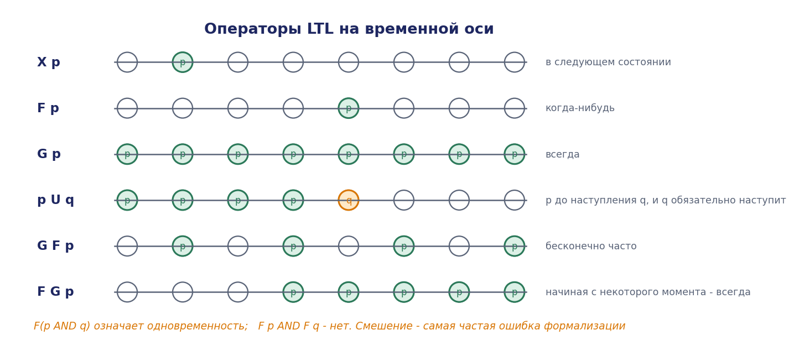
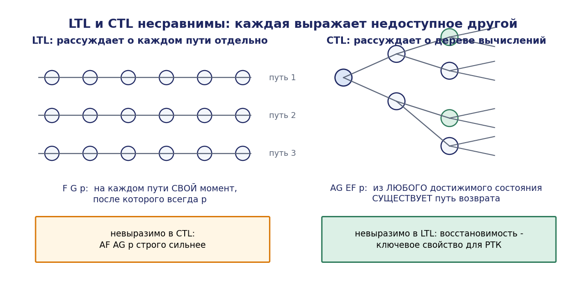
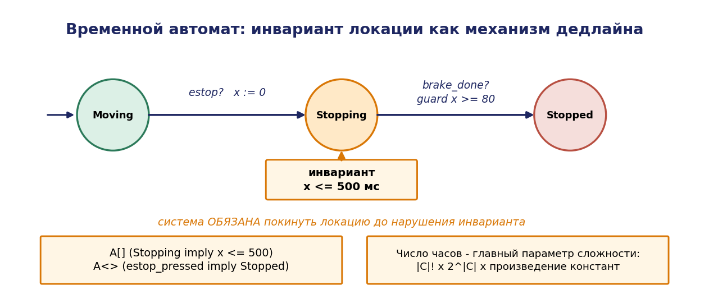
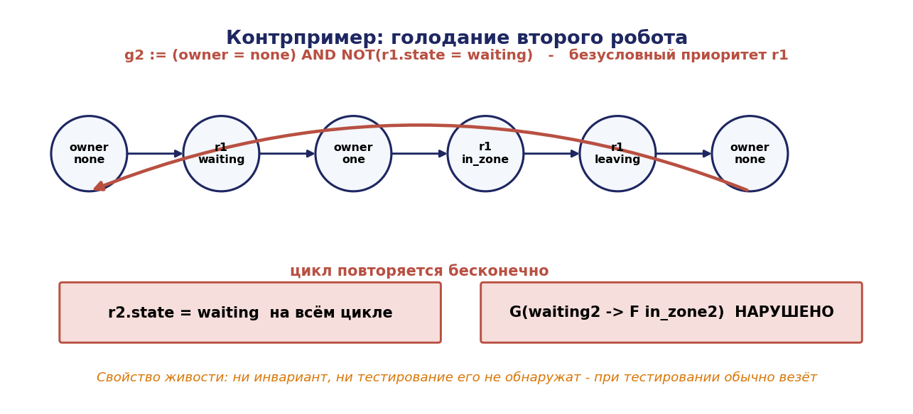

# Глава 7. Темпоральная логика и верификация моделей

## 7.1. Введение: чего не могут инварианты и тесты

Главы 3 и 4 дали два способа гарантировать корректность: супервизорный синтез (логика строится корректной по построению) и структурный анализ (свойства выводятся из инвариантов и сифонов). Оба мощны, но ограничены классом выразимых свойств.

Инвариант выражает утверждение, истинное в каждом состоянии по отдельности: «зона занята не более чем одним роботом», «в буфере не более трёх деталей». Такие свойства называются **свойствами состояний**.

Но многие требования к РТК относятся не к состояниям, а к **последовательностям состояний**:

- «после запроса ресурс в конце концов предоставляется»;
- «робот не входит в зону, пока не получил разрешение»;
- «после аварийного останова система не возобновляет движение, пока оператор не выполнил квитирование»;
- «между двумя обслуживаниями одного робота обязательно обслуживается другой» (отсутствие голодания);
- «всякий раз, когда возникает отказ, за ним следует либо восстановление, либо переход в безопасное состояние».

Ни одно из этих требований не является инвариантом: истинность каждого определяется всей траекторией, а не отдельным состоянием. Проверка тестированием бессильна по причинам, разобранным в главе 1: тест обнаруживает наличие ошибки, но не подтверждает её отсутствие.

Аппарат, позволяющий формулировать и **автоматически проверять** такие требования, — темпоральная логика и проверка моделей (model checking). Разработанная в конце 1970-х — начале 1980-х годов (Э. Кларк, Э. Эмерсон, Ж. Сифакис — премия Тьюринга 2007; А. Пнуэли — премия Тьюринга 1996), эта технология сегодня применяется в проектировании процессоров, авиационного и железнодорожного оборудования, протоколов и всё шире — в робототехнике.

Метод даёт три результата: подтверждение свойства для **всех** возможных траекторий, либо **контрпример** — конкретную трассу, нарушающую свойство, либо сообщение о невозможности проверки в отведённых ресурсах. Контрпример — исключительно ценный инженерный артефакт: это готовый сценарий для отладки, воспроизводимый в симуляторе.

## 7.2. Модель Крипке

### 7.2.1. Определение

**Определение 7.1.** Структурой Крипке над множеством атомарных высказываний AP называется четвёрка

```math
M = (S, S_0, R, L)
```

где

- $S$ — конечное множество состояний;
- $S_0 \subseteq S$ — множество начальных состояний;
- $R \subseteq S \times S$ — тотальное отношение переходов $(\forall s \exists s': (s, s') \in R)$;
- $L : S \to 2^{AP}$ — функция разметки, приписывающая каждому состоянию множество истинных в нём высказываний.

Требование тотальности отношения переходов существенно: оно гарантирует, что всякий путь бесконечен. Тупиковое состояние моделируется добавлением петли — это соглашение, а не потеря общности; при этом важно, чтобы разметка тупика позволяла его распознать (например, атом `deadlock`).

**Путём** из состояния $s$ называется бесконечная последовательность $\pi = s_0s_1s_2\ldots$ с $s_0 = s$ и $(s_i, s_{i+1}) \in R$ для всех $i$. Обозначим $\pi^i = s_is_{i+1}\ldots$ — суффикс пути начиная с $i$-й позиции, $\pi [i] = s_i$.

### 7.2.2. Построение модели Крипке для РТК

Модель Крипке получается из дискретно-событийной модели (глава 2) или сети Петри (глава 4) прямо:

- из автомата $G: S = X, S_0 = \lbrace x_0 \rbrace, R = \lbrace(x, x') : \exists \sigma, f(x,\sigma) = x' \rbrace$, разметка кодирует состояния компонентов;
- из сети Петри: $S = R(N, M_0), R$ задаётся отношением срабатывания, разметка кодирует предикаты вида «$M(p) \ge k$».

Важно, что при переходе к модели Крипке **имена событий теряются**, если их не закодировать в разметку. На практике добавляют атомы вида `last_event = σ`, либо используют модели с разметкой переходов (LTS), поддерживаемые частью инструментов.

## 7.3. Линейная темпоральная логика (LTL)

### 7.3.1. Синтаксис

**Определение 7.2.** Формулы LTL над AP строятся по грамматике

```math
\varphi ::= \mathrm{true} \mid \mathrm{false} \mid p \mid \neg \varphi \mid \varphi \wedge \varphi \mid \varphi \vee \varphi \mid \varphi \to \varphi \mid X \varphi \mid F \varphi \mid G \varphi \mid \varphi U \varphi \mid \varphi R \varphi
```

где $p \in \mathrm{AP}$.

Операторы читаются:

| Оператор | Название | Чтение |
|---|---|---|
| $X \varphi$ | neXt | в следующем состоянии $\varphi$ |
| $F \varphi$ | Finally, eventually | когда-нибудь в будущем $\varphi$ |
| $G \varphi$ | Globally, always | всегда $\varphi$ |
| $\varphi U \psi$ | Until | $\varphi$ выполняется, пока не наступит $\psi$, и $\psi$ обязательно наступит |
| $\varphi R \psi$ | Release | $\psi$ выполняется, пока (и включая момент, когда) $\varphi$ не освободит его |

### 7.3.2. Семантика

Формулы LTL интерпретируются на путях. Отношение $\pi \models \varphi$ («путь $\pi$ удовлетворяет $\varphi$») определяется индуктивно:

- $\pi \models p \iff p \in L(\pi [0])$;
- $\pi \models \neg \varphi \iff$ не $\pi \models \varphi$;
- $\pi \models \varphi \wedge \psi \iff \pi \models \varphi$ и $\pi \models \psi$;
- $\pi \models X \varphi \iff \pi^1 \models \varphi$;
- $\pi \models F \varphi \iff \exists i \ge 0: \pi^i \models \varphi$;
- $\pi \models G \varphi \iff \forall i \ge 0: \pi^i \models \varphi$;
- $\pi \models \varphi U \psi \iff \exists i \ge 0: \pi^i \models \psi$ и $\forall 0 \le j < i: \pi^{j} \models \varphi$;
- $\pi \models \varphi R \psi \iff \forall i \ge 0: \pi^i \models \psi$ либо $\exists j < i: \pi^{j} \models \varphi$.

Модель удовлетворяет формуле, $M \models \varphi$, если $\varphi$ выполняется на **всех** путях из всех начальных состояний.

### 7.3.3. Тождества

Полезные эквивалентности, применяемые при работе со спецификациями:


```math
\begin{gathered} F \varphi \equiv \mathrm{true} U \varphi \cr G \varphi \equiv \neg F \neg \varphi \cr \varphi R \psi \equiv \neg(\neg \varphi U \neg \psi) \cr \neg X \varphi \equiv X \neg \varphi \cr F(\varphi \vee \psi) \equiv F \varphi \vee F \psi \cr G(\varphi \wedge \psi) \equiv G \varphi \wedge G \psi \end{gathered}
```

Обратим внимание, что **$F(\varphi \wedge \psi) \not\equiv F \varphi \wedge F \psi$** и **$G(\varphi \vee \psi) \not\equiv G \varphi \vee G \psi$**. Смешение этих случаев — распространённая ошибка при формализации требований. Пример: «когда-нибудь оба робота будут свободны одновременно» — это $F(\mathit{free}_1 \wedge \mathit{free}_2)$; «каждый когда-нибудь будет свободен» — это $F \mathit{free}_1 \wedge F \mathit{free}_2$. Первое существенно сильнее.

Комбинации операторов имеют устоявшиеся названия:

- **$G F \varphi$** — «бесконечно часто $\varphi$»; выражает справедливость (fairness);
- **$F G \varphi$** — «начиная с некоторого момента всегда $\varphi$»; выражает стабилизацию;
- **$G(\varphi \to F \psi)$** — «всякий запрос когда-нибудь удовлетворяется»; отклик (response);
- **$G(\varphi \to X \psi)$** — «сразу после $\varphi$ следует $\psi$»;
- **$\neg \psi U \varphi$** — «$\psi$ не наступит раньше $\varphi$».




### 7.3.4. Шаблоны спецификаций

Формализация требования на LTL — навык, а не механическая операция. Практически полезен каталог шаблонов Двайера, покрывающий большинство встречающихся требований. Приведём основные, с примерами из РТК.

| Шаблон | Формулировка | LTL | Пример |
|---|---|---|---|
| Отсутствие (Absence) | $P$ никогда не наступает | $G \neg P$ | зона не занята двумя роботами |
| Существование (Existence) | $P$ когда-нибудь наступает | F P | заказ будет выполнен |
| Универсальность | $P$ всегда истинно | G P | скорость $\le$ предела |
| Отклик (Response) | за $P$ всегда следует $Q$ | $G(P \to F Q)$ | за запросом следует выдача |
| Предшествование (Precedence) | $Q$ не наступит без предшествующего $P$ | $\neg Q U (P \vee G\neg Q)$ | движение только после разрешения |
| Ограниченное существование | $P$ наступает не более $k$ раз | (комбинация $X$ и $U$) | не более 2 повторов захвата |
| Отклик после $Q$ | после $Q$ за $P$ следует $R$ | $G(Q \to G(P \to F R))$ | после наладки — нормальный режим |
| Между $Q$ и $R$ | $P$ выполняется между $Q$ и $R$ | $G((Q \wedge \neg R) \to(P U R))$ | пока идёт цикл, дверь закрыта |

**Правила формализации.**

1. Начните с классификации: безопасность $(G \neg \ldots)$ или живость $(F \ldots, G(\ldots \to F \ldots))$.
2. Определите атомарные высказывания явно — что именно наблюдается в модели.
3. Проверьте формулу на «вырожденной» модели: не выполняется ли она тривиально. Формула $G(P \to F Q)$ истинна, если $P$ никогда не наступает; такое «прохождение» проверки — типичная ловушка (vacuous truth).
4. Проверьте отрицание: если и $\varphi$, и $\neg \varphi$ проходят, модель или формула некорректна.

Пункт 3 заслуживает выделения: **проверка на невырожденность обязательна**. Инструменты (NuSMV, SPIN) имеют соответствующие режимы; при их отсутствии выполняется ручная проверка достижимости посылки.

## 7.4. Логика ветвящегося времени (CTL)

### 7.4.1. Синтаксис и семантика

LTL рассуждает о путях по отдельности. CTL (Computation Tree Logic) рассуждает о дереве вычислений, добавляя кванторы по путям.

**Определение 7.3.** Формулы CTL строятся по грамматике

```math
\varphi ::= \mathrm{true} \mid p \mid \neg \varphi \mid \varphi \wedge \varphi \mid \mathrm{EX} \varphi \mid \mathrm{EG} \varphi \mid E(\varphi U \varphi) \mid \mathrm{AX} \varphi \mid \mathrm{AG} \varphi \mid A(\varphi U \varphi) \mid \mathrm{EF} \varphi \mid \mathrm{AF} \varphi
```

Кванторы: **A** — «для всех путей», **$E$** — «существует путь». Каждый темпоральный оператор обязан быть непосредственно предварён квантором.

Семантика определяется для состояний:

- $s \models \mathrm{EX} \varphi \iff \exists$ путь $\pi$ из $s: \pi [1] \models \varphi$;
- $s \models \mathrm{AX} \varphi \iff \forall$ путей $\pi$ из $s: \pi [1] \models \varphi$;
- $s \models \mathrm{EG} \varphi \iff \exists$ путь $\pi$ из $s: \forall i, \pi [i] \models \varphi$;
- $s \models \mathrm{AG} \varphi \iff \forall$ путей $\pi$ из $s: \forall i, \pi [i] \models \varphi$;
- $s \models \mathrm{EF} \varphi \iff \exists$ путь $\pi$ из $s: \exists i, \pi [i] \models \varphi$;
- $s \models E(\varphi U \psi), A(\varphi U \psi)$ — аналогично с квантором.

Достаточен базис {EX, EG, EU}: остальные операторы выражаются через них:

```math
\begin{gathered} \mathrm{EF} \varphi \equiv E(\mathrm{true} U \varphi) \cr \mathrm{AX} \varphi \equiv \neg \mathrm{EX} \neg \varphi \cr \mathrm{AG} \varphi \equiv \neg \mathrm{EF} \neg \varphi \equiv \neg E(\mathrm{true} U \neg \varphi) \cr \mathrm{AF} \varphi \equiv \neg \mathrm{EG} \neg \varphi \cr A(\varphi U \psi) \equiv \neg E(\neg \psi U (\neg \varphi \wedge \neg \psi)) \wedge \neg \mathrm{EG} \neg \psi \end{gathered}
```

### 7.4.2. Сравнительная выразительность

LTL и CTL несравнимы: каждая выражает нечто, недоступное другой.


**Утверждение 7.1.** Формула CTL **AG EF p** («из любого достижимого состояния возможно вернуться к $p$») не выражается в LTL.

*Обоснование.* LTL квантифицирует по всем путям, и всякая LTL-формула определяет свойство множества путей. Свойство «существует путь» принципиально не выражается в терминах всех путей. Формальное доказательство строится указанием двух моделей с одинаковыми множествами путей (одинаковыми языками), но различающимися по AG EF p: одна модель имеет ветвление, ведущее в тупик, вторая — нет, при том что все бесконечные пути совпадают. ∎

**Утверждение 7.2.** Формула LTL **F G p** («начиная с некоторого момента всегда $p$») не выражается в CTL.

*Обоснование.* Естественный кандидат AF AG p строго сильнее: он требует существования момента, после которого $p$ истинно на **всех** продолжениях, тогда как F G p требует лишь, чтобы на каждом пути нашёлся свой такой момент. Классический контрпример: модель, в которой из начального состояния возможен переход в состояние с $p$ и петлёй, а также бесконечное «откладывание». ∎

**Инженерное значение утверждения 7.1.** Формула AG EF p выражает **восстановимость** — свойство первостепенной важности для РТК: «из любого достижимого состояния существует путь возврата в исходное». Именно это свойство означает отсутствие необратимых состояний, и именно ради него в проектах РТК применяют CTL, несмотря на то что для описания требований к траекториям LTL удобнее.

Практическая рекомендация: **свойства безопасности и отклика формулировать на LTL, свойства восстановимости и достижимости — на CTL**. Логика CTL* объединяет обе, но её проверка дороже.




## 7.5. Проверка моделей CTL

### 7.5.1. Алгоритм маркировки

Классический алгоритм Кларка–Эмерсона–Систлы работает по подформулам: для каждой подформулы вычисляется множество состояний, в которых она истинна.

**Алгоритм 7.1.**

```
Sat(p)      = { s : p ∈ L(s) }
Sat(¬φ)     = S \ Sat(φ)
Sat(φ ∧ ψ)  = Sat(φ) ∩ Sat(ψ)
Sat(EX φ)   = { s : ∃s′, (s,s′) ∈ R и s′ ∈ Sat(φ) }        // прообраз
Sat(E(φ U ψ)) : наименьшая неподвижная точка
    T ← Sat(ψ)
    повторять
        T′ ← T ∪ ( Sat(φ) ∩ Pre∃(T) )
    пока T′ ≠ T
Sat(EG φ) : наибольшая неподвижная точка
    T ← Sat(φ)
    повторять
        T′ ← T ∩ Pre∃(T)
    пока T′ ≠ T
```

где $\mathrm{Pre}_{\exists}(T) = \lbrace s : \exists s' \in T, (s,s') \in R \rbrace$.

**Теорема 7.1 (корректность вычисления EU).** Алгоритм для $E(\varphi U \psi)$ вычисляет в точности множество состояний, удовлетворяющих $E(\varphi U \psi)$.

*Доказательство.* Обозначим $T_k$ — значение $T$ после $k$ итераций. Индукцией по $k$ покажем: $T_k = \lbrace s : \text{ существует путь из } s, \text{ на котором } \psi \text{ достигается не более чем за } k \text{ шагов }, \text{ причём во всех предшествующих состояниях истинно } \varphi \rbrace$.

База: $T_0 = \mathrm{Sat}(\psi)$ — $\psi$ достигается за 0 шагов.

Шаг: $T_{k+1} = T_k \cup(\mathrm{Sat}(\varphi) \cap \mathrm{Pre}_{\exists}(T_k))$. Состояние $s$ принадлежит второму слагаемому $\iff s \models \varphi$ и существует преемник $s' \in T_k$, то есть из $s' \psi$ достижимо за $\le k$ шагов по $\varphi$-пути. Значит, из $s \psi$ достижимо за $\le k+1$ шагов по $\varphi$-пути.

Последовательность $T_k$ монотонно возрастает и ограничена $S$, следовательно стабилизируется за не более $\lvert S\rvert$ шагов. Предел $\cup_k T_k$ есть в точности множество состояний, из которых существует $\varphi$-путь конечной длины до $\psi$, то есть $\mathrm{Sat}(E(\varphi U \psi)). \blacksquare$

**Теорема 7.2 (корректность вычисления EG).** Алгоритм для $\mathrm{EG} \varphi$ вычисляет $\mathrm{Sat}(\mathrm{EG} \varphi)$.

*Доказательство.* Обозначим $T_k$ — значение после $k$ итераций; $T_0 = \mathrm{Sat}(\varphi), T_{k+1} = T_k \cap \mathrm{Pre}_{\exists}(T_k)$. Индукцией: $T_k = \lbrace s : \text{ существует путь длины } k \text{ из } s, \text{ все состояния которого удовлетворяют } \varphi \rbrace$.

Последовательность монотонно убывает и стабилизируется за $\le \lvert S\rvert$ шагов; предел $T^{*}$ удовлетворяет $T^{*} = T^{*} \cap \mathrm{Pre}_{\exists}(T^{*})$, то есть каждое состояние $T^{*}$ имеет преемника в $T^{*}$ и удовлетворяет $\varphi$. Значит, из каждого состояния $T^{*}$ можно бесконечно продолжать путь внутри $T^{*}$, все состояния которого удовлетворяют $\varphi : T^{*} \subseteq \mathrm{Sat}(\mathrm{EG} \varphi)$.

Обратно, если $s \models \mathrm{EG} \varphi$, то существует бесконечный $\varphi$-путь из $s$; все его состояния принадлежат каждому $T_k$ (индукцией), следовательно $s \in T^{*}. \blacksquare$

Существование и единственность неподвижных точек гарантируются теоремой Кнастера–Тарского: монотонный оператор на полной решётке (здесь — решётке подмножеств $S$) имеет наименьшую и наибольшую неподвижные точки, достигаемые итерацией от $\varnothing$ и от $S$ соответственно.

**Теорема 7.3 (сложность).** Проверка модели для CTL выполняется за время $O(\lvert S\rvert + \lvert R\rvert) \cdot \lvert \varphi \rvert$, то есть **линейно** по размеру модели и по длине формулы.

*Доказательство.* Число подформул $\varphi$ не превосходит $\lvert \varphi \rvert$. Для каждой из них вычисление Sat требует: для булевых связок — O(|S|); для EX — один проход по R, O(|R|); для EU и EG — не более $\lvert S\rvert$ итераций, каждая O(|R|), что даёт $O(\lvert S\rvert \cdot \lvert R\rvert)$. Более аккуратная реализация EU через обратный поиск в ширину и EG через поиск сильно связных компонент даёт O(|S| + |R|) на подформулу. Итого $O((\lvert S\rvert + \lvert R\rvert)\cdot \lvert \varphi \rvert). \blacksquare$

Линейная сложность — сильный результат. Ограничением остаётся $\lvert S\rvert$, экспоненциальное по числу компонентов, что и мотивирует символьные методы (раздел 7.7).

## 7.6. Проверка моделей LTL

### 7.6.1. Автоматный подход

Метод Варди–Вольпера сводит проверку LTL к задаче о пустоте языка автомата.

Ключевая идея: проверить $M \models \varphi$ означает убедиться, что **ни один** путь модели не удовлетворяет $\neg \varphi$. Для этого:

1. построить автомат Бюхи $A_{\neg \varphi}$, принимающий в точности те бесконечные слова, которые удовлетворяют $\neg \varphi$;
2. построить произведение $M \times A_{\neg \varphi}$;
3. проверить, пусто ли множество принимаемых слов произведения.

Если язык произведения пуст — свойство выполняется. Если непуст — любое принимаемое слово есть контрпример.

### 7.6.2. Автоматы Бюхи

**Определение 7.4.** Автоматом Бюхи называется пятёрка $A = (Q, \Sigma, \delta, Q_0, F)$, где $\delta \subseteq Q \times \Sigma \times Q$ — отношение переходов (недетерминированное), $F \subseteq Q$ — множество принимающих состояний. Бесконечное слово $w$ принимается, если существует пробег по $w$, посещающий состояния из $F$ **бесконечно часто**.

Условие «бесконечно часто» — принципиальное отличие от конечных автоматов; именно оно позволяет выразить свойства живости.

**Теорема 7.4 (Варди–Вольпер).** Для всякой формулы $\mathrm{LTL} \varphi$ существует автомат Бюхи $A_\varphi$ с не более чем $2^{O(\lvert \varphi \rvert)}$ состояниями, принимающий в точности множество путей, удовлетворяющих $\varphi$.

*Идея построения.* Состояниями $A_\varphi$ служат «атомы» — максимальные непротиворечивые множества подформул $\varphi$ и их отрицаний, замкнутые относительно правил семантики. Переходы определяются условиями согласованности «текущее — следующее», выводимыми из тождеств развёртки:

```math
\begin{gathered} F \psi \equiv \psi \vee X F \psi \cr G \psi \equiv \psi \wedge X G \psi \cr \psi_1 U \psi_2 \equiv \psi_2 \vee(\psi_1 \wedge X(\psi_1 U \psi_2)) \end{gathered}
```

Принимающие множества строятся так, чтобы исключить «откладывание навсегда» обязательств вида $F \psi$: для каждой подформулы вида $\psi_1 U \psi_2$ вводится условие принятия, требующее бесконечно частого посещения состояний, где $\psi_2$ истинно или $\psi_1 U \psi_2$ ложно. Полученный обобщённый автомат Бюхи преобразуется в обычный стандартной конструкцией. ∎

### 7.6.3. Проверка пустоты

**Утверждение 7.3.** Язык автомата Бюхи непуст тогда и только тогда, когда существует достижимое из начального состояния принимающее состояние, лежащее на цикле.

*Доказательство.* (⇐) Пусть $q \in F$ достижимо и лежит на цикле. Тогда пробег «путь до $q$, затем цикл бесконечно» посещает $q$ бесконечно часто и принимается. (⇒) Пусть слово принимается; его пробег посещает $F$ бесконечно часто, а состояний конечное число, значит некоторое $q \in F$ посещается бесконечно часто; отрезок между двумя посещениями образует цикл. ∎

Алгоритмически это реализуется вложенным поиском в глубину (nested DFS): первый DFS находит достижимые принимающие состояния, второй, запускаемый при возврате из принимающего состояния, ищет путь обратно в него. Алгоритм работает за $O(\lvert S\rvert \cdot \lvert A\rvert)$ и требует памяти, линейной по размеру произведения, что делает его пригодным для «на лету» (on-the-fly) верификации, когда произведение не строится целиком.

**Теорема 7.5 (сложность LTL model checking).** Проверка $M \models \varphi$ выполняется за время $O(\lvert M\rvert \cdot 2^{O(\lvert \varphi \rvert)})$. Задача PSPACE-полна по длине формулы.

Экспоненциальность по формуле на практике не критична: формулы требований коротки (5–20 символов). Критичен размер модели.

### 7.6.4. Справедливость

Модель, включающая все математически возможные пути, часто нарушает свойства живости по «нереалистичным» причинам: путь, на котором некоторый разрешённый переход никогда не срабатывает (робот, который никогда не завершает движение), формально существует, но физически невозможен.

Для исключения таких путей вводятся **условия справедливости** (fairness):

- **слабая справедливость** (justice): если переход разрешён непрерывно начиная с некоторого момента, он в конце концов срабатывает: **F G enabled(t) → G F taken(t)**;
- **сильная справедливость** (compassion): если переход разрешён бесконечно часто, он срабатывает бесконечно часто: **G F enabled(t) → G F taken(t)**.

Проверка ведётся только по справедливым путям. Практически: **все свойства живости в РТК проверяются при условиях справедливости**, иначе они не выполняются никогда. При этом важно понимать, что справедливость — это допущение о среде и оборудовании, которое должно быть явно зафиксировано в проектной документации: «предполагается, что начатая операция завершается за конечное время».

## 7.7. Символьная проверка моделей

### 7.7.1. Идея

Явное перечисление состояний ограничивает применимость $10^6-10^7$ состояниями. Символьный подход (Мак-Миллан, 1992) представляет множества состояний и отношение переходов булевыми функциями, а операции над множествами — операциями над функциями.

Состояние кодируется вектором булевых переменных $x = (x_1, \ldots, x_n)$; множество состояний $T$ представляется характеристической функцией $\chi_T(x)$; отношение переходов — функцией $R(x, x')$.

Прообраз вычисляется как

```math
\mathrm{Pre}_{\exists}(T)(x) = \exists x' (R(x, x') \wedge \chi_T(x'))
```

Все алгоритмы раздела 7.5 переписываются в этих терминах без изменения структуры: они и так были сформулированы через операции над множествами.

### 7.7.2. Бинарные решающие диаграммы

Булевы функции представляются **упорядоченными редуцированными бинарными решающими диаграммами** (ROBDD): ациклическим графом, в котором каждый внутренний узел помечен переменной и имеет две исходящие дуги (значение 0 и 1), переменные встречаются на всех путях в одном и том же порядке, изоморфные поддеревья разделяются, а избыточные узлы удаляются.

**Теорема 7.6 (каноничность).** При фиксированном порядке переменных ROBDD булевой функции единственна с точностью до изоморфизма.

Каноничность даёт важное практическое следствие: проверка эквивалентности двух функций и проверка на тождественный ноль выполняются за $O(1)$ (сравнение указателей на корни).

Размер BDD критически зависит от порядка переменных: для одной и той же функции он может различаться от линейного до экспоненциального. Эвристика для моделей РТК: **переменные, описывающие взаимодействующие компоненты, размещать рядом**. Инструменты применяют динамическое переупорядочение (sifting).

Существуют функции (например, умножение), для которых BDD экспоненциальна при любом порядке. Тем не менее для моделей управления, обладающих регулярной структурой, символьный подход поднимает практическую границу до $10^{20}$ состояний и выше.

### 7.7.3. Ограниченная проверка моделей и SAT

Альтернативный символьный подход — **ограниченная проверка (bounded model checking, BMC)**: ищется контрпример длины не более $k$. Условие существования такого контрпримера кодируется булевой формулой

```math
I(x_0) \wedge R(x_0,x_1) \wedge R(x_1,x_2) \wedge \ldots \wedge R(x_{k-1},x_k) \wedge \neg \varphi_k(x_0,\ldots,x_k)
```

и передаётся SAT-решателю. Выполнимость означает наличие контрпримера, извлекаемого из найденной подстановки.

BMC не полон: невыполнимость означает лишь отсутствие коротких контрпримеров. Полнота достигается при $k$, превышающем диаметр модели, либо методами индукции (k-induction) и интерполяции (IC3/PDR).

На практике BMC чрезвычайно эффективен для **поиска ошибок**: большинство дефектов проявляется на коротких трассах, и BMC находит их быстрее, чем BDD-методы строят полное множество достижимых состояний. Рекомендуемый порядок работы: сначала BMC для поиска ошибок, затем полная проверка для подтверждения корректности.

## 7.8. Временные автоматы и проверка дедлайнов

### 7.8.1. Мотивация

LTL и CTL говорят о порядке, но не о длительностях. Требование «после аварийного останова движение прекращается за 0,5 с» не выразимо ни на LTL, ни на CTL. Для количественных временных требований используются **временные автоматы** (Алур, Дилл, 1994) и логика TCTL.

### 7.8.2. Определение

**Определение 7.5.** Временным автоматом называется кортеж $A = (L, l_0, C, \Sigma, E, \mathrm{Inv})$, где

- $L$ — конечное множество локаций (дискретных состояний);
- $l_0 \in L$ — начальная локация;
- C — конечное множество часов (вещественных переменных, растущих с единичной скоростью);
- $\Sigma$ — алфавит действий;
- $E \subseteq L \times \Sigma \times \mathrm{Guard}(C) \times 2^{C} \times L$ — переходы с охраной, сбросом часов и целевой локацией;
- Inv : L → Guard(C) — инвариант локации.

Охраны и инварианты — конъюнкции ограничений вида $x \bowtie c$ или $x - y \bowtie c$, где $x, y \in C, c \in \mathbb{N}, \bowtie \in \lbrace <, \le, =, \ge, > \rbrace$.

Состояние системы есть пара (l, v), где $v : C \to \mathbb{R}\ge 0$ — оценка часов. Возможны два типа шагов: **задержка** (все часы растут на $d$, при условии сохранения инварианта локации) и **переход** (мгновенный, при выполнении охраны, с обнулением указанных часов).

Инвариант локации — механизм принуждения: система обязана покинуть локацию до нарушения инварианта. Именно так выражаются дедлайны: локация «останавливаюсь» с инвариантом $x \le 0{,}5$ гарантирует выход из неё не позднее 0,5 с.

### 7.8.3. Разрешимость: регионы

Пространство состояний временного автомата бесконечно (часы вещественны). Разрешимость обеспечивается конечной абстракцией.

**Определение 7.6.** Две оценки часов $v$ и $v'$ **эквивалентны по регионам**, если

1. для каждого часа $x: \lfloor v(x)\rfloor = \lfloor v'(x)\rfloor$ либо оба значения превышают максимальную константу $c_x$, встречающуюся в охранах;
2. для каждой пары x, y с $v(x) \le c_x, v(y) \le c_y$: дробные части упорядочены одинаково, $\mathit{frac}(v(x)) \le \mathit{frac}(v(y)) \iff \mathit{frac}(v'(x)) \le \mathit{frac}(v'(y))$;
3. $\mathit{frac}(v(x)) = 0 \iff \mathit{frac}(v'(x)) = 0$.

**Теорема 7.7 (Алур–Дилл).** Отношение эквивалентности по регионам является бисимуляцией: эквивалентные состояния удовлетворяют одним и тем же формулам TCTL. Число классов эквивалентности конечно и не превосходит

$\lvert L\rvert \cdot \lvert C\rvert ! \cdot 2^{\lvert C\rvert} \cdot \prod_{x \in C} (2c_x + 2)$

Следовательно, проверка достижимости и проверка TCTL для временных автоматов разрешимы.

*Комментарий к оценке.* Множитель $\lvert C\rvert$! возникает из числа упорядочений дробных частей, $2^{\lvert C\rvert}$ — из вариантов равенства нулю, произведение — из целых частей. Оценка экспоненциальна по числу часов, что делает **число часов главным параметром сложности**: практическое правило — использовать минимально необходимое число часов, повторно применяя один и тот же часовой при возможности.

На практике вместо регионов применяются **зоны** — выпуклые объединения регионов, представляемые матрицами разностных ограничений (DBM). Зоновая абстракция гораздо компактнее и лежит в основе инструмента UPPAAL.

### 7.8.4. Пример: проверка дедлайна аварийного останова

Модель на языке UPPAAL:


```
// Часы
clock x;

// Локации процесса «Движение»
Moving:      инвариант — отсутствует
Stopping:    инвариант  x <= 500      // мс
Stopped:     инвариант — отсутствует

// Переходы
Moving   --[ estop?, сброс x ]-->        Stopping
Stopping --[ brake_done?, guard x >= 80 ]--> Stopped
```

Свойство на TCTL:

```
A[] (Stopping imply x <= 500)
E<> Stopped
A<> (estop_pressed imply Stopped)
```

Первая формула — инвариант дедлайна; вторая — достижимость останова; третья — гарантия останова после нажатия. Если тормозной процесс требует более 500 мс при некоторой скорости, UPPAAL выдаст контрпример с конкретными значениями часов — то есть укажет, при какой комбинации условий дедлайн нарушается.

Эта проверка непосредственно поддерживает бюджет задержки из главы 1: там мы вычислили требование арифметически, здесь — проверяем его на модели с учётом всех ветвлений логики.




## 7.9. Разбор: верификация ячейки примера Б

### 7.9.1. Модель на языке NuSMV

```
MODULE robot(id, zone_free, grant)
  VAR
    state : { idle, waiting, in_zone, leaving };
  ASSIGN
    init(state) := idle;
    next(state) :=
      case
        state = idle                   : { idle, waiting };
        state = waiting  &  grant      : in_zone;
        state = waiting  & !grant      : waiting;
        state = in_zone                : { in_zone, leaving };
        state = leaving                : idle;
        TRUE                           : state;
      esac;

MODULE main
  VAR
    r1    : robot(1, zone_free, g1);
    r2    : robot(2, zone_free, g2);
    owner : { none, one, two };
  DEFINE
    zone_free := (owner = none);
    g1 := (owner = none) | (owner = one);
    g2 := (owner = none) & !(r1.state = waiting);   -- приоритет r1
  ASSIGN
    init(owner) := none;
    next(owner) :=
      case
        r1.state = waiting & g1                 : one;
        r2.state = waiting & g2                 : two;
        r1.state = leaving & owner = one        : none;
        r2.state = leaving & owner = two        : none;
        TRUE                                    : owner;
      esac;

  -- Спецификации
  LTLSPEC G !(r1.state = in_zone & r2.state = in_zone)     -- взаимное исключение
  LTLSPEC G (r1.state = waiting -> F r1.state = in_zone)   -- отсутствие голодания r1
  LTLSPEC G (r2.state = waiting -> F r2.state = in_zone)   -- отсутствие голодания r2
  CTLSPEC AG EF (owner = none)                             -- восстановимость
  CTLSPEC AG !(r1.state = waiting & r2.state = waiting
               & AX AX (r1.state = waiting & r2.state = waiting))  -- нет мгновенного тупика
```

### 7.9.2. Ожидаемый результат и его интерпретация

Первая спецификация (взаимное исключение) выполняется — это свойство безопасности, обеспеченное структурой присвоения `owner`.


Вторая спецификация (отсутствие голодания r1) выполняется.

**Третья спецификация не выполняется.** Условие `g2 := (owner = none) & !(r1.state = waiting)` даёт первому роботу безусловный приоритет: если r1 запрашивает зону всякий раз, как её освобождает, r2 не получит её никогда. NuSMV выдаст контрпример — циклическую трассу, в которой r2 постоянно находится в `waiting`, а r1 циклически проходит `waiting → in_zone → leaving → idle → waiting`.

Это **голодание** (starvation) — нарушение свойства живости, которое невозможно обнаружить ни инвариантом, ни тестированием (при тестировании обычно везёт, и r2 своё получает). Обнаружение таких дефектов и есть основная практическая ценность проверки моделей.

**Исправление** — введение справедливой дисциплины, например очереди FIFO или чередования:

```
  VAR  turn : { one, two };
  DEFINE
    g1 := (owner = none) & (turn = one | r2.state != waiting);
    g2 := (owner = none) & (turn = two | r1.state != waiting);
  ASSIGN
    next(turn) :=
      case
        r1.state = leaving : two;
        r2.state = leaving : one;
        TRUE               : turn;
      esac;
```

После исправления обе спецификации отсутствия голодания выполняются. Заметим, что исправление найдено не догадкой, а прочтением контрпримера.




### 7.9.3. Проверка на невырожденность

Перед принятием результата обязательно проверяем, что посылки достижимы:

```
  CTLSPEC EF (r1.state = waiting)
  CTLSPEC EF (r2.state = waiting)
  CTLSPEC EF (r1.state = in_zone)
  CTLSPEC EF (r2.state = in_zone)
```

Если хотя бы одна из этих формул ложна, соответствующая спецификация отклика проходила вырожденно, и её «выполнение» ничего не значит.

## 7.10. Проблема размера модели и абстракция

### 7.10.1. Оценка

Для полной ячейки примера Б: 5 компонентов, 3–6 состояний каждый, плюс переменные ресурсов — порядка $10^4-10^5$ состояний, что для явных методов приемлемо. Для линии из пяти таких ячеек с транспортной системой — $10^{20}$ и более, что требует символьных методов и абстракции.

### 7.10.2. Методы сокращения

**Абстракция по предикатам.** Вместо точных значений переменных используются предикаты («буфер пуст», «буфер частично заполнен», «буфер полон» вместо счётчика 0…10). Абстракция должна быть **консервативной**: если свойство выполняется в абстрактной модели, оно выполняется и в конкретной.

**Редукция частичных порядков.** Для параллельных систем многие чередования независимых событий эквивалентны относительно проверяемого свойства; проверяется по одному представителю из класса. Реализована в SPIN; даёт сокращение на порядки для моделей с большим числом независимых компонентов.

**Редукция по симметрии.** Однотипные компоненты (пять одинаковых AMR) порождают симметричные состояния; проверяется по одному представителю орбиты.

**Композиционная верификация (assume–guarantee).** Свойство системы выводится из свойств компонентов и предположений об их окружении: если A гарантирует $\varphi_A$ при предположении $\psi_A$, а B гарантирует $\psi_A$ при предположении $\varphi_A$, то при выполнении условий некругового рассуждения композиция гарантирует $\varphi_A \wedge \psi_A$.

**CEGAR (Counterexample-Guided Abstraction Refinement).** Итеративная схема: строится грубая абстракция; если проверка проходит — свойство доказано; если найден контрпример, проверяется его реализуемость в конкретной модели; если реализуем — это настоящая ошибка; если нет («ложный контрпример») — абстракция уточняется так, чтобы его исключить, и цикл повторяется. Схема автоматизирует поиск подходящего уровня абстракции.

## 7.11. Инструменты

| Инструмент | Логика | Метод | Область применения |
|---|---|---|---|
| NuSMV / nuXmv | CTL, LTL | символьный (BDD), BMC, IC3 | синхронные системы, логика управления |
| SPIN | LTL | явный, on-the-fly, редукция частичных порядков | протоколы, распределённые системы |
| UPPAAL | TCTL | зоны (DBM) | системы реального времени, дедлайны |
| PRISM | PCTL, CSL | вероятностный | стохастические системы, надёжность |
| TLA+ / TLC | TLA | явный | спецификация распределённых алгоритмов |
| CBMC | — | BMC над C | верификация исходного кода |

Для семинара 5 рекомендуется NuSMV (логика ячейки, LTL и CTL) в сочетании с UPPAAL (проверка дедлайнов).

## 7.12. Место верификации в процессе проектирования

Проверка моделей — не финальная приёмка, а инструмент **раннего** обнаружения дефектов. Практическая схема применения:

1. **После построения ДЭС-модели** (глава 2): проверить неблокируемость, восстановимость (AG EF init).
2. **После синтеза супервизора** (глава 3): проверить, что синтез не нарушил живость; проверить отсутствие голодания при выбранной дисциплине.
3. **После структурного анализа** (глава 4): проверить свойства, не выразимые инвариантами.
4. **После проектирования исполнительной логики** (глава 6): перевести дерево поведения в автомат и проверить корректность приоритетов и завершаемость.
5. **После определения временных требований** (глава 15): проверить дедлайны на временных автоматах.
6. **При каждом изменении**: повторный прогон проверок как регрессионный тест — стоимость прогона мала, стоимость пропущенного дефекта велика.

Существенно, что верификация относится к модели, а не к реализации. Разрыв между ними закрывается тремя средствами: кодогенерацией из модели, мониторингом во время исполнения (глава 9) и испытаниями (глава 17).

## 7.13. Выводы

1. Инварианты выражают свойства состояний; требования к РТК часто являются свойствами траекторий и требуют темпоральной логики.
2. LTL рассуждает о путях, CTL — о дереве вычислений; логики несравнимы: AG EF p (восстановимость) невыразима в LTL, F G p (стабилизация) невыразима в CTL.
3. Проверка CTL выполняется за время, линейное по размеру модели и длине формулы, через вычисление неподвижных точек.
4. Проверка LTL сводится к проверке пустоты произведения модели и автомата Бюхи для отрицания формулы; сложность экспоненциальна по формуле, но формулы коротки.
5. Свойства живости требуют условий справедливости, которые являются явным допущением о поведении оборудования и должны фиксироваться в документации.
6. Символьные методы (BDD) и ограниченная проверка (SAT) поднимают практическую границу применимости на много порядков; BMC особенно эффективен для поиска ошибок.
7. Количественные временные требования проверяются на временных автоматах; сложность экспоненциальна по числу часов, что делает экономию часов главной оптимизацией модели.
8. Контрпример — основной практический продукт верификации: он не только доказывает наличие дефекта, но и указывает его исправление.

## 7.14. Контрольные вопросы

1. Приведите три требования к РТК, невыразимых инвариантом, и объясните почему.
2. В чём различие $F(\varphi \wedge \psi)$ и $F \varphi \wedge F \psi$? Приведите пример, где смешение приводит к ошибке.
3. Что выражают формулы $G F \varphi$ и $F G \varphi$? Приведите инженерные примеры.
4. Сформулируйте шаблон отклика и объясните опасность вырожденной истинности.
5. Почему AG EF p невыразимо в LTL и почему это свойство важно для РТК?
6. Докажите корректность вычисления $\mathrm{Sat}(\mathrm{EG} \varphi)$.
7. Почему проверка CTL линейна, а LTL экспоненциальна по формуле?
8. Что такое автомат Бюхи и зачем нужно условие «бесконечно часто»?
9. Зачем нужны условия справедливости? Что произойдёт при их отсутствии при проверке свойства отклика?
10. Почему число часов сильнее влияет на сложность проверки временного автомата, чем число локаций?

## 7.15. Задачи

**Задача 7.1.** Формализуйте на LTL: (а) робот не входит в зону без разрешения; (б) после запроса разрешение выдаётся не позднее чем через три шага; (в) при аварийном останове система не возобновляет движение до квитирования; (г) между двумя обслуживаниями r1 обязательно обслуживается r2.

**Задача 7.2.** Для каждой формулы задачи 7.1 укажите, является ли она свойством безопасности или живости, и постройте отрицание.

**Задача 7.3.** Постройте модель Крипке для системы из двух роботов и одной зоны (не более 12 состояний). Вручную вычислите $\mathrm{Sat}(\mathrm{AG} \neg(in_1 \wedge in_2))$ алгоритмом маркировки.

**Задача 7.4.** Постройте автомат Бюхи для формулы $G(p \to F q)$. Сколько состояний потребовалось?

**Задача 7.5.** Реализуйте модель из раздела 7.9.1 в NuSMV. Воспроизведите контрпример для свойства отсутствия голодания r2. Внесите исправление и убедитесь, что свойство выполнено.

**Задача 7.6.** Добавьте в модель третьего робота. Как изменилось число состояний? Проверьте те же свойства. Требуется ли изменение дисциплины?

**Задача 7.7.** Постройте временной автомат в UPPAAL для контура аварийного останова с параметрами из главы 1 (задержки сенсора, обработки, привода). Проверьте дедлайн 500 мс. Найдите максимальную скорость, при которой дедлайн выполняется.

**Задача 7.8.** Проверьте все спецификации на невырожденность. Найдите в задаче 7.1 формулу, которая может пройти вырожденно, и постройте модель, на которой это происходит.

**Задача 7.9.** Оцените число состояний модели ячейки примера Б при явном представлении. Оцените, при каком числе ячеек в линии явная проверка станет невозможной.

**Задача 7.10.** Переведите дерево поведения из главы 6 (задача 6.3) в модель NuSMV и проверьте: (а) аварийный останов всегда имеет приоритет; (б) миссия в конце концов завершается при условии справедливости; (в) отсутствие бесконечного цикла между подъездом и захватом.

## 7.16. Литература к главе

1. Clarke E. M., Grumberg O., Kroening D., Peled D., Veith H. Model Checking. 2nd ed. — MIT Press, 2018.
2. Baier C., Katoen J.-P. Principles of Model Checking. — MIT Press, 2008.
3. Pnueli A. The Temporal Logic of Programs // Proc. 18th IEEE Symposium on Foundations of Computer Science, 1977. — P. 46–57.
4. Clarke E. M., Emerson E. A., Sistla A. P. Automatic Verification of Finite-State Concurrent Systems Using Temporal Logic Specifications // ACM TOPLAS. — 1986. — Vol. 8, No. 2. — P. 244–263.
5. Vardi M. Y., Wolper P. An Automata-Theoretic Approach to Automatic Program Verification // Proc. LICS, 1986. — P. 332–344.
6. Alur R., Dill D. L. A Theory of Timed Automata // Theoretical Computer Science. — 1994. — Vol. 126, No. 2. — P. 183–235.
7. Dwyer M. B., Avrunin G. S., Corbett J. C. Patterns in Property Specifications for Finite-State Verification // Proc. ICSE, 1999. — P. 411–420.
8. Bryant R. E. Graph-Based Algorithms for Boolean Function Manipulation // IEEE Transactions on Computers. — 1986. — Vol. C-35, No. 8. — P. 677–691.
9. Biere A., Cimatti A., Clarke E., Zhu Y. Symbolic Model Checking without BDDs // Proc. TACAS, 1999. — P. 193–207.
10. Behrmann G., David A., Larsen K. G. A Tutorial on UPPAAL // Formal Methods for the Design of Real-Time Systems. — Springer, 2004. — P. 200–236.
