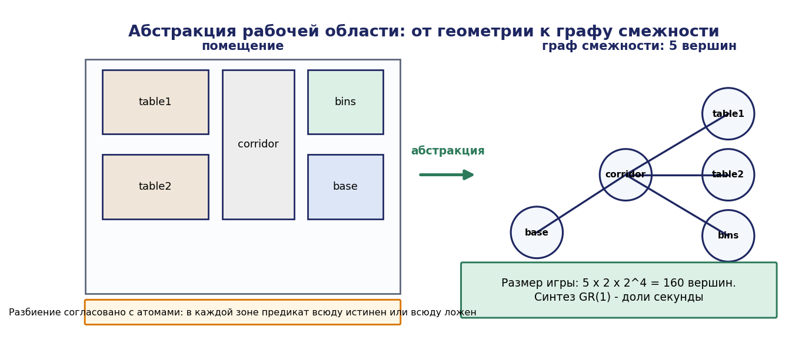
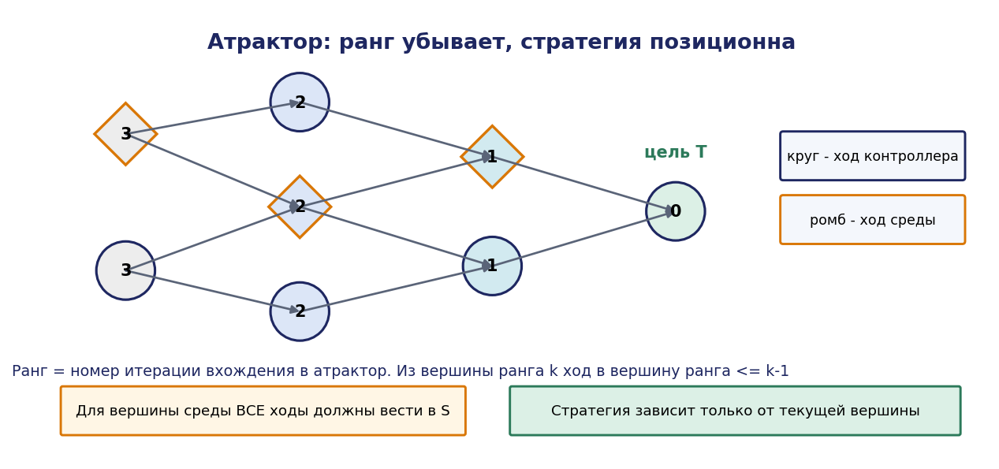
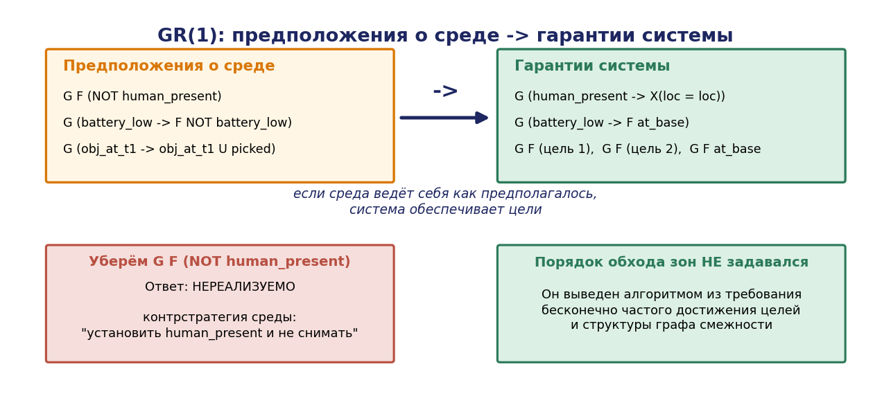

# Глава 8. Синтез управления по темпоральной спецификации

## 8.1. Введение: от проверки к порождению

Глава 7 дала инструмент проверки: инженер пишет логику, инструмент говорит, корректна ли она. Если некорректна — контрпример указывает, где именно, и цикл повторяется. Это существенный прогресс по сравнению с тестированием, но исходная логика по-прежнему пишется вручную.

Настоящая глава излагает следующий шаг: **порождение управляющей логики непосредственно из формулировки требований**. Инженер пишет формулу LTL, описывающую миссию, и алгоритм синтеза строит контроллер, корректный по построению. Если такого контроллера не существует, алгоритм сообщает об этом и указывает причину.

Идея та же, что в главе 3 (супервизорный синтез), но на другом уровне и с другим языком спецификации. Сопоставим два подхода:

| Аспект | Супервизорный синтез (гл. 3) | Синтез по LTL (гл. 8) |
|---|---|---|
| Спецификация | автомат-ограничение | формула темпоральной логики |
| Выразительность | регулярные языки конечных трасс | $\omega$-регулярные свойства бесконечных трасс |
| Свойства живости | через маркированные состояния | напрямую (F, G F) |
| Модель среды | часть системы $G$ | отдельный игрок с предположениями |
| Постановка | ограничение поведения | игра двух игроков |
| Результат | максимально разрешительный супервизор | выигрышная стратегия |

Ключевое различие концептуальное: супервизорный синтез рассматривает систему как единый объект, поведение которого ограничивается; синтез по LTL рассматривает взаимодействие как **игру** между контроллером и средой, где среда действует антагонистически. Второй подход честнее отражает ситуацию автономного робота: обстановка не подчиняется контроллеру и в худшем случае ведёт себя наихудшим образом.

## 8.2. Абстракция непрерывной динамики

### 8.2.1. Постановка

Робот движется в непрерывном пространстве, его состояние $x \in \mathbb{R}^n$, динамика $\dot{x} = f(x, u)$. Спецификация же формулируется в дискретных терминах: «побывать в зоне A», «не входить в зону D». Требуется мост между непрерывной динамикой и дискретной логикой.

Мост строится **абстракцией**: рабочая область разбивается на конечное число ячеек, и непрерывная система заменяется конечной транзиционной системой, состояниями которой служат ячейки.

### 8.2.2. Построение абстракции

Пусть рабочая область $X \subset \mathbb{R}^n$ разбита на ячейки $\lbrace X_1, \ldots, X_N \rbrace, X = \cup X_i, X_i \cap X_j = \varnothing$ при $i \ne j$. Разбиение должно быть **согласовано с атомарными высказываниями**: для каждого $p \in \mathrm{AP}$ и каждой ячейки $X_i$ либо все точки $X_i$ удовлетворяют $p$, либо ни одна. Иначе разметка ячейки не определена.

Транзиционная система абстракции $T = (Q, Q_0, \to, \mathrm{AP}, L)$:

- $Q = \lbrace q_1, \ldots, q_N \rbrace$, где $q_i$ соответствует $X_i$;
- $q_i \to q_j$, если существует управление, переводящее систему из некоторой точки $X_i$ в некоторую точку $X_j$, не покидая $X_i \cup X_j$.

### 8.2.3. Корректность абстракции

Соответствие абстракции и исходной системы формализуется отношением симуляции.

**Определение 8.1.** Отношение $\preceq \subseteq S_1 \times S_2$ называется **симуляцией** системы $T_1$ системой $T_2$, если из $(s_1, s_2) \in \preceq$ следует: $L_1(s_1) = L_2(s_2)$ и для всякого перехода $s_1 \to s_1'$ существует переход $s_2 \to s_2'$ с $(s_1', s_2') \in \preceq$. Если $\preceq$ и $\preceq^{-1}$ обе являются симуляциями, отношение называется **бисимуляцией**.

**Теорема 8.1 (перенос свойств).** Если $T_1 \preceq T_2$ ($T_2$ симулирует $T_1$), то всякая формула LTL, выполняющаяся на $T_2$, выполняется и на $T_1$.

*Доказательство.* Пусть $\pi_1 = s_0s_1s_2\ldots$ — произвольный путь в $T_1$ из начального состояния. Индукцией по $i$ построим путь $\pi_2 = t_0t_1t_2\ldots$ в $T_2$ с $(s_i, t_i) \in \preceq$ для всех $i: t_0$ существует по условию на начальные состояния; при наличии $(s_i,t_i) \in \preceq$ и перехода $s_i \to s_{i+1}$ по определению симуляции найдётся $t_{i+1}$ с $(s_{i+1},t_{i+1}) \in \preceq$. По определению симуляции $L_1(s_i) = L_2(t_i)$ для всех $i$, значит пути $\pi_1$ и $\pi_2$ порождают одно и то же слово над $2^{AP}$. Так как $\varphi$ выполняется на всех путях $T_2$, она выполняется на $\pi_2$, а значит и на $\pi_1$ (LTL зависит только от слова разметок). Ввиду произвольности $\pi_1$ получаем $T_1 \models \varphi . \blacksquare$

**Инженерное следствие.** Абстракция должна **симулировать** реальную систему (быть «богаче» по поведению). Тогда доказанное на абстракции верно для системы. Обратное неверно: свойство, не выполняющееся на абстракции, может выполняться на системе — абстракция консервативна, и её ложные контрпримеры требуют уточнения разбиения (схема CEGAR из главы 7).

Для синтеза требуется более сильное условие: контроллер, построенный на абстракции, должен быть **реализуем** в непрерывной системе. Это обеспечивается, если для каждого перехода абстракции существует непрерывный регулятор, гарантированно переводящий систему из ячейки в соседнюю за конечное время (регулятор «на грань», facet reachability controller). Для систем с достаточно простой динамикой (одноинтеграторные модели, дифференциально плоские системы) такие регуляторы строятся аналитически на симплициальных или прямоугольных разбиениях.

### 8.2.4. Практическое разбиение

| Способ | Свойства | Применение |
|---|---|---|
| Равномерная сетка | просто, число ячеек растёт как $(1/h)^n$ | 2D-навигация, малые области |
| Триангуляция | аналитические регуляторы на симплексах | планарные задачи |
| Разбиение по препятствиям (cell decomposition) | адаптивно, ячеек мало | навигация в помещениях |
| Топологическая карта помещений | ячейка = комната/зона, естественная разметка | миссии уровня здания |


Для примера А наиболее уместно последнее: ячейками служат «зона стола 1», «зона стола 2», «коридор», «зона контейнеров», «база». Их 5–10, что делает синтез мгновенным, а разметка (`at_table1`, `at_bins`, …) естественна.

Это принципиальный практический вывод: **синтез по LTL применим на уровне миссии, где число дискретных ячеек мало**, а не на уровне траекторий, где абстракция взрывается.




## 8.3. Синтез в случае недетерминированной среды: игровая постановка

### 8.3.1. Игра на графе

Взаимодействие контроллера и среды моделируется игрой двух игроков на графе.

**Определение 8.2.** Игрой называется кортеж $G = (V, V_c, V_e, E, v_0, \mathrm{Win})$, где $V = V_c \cup V_e$ — разбиение вершин на вершины контроллера и среды, $E \subseteq V \times V$ — рёбра, $v_0$ — начальная вершина, $\mathrm{Win} \subseteq V^{\omega}$ — множество выигрышных бесконечных путей.

Партия: фишка стоит в вершине; если вершина принадлежит $V_c$, ход выбирает контроллер, иначе — среда. Контроллер выигрывает партию, если порождённый бесконечный путь принадлежит Win.

**Стратегия** контроллера — функция $\sigma : V^{*}\cdot V_c \to V$, сопоставляющая истории партии следующий ход. Стратегия **выигрышная**, если при её соблюдении контроллер выигрывает при любом поведении среды.

**Теорема 8.2 (детерминированность, Бюхи–Ландвебер, 1969).** Игры с $\omega$-регулярным условием выигрыша детерминированы: в каждой вершине либо контроллер, либо среда имеет выигрышную стратегию. Более того, выигрышные стратегии могут быть выбраны **конечно-памятными** (реализуемыми конечным автоматом), а для условий Бюхи и достижимости — **позиционными** (зависящими только от текущей вершины).

Практическое значение теоремы: результат синтеза — не абстрактная функция от истории, а конечный автомат, который можно реализовать в контроллере робота.

### 8.3.2. Атракторы и достижимость

Для условия достижимости (Win = «когда-нибудь посетить $T$») выигрышное множество вычисляется как **атрактор**.


**Определение 8.3.** Контролируемый предшественник множества $S$:

```math
\mathrm{CPre}(S) = \lbrace v \in V_c : \exists(v,v') \in E, v' \in S \rbrace \cup \lbrace v \in V_e : \forall(v,v') \in E, v' \in S \rbrace
```

Для вершины контроллера достаточно одного хода в $S$; для вершины среды все ходы должны вести в $S$ (среда враждебна).

**Атрактор** множества $T$:

```math
\mathrm{Attr}(T) = \mu Z. (T \cup \mathrm{CPre}(Z))
```

где $\mu$ обозначает наименьшую неподвижную точку, вычисляемую итерацией $Z_0 = \varnothing, Z_{k+1} = T \cup \mathrm{CPre}(Z_k)$.

**Теорема 8.3.** Контроллер имеет выигрышную стратегию для условия достижимости $T$ тогда и только тогда, когда $v_0 \in \mathrm{Attr}(T)$. Стратегия позиционна: из вершины уровня $k$ выбирается ход в вершину уровня $k-1$, где уровень определяется номером итерации, на которой вершина вошла в атрактор.

*Доказательство.* (⇐) Пусть $v_0 \in \mathrm{Attr}(T)$. Определим ранг $rk(v) = \min \lbrace k : v \in Z_k \rbrace$. Для $v \in V_c$ с $rk(v) = k > 0$ по определению CPre существует ход в вершину ранга $\le k-1$; стратегия выбирает его. Для $v \in V_e$ с $rk(v) = k > 0$ все ходы ведут в вершины ранга $\le k-1$. Ранг строго убывает при каждом ходе, значит за не более $rk(v_0)$ ходов достигается ранг 0, то есть множество $T$.

(⇒) Пусть $v_0 \notin \mathrm{Attr}(T)$. Обозначим $W = V \setminus \mathrm{Attr}(T)$. Для $v \in V_c \cap W$ все ходы ведут в $W$ (иначе $v \in \mathrm{CPre}(\mathrm{Attr}(T)) \subseteq \mathrm{Attr}(T)$); для $v \in V_e \cap W$ существует ход в $W$. Значит, среда имеет стратегию, удерживающую фишку в $W$ навсегда; так как $T \subseteq \mathrm{Attr}(T)$, множество $T$ не посещается, и контроллер проигрывает. ∎

Для условия Бюхи («посещать $T$ бесконечно часто») выигрышное множество вычисляется вложенными неподвижными точками:

```math
\mathrm{Win}_{\mathrm{Buchi}}(T) = \nu Y. \mu Z. ((T \cap \mathrm{CPre}(Y)) \cup \mathrm{CPre}(Z))
```

где $\nu$ — наибольшая неподвижная точка. Внутренняя $\mu$ обеспечивает достижение $T$, внешняя $\nu$ — возможность повторения.




### 8.3.3. Общая схема синтеза по LTL

**Алгоритм 8.1.**

```
Вход: абстракция среды T, формула LTL φ
Выход: контроллер (конечный автомат) или «нереализуемо»

1. Построить детерминированный автомат A_φ по φ
   (Бюхи -> детерминизация Сафры -> автомат Рабина/Парити)
2. Построить игру G = T × A_φ:
   вершины — пары (состояние среды, состояние автомата);
   ходы контроллера — выбор управляющего действия;
   ходы среды — выбор недетерминированного исхода
3. Вычислить выигрышное множество W для условия принятия A_φ
4. Если начальная вершина ∉ W: вернуть «нереализуемо»
5. Иначе извлечь позиционную (или конечно-памятную) стратегию
   и представить её конечным автоматом
```

**Теорема 8.4 (сложность).** Задача синтеза по формуле LTL является 2EXPTIME-полной по длине формулы.

Двойная экспонента возникает из двух источников: перевод LTL в автомат Бюхи (экспонента) и детерминизация автомата Бюхи конструкцией Сафры (вторая экспонента). Это делает общий синтез по LTL практичным лишь для коротких формул.

Именно поэтому основное практическое значение имеет фрагмент, для которого сложность полиномиальна.

## 8.4. Фрагмент GR(1)

### 8.4.1. Вид спецификации

**Определение 8.4.** Спецификация принадлежит фрагменту **GR(1)** (Generalized Reactivity of rank 1), если имеет вид


```math
\varphi = (\varphi_e^{\mathrm{init}} \wedge G \varphi_e^{\mathrm{trans}} \wedge \bigwedge_{i=1}^{m} G F \varphi_e^{i}) \quad \to \quad(\varphi_s^{\mathrm{init}} \wedge G \varphi_s^{\mathrm{trans}} \wedge \bigwedge_{j=1}^{n} G F \varphi_s^{j})
```

где

- левая часть — **предположения о среде**: начальные условия, ограничения на переходы среды, условия справедливости среды;
- правая часть — **гарантии системы**: начальные условия, ограничения на переходы системы, цели, достигаемые бесконечно часто;
- все $\varphi^{\mathrm{init}}, \varphi^{\mathrm{trans}}$ — булевы формулы ($\varphi^{\mathrm{trans}}$ может содержать оператор $X$ для описания перехода), $\varphi^{i}, \varphi^{j}$ — булевы формулы.

Читается: «если среда ведёт себя согласно предположениям, то система обеспечивает гарантии».

Импликация принципиальна: **если среда нарушает предположение, система ничем не обязана**. Это честное отражение инженерной реальности — робот не обязан выполнять миссию, если ему постоянно перегораживают дорогу. Но это же требует аккуратности: слишком слабые предположения делают спецификацию нереализуемой, слишком сильные — делают контроллер бесполезным (он «выигрывает», провоцируя среду на нарушение предположения).




### 8.4.2. Алгоритм синтеза

**Теорема 8.5 (Пнуэли, Питерман, Сааар, 2006).** Синтез для GR(1) выполняется за время $O(n \cdot m \cdot \lvert \Sigma \rvert^2)$, где $\lvert \Sigma \rvert$ — размер пространства состояний игры, $n$ и $m$ — числа условий справедливости системы и среды. То есть **полиномиально** по размеру игры.

Выигрышное множество вычисляется тремя вложенными неподвижными точками ($\mu$-исчисление):

```math
W = \nu Z_1,\ldots,Z_n . \bigwedge_{j=1}^{n} \mu Y. \bigvee_{i=1}^{m} \nu X. ((\varphi_s^{j} \wedge \mathrm{CPre}(Z_{j\oplus 1})) \vee \mathrm{CPre}(Y) \vee(\neg \varphi_e^{i} \wedge \mathrm{CPre}(X)))
```

Смысл слоёв:

- внутренняя $\nu$ (по $X$): удерживать систему в состояниях, где предположение среды $\varphi_e^{i}$ нарушено — тогда система выиграла «по умолчанию»;
- средняя $\mu$ (по $Y$): достичь за конечное число шагов текущей цели $\varphi_s^{j}$;
- внешняя $\nu$ (по $Z$): обеспечить бесконечное повторение циклического обхода всех целей $j = 1, \ldots, n$.

Полиномиальность — причина, по которой именно GR(1) используется в практических инструментах робототехнического синтеза.

### 8.4.3. Нереализуемость и её диагностика

Если начальное состояние не принадлежит выигрышному множеству, спецификация нереализуема. Это не отказ метода, а результат: он означает, что **при данных предположениях о среде требуемое поведение недостижимо**.

Инструменты выдают **контрстратегию** — стратегию среды, гарантированно срывающую выполнение. Её анализ указывает на одну из трёх причин:

1. **Недостаточные предположения о среде.** Пример: не указано, что дверь, будучи закрытой, когда-нибудь открывается; среда держит её закрытой навсегда. Исправление — добавить $G F \text{door_open}$ или $G(\mathit{request} \to F \text{door_open})$.
2. **Противоречивые гарантии.** Пример: требуется одновременно «всегда быть на базе» и «бесконечно часто посещать стол». Исправление — пересмотр требований.
3. **Физическая невозможность.** Пример: требуется достичь зоны, отрезанной препятствием. Исправление — изменение компоновки или ослабление требования.

Диагностика нереализуемости — одно из главных практических достоинств метода: она обнаруживает противоречия в требованиях **до** начала разработки, а не после интеграции.

## 8.5. Разбор: синтез контроллера миссии для примера А

### 8.5.1. Постановка

Рабочая область разбита на 5 зон: `base`, `corridor`, `table1`, `table2`, `bins`. Граф смежности:

base — corridor — table1
              |— table2
              |— bins

Дискретные переменные системы: `loc ∈ {base, corridor, table1, table2, bins}`, `holding ∈ {none, obj}`.

Переменные среды: `obj_at_t1`, `obj_at_t2` (наличие предмета на столе, определяется восприятием), `human_present`, `battery_low`.

### 8.5.2. Спецификация

**Предположения о среде.**

```
G F ¬human_present              -- человек не находится в зоне вечно
G (battery_low → F ¬battery_low) -- после зарядки заряд восстанавливается
G (obj_at_t1 → (obj_at_t1 U picked1))  -- предмет не исчезает сам
```

**Гарантии системы.**

```
-- начальные условия
loc = base ∧ holding = none

-- ограничения на переходы: движение только по смежным зонам
G ( (loc = base)     → X(loc ∈ {base, corridor}) )
G ( (loc = corridor) → X(loc ∈ {corridor, base, table1, table2, bins}) )
G ( (loc = table1)   → X(loc ∈ {table1, corridor}) )
G ( (loc = table2)   → X(loc ∈ {table2, corridor}) )
G ( (loc = bins)     → X(loc ∈ {bins, corridor}) )

-- безопасность
G ( human_present → X(loc = loc) )        -- при человеке не двигаться
G ( battery_low → F (loc = base) )        -- при разряде вернуться на базу
G ¬( holding = obj ∧ loc = base )         -- на базу не возвращаться с грузом

-- цели (бесконечно часто)
G F ( obj_at_t1 → (loc = table1 ∧ holding = obj) )
G F ( holding = obj → loc = bins )
G F ( loc = base )
```

### 8.5.3. Результат и его анализ

Размер игры: 5 (локации) $\times 2 (\mathit{holding}) \times 2^4$ (переменные среды) = 160 вершин. Синтез GR(1) на такой игре занимает доли секунды.

**Синтезированный контроллер** представляет собой автомат из порядка 20–40 состояний, реализующий обход: `base → corridor → table1 → (захват) → corridor → bins → (укладка) → corridor → table2 → …`, с корректной обработкой появления человека (остановка) и разряда (возврат на базу).

Существенно, что **порядок обхода не задавался** — он выведен алгоритмом из требования бесконечно частого достижения целей и структуры графа смежности. Инженер описал, что должно достигаться, а не как.

**Диагностика нереализуемости.** Если убрать предположение $G F \neg \text{human_present}$, спецификация становится нереализуемой: среда может держать человека в зоне вечно, робот обязан стоять и не может достичь целей. Контрстратегия среды: «установить $\text{human_present}$ и никогда не снимать». Это указывает на необходимость либо предположения, либо ослабления цели до «достигать целей, когда человека нет».

Такой диалог со спецификацией — типичный рабочий процесс синтеза, и он даёт **проверенный набор требований** как побочный продукт.

## 8.6. От дискретного плана к непрерывному исполнению

Синтезированный контроллер оперирует дискретными переходами между зонами. Реализация требует иерархии:

```
Синтезированный автомат  (дискретные переходы между зонами)
        ↓  команда «перейти из corridor в table1»
Планировщик движения      (траектория внутри и между ячейками)
        ↓  опорная траектория
Регулятор                 (отработка траектории)
        ↓  скорости колёс
Привод
```

**Условие корректности иерархии.** Каждый дискретный переход должен быть реализуем непрерывным регулятором с гарантией: система переходит из ячейки $X_i$ в ячейку $X_j$ за конечное время, не покидая $X_i \cup X_j$.

При выполнении этого условия теорема 8.1 гарантирует, что свойства, доказанные на абстракции, выполняются в реальной системе.

Нарушение условия — типовой источник расхождения «в симуляции работает, на роботе нет». Практические причины: робот при переходе задевает соседнюю ячейку (разбиение слишком мелкое относительно габаритов), регулятор не гарантирует достижения за конечное время (застревает в локальном минимуме), фактическая динамика не соответствует модели.

Инженерная рекомендация: **проверять реализуемость каждого дискретного перехода экспериментально** и включать эти проверки в матрицу трассируемости.

## 8.7. Границы применимости

**Масштаб.** Синтез практичен при размере игры до $10^5-10^6$ вершин (для GR(1); символьные реализации поднимают границу). Это ограничивает применение уровнем миссии с 5–20 зонами и десятком булевых переменных.

**Консерватизм абстракции.** Абстракция огрубляет динамику; нереализуемость на абстракции не всегда означает нереализуемость в реальности. Уточнение разбиения увеличивает игру.

**Отсутствие оптимальности.** Синтез даёт *какой-нибудь* корректный контроллер, а не оптимальный по времени или энергии. Для оптимальности требуются количественные расширения (игры со средним выигрышем, MDP из главы 12).

**Дискретность времени.** Классический синтез не учитывает длительности. Расширения на временные автоматы существуют, но существенно дороже.

**Чувствительность к предположениям.** Контроллер корректен только при выполнении предположений о среде. Если предположения нарушены в эксплуатации, гарантии не действуют — поэтому предположения обязаны быть **проверяемыми во время исполнения** (глава 9): монитор, обнаруживающий нарушение предположения, переводит систему в безопасный режим.

Последний пункт особенно важен и часто упускается: синтезированный контроллер должен сопровождаться монитором его предположений. Без монитора формальная гарантия не имеет эксплуатационного смысла.

## 8.8. Инструменты

| Инструмент | Фрагмент | Особенности |
|---|---|---|
| Slugs | GR(1) | символьная реализация, диагностика нереализуемости |
| TuLiP (Caltech) | GR(1) | Python, абстракция непрерывной динамики, интеграция с планировщиками |
| LTLMoP | GR(1) | спецификация на структурированном английском, робототехническая направленность |
| Strix | полный LTL | победитель SYNTCOMP, парити-игры |
| Spot | LTL → автоматы | библиотека переводов и операций над $\omega$-автоматами |
| NuSMV/nuXmv | — | проверка (не синтез), полезен для контроля результата |

Практическая схема семинара: спецификация на $\mathrm{GR}(1) \to$ синтез в Slugs или TuLiP → экспорт автомата → исполнение в Webots через узел-исполнитель → проверка сценариев, включая нарушение предположений.

## 8.9. Выводы

1. Синтез по темпоральной спецификации порождает контроллер, корректный по построению, из формулировки требований; при невозможности — сообщает о нереализуемости и указывает причину.
2. Мост между непрерывной динамикой и дискретной спецификацией строится абстракцией; корректность переноса свойств обеспечивается отношением симуляции (теорема 8.1).
3. Взаимодействие с недетерминированной средой моделируется игрой двух игроков; игры с $\omega$-регулярным условием детерминированы, а выигрышные стратегии конечно-памятны (теорема 8.2).
4. Выигрышное множество для условия достижимости есть атрактор — наименьшая неподвижная точка контролируемого предшественника; стратегия позиционна и извлекается из рангов.
5. Полный синтез по LTL 2EXPTIME-полон; практичен фрагмент GR(1), для которого синтез полиномиален по размеру игры.
6. Спецификация GR(1) имеет вид «предположения о среде → гарантии системы»; корректность предположений столь же важна, как корректность гарантий, и требует мониторинга во время исполнения.
7. Диагностика нереализуемости обнаруживает противоречия в требованиях до начала разработки — практически это одна из самых ценных функций метода.
8. Каждый дискретный переход абстракции обязан быть реализуем непрерывным регулятором с гарантией достижения за конечное время; нарушение этого условия — типовая причина расхождения симуляции и реальности.

## 8.10. Контрольные вопросы

1. В чём принципиальное различие постановок супервизорного синтеза и синтеза по LTL?
2. Почему разбиение рабочей области должно быть согласовано с атомарными высказываниями?
3. Сформулируйте и докажите теорему о переносе свойств по отношению симуляции.
4. Почему для вершин среды в определении CPre требуется, чтобы все ходы вели в $S$?
5. Докажите теорему об атракторе. Почему стратегия позиционна?
6. Что означает вид спецификации GR(1) и почему импликация «предположения → гарантии» существенна?
7. Приведите пример спецификации, нереализуемой из-за недостаточных предположений о среде, и исправьте её.
8. Почему полный синтез по LTL 2EXPTIME-полон, а GR(1) — полиномиален?
9. Почему синтезированный контроллер обязательно должен сопровождаться монитором предположений?
10. Какие условия обеспечивают корректность иерархии «дискретный план — непрерывное исполнение»?

## 8.11. Задачи

**Задача 8.1.** Постройте абстракцию помещения из шести зон для примера А. Проверьте согласованность разбиения с набором атомарных высказываний.

**Задача 8.2.** Для игры из 8 вершин (4 контроллера, 4 среды) вычислите атрактор целевого множества вручную и извлеките позиционную стратегию.

**Задача 8.3.** Сформулируйте на GR(1) миссию «бесконечно часто патрулировать зоны A, B и C, никогда не входить в D, при появлении человека немедленно останавливаться».

**Задача 8.4.** Выполните синтез для задачи 8.3 в Slugs или TuLiP. Сколько состояний в полученном контроллере?

**Задача 8.5.** Удалите из спецификации задачи 8.3 предположение о том, что человек когда-нибудь уходит. Получите контрстратегию среды и объясните её.

**Задача 8.6.** Добавьте в спецификацию требование «не возвращаться на базу с грузом». Проверьте, осталась ли спецификация реализуемой; если нет — найдите причину.

**Задача 8.7.** Реализуйте синтезированный контроллер как узел-исполнитель в Webots для youBot. Проверьте выполнение миссии и реакцию на появление препятствия.

**Задача 8.8.** Постройте монитор предположений о среде: узел, обнаруживающий нарушение $G F \neg \text{human_present}$ по таймауту, и переводящий систему в безопасный режим. Обоснуйте выбор таймаута.

**Задача 8.9.** Оцените размер игры при 10 зонах и 6 булевых переменных среды. Останется ли синтез практичным? При каком числе переменных он станет невозможным?

**Задача 8.10.** Сравните контроллер, полученный синтезом, с деревом поведения, написанным вручную для той же миссии (задача 6.3): по объёму, читаемости, трудоёмкости изменения требований и гарантиям корректности.

## 8.12. Литература к главе

1. Belta C., Yordanov B., Aydin Gol E. Formal Methods for Discrete-Time Dynamical Systems. — Springer, 2017.
2. Kress-Gazit H., Fainekos G. E., Pappas G. J. Temporal-Logic-Based Reactive Mission and Motion Planning // IEEE Transactions on Robotics. — 2009. — Vol. 25, No. 6. — P. 1370–1381.
3. Bloem R., Jobstmann B., Piterman N., Pnueli A., Saar Y. Synthesis of Reactive(1) Designs // Journal of Computer and System Sciences. — 2012. — Vol. 78, No. 3. — P. 911–938.
4. Piterman N., Pnueli A., Saar Y. Synthesis of Reactive(1) Designs // Proc. VMCAI, 2006. — P. 364–380.
5. Pnueli A., Rosner R. On the Synthesis of a Reactive Module // Proc. POPL, 1989. — P. 179–190.
6. Büchi J. R., Landweber L. H. Solving Sequential Conditions by Finite-State Strategies // Transactions of the AMS. — 1969. — Vol. 138. — P. 295–311.
7. Wongpiromsarn T., Topcu U., Ozay N., Xu H., Murray R. M. TuLiP: A Software Toolbox for Receding Horizon Temporal Logic Planning // Proc. HSCC, 2011. — P. 313–314.
8. Ehlers R., Raman V. Slugs: Extensible GR(1) Synthesis // Proc. CAV, 2016. — P. 333–339.
9. Kress-Gazit H., Lahijanian M., Raman V. Synthesis for Robots: Guarantees and Feedback for Robot Behavior // Annual Review of Control, Robotics, and Autonomous Systems. — 2018. — Vol. 1. — P. 211–236.
