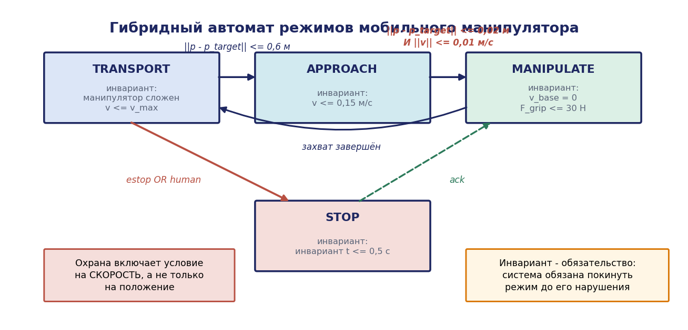
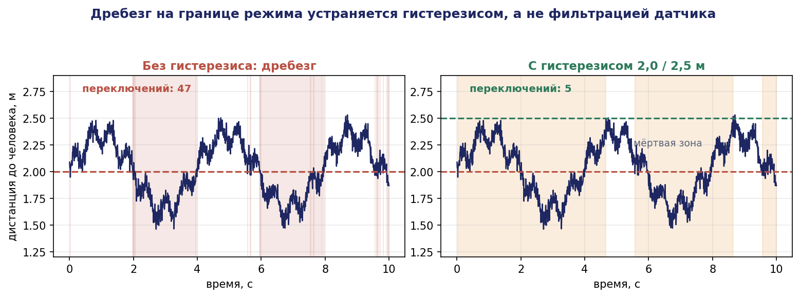
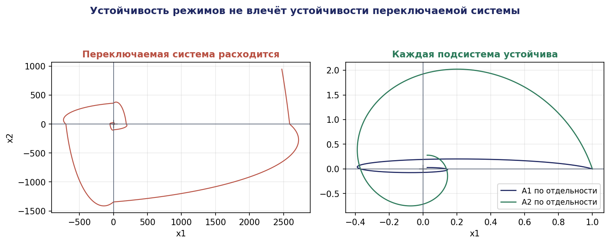
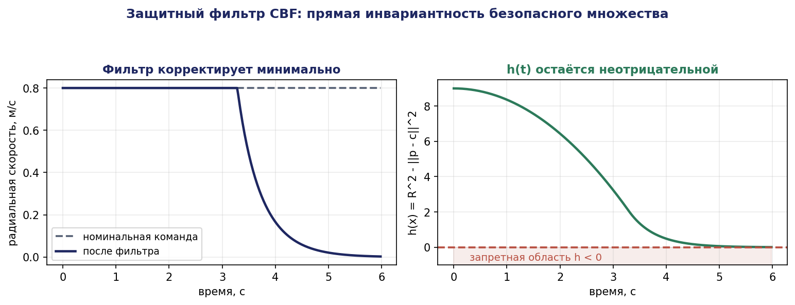
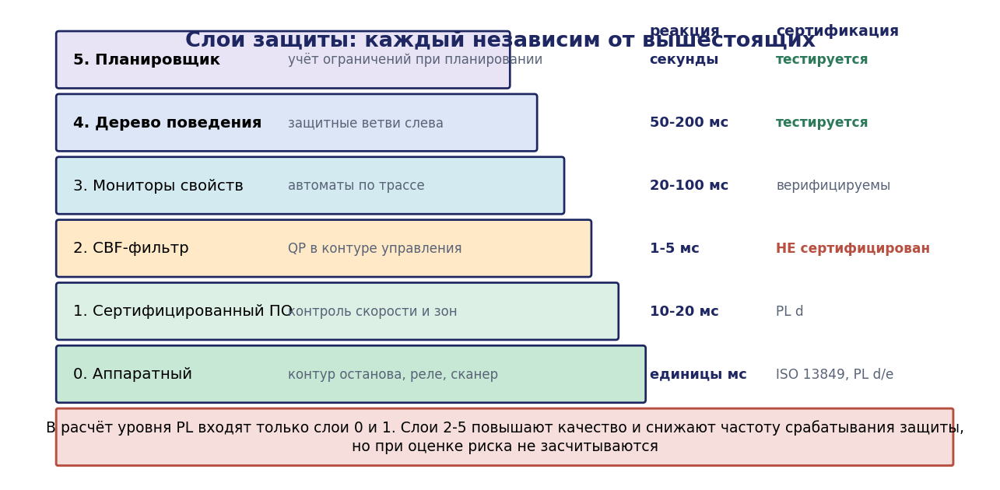

# Глава 9. Гибридные системы, мониторинг и безопасность в контуре

## 9.1. Введение: стык двух миров

Все предыдущие главы работали в дискретном мире: события, состояния, трассы, формулы. Реальный робототехнический комплекс, однако, наполовину непрерывен: приводы, датчики, динамика движения, физика контакта описываются дифференциальными уравнениями. Дискретная логика и непрерывная динамика существуют не по отдельности, а во взаимодействии, и именно на их стыке возникает большинство аварий.

Три типичных сценария.

**Сценарий 1.** Дискретная логика корректна, регулятор устойчив, но переключение между режимами происходит в момент, когда состояние непрерывной системы не удовлетворяет предпосылке нового режима. Робот переключается в режим «транспортировка» с непогашенной скоростью манипулятора, и груз выпадает.

**Сценарий 2.** Каждый режим по отдельности устойчив, но последовательность переключений порождает неустойчивость. Это контринтуитивный, но математически неизбежный эффект: устойчивость подсистем не влечёт устойчивости переключаемой системы.

**Сценарий 3.** Планировщик выдал формально корректный план, но его исполнение в конкретных физических условиях приводит к нарушению ограничения безопасности — например, к превышению допустимой силы контакта.

Настоящая глава даёт аппарат для работы с этим стыком: гибридные автоматы как модель, теорию устойчивости переключаемых систем, верификацию во время исполнения (мониторы) и функции барьера как непрерывный защитный фильтр. Завершается глава архитектурой защитного слоя, реализующей принцип независимости, сформулированный в главе 1.

## 9.2. Гибридные автоматы

### 9.2.1. Определение

**Определение 9.1.** Гибридным автоматом называется кортеж

```math
H = (Q, X, \mathrm{Init}, F, \mathrm{Inv}, E, G, R)
```

где

- $Q$ — конечное множество дискретных состояний (режимов, локаций);
- $X \subseteq \mathbb{R}^n$ — непрерывное пространство состояний;
- $\mathrm{Init} \subseteq Q \times X$ — множество начальных состояний;
- $F : Q \times X \to \mathbb{R}^n$ — векторное поле, задающее непрерывную динамику $\dot{x} = F(q, x)$ в режиме $q$;
- $\mathrm{Inv} : Q \to 2^{X}$ — инвариант режима: система может находиться в $q$ только пока $x \in \mathrm{Inv}(q)$;
- $E \subseteq Q \times Q$ — дискретные переходы;
- $G : E \to 2^{X}$ — охранное условие (guard): переход $e$ возможен только при $x \in G(e)$;
- $R : E \times X \to 2^{X}$ — отображение сброса (reset): непрерывное состояние после перехода.

**Выполнением** (run) называется чередующаяся последовательность непрерывных эволюций и дискретных переходов. Гибридное время описывается парой $(\tau, i)$: непрерывное время и номер дискретного перехода.

### 9.2.2. Пример: мобильный манипулятор

```
Режим TRANSPORT:
  динамика:   ẋ = v·cos θ,  ẏ = v·sin θ,  θ̇ = ω,  q̇_arm = 0
  инвариант:  ‖q_arm − q_stow‖ ≤ ε   ∧   v ≤ v_max_transport
  переходы:
    TRANSPORT → APPROACH   guard: ‖p − p_target‖ ≤ 0.6 м
    TRANSPORT → STOP       guard: human_detected ∨ estop


Режим APPROACH:
  динамика:   позиционное управление базой, манипулятор неподвижен
  инвариант:  v ≤ 0.15 м/с
  переходы:
    APPROACH → MANIPULATE  guard: ‖p − p_target‖ ≤ 0.02 м  ∧  ‖v‖ ≤ 0.01 м/с
    APPROACH → TRANSPORT   guard: цель потеряна

Режим MANIPULATE:
  динамика:   ṗ = 0,  q̇_arm = u_arm
  инвариант:  ‖v_base‖ = 0  ∧  F_grip ≤ 30 Н
  переходы:
    MANIPULATE → TRANSPORT guard: захват завершён ∧ ‖q_arm − q_stow‖ ≤ ε

Режим STOP:
  динамика:   v̇ = −a_max·sign(v),  q̇_arm = 0
  инвариант:  τ ≤ 0.5 с
  переходы:
    STOP → TRANSPORT       guard: ¬human_detected ∧ ¬estop ∧ ack
```

Обратим внимание на два обстоятельства.

Во-первых, охранное условие перехода APPROACH → MANIPULATE содержит **условие на скорость**, а не только на положение. Именно это условие предотвращает сценарий 1 из введения. Формулирование охранных условий, включающих непрерывное состояние, а не только дискретные флаги, — основное практическое требование к проектированию гибридной модели.

Во-вторых, инвариант режима MANIPULATE требует нулевой скорости базы, что формально выражает требование R1 из главы 1 («манипулятор не движется при движении базы»). Инвариант — это не комментарий, а обязательство: система не может находиться в режиме, если инвариант нарушен, а значит, обязана перейти в другой режим.




### 9.2.3. Зенон-поведение

**Определение 9.2.** Выполнение называется **зенонным**, если оно содержит бесконечное число дискретных переходов за конечный промежуток непрерывного времени.


Классический пример — прыгающий мяч с коэффициентом восстановления $e < 1$: интервалы между ударами образуют геометрическую прогрессию, сумма которой конечна.

В моделях РТК зенон-поведение почти всегда является **артефактом моделирования**, а не свойством системы, и указывает на ошибку: обычно на переключение между двумя режимами с пересекающимися охранными условиями без гистерезиса.

**Пример дефекта.** Режим SLOW при расстоянии до человека $d < 2$ м, режим NORMAL при $d \ge 2$ м. При $d$, колеблющемся вокруг 2 м из-за шума датчика, система переключается на каждом такте — «дребезг», в пределе зенонное поведение.

**Исправление** — гистерезис: переход в SLOW при $d < 2{,}0$ м, обратно — при $d > 2{,}5$ м. Охранные условия не пересекаются, между ними «мёртвая зона».

Практическое правило: **любая пара встречных переходов должна иметь гистерезис либо минимальное время пребывания в режиме (dwell time)**. Это же требование получит теоретическое обоснование в разделе 9.4.




## 9.3. Достижимость гибридных систем

### 9.3.1. Неразрешимость

Естественный вопрос: можно ли для гибридного автомата вычислить множество достижимых состояний и тем самым проверить безопасность?

**Теорема 9.1 (Хенцингер и др., 1998).** Задача достижимости для линейных гибридных автоматов (с динамикой $\dot{x} \in \mathrm{Ax} + B$, полиэдральными охранами и инвариантами) неразрешима. Более того, она неразрешима уже для класса автоматов с двумя часами переменной скорости.

*Комментарий к доказательству.* Сводится моделирование двухсчётчиковой машины Минского: значения счётчиков кодируются непрерывными переменными, операции инкремента/декремента и проверки на ноль — дискретными переходами с соответствующими сбросами. Останов машины Минского неразрешим, следовательно неразрешима и достижимость. ∎

Это фундаментальный результат: **точной автоматической проверки безопасности гибридной системы в общем случае не существует**. Следствие для практики — необходимость либо ограничиваться разрешимыми классами, либо использовать аппроксимации.

### 9.3.2. Разрешимые классы

**Временные автоматы** (глава 7) — гибридные автоматы, все непрерывные переменные которых суть часы со скоростью 1, сравниваемые с целыми константами. Достижимость разрешима (теорема Алура–Дилла).

**Инициализированные прямоугольные автоматы**: скорости переменных лежат в интервалах, охраны и инварианты прямоугольны, и при каждом изменении скорости переменной она обязательно переинициализируется. Достижимость разрешима.

**Мультискоростные автоматы с постоянными скоростями в режимах** при некоторых дополнительных условиях допускают точный анализ.

Практический вывод: **если временных требований достаточно для проверки безопасности, следует моделировать временным автоматом** и получить точный ответ, а не строить полную гибридную модель и получить приближённый.

### 9.3.3. Аппроксимация достижимого множества

Для неразрешимых случаев вычисляется **надмножество** достижимых состояний: если оно не пересекается с небезопасным множеством, безопасность доказана; если пересекается — вывод неопределённый (может быть ложная тревога).

Представления множеств и их свойства:

| Представление | Точность | Стоимость операций | Инструмент |
|---|---|---|---|
| Гиперпрямоугольники (боксы) | низкая | очень низкая | быстрая оценка |
| Полиэдры | высокая | высокая (рост числа граней) | PHAVer |
| Зонотопы | хорошая для линейных систем | низкая (замкнуты относительно линейных отображений и суммы Минковского) | CORA, SpaceEx |
| Тейлоровы модели | высокая для нелинейных | средняя | Flow* |
| Эллипсоиды | средняя | низкая | Ellipsoidal Toolbox |

Зонотопы заслуживают отдельного упоминания: зонотоп есть образ гиперкуба при аффинном отображении,

```math
Z = \lbrace c + \sum_{i=1}^{k} \alpha_i g_i : \alpha_i \in [-1, 1] \rbrace
```

и он замкнут относительно линейных преобразований и сумм Минковского — ровно тех операций, которые нужны при распространении множества вдоль линейной динамики. Это делает анализ достижимости линейных систем эффективным.

Практическая рекомендация: аппроксимация достижимости применяется для **критических контуров с малой размерностью** (2–6 непрерывных переменных): тормозной путь, зона досягаемости манипулятора, контур силы контакта. Для системы целиком она нереалистична.

## 9.4. Переключаемые системы и устойчивость

### 9.4.1. Постановка

Рассмотрим систему


```math
\dot{x} = f_{\sigma(t)}(x), \quad \sigma : [0, \infty) \to \lbrace 1, \ldots, N \rbrace
```

где $\sigma$ — сигнал переключения, порождаемый дискретной логикой.

Наивное ожидание: если каждая подсистема $\dot{x} = f_i(x)$ асимптотически устойчива, то и переключаемая система устойчива. Это **неверно**.

**Контрпример.** Две линейные системы второго порядка

```math
A_1 = \begin{pmatrix} -1 & -10 \cr 1 & -1 \end{pmatrix}, \quad A_2 = \begin{pmatrix} -1 & -1 \cr 10 & -1 \end{pmatrix}
```

Обе гурвицевы (собственные значения $-1 \pm i\sqrt{10}$ и $-1 \pm i\sqrt{10}$, вещественные части отрицательны). Однако при переключении, синхронизированном с фазой траектории (переключаться в моменты, когда траектория пересекает определённые лучи), можно добиться того, что норма состояния возрастает на каждом цикле: каждая подсистема «раскручивает» траекторию в своей области, и переключение выбирается так, чтобы всегда попадать в зону раскрутки. Траектория расходится по спирали.

Физическая аналогия — раскачивание качелей: каждое отдельное движение затухающее, но их согласованное чередование накачивает энергию.

**Инженерный смысл.** Логика переключения режимов может дестабилизировать систему, состоящую из устойчивых режимов. Это не теоретическая экзотика: колебания мобильного робота между режимами «объезд слева» и «объезд справа», нарастающие рывки манипулятора при переключении между позиционным и силовым управлением — практические проявления этого эффекта.




### 9.4.2. Общая функция Ляпунова

**Теорема 9.2.** Если существует функция $V : \mathbb{R}^n \to \mathbb{R}$, положительно определённая, радиально неограниченная, такая что

```math
\nabla V(x)^T f_i(x) < 0 \text{ для всех } x \ne 0 \text{ и всех } i = 1, \ldots, N,
```

то переключаемая система асимптотически устойчива при **произвольном** сигнале переключения.

*Доказательство.* Вдоль любой траектории, при любом $\sigma(t)$, производная $\dot{V} = \nabla V(x)^T f_{\sigma(t)}(x) < 0$. Следовательно, V(x(t)) строго убывает и, будучи положительно определённой и радиально неограниченной, стремится к нулю, что влечёт $x(t) \to 0$. Отсутствие зависимости от $\sigma$ даёт устойчивость при произвольных переключениях. ∎

Условие сильное: общая функция Ляпунова существует далеко не всегда. Для линейных систем её существование эквивалентно разрешимости системы линейных матричных неравенств

```math
A_i^T P + P A_i \prec 0, \quad P \succ 0, \quad i = 1, \ldots, N
```

решаемой стандартными средствами выпуклой оптимизации. Если система неразрешима, общей квадратичной функции Ляпунова не существует, и требуется другой подход.

### 9.4.3. Минимальное время пребывания

**Теорема 9.3 (dwell time).** Пусть каждая подсистема $\dot{x} = A_i x$ асимптотически устойчива, и для каждой существует функция Ляпунова $V_i(x) = x^TP_i x$ с оценками

```math
\alpha_1\lVert x\rVert^2 \le V_i(x) \le \alpha_2\lVert x\rVert^2, \quad \dot{V}_i \le -2\lambda V_i
```

Тогда существует $\tau_d > 0$ такое, что при соблюдении условия «интервал между любыми двумя последовательными переключениями не менее $\tau_d$» переключаемая система асимптотически устойчива. Достаточно взять

$\tau_d > \ln(\mu) / (2\lambda)$,  где $\mu = \max_{i,j} (\alpha_2 / \alpha_1)$ — оценка «скачка» функции Ляпунова при переключении.

*Доказательство.* Рассмотрим моменты переключений $t_0 < t_1 < \ldots$ с $t_{k+1} - t_k \ge \tau_d$. На интервале $[t_k, t_{k+1})$ действует подсистема $i_k$, и

```math
V_{i_k}(x(t_{k+1}^-)) \le e^{-2\lambda(t_{k+1} - t_k)} V_{i_k}(x(t_k))
```

В момент переключения функция Ляпунова меняется на другую, и оценка скачка:

```math
V_{i_{k+1}}(x) \le \alpha_2\lVert x\rVert^2 \le(\alpha_2/\alpha_1) \cdot \alpha_1\lVert x\rVert^2 \le \mu \cdot V_{i_k}(x)
```

Комбинируя, для последовательных интервалов:

```math
V_{i_{k+1}}(x(t_{k+1})) \le \mu \cdot e^{-2\lambda \tau_d} \cdot V_{i_k}(x(t_k))
```

Коэффициент $\mu \cdot e^{-2\lambda \tau_d} < 1$ при $\tau_d > \ln(\mu)/(2\lambda)$. Следовательно, значения функции Ляпунова в моменты переключений образуют геометрически убывающую последовательность, а между переключениями функция убывает. Значит, $x(t) \to 0. \blacksquare$

**Инженерное следствие.** Минимальное время пребывания в режиме — **вычисляемый** проектный параметр, а не эвристика. Он же является теоретическим обоснованием требования гистерезиса из раздела 9.2.3: гистерезис гарантирует ненулевое время пребывания.

**Числовой пример.** Пусть $\lambda = 2 c^{-1}$ (постоянная времени 0,5 с), а оценка скачка $\mu = 4$. Тогда $\tau_d > \ln 4 / 4 = 0{,}347$ с. Логика, переключающая режимы чаще трёх раз в секунду, теряет гарантию устойчивости. Это конкретное ограничение на частоту работы логики верхнего уровня — количественная форма правила разделения масштабов времени из главы 1.

## 9.5. Верификация во время исполнения

### 9.5.1. Постановка

Проверка моделей (глава 7) доказывает свойства модели. Реальная система может отличаться от модели: неучтённые возмущения, ошибки реализации, отказы оборудования, нарушение предположений о среде. Верификация во время исполнения (runtime verification) замыкает разрыв: **монитор наблюдает фактическую трассу и сигнализирует о нарушении спецификации**.

Монитор не заменяет верификацию: он не доказывает свойств, а обнаруживает их нарушение в момент возникновения. Зато он работает с реальной системой и не требует модели.

### 9.5.2. Трёхзначная семантика LTL

Формулы LTL интерпретируются на бесконечных трассах, а монитор наблюдает конечный префикс. Для этого вводится трёхзначная семантика.

**Определение $9.3 (\mathrm{LTL}_3)$.** Для конечного слова $u \in \Sigma^{*}$ и формулы $\varphi$:

```math
[u \models \varphi]_3 = \begin{cases} \top, & \text{ если для всех бесконечных продолжений } w: uw \models \varphi \cr \bot, & \text{ если для всех бесконечных продолжений } w: uw \not\models \varphi \cr ?, & \text{ иначе } \end{cases}
```

Значение $\top$ означает, что формула уже удовлетворена окончательно; $\bot$ — нарушена окончательно; ? — вердикт ещё не определён.

**Утверждение 9.1.** Для свойства безопасности $(\varphi = G \psi)$ значение $\top$ никогда не достигается на конечном префиксе, но $\bot$ достигается в момент нарушения. Для свойства живости $(\varphi = F \psi)$ значение $\bot$ никогда не достигается на конечном префиксе, но $\top$ достигается в момент выполнения.

*Доказательство.* Для $\varphi = G \psi$: конечный префикс $u$, на котором $\psi$ всюду истинно, продолжается как словом, где $\psi$ остаётся истинным (тогда $uw \models \varphi$), так и словом, где $\psi$ нарушается (тогда $uw \not\models \varphi$). Значит, вердикт ?. Если же $\psi$ нарушено в $u$, то ни одно продолжение не спасёт: вердикт $\bot$. Для $\varphi = F \psi$ рассуждение двойственно. ∎

**Инженерное следствие, повторяющее вывод главы 1 на новом уровне.** Монитор способен обнаруживать нарушения **только свойств безопасности**. Свойства живости мониторингом не проверяются принципиально. Практический обход — ограничение по времени: вместо $F \psi$ мониторится «$\psi$ наступит в течение $T$», что является свойством безопасности и монитором проверяется.

Это ещё одно обоснование обязательности поля `timeout` в контракте навыка (глава 1): таймаут превращает непроверяемое обязательство живости в проверяемое обязательство безопасности.

### 9.5.3. Синтез монитора

Монитор строится как детерминированный конечный автомат по формуле:

**Алгоритм 9.1.**

```
Вход: формула LTL φ
Выход: детерминированный монитор M_φ

1. Построить автоматы Бюхи A_φ и A_{¬φ}
2. Для каждого: вычислить множество состояний, из которых
   язык непуст (существует принимающий путь)
3. Детерминизировать оба (конструкция подмножеств),
   получив F_φ и F_{¬φ}
4. Построить произведение; разметить состояния:
     ⊥  — если в F_φ достигнуто состояние с пустым языком
     ⊤  — если в F_{¬φ} достигнуто состояние с пустым языком
     ?  — иначе
5. Минимизировать
```

Монитор потребляет по одному событию за такт и выдаёт текущий вердикт за $O(1)$. Это делает мониторинг применимым в реальном времени с частотой контура управления.

### 9.5.4. Пример: монитор для примера А

Требование R2 из главы 1: «захваченный предмет не теряется до укладки», формализуемое как

```math
G(\mathit{held} \to(\mathit{held} U \mathit{placed}))
```

Монитор:

```python
class MonitorR2:
    """G(held -> (held U placed)) — трёхзначный монитор."""
    def __init__(self):
        self.obligation = False      # активно ли обязательство «держать до укладки»
        self.verdict = '?'

    def step(self, held, placed):
        if self.verdict == '_|_':
            return self.verdict
        if self.obligation:
            if placed:
                self.obligation = False          # обязательство снято
            elif not held:
                self.verdict = '_|_'             # предмет потерян до укладки
                return self.verdict
        if held and not self.obligation:
            self.obligation = True               # новое обязательство
        return self.verdict
```

Монитор занимает десяток строк, работает за константное время и **порождается автоматически** из формулы — то есть его корректность не зависит от аккуратности программиста.

### 9.5.5. Реакция на нарушение

Обнаружение нарушения бесполезно без определённой реакции. Проектная таблица реакций — обязательный артефакт:

| Нарушенное свойство | Класс | Реакция | Обоснование |
|---|---|---|---|
| Скорость в присутствии человека | безопасность, критично | немедленный останов категории 2 | требование ISO/TS 15066 |
| Предмет потерян до укладки | целостность задачи | повторное обнаружение и захват | восстановимо |
| Предположение среды нарушено (человек не уходит) | предположение синтеза | переход в режим ожидания, оповещение оператора | гарантии контроллера недействительны |
| Дедлайн навыка превышен | производительность | отмена навыка, переход к recovery | контракт навыка |
| Инвариант усилия захвата | безопасность оборудования | разжать, зафиксировать событие | защита изделия |

Столбец «Реакция» — точка соединения формальной верификации с исполнительной логикой: реакция реализуется ветвью дерева поведения (глава 6), расположенной левее рабочих ветвей.

## 9.6. Функции барьера и защитный фильтр

### 9.6.1. Постановка

Монитор обнаруживает нарушение постфактум. Для физических ограничений (столкновение, превышение усилия, выход за границу зоны) это неприемлемо: нужно **не допустить** нарушения, а не зафиксировать его.

Инструмент — **управляющие функции барьера** (Control Barrier Functions, CBF), позволяющие построить фильтр, который корректирует произвольное управляющее воздействие минимальным образом так, чтобы система гарантированно оставалась в безопасном множестве.

### 9.6.2. Определение и основная теорема

Рассмотрим аффинную по управлению систему

```math
\dot{x} = f(x) + g(x)\cdot u, \quad x \in \mathbb{R}^n, u \in U \subseteq \mathbb{R}^{m}
```

Пусть безопасное множество задано как множество уровня непрерывно дифференцируемой функции $h$:

```math
C = \lbrace x \in \mathbb{R}^n : h(x) \ge 0 \rbrace, \quad \partial C = \lbrace x : h(x) = 0 \rbrace
```

**Определение 9.4.** Функция $h$ называется **управляющей функцией барьера** для C, если существует расширенная функция класса $K$ (строго возрастающая, $\alpha(0) = 0$) такая, что

```math
\sup_{u \in U} [ L_f h(x) + L_g h(x)\cdot u ] \ge -\alpha(h(x)) \quad \text{ для всех } x
```

где $L_f h = \nabla h\cdot f$ и $L_g h = \nabla h\cdot g$ — производные Ли.

**Теорема 9.4 (прямая инвариантность, Эймс и др.).** Пусть $h$ — управляющая функция барьера для C. Тогда любое липшицево управление $u(x)$, удовлетворяющее

```math
\dot{h}(x, u) = L_f h(x) + L_g h(x)\cdot u \ge -\alpha(h(x)),
```

делает множество C прямо инвариантным: если $x(0) \in C$, то $x(t) \in C$ для всех $t \ge 0$.

*Доказательство.* Рассмотрим скалярную функцию $y(t) = h(x(t))$. По условию

```math
\dot{y}(t) \ge -\alpha(y(t))
```

Сравним с решением скалярного дифференциального уравнения $\dot{z} = -\alpha(z), z(0) = y(0) \ge 0$. Функция $\alpha$ класса $K$ обращается в ноль только при $z = 0$, следовательно $z \equiv 0$ является решением при $z(0) = 0$, и по теореме единственности (при липшицевости $\alpha$) решение с $z(0) \ge 0$ остаётся неотрицательным для всех $t$.

По лемме сравнения (Хаддад–Челлабоина), из $\dot{y} \ge -\alpha(y)$ и $y(0) = z(0)$ следует $y(t) \ge z(t) \ge 0$ для всех $t \ge 0$. Значит, $h(x(t)) \ge 0$, то есть $x(t) \in C. \blacksquare$

**Замечание о роли $\alpha$.** При $\alpha(h) = \gamma \cdot h$ условие принимает вид $\dot{h} \ge -\gamma \cdot h$: чем ближе система к границе (меньше $h$), тем сильнее ограничение на скорость приближения. Это даёт «мягкое» торможение у границы вместо жёсткого запрета, что существенно для гладкости движения. Параметр $\gamma$ задаёт консервативность: большое $\gamma$ — позднее и резкое вмешательство, малое $\gamma$ — раннее и мягкое.

### 9.6.3. Защитный фильтр как задача квадратичного программирования

Практическая реализация: произвольный «номинальный» регулятор (планировщик, оператор, нейросетевая политика) выдаёт желаемое управление $u_{\mathrm{nom}}$; фильтр находит ближайшее к нему безопасное:

```math
\begin{gathered} u^{*} = \arg \min_{u \in U} \lVert u - u_{\mathrm{nom}}\rVert^2 \cr \text{ при условии } \quad L_f h(x) + L_g h(x)\cdot u \ge -\alpha(h(x)) \end{gathered}
```

Это задача квадратичного программирования с линейными ограничениями. При одном ограничении она решается аналитически; при нескольких — стандартным QP-решателем за микросекунды, что позволяет включать фильтр в контур с частотой 1 кГц.

**Ключевое свойство архитектуры.** Фильтр не зависит от того, откуда пришло $u_{\mathrm{nom}}$. Планировщик может быть неоптимален, нейросеть может ошибиться, оператор может дать опасную команду — безопасность обеспечивается фильтром, работающим на основании измеренного состояния и явно заданной функции $h$. Это прямая реализация принципа независимости защитного слоя из главы 1.

### 9.6.4. Пример: ограничение зоны и дистанции

**Ограничение рабочей зоны.** Робот должен оставаться в круге радиуса $R$ с центром в $c$:


```math
h(x) = R^2 - \lVert p - c\rVert^2
```

Для модели одноинтегратора $\dot{p} = u: \nabla h = -2(p - c), L_f h = 0, L_g h = -2(p - c)^T$. Условие CBF:

```math
-2(p - c)^T\cdot u \ge -\gamma \cdot(R^2 - \lVert p - c\rVert^2)
```

то есть радиальная составляющая скорости ограничена: $(p - c)^Tu \le \gamma(R^2 - \lVert p-c\rVert^2)/2$. У границы $(\lVert p-c\rVert \to R)$ правая часть стремится к нулю, и радиальная скорость наружу запрещается.

**Ограничение дистанции до человека.** Пусть $p_h$ — положение человека, $d_{\min}$ — минимальная дистанция:

```math
h(x) = \lVert p - p_h\rVert^2 - d_{\min}^2
```

При движущемся человеке появляется член $L_f h$, учитывающий скорость человека — то есть фильтр автоматически становится консервативнее при сближении.

**Числовой пример.** $R = 3$ м, $\gamma = 2 c^{-1}$, робот находится на расстоянии 2,8 м от центра, номинальная команда — радиально наружу со скоростью 0,8 м/с. Ограничение: $(p-c)^Tu \le \gamma(R^2 - \lVert p-c\rVert^2)/2 = 2\cdot(9 - 7{,}84)/2 = 1{,}16$ м²/с. Радиальная проекция номинальной команды: $2{,}8 \cdot 0{,}8 = 2{,}24 > 1{,}16$. Фильтр уменьшит радиальную составляющую до 1,16/2,8 = 0,414 м/с. На расстоянии 2,95 м предел составит $2\cdot(9 - 8{,}7)/2/2{,}95 = 0{,}102$ м/с — робот почти остановится у границы, но не «упрётся» в неё рывком.




### 9.6.5. Ограничения метода

**Построение $h$.** Для сложных ограничений (столкновение манипулятора с препятствием во всей конфигурации) явная функция барьера неизвестна и должна быть построена численно или обучена, что снимает часть гарантий.

**Относительная степень.** Если $L_g h(x) \equiv 0$ (управление не влияет на $\dot{h}$ напрямую), требуется расширение до CBF высокого порядка (HOCBF) с производными более высокого порядка.

**Ограничения на управление.** При $u \in U$ (ограниченный момент привода) условие CBF может оказаться невыполнимым: физически невозможно затормозить. Это означает, что множество C не является управляемо-инвариантным, и требуется его сужение до «множества гарантированного торможения» — что, по сути, и есть расчёт тормозного пути.

**Модель.** Гарантия относится к модели $\dot{x} = f + g\cdot u$. Ошибка модели разрушает гарантию; робастные расширения (с оценкой границ неопределённости) существуют.

## 9.7. Архитектура защитного слоя

### 9.7.1. Simplex-архитектура

Объединение изложенного даёт стандартную архитектуру безопасного управления:

```
        ┌─────────────────────────┐
        │  Сложный контроллер     │  планировщик, AI, оператор
        │  (не сертифицирован)    │  — высокая производительность
        └───────────┬─────────────┘
                    │ u_nom
                    ▼
        ┌─────────────────────────┐
        │  Модуль принятия решения│  проверка h(x), запас,
        │  (сертифицирован)       │  вердикты мониторов
        └─────┬──────────────┬────┘
              │ безопасно    │ опасно
              ▼              ▼
        ┌──────────┐   ┌──────────────────┐
        │ u = u_nom│   │ Простой надёжный │  торможение,
        └──────────┘   │ контроллер       │  удержание позиции
                       └──────────────────┘
```

Принцип: сложный высокопроизводительный контроллер работает, пока состояние находится в области, из которой простой сертифицированный контроллер гарантированно способен обеспечить безопасность. При выходе за эту область управление передаётся простому контроллеру.

CBF-фильтр является непрерывной версией той же идеи: вместо переключения выполняется минимальная коррекция.

### 9.7.2. Слои защиты в РТК

Практическая реализация в комплексе включает несколько независимых слоёв:


| Слой | Реализация | Время реакции | Сертификация |
|---|---|---|---|
| 0. Аппаратный | контур аварийного останова, реле безопасности, сканер | единицы мс | ISO 13849, PL d/e |
| 1. Сертифицированный программный | контроль скорости и зон в контроллере безопасности | 10–20 мс | PL d |
| 2. CBF-фильтр | QP в контуре управления | 1–5 мс | не сертифицирован, но верифицируем |
| 3. Мониторы свойств | автоматы по трассе событий | 20–100 мс | верифицируемы |
| 4. Исполнительная логика | защитные ветви дерева поведения | 50–200 мс | тестируется |
| 5. Планировщик | учёт ограничений при планировании | секунды | тестируется |

**Правило проектирования: каждый слой независим от вышестоящих.** Слой 0 работает при отказе всего программного обеспечения; слой 2 — при неверном плане; слой 3 — при неучтённом сценарии. Нарушение независимости (например, реализация аварийного останова через ту же вычислительную платформу, что и планировщик) сводит многослойность к иллюзии.




### 9.7.3. Связь с нормативными требованиями

Слои 0 и 1 подлежат оценке по ISO 13849 (уровень производительности PL) или IEC 62061 (SIL). Слои 2–5 повышают надёжность и производительность, но **не засчитываются** как защитные функции при оценке риска, поскольку не сертифицированы. Подробно — в главе 16.

Это обстоятельство необходимо понимать с самого начала проектирования: сколь угодно изящный CBF-фильтр не заменяет светового барьера с точки зрения приёмки комплекса.

## 9.8. Разбор: защитный слой для примера А

**Ограничения безопасности:**

- $h_1 = d_{\mathrm{human}} - 0{,}8$ — дистанция до человека не менее 0,8 м при движении;
- $h_2 = 30 - F_{\mathrm{grip}}$ — усилие захвата не более 30 Н;
- $h_3 = 0{,}25 - \lVert v\rVert$ при обнаружении человека в зоне наблюдения;
- $h_4 = R^2 - \lVert p - c\rVert^2$ — не покидать рабочую зону.

**Мониторы:**

- $M_1: G(\mathit{estop} \to F_{\le 0{,}5\text{ с }} \mathit{stopped})$ — дедлайн останова;
- $M_2: G(\mathit{held} \to \mathit{held} U \mathit{placed})$ — целостность транспортировки;
- $M_3: G(\text{base_moving} \to \neg \text{arm_moving})$ — раздельность движений;
- $M_4: G F \neg \text{human_present}$ — предположение синтеза (проверяется по таймауту 120 с).

**Реализация в дереве поведения** (левейшие ветви корневого Fallback):

```
?  Корень
├── →  [Слой безопасности]
│   ├── ○  Монитор M₁ или M₃ дал ⊥ ?
│   └── □  БезопасныйОстанов + журнал + оповещение
├── →  [Нарушение предположения]
│   ├── ○  Монитор M₄ дал ⊥ ?
│   └── □  РежимОжидания + запрос оператора
├── →  [Энергия]
│   └── …
└── □  [Миссия]
```

**Фильтр CBF** работает независимо от дерева, между выходом планировщика движения и приводами, с частотой 200 Гц, обеспечивая $h_1, h_3, h_4$ непрерывно.

**Гибридный автомат режимов** (раздел 9.2.2) реализуется как машина состояний верхнего уровня с гистерезисом: переход в SLOW при $d < 2{,}0$ м, обратно при $d > 2{,}5$ м; минимальное время пребывания 0,4 с согласно расчёту раздела 9.4.3.

Обратим внимание, что четыре механизма — гибридный автомат режимов, CBF-фильтр, мониторы и защитные ветви дерева — не дублируют друг друга, а работают на разных временных масштабах и с разной степенью доверия. Именно эта многомасштабность и есть содержание понятия «защита в глубину».

## 9.9. Выводы

1. Гибридный автомат — модель стыка дискретной логики и непрерывной динамики; охранные условия должны включать непрерывное состояние, а не только дискретные флаги, иначе возникают аварии переключения.
2. Зенон-поведение в моделях РТК почти всегда является дефектом моделирования и устраняется гистерезисом или минимальным временем пребывания.
3. Задача достижимости гибридных систем неразрешима в общем случае; практическое решение — либо разрешимые классы (временные автоматы), либо консервативная аппроксимация достижимого множества для малоразмерных критических контуров.
4. Устойчивость всех режимов не влечёт устойчивости переключаемой системы; гарантии дают общая функция Ляпунова (при произвольных переключениях) либо минимальное время пребывания, вычисляемое по формуле $\tau_d > \ln \mu / 2\lambda$.
5. Монитор обнаруживает нарушения только свойств безопасности; свойства живости мониторингом не проверяются, что обосновывает обязательность таймаутов в контрактах навыков.
6. Управляющая функция барьера обеспечивает прямую инвариантность безопасного множества; QP-фильтр минимально корректирует произвольное номинальное управление, оставаясь независимым от его источника.
7. Защита строится слоями, каждый из которых независим от вышестоящих; при оценке риска засчитываются только сертифицированные слои.

## 9.10. Контрольные вопросы

1. Приведите пример аварии, вызванной переключением режима при неподходящем непрерывном состоянии. Как это предотвращается в модели?
2. Что такое зенон-поведение и почему в моделях РТК оно указывает на ошибку?
3. Сформулируйте теорему о неразрешимости достижимости гибридных систем. Какие практические следствия из неё вытекают?
4. Почему зонотопы удобны для анализа достижимости линейных систем?
5. Постройте физическую аналогию неустойчивости переключаемой системы из устойчивых подсистем.
6. Докажите теорему о минимальном времени пребывания. Как её результат связан с требованием гистерезиса?
7. Почему монитор не может обнаружить нарушение свойства живости? Как это обходится на практике?
8. Сформулируйте и докажите теорему о прямой инвариантности для CBF.
9. Какова роль функции $\alpha$ в определении CBF и как её выбор влияет на поведение робота у границы?
10. Почему CBF-фильтр не заменяет сертифицированный контур безопасности?

## 9.11. Задачи

**Задача 9.1.** Постройте гибридный автомат для примера А с четырьмя режимами. Для каждого выпишите динамику, инвариант, охраны переходов. Убедитесь, что охраны включают ограничения на непрерывные переменные.

**Задача 9.2.** Найдите в модели задачи 9.1 пару встречных переходов без гистерезиса и покажите возможность дребезга. Введите гистерезис и оцените минимальное время пребывания.

**Задача 9.3.** Для двух матриц $A_1, A_2$ из раздела 9.4.1 проверьте гурвицевость и попытайтесь найти общую квадратичную функцию Ляпунова, решив систему ЛМН. Что показывает результат?

**Задача 9.4.** Рассчитайте $\tau_d$ для системы с $\lambda = 1{,}5 c^{-1}$ и $\mu = 9$. Какова максимально допустимая частота переключения режимов?

**Задача 9.5.** Постройте монитор для свойства $G(\mathit{request} \to F_{\le 5\text{ с }} \mathit{grant})$. Реализуйте его на Python и проверьте на синтетических трассах.

**Задача 9.6.** Постройте монитор для требования R5 из главы 1 (останов за 0,5 с). Какие события он должен наблюдать и с какой частотой?

**Задача 9.7.** Для одноинтеграторной модели постройте CBF для ограничения «не приближаться к линии $x = 0$ ближе чем на 0,5 м» и выведите явное выражение фильтра.

**Задача 9.8.** Реализуйте QP-фильтр CBF для ограничения рабочей зоны в Webots. Подайте номинальную команду, выводящую робота за границу, и убедитесь, что фильтр её корректирует. Постройте график $h(t)$ — он должен оставаться неотрицательным.

**Задача 9.9.** Исследуйте влияние параметра $\gamma$ на поведение у границы: постройте траектории для $\gamma = 0{,}5; 2; 10$. Объясните различие.

**Задача 9.10.** Составьте таблицу слоёв защиты для примера Б (производственная ячейка) с указанием реализации, времени реакции и уровня сертификации каждого слоя. Проверьте независимость слоёв.

## 9.12. Литература к главе

1. Lygeros J., Tomlin C., Sastry S. Hybrid Systems: Modeling, Analysis and Control. — Lecture notes, UC Berkeley / ETH Zürich, 2010.
2. Henzinger T. A., Kopke P. W., Puri A., Varaiya P. What's Decidable about Hybrid Automata? // Journal of Computer and System Sciences. — 1998. — Vol. 57, No. 1. — P. 94–124.
3. Liberzon D. Switching in Systems and Control. — Birkhäuser, 2003.
4. Ames A. D., Coogan S., Egerstedt M., Notomista G., Sreenath K., Tabuada P. Control Barrier Functions: Theory and Applications // Proc. European Control Conference, 2019. — P. 3420–3431.
5. Ames A. D., Xu X., Grizzle J. W., Tabuada P. Control Barrier Function Based Quadratic Programs for Safety Critical Systems // IEEE Transactions on Automatic Control. — 2017. — Vol. 62, No. 8. — P. 3861–3876.
6. Bauer A., Leucker M., Schallhart C. Runtime Verification for LTL and TLTL // ACM Transactions on Software Engineering and Methodology. — 2011. — Vol. 20, No. 4.
7. Sha L. Using Simplicity to Control Complexity // IEEE Software. — 2001. — Vol. 18, No. 4. — P. 20–28.
8. Althoff M. An Introduction to CORA 2015 // Proc. ARCH Workshop, 2015.
9. Frehse G. et al. SpaceEx: Scalable Verification of Hybrid Systems // Proc. CAV, 2011. — P. 379–395.
