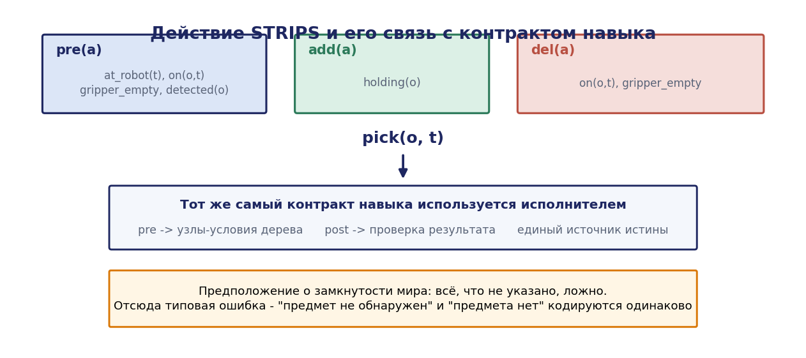
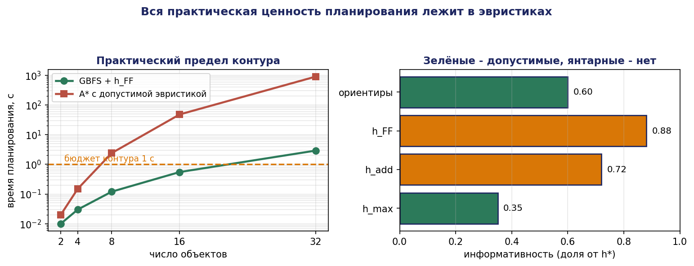
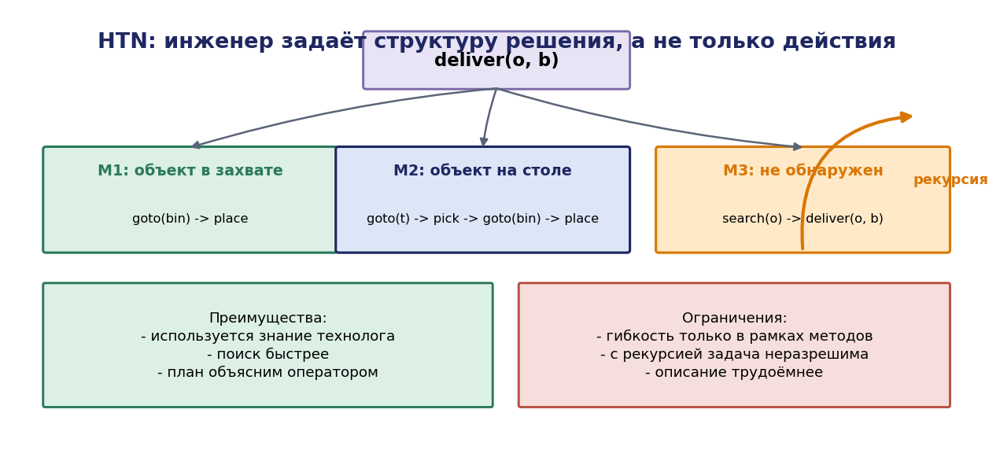
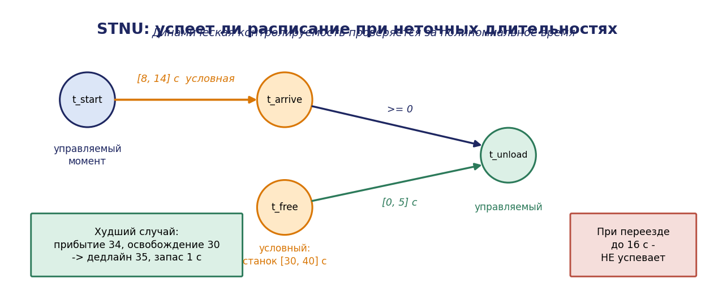

# Глава 10. Планирование задач

## 10.1. Введение: откуда берётся последовательность действий

Главы 6 и 8 дали два способа получить исполнительную логику: написать дерево поведения вручную или синтезировать контроллер из темпоральной спецификации. Оба способа предполагают, что **последовательность действий известна заранее** — либо потому, что её продумал инженер, либо потому, что она выведена из формулы для фиксированного набора зон.

Комплекс, работающий в изменяющихся условиях, требует большего: способности **строить последовательность действий под конкретную задачу во время работы**. Заказ содержит три детали разных типов; на столе обнаружены предметы в неизвестной заранее конфигурации; один из манипуляторов вышел из строя, и маршрут нужно перестроить. Прописать все варианты невозможно — их комбинаторно много.

Аппарат, решающий эту задачу, — **автоматическое планирование** (automated planning). Инженер описывает не последовательность, а **словарь действий**: что каждое действие требует и что оно даёт. Планировщик находит последовательность, ведущую из текущего состояния в целевое.

Это третий и последний уровень «не писать логику вручную», рассматриваемый в курсе:

| Глава | Что задаёт инженер | Что вычисляется |
|---|---|---|
| 3 | модель оборудования + запреты | супервизор (ограничение поведения) |
| 8 | предположения о среде + цели на LTL | реактивный контроллер |
| 10 | действия с предусловиями и эффектами + цель | последовательность действий |

Настоящая глава излагает классическое планирование в пространстве состояний, язык PDDL, эвристический поиск, иерархические сети задач (HTN) и временные сети ограничений. Глава 11 продолжит тему, добавив геометрию.

## 10.2. Классическая постановка

### 10.2.1. Модель STRIPS

**Определение 10.1.** Задачей планирования в модели STRIPS называется четвёрка

```math
\Pi = (F, A, s_0, g)
```

где

- $F$ — конечное множество атомов (пропозициональных переменных, описывающих факты о мире);
- A — конечное множество действий, каждое действие $a \in A$ есть тройка $a = \langle \mathit{pre}(a), \mathit{add}(a), \mathit{del}(a)\rangle$ с $\mathit{pre}(a), \mathit{add}(a), \mathit{del}(a) \subseteq F$;
- $s_0 \subseteq F$ — начальное состояние (множество истинных атомов);
- $g \subseteq F$ — цель (множество атомов, которые должны стать истинными).

Состояние есть подмножество $F$: атом истинен, если принадлежит состоянию (**предположение о замкнутости мира**: всё, что не указано, ложно).

Действие $a$ **применимо** в состоянии $s$, если $\mathit{pre}(a) \subseteq s$. Результат применения:

```math
\gamma(s, a) = (s \setminus \mathit{del}(a)) \cup \mathit{add}(a)
```

**Планом** называется последовательность $\pi = \langle a_1, \ldots, a_n\rangle$ такая, что применение по очереди из $s_0$ приводит в состояние $s_n \supseteq g$.

### 10.2.2. Пример

Действие «взять предмет со стола» для примера А:


```
pick(o, t):
  pre: at_robot(t), on(o, t), gripper_empty, detected(o)
  add: holding(o)
  del: on(o, t), gripper_empty
```

Действие «переместиться»:

```
move(from, to):
  pre: at_robot(from), connected(from, to)
  add: at_robot(to)
  del: at_robot(from)
```

Действие «уложить в контейнер»:

```
place(o, b):
  pre: at_robot(b), holding(o), type_matches(o, b)
  add: in_bin(o, b), gripper_empty
  del: holding(o)
```

Начальное состояние и цель:

```
s0 = { at_robot(base), gripper_empty, on(bolt1, table1), on(nut1, table2),
       detected(bolt1), detected(nut1), connected(base, corridor), ... }

g  = { in_bin(bolt1, bin_bolts), in_bin(nut1, bin_nuts), at_robot(base) }
```

Планировщик найдёт последовательность из 10–12 действий. При изменении состава предметов план перестраивается автоматически, без изменения описания действий.




### 10.2.3. Сложность

**Теорема 10.1 (Байлум и Гивен, 1994).** Задача существования плана в модели STRIPS PSPACE-полна. Задача существования плана длины не более k NP-полна.

*Комментарий.* PSPACE-трудность доказывается сведением задачи о принятии линейно-ограниченной машины Тьюринга: состояние ленты кодируется атомами, переходы — действиями. Принадлежность PSPACE следует из того, что план, если существует, имеет длину не более $2^{\lvert F\rvert}$, и его поиск ведётся с полиномиальной памятью недетерминированным алгоритмом (теорема Сэвича). ∎

Практический смысл: планирование принципиально дорого, и вся практическая ценность лежит в качестве эвристик.

## 10.3. Язык PDDL

### 10.3.1. Структура описания

PDDL (Planning Domain Definition Language) — стандартный язык, разделяющий описание **домена** (действия, предикаты, типы — что вообще возможно) и **задачи** (объекты, начальное состояние, цель — что требуется сейчас).

**Домен для примера А:**

```lisp
(define (domain mobile-manipulator)
  (:requirements :strips :typing :negative-preconditions :fluents)

  (:types
    location object bin - locatable
    part tool - object)

  (:predicates
    (at-robot     ?l - location)
    (connected    ?l1 ?l2 - location)
    (on           ?o - object ?l - location)
    (holding      ?o - object)
    (gripper-empty)
    (detected     ?o - object)
    (in-bin       ?o - object ?b - bin)
    (bin-at       ?b - bin ?l - location)
    (accepts      ?b - bin ?o - object)
    (reachable    ?o - object ?l - location))

  (:functions
    (travel-time ?l1 ?l2 - location)
    (total-cost))

  (:action move
    :parameters (?from ?to - location)
    :precondition (and (at-robot ?from) (connected ?from ?to))
    :effect (and (at-robot ?to)
                 (not (at-robot ?from))
                 (increase (total-cost) (travel-time ?from ?to))))

  (:action pick
    :parameters (?o - object ?l - location)
    :precondition (and (at-robot ?l) (on ?o ?l) (gripper-empty)
                       (detected ?o) (reachable ?o ?l))
    :effect (and (holding ?o)
                 (not (on ?o ?l))
                 (not (gripper-empty))
                 (increase (total-cost) 8)))

  (:action place
    :parameters (?o - object ?b - bin ?l - location)
    :precondition (and (at-robot ?l) (bin-at ?b ?l)
                       (holding ?o) (accepts ?b ?o))
    :effect (and (in-bin ?o ?b) (gripper-empty)
                 (not (holding ?o))
                 (increase (total-cost) 6)))

  (:action observe
    :parameters (?o - object ?l - location)
    :precondition (and (at-robot ?l) (on ?o ?l))
    :effect (and (detected ?o)
                 (increase (total-cost) 3))))
```

**Задача:**

```lisp
(define (problem collect-2024-11)
  (:domain mobile-manipulator)
  (:objects
    base corridor table1 table2 binzone - location
    bolt1 bolt2 nut1 - part
    bin-bolts bin-nuts - bin)
  (:init
    (at-robot base) (gripper-empty)
    (connected base corridor)   (connected corridor base)
    (connected corridor table1) (connected table1 corridor)
    (connected corridor table2) (connected table2 corridor)
    (connected corridor binzone)(connected binzone corridor)
    (on bolt1 table1) (on bolt2 table1) (on nut1 table2)
    (reachable bolt1 table1) (reachable bolt2 table1) (reachable nut1 table2)
    (bin-at bin-bolts binzone)  (bin-at bin-nuts binzone)
    (accepts bin-bolts bolt1)   (accepts bin-bolts bolt2)
    (accepts bin-nuts nut1)
    (= (travel-time base corridor) 12)
    (= (travel-time corridor table1) 9)
    (= (travel-time corridor table2) 11)
    (= (travel-time corridor binzone) 7)
    (= (total-cost) 0))
  (:goal (and (in-bin bolt1 bin-bolts)
              (in-bin bolt2 bin-bolts)
              (in-bin nut1 bin-nuts)
              (at-robot base)))
  (:metric minimize (total-cost)))
```

### 10.3.2. Уровни выразительности

| Уровень | Возможности | Применимость к РТК |
|---|---|---|
| STRIPS | булевы предикаты, add/del | базовая логика операций |
| ADL | отрицательные предусловия, кванторы, условные эффекты | более компактные домены |
| PDDL 2.1 (числовые) | числовые переменные, метрики, длительности | стоимости, ресурсы, время |
| PDDL 2.1 (временные) | параллельные длительные действия | координация нескольких роботов |
| PDDL+ | непрерывные процессы и события | гибридные задачи (заряд, нагрев) |
| PDDL 3 | предпочтения и ограничения на траектории | мягкие требования |

Практический совет: **начинать с STRIPS и добавлять выразительность только при необходимости**. Каждый уровень резко сужает круг доступных планировщиков и увеличивает время поиска.

## 10.4. Поиск и эвристики

### 10.4.1. Направление поиска

**Прогрессивный поиск** (вперёд, от $s_0$): состояния явные, применимость действий проверяется прямо, легко вычислять эвристики. Основной подход современных планировщиков.

**Регрессивный поиск** (назад, от $g$): узлы суть частичные описания (подцели), ветвление меньше, но возникают несовместимые подцели и «недостижимые» узлы.

**Планирование в пространстве планов** (POP): узлы — частично упорядоченные множества действий; естественно порождает параллельные планы, но эвристики слабее.

### 10.4.2. Релаксация с отбрасыванием удалений

Основной источник эвристик — релаксация $\Pi^+$, получаемая отбрасыванием списков удалений: $\mathit{del}(a) = \varnothing$ для всех $a$.

**Утверждение 10.1.** Для релаксированной задачи $\Pi^+$ состояния монотонно растут $(s \subseteq \gamma^+(s, a))$, следовательно всякий достижимый атом остаётся истинным навсегда.

**Теорема 10.2.** Оптимальная стоимость решения релаксированной задачи $h^+(s)$ является **допустимой** эвристикой: $h^+(s) \le h^{*}(s)$, где $h^{*}$ — оптимальная стоимость исходной задачи.

*Доказательство.* Всякий план $\pi$ для исходной задачи, применённый в релаксированной, также достигает цели: множество истинных атомов в релаксации на каждом шаге является надмножеством соответствующего множества в исходной задаче (индукция по шагам: базис тривиален; на шаге добавляются те же атомы add(a), а удаления не производятся). Значит, множество решений релаксации содержит множество решений исходной задачи, и минимум по большему множеству не больше: $h^+(s) \le h^{*}(s). \blacksquare$

**Теорема 10.3.** Вычисление $h^+$ (оптимального решения релаксированной задачи) NP-трудно.

Поэтому на практике используются вычислимые за полиномиальное время аппроксимации.

### 10.4.3. Семейство эвристик

**$h_{\max}$.** Определяется рекурсивно как стоимость самой дорогой подцели:

```math
\begin{gathered} h_{\max}(s, g) = \max_{p \in g} h_{\max}(s, p) \cr h_{\max}(s, p) = 0, \text{ если } p \in s \cr h_{\max}(s, p) = \min_{a : p \in \mathrm{add}(a)} (\mathit{cost}(a) + h_{\max}(s, \mathit{pre}(a))) \end{gathered}
```

Допустима, но обычно сильно недооценивает.

**$h_{\mathrm{add}}$.** То же с заменой max на сумму: недопустима (переоценивает при разделяемых подцелях), но информативнее и на практике даёт быстрый поиск.

**$h_{FF}$ (Хофман, Небель).** Извлекает **релаксированный план** из графа планирования и берёт его длину (или стоимость). Недопустима, но эмпирически одна из лучших. Дополнительно порождает множество **полезных действий** (helpful actions) — тех, что входят в релаксированный план, — что позволяет резко сузить ветвление.

**Эвристики ориентиров (landmarks).** Ориентир — факт (или дизъюнкция фактов), истинный в некоторый момент **любого** решения. Ориентиры извлекаются из структуры задачи; их число даёт нижнюю оценку.

**Утверждение 10.2.** Если $L$ — множество попарно «непересекающихся» ориентиров, каждый из которых требует своего действия, то число оставшихся ориентиров является допустимой эвристикой.

**Абстракции.** Merge-and-shrink, pattern databases: строится абстракция задачи (проекция на подмножество переменных), решается точно, полученная стоимость — допустимая эвристика.

### 10.4.4. Алгоритмы поиска

- **A\*** с допустимой эвристикой даёт оптимальный план; применим при малых задачах.
- **Жадный поиск по первому наилучшему (GBFS)** с $h_{FF}$ — быстрая генерация приемлемого плана; основной режим для робототехники.
- **Enforced Hill Climbing** — быстрый спуск с поиском в ширину при застревании; исходный режим FF.
- **Поиск с чередующимися очередями** — комбинация нескольких эвристик; используется в Fast Downward.


**Практический ориентир.** Для доменов масштаба РТК (десятки объектов, 5–10 типов действий) GBFS с $h_{FF}$ находит план за доли секунды; поиск оптимального плана A\* может занимать минуты. В контуре управления практически всегда используется неоптимальный, но быстрый режим, а оптимизация выполняется на уровне диспетчеризации (глава 14).




### 10.4.5. Планировщики

| Планировщик | Особенности |
|---|---|
| Fast Downward | эталонная архитектура, множество эвристик, PDDL 2.2 |
| FF | классический, $h_{FF}$, быстрый |
| LAMA | ориентиры, режим «якорь и улучшение» |
| pyperplan | учебный, на Python, читаемый исходный код |
| OPTIC / POPF | временные, PDDL 2.1 с длительностями |
| ENHSP | числовые и гибридные (PDDL+) |
| PlanSys2 | ROS 2-интеграция планирования, исполнение планов |

Для семинара 6 рекомендуется pyperplan (для понимания устройства) и Fast Downward (для реальных задач).

## 10.5. Иерархические сети задач (HTN)

### 10.5.1. Мотивация

Классическое планирование не использует знание инженера о том, **как** обычно решается задача. Между тем в производстве такое знание есть: технолог знает, что деталь сначала берут, потом везут, потом кладут. Заставлять планировщик заново открывать эту структуру расточительно.

HTN-планирование позволяет задать структуру явно: задачи декомпозируются на подзадачи посредством **методов**, и планировщик выбирает применимые методы, а не собирает план из атомарных действий.

### 10.5.2. Формализация

**Определение 10.2.** Задачей HTN-планирования называется кортеж $(s_0, w, D)$, где $s_0$ — начальное состояние, $w$ — начальная сеть задач, $D = (A, M)$ — область, состоящая из примитивных действий A и методов $M$.

Задачи делятся на **примитивные** (соответствуют действиям) и **составные**. **Метод** $m = \langle \mathit{task}(m), \mathit{pre}(m), \mathit{subtasks}(m), \mathit{constraints}(m)\rangle$ указывает, как составная задача декомпозируется при выполнении условия pre(m).

План строится рекурсивным применением методов до получения сети из одних примитивных задач, совместимой с ограничениями порядка.

### 10.5.3. Пример

```
task: deliver(?o, ?b)
  method M1 «объект уже в захвате»:
    pre:      (holding ?o)
    subtasks: [ goto(?bin_loc), place(?o, ?b) ]


  method M2 «объект на известном столе»:
    pre:      (on ?o ?t) and (detected ?o)
    subtasks: [ goto(?t), pick(?o, ?t), goto(?bin_loc), place(?o, ?b) ]

  method M3 «объект не обнаружен»:
    pre:      (not (detected ?o))
    subtasks: [ search(?o), deliver(?o, ?b) ]        ← рекурсия
```

Метод M3 демонстрирует рекурсивную декомпозицию: если объект не найден, сначала выполняется поиск, затем задача ставится заново.




### 10.5.4. Выразительность

**Теорема 10.4 (Эрол, Хендлер, Нау, 1996).** Задача существования плана для HTN в общем случае **неразрешима**; для HTN без рекурсии она разрешима и находится в EXPSPACE.

Неразрешимость может показаться недостатком, но она есть следствие **большей выразительности**: HTN способны выражать контекстно-свободные и более сложные структуры плана, недоступные STRIPS.

Практически рекурсия ограничивается по глубине, что возвращает разрешимость.

### 10.5.5. Сравнение подходов

| Критерий | Классическое (PDDL) | HTN |
|---|---|---|
| Что задаёт инженер | действия и цель | действия, методы, структуру решения |
| Использование знаний предметной области | слабое | сильное |
| Скорость поиска | зависит от эвристики | обычно быстрее |
| Гибкость при новых ситуациях | высокая | ограничена набором методов |
| Трудоёмкость описания | ниже | выше |
| Объяснимость плана | средняя | высокая (видна иерархия) |
| Разрешимость | PSPACE | неразрешима с рекурсией |

**Практический выбор для РТК.** HTN предпочтителен, когда технологический процесс известен и структурирован (пример Б: маршруты заданы технологом). Классическое планирование предпочтительно, когда ситуации разнообразны и заранее не структурированы (пример А: произвольная расстановка предметов). Гибридные подходы (HTN с классическим планированием на нижнем уровне) применяются в промышленных системах.

Заметим также связь с главой 6: **иерархия HTN-методов структурно соответствует дереву поведения**, и существуют трансляции HTN-планов в деревья поведения, сохраняющие реактивность.

## 10.6. Планирование как задача удовлетворения ограничений

Альтернативная постановка: зафиксировать горизонт $k$ и закодировать существование плана длины $k$ как задачу выполнимости (SAT) или удовлетворения ограничений (CSP).

Переменные: $x_{f,i}$ — истинность атома $f$ на шаге $i; y_{a,i}$ — выполняется ли действие $a$ на шаге $i, i = 0, \ldots, k$.

Ограничения:

- начальное состояние: $x_{f,0} = [f \in s_0]$;
- цель: $x_{f,k} = 1$ для $f \in g$;
- предусловие: $y_{a,i} \to x_{f,i}$ для $f \in \mathit{pre}(a)$;
- эффекты: $y_{a,i} \to x_{f,i+1}$ для $f \in \mathit{add}(a); y_{a,i} \to \neg x_{f,i+1}$ для $f \in \mathit{del}(a)$;
- аксиомы фрейма: $x_{f,i} \wedge \neg x_{f,i+1} \to \bigvee_{a : f \in \mathrm{del}(a)} y_{a,i}$;
- исключение конфликтов: несовместимые действия не выполняются одновременно.

Такая кодировка (SATPLAN, Кауц и Селман) прямо соответствует ограниченной проверке моделей из главы 7 — обе сводят задачу к SAT с развёрткой по шагам. Подход эффективен для задач с высокой параллельностью действий и естественно расширяется на числовые ограничения (SMT).

## 10.7. Временные сети ограничений

### 10.7.1. Простые временные сети

Планирование даёт порядок действий; для координации нескольких роботов нужен ещё и **график**. Аппарат — простые временные сети.

**Определение 10.3.** Простой временной сетью (STN) называется пара (X, C), где $X = \lbrace x_0, x_1, \ldots, x_n \rbrace$ — переменные-моменты времени ($x_0$ — опорная точка, обычно 0), а C — множество ограничений вида

```math
a_{ij} \le x_j - x_i \le b_{ij}
```

Каждому ограничению соответствуют дуги графа расстояний: дуга $i \to j$ веса $b_{ij}$ и дуга $j \to i$ веса $-a_{ij}$.

**Теорема 10.5.** STN совместна тогда и только тогда, когда её граф расстояний не содержит цикла отрицательного веса. Множество допустимых значений вычисляется алгоритмом кратчайших путей (Флойда–Уоршелла) за $O(n^3)$, после чего для каждой пары получаются точные границы разностей.

*Доказательство.* Условие $x_j - x_i \le b_{ij}$ есть в точности ограничение кратчайшего пути. Значения $x_i := d(x_0, x_i)$ (кратчайшие расстояния от опорной точки) удовлетворяют всем ограничениям по неравенству треугольника, если отрицательных циклов нет. Обратно, отрицательный цикл даёт противоречивое условие вида 0 < 0. ∎

Практическая ценность: **STN даёт не одно расписание, а множество допустимых**, что позволяет исполнителю выбирать моменты в реальном времени, поглощая отклонения.

### 10.7.2. Неопределённые длительности: STNU

Длительность действия робота не выбирается исполнителем, а определяется физикой: «переезд займёт от 8 до 14 с». Такие связи называются **условными** (contingent), и сеть с ними обозначается STNU.

**Определение 10.4 (динамическая контролируемость).** STNU динамически контролируема, если существует стратегия назначения контролируемых моментов, зависящая только от **уже наблюдённых** исходов условных связей, гарантирующая выполнение всех ограничений при любых значениях условных длительностей.

**Теорема 10.6 (Морис и др.).** Динамическая контролируемость STNU проверяется за полиномиальное время (известны алгоритмы $O(n^3)$).

**Инженерный смысл.** Проверка динамической контролируемости отвечает на вопрос: «выполнимо ли расписание при том, что длительности операций точно неизвестны, а решения приходится принимать по ходу?» Отрицательный ответ означает, что расписание слишком жёсткое, и требуется либо расширение допусков, либо снижение разброса длительностей — что является требованием к оборудованию.

Это ровно тот анализ, которого не хватает в типовом проекте: расписание, составленное по номинальным длительностям, оказывается неисполнимым при их реальном разбросе, и это выясняется на пусконаладке.

### 10.7.3. Пример

Робот должен доставить деталь к станку, при этом станок освободится через [30, 40] с, а переезд занимает [8, 14] с; выгрузка допустима не ранее освобождения станка и не позднее чем через 5 с после него (иначе теряется темп).


Переменные: $\text{t_start}$ (управляемый), $\text{t_arrive}$ (условный, $\text{t_arrive} - \text{t_start} \in [8{,}14]$), $t_{\mathrm{free}}$ (условный, наблюдаемый, $\in [30{,}40]$), $\text{t_unload}$ (управляемый).

Ограничения: $\text{t_unload} \ge t_{\mathrm{free}}, \text{t_unload} \le t_{\mathrm{free}} + 5, \text{t_unload} \ge \text{t_arrive}$.

Проверка: если робот выезжает в момент $\text{t_start} = 20$, он прибудет в [28, 34]. Станок освободится в [30, 40]. При наихудшем сочетании (прибытие 34, освобождение 30) выгрузка возможна в момент $\max(34, 30) = 34 \le 30 + 5 = 35$ — успевает. При освобождении в 30 и прибытии 34 запас 1 с. Если бы переезд занимал до 16 с, прибытие 36 > 35 — сеть не динамически контролируема, и выезжать надо раньше.

Такой расчёт — типовое содержание проектирования координации; он выполняется алгоритмом, а не прикидкой.




## 10.8. Планирование в контуре управления

### 10.8.1. Схема исполнения

План не является программой: он устаревает в момент составления. Практическая схема — цикл «планировать — исполнять — перепланировать»:

```
1. Обновить состояние мира по данным восприятия
2. Если план отсутствует или недействителен — построить план
3. Взять следующее действие плана
4. Проверить его предусловие в актуальном состоянии
   4a. предусловие нарушено -> перейти к 2 (перепланирование)
5. Исполнить действие через дерево поведения (навык)
6. Проверить постусловие
   6a. постусловие не достигнуто -> учесть отказ, перейти к 2
7. Если цель достигнута — завершить, иначе к 3
```

Здесь смыкаются главы 6 и 10: **действие плана исполняется как навык, реализованный поддеревом дерева поведения**, а контракт навыка (pre/post) есть в точности описание действия для планировщика. Это не совпадение, а сознательное проектное решение: одно и то же описание используется и планировщиком, и исполнителем, что исключает рассогласование.

### 10.8.2. Частота перепланирования

Перепланирование стоит времени (десятки–сотни миллисекунд) и не должно выполняться на каждом такте. Правило разделения масштабов времени из главы 1 применяется здесь буквально: планировщик работает на порядок медленнее исполнителя.

Перепланирование инициируется событиями, а не таймером:

- нарушено предусловие текущего действия;
- действие завершилось отказом после исчерпания повторов;
- обнаружен новый объект, изменяющий цель;
- изменилась доступность ресурсов (отказ манипулятора).

### 10.8.3. Восстановление плана вместо полного перепланирования

Полное перепланирование избыточно, если изменение локально. Применяются:

- **починка плана (plan repair)**: поиск минимального изменения, восстанавливающего исполнимость;
- **планирование на скользящем горизонте**: планируется только несколько ближайших шагов;
- **инкрементальные алгоритмы поиска** (D\* Lite и родственные) для планов, представимых как поиск на графе.

Практическое замечание: починка плана в худшем случае не легче полного перепланирования, но эмпирически быстрее и, что важнее для оператора, даёт **стабильный** план — робот не меняет решение целиком при малом изменении обстановки. Стабильность плана — недооценённое, но существенное эксплуатационное требование: непредсказуемо мечущийся робот вызывает недоверие персонала независимо от формальной оптимальности его решений.

## 10.9. Разбор: домен для примера Б

Приведём фрагмент временного домена для производственной ячейки, где действия имеют длительности и конкурируют за ресурсы.

```lisp
(define (domain cell)
  (:requirements :typing :durative-actions :fluents)
  (:types robot machine part location - object)
  (:predicates
    (free ?r - robot) (holds ?r - robot ?p - part)
    (at-part ?p - part ?l - location)
    (machine-free ?m - machine) (in-machine ?p - part ?m - machine)
    (processed ?p - part) (zone-free))

  (:durative-action load
    :parameters (?r - robot ?p - part ?m - machine)
    :duration (= ?duration 5)
    :condition (and (at start (holds ?r ?p))
                    (at start (machine-free ?m))
                    (at start (zone-free))
                    (over all (holds ?r ?p)))
    :effect (and (at start (not (zone-free)))
                 (at start (not (machine-free ?m)))
                 (at end (in-machine ?p ?m))
                 (at end (not (holds ?r ?p)))
                 (at end (free ?r))
                 (at end (zone-free))))

  (:durative-action process
    :parameters (?p - part ?m - machine)
    :duration (= ?duration 22)
    :condition (and (at start (in-machine ?p ?m))
                    (over all (in-machine ?p ?m)))
    :effect (at end (processed ?p)))

  (:durative-action unload
    :parameters (?r - robot ?p - part ?m - machine)
    :duration (= ?duration 5)
    :condition (and (at start (free ?r))
                    (at start (processed ?p))
                    (at start (in-machine ?p ?m))
                    (at start (zone-free)))
    :effect (and (at start (not (zone-free)))
                 (at start (not (free ?r)))
                 (at end (holds ?r ?p))
                 (at end (not (in-machine ?p ?m)))
                 (at end (machine-free ?m))
                 (at end (zone-free)))))
```

Обратим внимание на моделирование зоны $Z$: предикат `zone-free` снимается в начале действия и восстанавливается в конце (`at start` / `at end`), что выражает эксклюзивное удержание ресурса на время операции. Это ровно та конструкция, которая в главе 4 порождала сифон и тупик. Временной планировщик (OPTIC, POPF) обязан учитывать её при построении расписания.

Полезное упражнение (задача 10.8): убедиться, что планировщик самостоятельно избегает тупика, поскольку строит только исполнимые планы, — но при этом **не гарантирует** отсутствия тупика при исполнении в реальной системе, где действия могут задержаться. Гарантию даёт супервизор (глава 3) или монитор сифона (глава 4), а не планировщик. Это принципиальное разделение ролей: планировщик отвечает за достижение цели, супервизор — за невозможность недопустимого.

## 10.10. Выводы

1. Планирование задач позволяет описать словарь действий вместо последовательности; последовательность строится автоматически под конкретную обстановку.
2. Модель STRIPS формализует действие тройкой $\langle \mathit{pre}, \mathit{add}, \mathit{del}\rangle$; задача существования плана PSPACE-полна, поэтому вся практическая ценность лежит в эвристиках.
3. Основной источник эвристик — релаксация с отбрасыванием удалений; её оптимальное решение допустимо (теорема 10.2), но NP-трудно, поэтому применяются аппроксимации h_max, h_add, h_FF и ориентиры.
4. PDDL разделяет домен и задачу; повышение уровня выразительности резко сужает круг доступных планировщиков, поэтому наращивать его следует только по необходимости.
5. HTN использует знание инженера о структуре решения; выразительнее классического планирования (неразрешим с рекурсией), быстрее, но менее гибок при новых ситуациях.
6. Простые временные сети дают множество допустимых расписаний; проверка динамической контролируемости STNU отвечает на вопрос об исполнимости расписания при неопределённых длительностях и выполняется за полиномиальное время.
7. Планирование включается в контур как цикл «планировать — исполнять — перепланировать»; действие плана исполняется как навык, а контракт навыка служит его описанием для планировщика — единое описание исключает рассогласование.
8. Планировщик отвечает за достижение цели, но не за невозможность недопустимого; гарантии безопасности обеспечивают супервизор и мониторы.

## 10.11. Контрольные вопросы

1. Что означает предположение о замкнутости мира и какие ошибки оно порождает при моделировании РТК?
2. Сформулируйте задачу STRIPS. Почему в описании действия нужны и add, и del?
3. Почему релаксация с отбрасыванием удалений даёт допустимую эвристику? Докажите.
4. Чем $h_{\mathrm{add}}$ отличается от $h_{\max}$ и почему $h_{\mathrm{add}}$ обычно эффективнее, будучи недопустимой?
5. Что такое полезные действия и как они ускоряют поиск?
6. Когда HTN предпочтительнее классического планирования? Приведите примеры из обоих сквозных примеров курса.
7. Почему HTN с рекурсией неразрешим и как это ограничивают на практике?
8. Что даёт STN по сравнению с фиксированным расписанием?
9. Объясните смысл динамической контролируемости и приведите пример нединамически контролируемой сети.
10. Почему стабильность плана — эксплуатационное требование, а не только удобство?

## 10.12. Задачи

**Задача 10.1.** Опишите на PDDL домен для примера А с четырьмя действиями. Проверьте домен на синтаксическую корректность валидатором.

**Задача 10.2.** Составьте задачу с 5 предметами на трёх столах и двумя контейнерами. Запустите Fast Downward в режиме GBFS с $h_{FF}$ и в режиме A\* с допустимой эвристикой. Сравните время поиска и длину планов.

**Задача 10.3.** Вычислите $h_{\max}$ и $h_{\mathrm{add}}$ вручную для начального состояния задачи 10.2. Объясните расхождение.

**Задача 10.4.** Добавьте в домен стоимости действий и метрику минимизации. Как изменился найденный план?

**Задача 10.5.** Опишите ту же задачу в виде HTN (например, на языке SHOP2 или GTPyhop). Сравните время поиска и качество плана с результатом задачи 10.2.

**Задача 10.6.** Постройте STN для последовательности из пяти действий с интервальными длительностями. Проверьте совместность алгоритмом Флойда–Уоршелла и найдите минимальную и максимальную общую длительность.

**Задача 10.7.** Превратите STN задачи 10.6 в STNU, объявив длительности переездов условными. Проверьте динамическую контролируемость. Если сеть неконтролируема, найдите минимальное ослабление ограничений, делающее её контролируемой.

**Задача 10.8.** Реализуйте временной домен из раздела 10.9 и запустите OPTIC для трёх деталей. Постройте диаграмму Гантта полученного плана. Проверьте, использует ли планировщик зону эксклюзивно.

**Задача 10.9.** Реализуйте цикл «планировать — исполнять — перепланировать» в Webots для примера А: узел планирования вызывает Fast Downward, узлы-действия реализованы деревом поведения. Внесите отказ (предмет недостижим) и убедитесь в корректном перепланировании.

**Задача 10.10.** Измерьте время планирования как функцию числа предметов (2, 4, 8, 16, 32). Постройте график. При каком числе объектов планирование перестаёт укладываться в 1 с?

## 10.13. Литература к главе

1. Ghallab M., Nau D., Traverso P. Automated Planning and Acting. — Cambridge University Press, 2016.
2. Ghallab M., Nau D., Traverso P. Automated Planning: Theory and Practice. — Morgan Kaufmann, 2004.
3. Fikes R. E., Nilsson N. J. STRIPS: A New Approach to the Application of Theorem Proving to Problem Solving // Artificial Intelligence. — 1971. — Vol. 2. — P. 189–208.
4. Hoffmann J., Nebel B. The FF Planning System: Fast Plan Generation Through Heuristic Search // JAIR. — 2001. — Vol. 14. — P. 253–302.
5. Helmert M. The Fast Downward Planning System // JAIR. — 2006. — Vol. 26. — P. 191–246.
6. Bylander T. The Computational Complexity of Propositional STRIPS Planning // Artificial Intelligence. — 1994. — Vol. 69. — P. 165–204.
7. Erol K., Hendler J., Nau D. Complexity Results for HTN Planning // Annals of Mathematics and Artificial Intelligence. — 1996. — Vol. 18. — P. 69–93.
8. Dechter R., Meiri I., Pearl J. Temporal Constraint Networks // Artificial Intelligence. — 1991. — Vol. 49. — P. 61–95.
9. Morris P., Muscettola N., Vidal T. Dynamic Control of Plans with Temporal Uncertainty // Proc. IJCAI, 2001. — P. 494–499.
10. Kautz H., Selman B. Planning as Satisfiability // Proc. ECAI, 1992. — P. 359–363.
