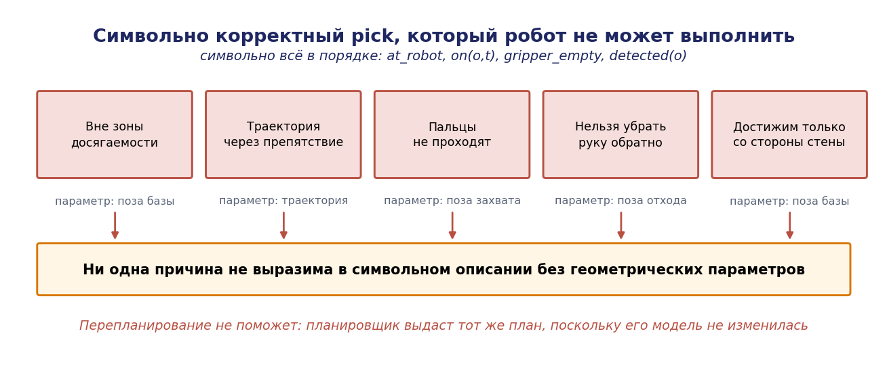
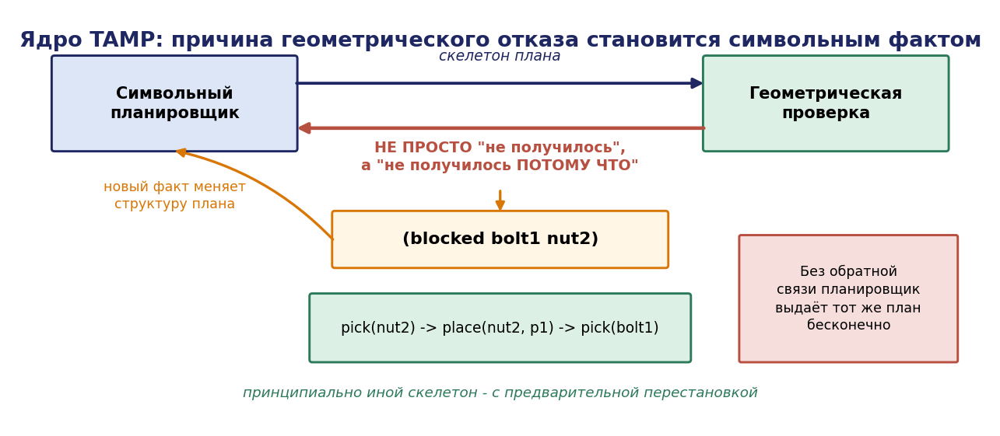
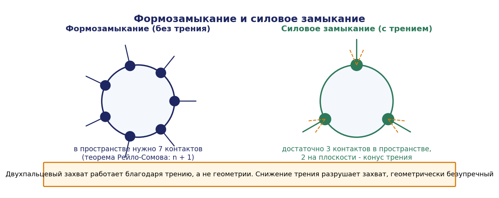
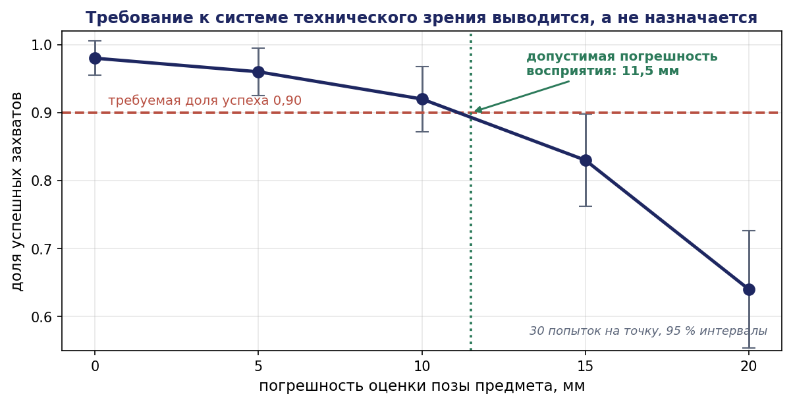

# Глава 11. Совместное планирование задач и движений (TAMP)

## 11.1. Введение: план, который нельзя выполнить

Планировщик из главы 10 работает в символьном мире. Действие `pick(bolt1, table1)` требует, чтобы робот находился у стола, захват был пуст, а предмет обнаружен. Все три условия — булевы, и планировщик их проверяет.


Но реальный захват возможен не всегда, даже когда все булевы условия истинны:

- предмет находится вне зоны досягаемости манипулятора при данном положении базы;
- существует конфигурация захвата, но траектория к ней проходит через препятствие;
- предмет стоит вплотную к другому, и пальцы захвата не проходят;
- предмет достижим, но после его взятия манипулятор не может вернуться в транспортное положение, не задев стойку;
- предмет достижим только с одной стороны, а с этой стороны робот не может встать из-за стены.

Ни одно из этих обстоятельств не выразимо в символьном описании без указания **геометрических параметров**. Символьный планировщик, ничего не знающий о геометрии, выдаст формально корректный план, который исполнитель не сможет выполнить. Перепланирование не поможет: планировщик выдаст тот же план, поскольку его модель не изменилась.

Эта ситуация — не редкий случай, а норма для мобильного манипулятора. Совместное планирование задач и движений (Task and Motion Planning, TAMP) есть класс методов, решающих символьную и геометрическую подзадачи **совместно**.




## 11.2. Постановка задачи

### 11.2.1. Гибридное пространство состояний

Состояние задачи TAMP есть пара

```math
s = (s_{\mathrm{disc}}, s_{\mathrm{cont}})
```

где $s_{\mathrm{disc}}$ — символьная часть (что где находится, что в захвате, что обработано), а $s_{\mathrm{cont}} \in \mathbb{R}^{d}$ — непрерывная часть: конфигурация робота $q \in Q$, позы объектов $p_1, \ldots, p_k \in \mathrm{SE}(3)$.

Действия параметризованы непрерывными величинами:

- `pick(o, g, q)` — взять объект $o$ захватом с относительной позой $g$ из конфигурации робота $q$;
- `place(o, p, q)` — поставить объект $o$ в позу $p$ из конфигурации $q$;
- `move(q₁, q₂, τ)` — переместиться из $q_1$ в $q_2$ по траектории $\tau$.

**Определение 11.1.** Задача TAMP есть задача поиска последовательности параметризованных действий $\langle a_1(\theta_1), \ldots, a_n(\theta_n)\rangle$, где $\theta_i$ — непрерывные параметры, такой что:

1. символьная проекция последовательности является корректным символьным планом;
2. для каждого действия существуют значения параметров, удовлетворяющие геометрическим ограничениям (достижимость, отсутствие коллизий, устойчивость);
3. параметры соседних действий согласованы (конфигурация после действия $i$ есть начальная для i+1).

Пространство поиска гибридно: дискретный выбор последовательности умножается на непрерывный выбор параметров. Именно это произведение делает задачу трудной.

### 11.2.2. Сложность

**Утверждение 11.1.** Задача TAMP не проще ни задачи планирования задач (PSPACE-полна, глава 10), ни задачи планирования движения (PSPACE-трудна по теореме Ривза–Шарира для манипулятора с $k$ звеньями). Более того, задача перестановки объектов на плоскости с целью освободить проход (Navigation Among Movable Obstacles) NP-трудна даже в простейшей постановке.

Практически это означает: полных и эффективных алгоритмов не существует, и все методы суть эвристические схемы взаимодействия символьного и геометрического уровней. Задача инженера — организовать это взаимодействие так, чтобы поиск сходился на реальных задачах.

## 11.3. Источники геометрической несовместимости

Систематизируем причины, по которым символьно корректное действие оказывается невыполнимым. Каждая порождает своё геометрическое ограничение и свой способ его учёта.

| Причина | Ограничение | Параметр, подлежащий выбору |
|---|---|---|
| Объект вне досягаемости | $\exists q: \mathrm{FK}(q) = \text{T_grasp}, q \in Q_{\mathrm{free}}$ | поза базы |
| Захват невозможен геометрически | $\exists g \in G(o)$: пальцы не пересекают среду | поза захвата $g$ |
| Нет траектории подхода | $\exists \tau \subset Q_{\mathrm{free}}$ от $q_0$ до $q$ | траектория |
| Некуда поставить | $\exists p$: устойчиво, без коллизий, в зоне | поза установки $p$ |
| Объект загорожен другим | требуется предварительное перемещение | последовательность и позы |
| Объект не виден | $\exists q_{\mathrm{view}}$: объект в поле зрения, не заслонён | поза наблюдения |
| После взятия нельзя убрать руку | $\exists \tau_{\mathrm{retreat}} \subset Q_{\mathrm{free}}$ | поза захвата и отхода |

Существенно, что все эти ограничения — **экзистенциальные**: требуется существование значения параметра. Проверка существования обычно выполняется выборкой (sampling): генерируется кандидат, проверяется на выполнимость, при неудаче генерируется следующий.

## 11.4. Архитектуры решателей

### 11.4.1. Последовательная схема: скелетон и параметры

Простейшая и наиболее употребительная схема разделяет поиск на два уровня.


```
1. Символьный планировщик строит план (скелетон) — последовательность
   действий без значений непрерывных параметров
2. Геометрический уровень пытается найти значения параметров,
   удовлетворяющие всем ограничениям скелетона
3. Успех — план готов
4. Неудача — вернуться к 1, потребовав другой скелетон
```

**Достоинство:** простота, повторное использование готовых планировщиков обоих типов.

**Недостаток:** символьный уровень не знает причины отказа и может выдавать один непригодный скелетон за другим. Если предмет физически недостижим, планировщик будет перебирать порядок операций, не понимая, что дело не в порядке.

Улучшение — **передача обратной связи**: причина геометрического отказа транслируется в новый символьный факт (например, `(blocked bolt1 bolt2)`), добавляемый в модель, после чего символьный планировщик строит принципиально иной скелетон — с предварительным перемещением препятствия.

Эта схема «геометрический отказ → новый символьный предикат» и есть практическое ядро TAMP.




### 11.4.2. Чередующаяся схема

Геометрическая проверка выполняется **по ходу** построения символьного плана: как только очередное действие добавлено, проверяется существование параметров. Отказ немедленно отсекает ветвь поиска.

Достоинство — раннее отсечение; недостаток — геометрическая проверка вызывается очень часто и становится узким местом. Применяется кеширование результатов проверок.

### 11.4.3. Схема PDDLStream

Наиболее развитая современная схема (Гаррет, Лозано-Перес, Каэльблинг). Идея: расширить PDDL понятием **потока** (stream) — процедуры, порождающей значения непрерывных параметров вместе с **сертификатом** их корректности.

Поток задаётся сигнатурой: вход, выход, порождаемые факты.

```
stream sample-grasp
  :inputs  (?o)
  :domain  (Object ?o)
  :outputs (?g)
  :certified (Grasp ?o ?g)

stream inverse-kinematics
  :inputs  (?o ?p ?g)
  :domain  (and (Pose ?o ?p) (Grasp ?o ?g))
  :outputs (?q ?t)
  :certified (and (Conf ?q) (Traj ?t) (Kin ?o ?p ?g ?q ?t))

stream sample-placement
  :inputs  (?o ?surface)
  :domain  (Stackable ?o ?surface)
  :outputs (?p)
  :certified (and (Pose ?o ?p) (Supported ?o ?p ?surface))

stream test-cfree-traj-pose
  :inputs  (?t ?o ?p)
  :domain  (and (Traj ?t) (Pose ?o ?p))
  :certified (CFreeTrajPose ?t ?o ?p)
```

Действие в домене использует сертифицированные факты как обычные предусловия:

```lisp
(:action pick
  :parameters (?o ?p ?g ?q ?t)
  :precondition (and (AtPose ?o ?p) (HandEmpty) (AtConf ?q)
                     (Kin ?o ?p ?g ?q ?t)
                     (forall (?o2 ?p2) (imply (AtPose ?o2 ?p2)
                                              (CFreeTrajPose ?t ?o2 ?p2))))
  :effect (and (AtGrasp ?o ?g) (not (AtPose ?o ?p)) (not (HandEmpty))))
```

**Адаптивный алгоритм.** Основная схема работы:

```
1. Оптимистично: считать, что все потоки могут породить нужные значения;
   построить символьный план, использующий «оптимистичные» объекты
2. Определить, какие потоки нужно фактически выполнить,
   чтобы конкретизировать план
3. Выполнить эти потоки (сгенерировать значения и проверить сертификаты)
4. Добавить полученные факты в базу
5. Если план конкретизирован полностью — вернуть его
6. Иначе — увеличить бюджет вызовов потоков и повторить
```

**Теорема 11.1 (вероятностная полнота).** Если потоки выборки вероятностно полны (при неограниченном числе вызовов порождают любое допустимое значение с вероятностью, стремящейся к 1), а символьный планировщик полон, то алгоритм PDDLStream вероятностно полон: вероятность найти решение стремится к 1 при увеличении числа вызовов потоков, если решение существует.

*Идея доказательства.* Пусть решение существует и использует конкретные значения параметров $\theta^{*}$. Для каждого $\theta^{*}_i$ соответствующий поток по предположению порождает значение из произвольно малой окрестности $\theta^{*}_i$ с вероятностью, стремящейся к 1 при росте числа вызовов. Ограничения задачи предполагаются робастными (выполняются в некоторой окрестности решения), поэтому достаточно попасть в окрестность. При достаточном числе вызовов все необходимые значения оказываются в базе фактов с вероятностью, близкой к 1; далее полный символьный планировщик находит план, использующий эти значения. ∎

**Замечание о робастности.** Предположение о том, что ограничения выполняются в окрестности решения, существенно и не всегда верно: задача «поставить деталь ровно в паз с зазором 0,05 мм» не робастна, и выборка её не решит. Такие задачи требуют не выборки, а решения оптимизационной задачи или использования податливости (compliance) при исполнении.

### 11.4.4. Оптимизационная схема

Альтернатива выборке: зафиксировать скелетон и решать задачу нелинейной оптимизации относительно всех непрерывных параметров сразу:

```math
\min \sum \lVert \text{параметры} \rVert \quad \text{при ограничениях: кинематика, коллизии, устойчивость, непрерывность}
```

Подход (Logic-Geometric Programming, Туссен) даёт гладкие и оптимальные по стоимости решения, естественно учитывает динамику и контакты, но требует хорошего начального приближения и чувствителен к локальным минимумам. Практически применяется в связке: выборка даёт начальное приближение, оптимизация улучшает.

## 11.5. Позиционирование мобильной базы

### 11.5.1. Постановка

Для мобильного манипулятора появляется параметр, отсутствующий у стационарного: **где поставить базу**. От него зависит достижимость объекта, и он же во многом определяет время выполнения миссии.

Наивный подход — подъехать к объекту на фиксированное расстояние — работает лишь для простых компоновок и систематически отказывает при работе у стены, в углу, при высоко или низко расположенных объектах.

### 11.5.2. Карта достижимости

**Определение 11.2.** Картой достижимости (reachability map) манипулятора называется отображение, сопоставляющее точке рабочего пространства (и, в полной версии, ориентации схвата) **индекс достижимости** — долю ориентаций, при которых существует решение обратной задачи кинематики без коллизий с собственным корпусом.

Карта строится один раз для данного манипулятора выборкой в пространстве конфигураций: генерируется множество конфигураций $q$, вычисляется прямая кинематика $\mathrm{FK}(q)$, результат накапливается в воксельной сетке.

**Определение 11.3.** Обратной картой достижимости (inverse reachability map) называется преобразование карты достижимости в систему координат объекта: для заданной целевой позы схвата она даёт распределение допустимых поз базы.

Алгоритм выбора позы базы:

```
1. Для целевой позы схвата T_grasp взять обратную карту достижимости
2. Наложить её на карту проходимости помещения
   (база должна стоять в свободном и достижимом месте)
3. Отсортировать кандидаты по индексу достижимости
   и по стоимости переезда
4. Проверять кандидатов по порядку: решить ОЗК, проверить коллизии,
   спланировать траекторию манипулятора
5. Вернуть первый успешный
```

Такой подход на порядок эффективнее случайной выборки поз базы: он сразу отсекает области, из которых объект недостижим при любой конфигурации манипулятора.

### 11.5.3. Совместная кинематика базы и манипулятора

Мобильный манипулятор избыточен: положение схвата определяется и базой, и суставами. Существуют два режима использования избыточности:

**Раздельный.** База позиционируется, затем фиксируется, работает только манипулятор. Просто, устойчиво, но требует точного позиционирования базы и не использует её подвижность для расширения рабочей зоны.

**Совместный.** База и манипулятор управляются как единая кинематическая цепь с якобианом

```math
J_{\mathrm{total}} = [ J_{\mathrm{base}} \mid J_{\mathrm{arm}} ], \quad \dot{x} = J_{\mathrm{total}} \cdot [ v_{\mathrm{base}}; \dot{q}_{\mathrm{arm}} ]
```

Избыточность разрешается псевдообращением с проекцией в нуль-пространство:

```math
[ v_{\mathrm{base}}; \dot{q}_{\mathrm{arm}} ] = J_{\mathrm{total}}^+ \cdot \dot{x}_{\mathrm{desired}} + (I - J_{\mathrm{total}}^+ J_{\mathrm{total}}) \cdot z
```

где $z$ — вектор вторичной задачи (удержание манипулятора вблизи центра рабочей зоны, избегание пределов суставов, минимизация движения базы).

Совместный режим даёт плавные движения и увеличивает достижимую зону, но чувствителен к погрешностям одометрии базы: ошибка положения базы напрямую переходит в ошибку положения схвата. Для точных операций применяется визуальная обратная связь по схвату (глава 12 в части оценки состояния), замыкающая контур помимо одометрии.

**Практический критерий выбора:** если требуемая точность позиционирования схвата сравнима с точностью локализации базы (единицы сантиметров), раздельный режим с визуальной доводкой предпочтителен; если требуется плавное движение по протяжённой траектории (сварка, нанесение), необходим совместный.

## 11.6. Планирование захвата

### 11.6.1. Замыкание

Захват должен удерживать объект. Формализуются два условия.


**Определение 11.4.** Множество контактов образует **силовое замыкание** (force closure), если контактные силы, допустимые по модели трения, способны уравновесить любой внешний винт сил и моментов.

**Определение 11.5.** Множество контактов образует **формозамыкание** (form closure), если объект удерживается геометрически, без опоры на трение: любое бесконечно малое движение объекта нарушает хотя бы одно контактное ограничение.

**Теорема 11.2 (Рейло — Сомов).** Для формозамыкания твёрдого тела с $n$ степенями свободы необходимо не менее n + 1 точечных контактов. Следовательно, на плоскости $(n = 3)$ требуется не менее 4 контактов, в пространстве $(n = 6)$ — не менее 7.

**Теорема 11.3.** При наличии кулоновского трения силовое замыкание достижимо существенно меньшим числом контактов: на плоскости достаточно двух контактов, в пространстве при точечных контактах с трением — трёх (при мягких контактах, передающих момент кручения, — двух).

*Комментарий.* Именно теорема 11.3 объясняет, почему двухпальцевый захват работает: он не обеспечивает формозамыкания, но при достаточном коэффициенте трения и правильно выбранных точках контакта даёт силовое замыкание. Отсюда же следует критичность материала губок и усилия сжатия: снижение трения разрушает захват, который геометрически «выглядит правильно».




### 11.6.2. Критерии качества захвата

Для выбора среди множества силозамкнутых захватов применяются метрики:


- **радиус наибольшего вписанного шара** в выпуклую оболочку контактных винтов (метрика Феррари–Кэннинга): характеризует наихудшее возмущение, которое захват выдержит;
- **угол конуса трения**: запас до проскальзывания;
- **удалённость от пределов суставов** и от сингулярностей;
- **устойчивость к погрешности позиционирования**: доля успешных захватов при возмущении позы на $\delta$.

Последняя метрика наиболее практична: она напрямую связывает планирование захвата с точностью восприятия. Если оценка позы предмета имеет погрешность 15 мм, следует выбирать захват, робастный к такому смещению, даже если он хуже по остальным метрикам.




### 11.6.3. Порождение кандидатов

| Метод | Требования | Применимость |
|---|---|---|
| База захватов по модели объекта | CAD-модель | известная номенклатура (пример Б) |
| Аналитический синтез по геометрии | сегментированная форма | простые формы (цилиндры, коробки) |
| Обучаемые модели (GPD, Dex-Net, Contact-GraspNet) | облако точек, обученная сеть | неизвестные объекты (пример А) |
| Эвристики по главным осям | облако точек | быстрый вариант для простых деталей |

Для примера А, где номенклатура ограничена (болты, гайки), практичен первый способ: для каждого типа предмета заранее задаётся набор относительных поз захвата с приоритетами, а планировщик выбирает первую геометрически допустимую.

## 11.7. Перестановка объектов

### 11.7.1. Постановка

Наиболее интересный класс задач TAMP: целевой объект недостижим, пока не убран другой. Требуется спланировать не только взятие цели, но и предварительные перемещения.

Формально: дано множество объектов $O$, требуется достичь целевой конфигурации; допускается перемещение любых объектов; минимизируется число перемещений или общее время.

**Утверждение 11.2.** Задача перестановки объектов на плоскости с целью достижения заданной конфигурации NP-трудна; задача навигации среди подвижных препятствий (NAMO) NP-трудна даже при одном перемещаемом препятствии в общей постановке.

### 11.7.2. Практический алгоритм

```
1. Попытаться выполнить целевое действие напрямую
2. При отказе — определить причину:
   найти объекты, пересекающиеся с траекторией подхода
   или с областью захвата (blocking set B)
3. Для каждого o ∈ B:
   найти свободную позу p', куда o можно переставить так, чтобы
   он не мешал ни целевому действию, ни другим запланированным
4. Рекурсивно: перестановка o может сама требовать освобождения места
5. Ограничить глубину рекурсии; при исчерпании — сообщить об отказе
```

Ключевые практические детали:

- **выбор позы для перестановки** должен учитывать не только текущее действие, но и последующие, иначе объект будет переставляться многократно;
- **ограничение глубины рекурсии** обязательно: без него алгоритм может уйти в бесконечное перекладывание;
- **кеширование** множеств блокирующих объектов ускоряет работу на порядок.

### 11.7.3. Разбор для примера А

**Ситуация.** На столе стоят три предмета: целевой болт `bolt1` в глубине, и перед ним две гайки `nut2`, `nut3`. Захват сверху для `bolt1` невозможен: пальцы задевают гайки; захват сбоку невозможен: мешает стенка стола.

**Ход решения.**

Шаг 1. Символьный план: `move(corridor, table1)`, `pick(bolt1, table1)`, … Геометрическая проверка `pick` отказывает.

Шаг 2. Анализ причины: проверка коллизий показывает пересечение траектории подхода с `nut2` и `nut3`. Порождается факт `(blocked bolt1 nut2)`, `(blocked bolt1 nut3)`.

Шаг 3. Символьный планировщик, получив новые факты и правило

```lisp
(:action pick
  :precondition (and ... (forall (?o2) (not (blocked ?o ?o2)))))
```

строит новый скелетон: `pick(nut2)`, `place(nut2, p₁)`, `pick(nut3)`, `place(nut3, p₂)`, `pick(bolt1)`, …

Шаг 4. Геометрический уровень выбирает позы $p_1, p_2$ выборкой из свободной поверхности стола с проверкой: (а) поза устойчива (центр масс над опорой); (б) объект не пересекает другие; (в) объект не попадает в зону подхода к `bolt1`; (г) объект остаётся в зоне досягаемости для последующего взятия (гайки тоже нужно собрать!).

Условие (г) — типичный пример дальновидности, отсутствующей в наивной реализации: без него гайки будут отставлены туда, откуда их придётся снова доставать с перестановкой.

Шаг 5. Полученный план исполним. Общее число действий выросло с 3 до 7, но задача решена.

**Экономический комментарий.** Если гайки в любом случае подлежат сбору, разумнее сначала собрать их (они и так на пути), а затем взять болт — то есть перестановка не нужна вовсе, достаточно правильного **порядка**. Такое решение находит планировщик, если стоимость перемещений включена в метрику: план с перестановкой стоит дороже плана с правильным порядком. Это иллюстрирует, почему в TAMP важна оптимизация по стоимости, а не только выполнимость.

## 11.8. Инструменты и интеграция

| Инструмент | Уровень | Особенности |
|---|---|---|
| PDDLStream | TAMP целиком | потоки, адаптивный алгоритм, PyBullet |
| MoveIt Task Constructor | TAMP для манипуляторов | стадии, генераторы, ROS 2 |
| MoveIt 2 | планирование движения | OMPL, CHOMP, STOMP, проверка коллизий |
| OMPL | планирование движения | RRT-Connect, PRM, RRT\*, BIT\* |
| Tesseract | планирование движения | траекторная оптимизация, промышленная направленность |
| GraspIt!, Dex-Net, GPD | захват | синтез и оценка захватов |
| Drake | оптимизационный TAMP | контактная динамика, LGP |

Для сквозного проекта курса в среде Webots практична схема: символьное планирование на pyperplan/Fast Downward, проверка достижимости и коллизий собственной реализацией (простая геометрия сцены позволяет обойтись без полноценного планировщика движения), карта достижимости манипулятора youBot строится офлайн выборкой.

## 11.9. Проектная методика

**Шаг 1. Определить, нужен ли TAMP.** Если геометрия сцены фиксирована и все действия заведомо выполнимы (пример Б: манипуляторы стационарны, позиции оснастки фиксированы), достаточно символьного планирования. TAMP нужен при подвижной базе, произвольном расположении объектов или тесной укладке.

**Шаг 2. Выделить непрерывные параметры действий.** Для каждого действия — что именно нужно выбрать: позу захвата, позу базы, позу установки, траекторию.

**Шаг 3. Определить геометрические предикаты.** Какие факты порождаются проверкой геометрии: `Kin`, `CFree`, `Supported`, `Blocked`, `Visible`.

**Шаг 4. Построить генераторы (потоки).** Для каждого параметра — процедура порождения кандидатов с проверкой. Порядок генерации существенно влияет на скорость: сначала дешёвые проверки (достижимость по карте), затем дорогие (планирование траектории).

**Шаг 5. Организовать обратную связь.** Причина геометрического отказа обязана транслироваться в символьный факт, иначе поиск зациклится.

**Шаг 6. Ограничить бюджет.** Число вызовов генераторов и глубина рекурсии перестановок ограничиваются; при исчерпании возвращается честный отказ, обрабатываемый исполнительной логикой (пометить объект недостижимым и продолжить миссию — требование R3 из главы 1).

**Шаг 7. Оценить робастность.** Выбранные параметры должны выдерживать погрешность восприятия и исполнения. Проверка: повторить план с возмущением поз объектов на величину погрешности и оценить долю успехов.

Шаг 7 особенно важен: план, найденный «впритык», в реальности не исполняется. Практическое правило — требовать запаса не менее удвоенной погрешности оценки позы по каждому геометрическому ограничению.

## 11.10. Выводы

1. Символьно корректный план может быть геометрически невыполним; перепланирование без изменения символьной модели не помогает, поскольку планировщик выдаст тот же план.
2. Задача TAMP имеет гибридное пространство поиска — произведение дискретного выбора последовательности на непрерывный выбор параметров; она не проще каждой из подзадач и потому решается эвристическими схемами.
3. Ядро практических методов — обратная связь «геометрический отказ → новый символьный предикат», порождающая принципиально иной скелетон плана.
4. Схема PDDLStream формализует эту идею через потоки, порождающие значения параметров вместе с сертификатами; при вероятностно полных потоках алгоритм вероятностно полон, но лишь для робастных задач.
5. Позиционирование мобильной базы решается обратной картой достижимости, что на порядок эффективнее случайной выборки поз.
6. Двухпальцевый захват работает благодаря силовому замыканию с трением (3 контакта в пространстве), а не формозамыканию (7 контактов); отсюда критичность трения и робастности захвата к погрешности позы.
7. Перестановка объектов NP-трудна; практический алгоритм требует ограничения глубины рекурсии, дальновидного выбора поз перестановки и учёта стоимости — иначе робот перекладывает предметы вместо выполнения задачи.
8. План должен иметь геометрический запас не менее удвоенной погрешности восприятия, иначе он неисполним на реальном оборудовании.

## 11.11. Контрольные вопросы

1. Приведите три причины, по которым символьно корректное действие `pick` может оказаться невыполнимым.
2. Почему простое перепланирование не решает проблему геометрической несовместимости?
3. В чём состоит основная идея передачи обратной связи от геометрического уровня к символьному?
4. Что такое поток в схеме PDDLStream и какую роль играет сертификат?
5. Сформулируйте условие вероятностной полноты и объясните, почему требуется робастность задачи.
6. Что такое обратная карта достижимости и как она используется при выборе позы базы?
7. Сравните раздельный и совместный режимы управления мобильным манипулятором. Когда какой предпочтителен?
8. Сколько контактов требуется для формозамыкания в пространстве и почему двухпальцевый захват всё же работает?
9. Какая метрика качества захвата наиболее важна при неточной оценке позы объекта и почему?
10. Почему при перестановке объектов важно учитывать последующие действия при выборе новой позы?

## 11.12. Задачи

**Задача 11.1.** Для youBot в Webots постройте карту достижимости манипулятора: выборкой по конфигурациям заполните воксельную сетку 5 см и визуализируйте индекс достижимости.

**Задача 11.2.** По карте из задачи 11.1 постройте обратную карту достижимости для захвата сверху и определите допустимую область поз базы для объекта на высоте 0,75 м.

**Задача 11.3.** Реализуйте проверку достижимости объекта как геометрический предикат и включите её в цикл планирования из задачи 10.9. Проверьте, что недостижимые объекты корректно исключаются из плана.

**Задача 11.4.** Постройте сцену, в которой целевой предмет загорожен двумя другими. Реализуйте алгоритм перестановки из раздела 11.7.2 и получите исполнимый план.

**Задача 11.5.** Для задачи 11.4 добавьте требование, чтобы загораживающие предметы также подлежали сбору. Сравните план с перестановкой и план с правильным порядком по числу действий и общему времени.

**Задача 11.6.** Реализуйте выбор позы установки объекта с проверкой устойчивости (центр масс над опорной областью) и отсутствия коллизий. Проверьте на сцене со стеснённой поверхностью.

**Задача 11.7.** Постройте для параллельного двухпальцевого захвата множество кандидатов для цилиндрической детали и упорядочьте их по робастности к смещению объекта на 10 мм. Проверьте лучший и худший экспериментально в симуляторе.

**Задача 11.8.** Оцените эмпирически вероятность успеха захвата как функцию погрешности оценки позы (0, 5, 10, 15, 20 мм) по 30 попыток на точку. Постройте график и определите допустимую погрешность восприятия для доли успеха 0,9.

**Задача 11.9.** Реализуйте схему PDDLStream (или её упрощённую версию) для примера А: потоки sample-grasp, inverse-kinematics, sample-placement, test-cfree. Сравните время решения с последовательной схемой «скелетон + параметры».

**Задача 11.10.** Проведите эксперимент по робастности: для найденного плана возмутите позы всех объектов на величину погрешности восприятия и оцените долю успешных исполнений за 20 прогонов. Сделайте вывод о достаточности геометрического запаса.

## 11.13. Литература к главе

1. Garrett C. R., Chitnis R., Holladay R., Kim B., Silver T., Kaelbling L. P., Lozano-Pérez T. Integrated Task and Motion Planning // Annual Review of Control, Robotics, and Autonomous Systems. — 2021. — Vol. 4. — P. 265–293.
2. Garrett C. R., Lozano-Pérez T., Kaelbling L. P. PDDLStream: Integrating Symbolic Planners and Blackbox Samplers via Optimistic Adaptive Planning // Proc. ICAPS, 2020. — P. 440–448.
3. Srivastava S., Fang E., Riano L., Chitnis R., Russell S., Abbeel P. Combined Task and Motion Planning Through an Extensible Planner-Independent Interface Layer // Proc. ICRA, 2014. — P. 639–646.
4. Toussaint M. Logic-Geometric Programming: An Optimization-Based Approach to Combined Task and Motion Planning // Proc. IJCAI, 2015. — P. 1930–1936.
5. Stilman M., Kuffner J. J. Navigation Among Movable Obstacles: Real-Time Reasoning in Complex Environments // International Journal of Humanoid Robotics. — 2005. — Vol. 2, No. 4. — P. 479–503.
6. Vahrenkamp N., Asfour T., Dillmann R. Robot Placement Based on Reachability Inversion // Proc. ICRA, 2013. — P. 1970–1975.
7. Bicchi A., Kumar V. Robotic Grasping and Contact: A Review // Proc. ICRA, 2000. — P. 348–353.
8. Ferrari C., Canny J. Planning Optimal Grasps // Proc. ICRA, 1992. — P. 2290–2295.
9. LaValle S. M. Planning Algorithms. — Cambridge University Press, 2006.
10. Mahler J. et al. Dex-Net 2.0: Deep Learning to Plan Robust Grasps // Proc. RSS, 2017.
