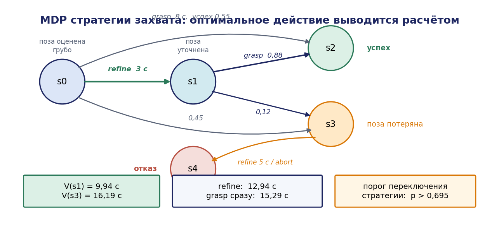
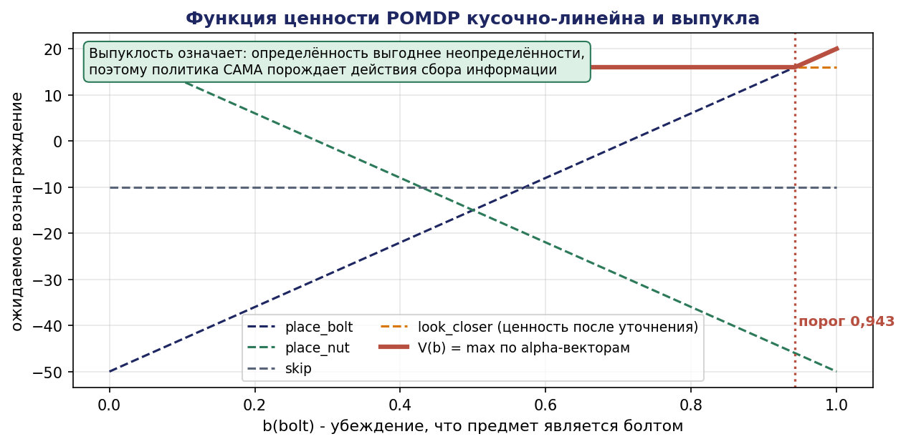
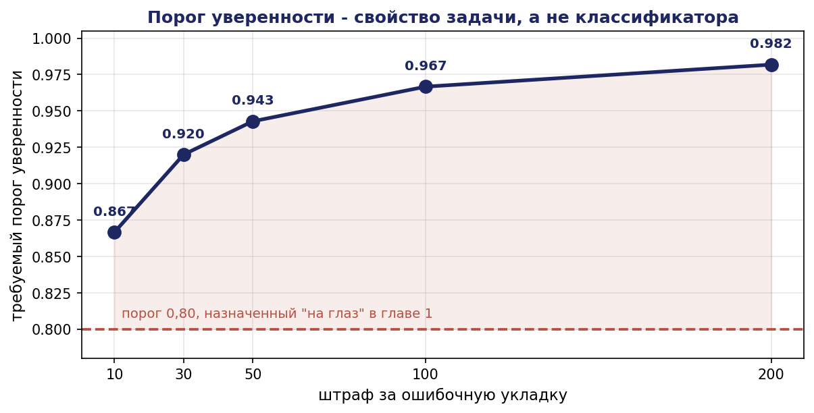
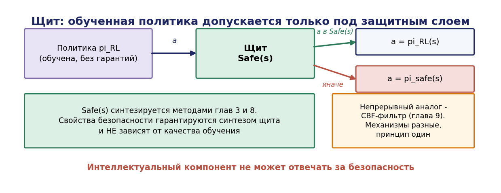

# Глава 12. Принятие решений при неопределённости

## 12.1. Введение: когда планировщик не знает состояния

Планирование глав 10 и 11 предполагало детерминированность: действие с известным предусловием даёт известный эффект, а текущее состояние мира известно точно. Оба предположения в РТК систематически нарушаются.

**Действие недетерминировано.** Захват срывается с вероятностью 0,1–0,3 в зависимости от объекта и точности позиционирования. Деталь перекашивается в патроне. Робот проскальзывает на неровности.

**Состояние наблюдается неполно.** Классификатор относит предмет к типу «болт» с уверенностью 0,72 — что означает, что предмет может оказаться и не болтом. Датчик наличия детали в захвате может ложно срабатывать. Положение объекта известно с погрешностью.

Детерминированный план в этих условиях либо срывается, либо требует непрерывного перепланирования, каждый раз игнорируя накопленную информацию. Нужен аппарат, в котором неопределённость является **частью модели**, а не помехой, а решение оптимизируется по математическому ожиданию.

Такой аппарат — марковские процессы принятия решений (MDP) и их обобщение на случай неполного наблюдения (POMDP). Настоящая глава излагает их теорию с доказательствами основных результатов, разбирает численные примеры и указывает границы применимости, включая границы применимости обучения с подкреплением в задачах управления комплексами.

## 12.2. Марковские процессы принятия решений

### 12.2.1. Определение

**Определение 12.1.** Марковским процессом принятия решений называется кортеж

```math
M = (S, A, T, R, \gamma)
```

где

- $S$ — конечное множество состояний;
- A — конечное множество действий, $A(s) \subseteq A$ — допустимые в состоянии $s$;
- $T : S \times A \times S \to [0{,}1]$ — функция переходов, $T(s, a, s') = P(s' \mid s, a), \sum_{s'} T(s,a,s') = 1$;
- $R : S \times A \to \mathbb{R}$ — функция вознаграждения (или, в задачах минимизации, стоимости);
- $\gamma \in [0, 1)$ — коэффициент дисконтирования.

**Марковское свойство:** распределение следующего состояния зависит только от текущего состояния и действия, но не от предыстории. Это предположение является **проектным решением**: если оно нарушено, состояние выбрано неудачно и должно быть расширено (например, включением числа уже совершённых попыток захвата).

**Политикой** называется отображение $\pi : S \to A$ (детерминированная стационарная политика) либо $\pi : S \to \Delta(A)$ (стохастическая).

**Ценностью** политики $\pi$ в состоянии $s$ называется ожидаемая дисконтированная сумма вознаграждений:

```math
V^{\pi}(s) = E[ \sum_{t=0}^{\infty} \gamma^t R(s_t, \pi(s_t)) \mid s_0 = s ]
```

Дисконтирование $\gamma < 1$ обеспечивает конечность суммы и выражает предпочтение раннего результата. Для задач с конечным горизонтом допустимо $\gamma = 1$.

### 12.2.2. Уравнения Беллмана

Ценность политики удовлетворяет системе линейных уравнений:

```math
V^{\pi}(s) = R(s, \pi(s)) + \gamma \cdot \sum_{s'} T(s, \pi(s), s') \cdot V^{\pi}(s')
```

Оптимальная ценность удовлетворяет уравнению оптимальности Беллмана:

```math
V^{*}(s) = \max_{a \in A(s)} [ R(s,a) + \gamma \cdot \sum_{s'} T(s,a,s') \cdot V^{*}(s') ]
```

Оптимальная политика извлекается из $V^{*}$:

```math
\pi^{*}(s) = \arg \max_{a \in A(s)} [ R(s,a) + \gamma \cdot \sum_{s'} T(s,a,s') \cdot V^{*}(s') ]
```

### 12.2.3. Оператор Беллмана и сходимость

Определим оператор $B : \mathbb{R}^{\lvert S\rvert} \to \mathbb{R}^{\lvert S\rvert}$:

```math
(\mathrm{BV})(s) = \max_{a} [ R(s,a) + \gamma \cdot \sum_{s'} T(s,a,s') \cdot V(s') ]
```

**Лемма 12.1 (сжимаемость).** Оператор B является сжатием в норме максимума с коэффициентом $\gamma$:

```math
\lVert \mathrm{BV}_1 - \mathrm{BV}_2\rVert_\infty \le \gamma \cdot \lVert V_1 - V_2\rVert_\infty
```

*Доказательство.* Зафиксируем $s$. Обозначим $Q_i(s,a) = R(s,a) + \gamma \sum_{s'}T(s,a,s')V_i(s'), i = 1{,}2$. Пусть $a_1 = \arg \max_a Q_1(s,a)$. Тогда

```math
\begin{gathered} (\mathrm{BV}_1)(s) - (\mathrm{BV}_2)(s) = Q_1(s,a_1) - \max_a Q_2(s,a) \le Q_1(s,a_1) - Q_2(s,a_1) \cr = \gamma \cdot \sum_{s'} T(s,a_1,s') \cdot [ V_1(s') - V_2(s') ] \cr \le \gamma \cdot \sum_{s'} T(s,a_1,s') \cdot \lVert V_1 - V_2\rVert_\infty = \gamma \cdot \lVert V_1 - V_2\rVert_\infty \end{gathered}
```

(последнее равенство — из нормировки распределения). Симметричным рассуждением получаем оценку для $(\mathrm{BV}_2)(s) - (\mathrm{BV}_1)(s)$. Взяв максимум по $s$, получаем утверждение. ∎

**Теорема 12.1 (существование и единственность).** Оператор B имеет единственную неподвижную точку $V^{*}$, и для любого начального $V_0$ последовательность $V_{k+1} = \mathrm{BV}_k$ сходится к $V^{*}$ геометрически:

```math
\lVert V_k - V^{*}\rVert_\infty \le \gamma^k \cdot \lVert V_0 - V^{*}\rVert_\infty
```

*Доказательство.* Пространство $(\mathbb{R}^{\lvert S\rvert}, \lVert \cdot \rVert_\infty)$ полно. По лемме 12.1 оператор B — сжатие с коэффициентом $\gamma < 1$. По теореме Банаха о неподвижной точке существует единственная $V^{*}$ с BV* = V*, и итерации сходятся к ней с указанной оценкой. ∎

**Теорема 12.2 (оптимальность детерминированной стационарной политики).** Существует детерминированная стационарная политика $\pi^{*}$, оптимальная одновременно для всех начальных состояний: $V^{\pi^{*}}(s) = V^{*}(s)$ для всех $s$.

*Доказательство.* Определим $\pi^{*}(s) = \arg \max_a [R(s,a) + \gamma \sum_{s'}T(s,a,s')V^{*}(s')]$. Тогда $V^{*}$ удовлетворяет уравнению для $V^{\pi^{*}}$, а поскольку это уравнение (линейная система с матрицей $I - \gamma T_{\pi^{*}}$, обратимой при $\gamma < 1$) имеет единственное решение, $V^{\pi^{*}} = V^{*}$. Оптимальность следует из того, что $V^{*}$ — максимум по всем политикам, что доказывается индукцией по горизонту с предельным переходом. ∎

Теорема 12.2 имеет важное практическое следствие: **не нужно искать зависящие от времени или случайные политики** — оптимум достигается на простейшем классе. Реализация политики есть таблица «состояние → действие».

### 12.2.4. Алгоритмы

**Итерация по ценности (value iteration).**

```
V ← произвольное (обычно 0)
повторять
    для каждого s:
        V'(s) ← max_a [ R(s,a) + γ Σ_{s'} T(s,a,s') V(s') ]
    δ ← ‖V' − V‖_∞;  V ← V'
пока δ > ε(1−γ)/(2γ)
π(s) ← arg max_a [ R(s,a) + γ Σ_{s'} T(s,a,s') V(s') ]
```

**Утверждение 12.1 (критерий останова).** Если $\lVert V_{k+1} - V_k\rVert_\infty < \varepsilon(1-\gamma)/(2\gamma)$, то $\lVert V_{k+1} - V^{*}\rVert_\infty < \varepsilon /2$, и извлечённая политика $\varepsilon$-оптимальна.

*Доказательство.* Из сжимаемости: $\lVert V_{k+1} - V^{*}\rVert = \lVert \mathrm{BV}_k - \mathrm{BV}^{*}\rVert \le \gamma \lVert V_k - V^{*}\rVert \le \gamma(\lVert V_k - V_{k+1}\rVert + \lVert V_{k+1} - V^{*}\rVert)$, откуда $(1-\gamma)\lVert V_{k+1} - V^{*}\rVert \le \gamma \lVert V_k - V_{k+1}\rVert$ и $\lVert V_{k+1} - V^{*}\rVert \le \gamma \lVert V_k-V_{k+1}\rVert /(1-\gamma)$. Подстановка условия даёт оценку. ∎

**Итерация по политике (policy iteration).**

```
π ← произвольная
повторять
    // оценка политики: решить линейную систему
    V^π = (I − γ T_π)^{-1} R_π
    // улучшение политики
    π'(s) ← arg max_a [ R(s,a) + γ Σ_{s'} T(s,a,s') V^π(s') ]
пока π' ≠ π
```

**Теорема 12.3 (конечная сходимость).** Итерация по политике сходится к оптимальной политике за конечное число шагов, не превосходящее числа детерминированных стационарных политик |A|^{|S|}; на практике — за единицы итераций.

*Доказательство.* Покажем монотонность: $V^{\pi '} \ge V^{\pi}$ покомпонентно. По построению $\pi '$ для каждого $s: R(s,\pi '(s)) + \gamma \Sigma T(s,\pi '(s),s')V^{\pi}(s') \ge R(s,\pi(s)) + \gamma \Sigma T(s,\pi(s),s')V^{\pi}(s') = V^{\pi}(s)$. Обозначив $B_{\pi '}$ оператор Беллмана для фиксированной политики $\pi '$, имеем $B_{\pi '}V^{\pi} \ge V^{\pi}$. Применяя монотонный оператор $B_{\pi '}$ повторно и переходя к пределу ($B_{\pi '}$ — сжатие с неподвижной точкой $V^{\pi '}$), получаем $V^{\pi '} = \lim B_{\pi '}^k V^{\pi} \ge V^{\pi}$.

Улучшение строго, если $\pi ' \ne \pi$ и $\pi$ не оптимальна. Так как множество политик конечно и ценность строго возрастает, повторений не бывает, и алгоритм завершается за конечное число шагов. ∎

Сравнение: итерация по ценности дешевле на шаг $O(\lvert S\rvert^2\lvert A\rvert)$, но требует больше шагов; итерация по политике дороже на шаг (решение линейной системы $O(\lvert S\rvert^3)$), но сходится за единицы итераций. Для задач масштаба РТК (сотни состояний) обе применимы.

### 12.2.5. Численный пример: стратегия захвата

Робот обнаружил предмет. Состояния:


- $s_0$ — предмет обнаружен, поза оценена грубо;
- $s_1$ — поза уточнена;
- $s_2$ — предмет в захвате (терминальное, успех);
- $s_3$ — предмет сдвинут при неудачном захвате, поза потеряна;
- $s_4$ — отказ, предмет помечен недоступным (терминальное).

Действия и их модель:

| Состояние | Действие | Исходы (вероятности) | Стоимость |
|---|---|---|---|
| $s_0$ | `refine` (уточнить позу камерой) | $s_1 (1{,}0)$ | 3 с |
| $s_0$ | `grasp` (захват сразу) | $s_2 (0{,}55), s_3 (0{,}45)$ | 8 с |
| $s_0$ | `abort` | $s_4 (1{,}0)$ | 0 (штраф 60) |
| $s_1$ | `grasp` | $s_2 (0{,}88), s_3 (0{,}12)$ | 8 с |
| $s_1$ | `abort` | $s_4 (1{,}0)$ | 0 (штраф 60) |
| $s_3$ | `refine` | $s_1 (0{,}8), s_3 (0{,}2)$ | 5 с |
| $s_3$ | `abort` | $s_4 (1{,}0)$ | 0 (штраф 60) |

Минимизируем ожидаемое время; штраф за отказ 60 с эквивалентен «отказаться дороже, чем потратить минуту». Возьмём $\gamma = 1$ (эпизодическая задача с терминальными состояниями), $V(s_2) = 0, V(s_4) = 60$.

Уравнения:

```math
\begin{gathered} V(s_1) = \min \lbrace 8 + 0{,}88\cdot 0 + 0{,}12\cdot V(s_3); \quad 60 \rbrace \cr V(s_3) = \min \lbrace 5 + 0{,}8\cdot V(s_1) + 0{,}2\cdot V(s_3); \quad 60 \rbrace \cr V(s_0) = \min \lbrace 3 + V(s_1); \quad 8 + 0{,}55\cdot 0 + 0{,}45\cdot V(s_3); \quad 60 \rbrace \end{gathered}
```

Решим первые два совместно, предполагая, что `abort` неоптимален:

```math
\begin{gathered} V(s_1) = 8 + 0{,}12\cdot V(s_3) \cr V(s_3) = 5 + 0{,}8\cdot V(s_1) + 0{,}2\cdot V(s_3) \quad \implies \quad 0{,}8\cdot V(s_3) = 5 + 0{,}8\cdot V(s_1) \quad \implies \quad V(s_3) = 6{,}25 + V(s_1) \end{gathered}
```

Подставляя: $V(s_1) = 8 + 0{,}12\cdot(6{,}25 + V(s_1)) = 8 + 0{,}75 + 0{,}12\cdot V(s_1)$

```math
0{,}88\cdot V(s_1) = 8{,}75 \implies \boldsymbol{V(s_1) = 9{,}943 \text{ с }}, \boldsymbol{V(s_3) = 16{,}193 \text{ с }}
```

Проверка: обе меньше 60, предположение верно.

Теперь $V(s_0)$:

- `refine` затем действовать: 3 + 9,943 = **12,943 с**
- `grasp` сразу: $8 + 0{,}45\cdot 16{,}193 = 8 + 7{,}287 =$ **15,287 с**
- `abort`: 60 с

Оптимально **уточнить позу**, несмотря на дополнительные 3 секунды: разница в ожидаемом времени 2,34 с в пользу уточнения.

**Анализ чувствительности** — важнейшая часть работы с моделью. Найдём, при какой вероятности успеха прямого захвата $p$ прямой захват станет выгоднее:

```math
8 + (1 - p)\cdot 16{,}193 < 12{,}943 \implies(1 - p)\cdot 16{,}193 < 4{,}943 \implies 1 - p < 0{,}3053 \implies p > 0{,}695
```

Итак, если прямой захват удаётся с вероятностью выше 0,70, уточнение излишне. Это **конкретный порог для инженерного решения**: измерив долю успешных захватов без уточнения, можно обоснованно включать или отключать этап уточнения, а не решать вопрос интуитивно.

Аналогично исследуется зависимость от стоимости уточнения: при времени уточнения $t_r$ прямой захват выгоднее при $t_r > 15{,}287 - 9{,}943 = 5{,}34$ с. То есть ускорение камеры и обработки имеет смысл лишь до этого предела.




## 12.3. Частично наблюдаемые процессы (POMDP)

### 12.3.1. Определение

**Определение 12.2.** Частично наблюдаемым марковским процессом принятия решений называется кортеж

```math
P = (S, A, T, R, \Omega, O, \gamma)
```

где $S, A, T, R, \gamma$ — как в $\mathrm{MDP}, \Omega$ — конечное множество наблюдений, а $O : S \times A \times \Omega \to [0{,}1]$ — функция наблюдения, $O(s', a, o) = P(o \mid s', a)$.

Агент не наблюдает состояние, а получает наблюдение, статистически связанное с состоянием.

### 12.3.2. Убеждение как достаточная статистика

**Определение 12.3.** Убеждением (belief) называется распределение вероятностей на множестве состояний: $b \in \Delta(S), b(s) = P$(s | история).

**Обновление убеждения** по формуле Байеса при совершении действия $a$ и получении наблюдения $o$:

```math
b'(s') = \eta \cdot O(s', a, o) \cdot \sum_{s \in S} T(s, a, s') \cdot b(s)
```

где $\eta$ — нормировочный множитель:

```math
\eta = 1 / \sum_{s''} [ O(s'', a, o) \cdot \sum_s T(s,a,s'') \cdot b(s) ]
```

**Теорема 12.4 (достаточность убеждения).** Убеждение $b_t$ является достаточной статистикой истории $(a_0,o_1,a_1,o_2,\ldots,a_{t-1},o_t)$: оптимальная политика может быть представлена как функция убеждения, $\pi : \Delta(S) \to A$, без потери оптимальности.

*Доказательство (схема).* Достаточно показать, что процесс $\lbrace b_t \rbrace$ марковский и что вознаграждение выражается через $b$. Марковость: из формулы обновления видно, что $b_{t+1}$ есть детерминированная функция от $(b_t, a_t, o_{t+1})$, а распределение $o_{t+1}$ зависит только от $(b_t, a_t)$:

```math
P(o \mid b, a) = \sum_{s'} O(s',a,o) \cdot \sum_s T(s,a,s')\cdot b(s)
```

Ожидаемое вознаграждение: $\rho(b, a) = \sum_s b(s)\cdot R(s,a)$. Следовательно, $(\Delta(S), A, \tau, \rho, \gamma)$, где $\tau$ — индуцированное распределение переходов между убеждениями, есть MDP («belief-MDP»), и по теореме 12.2 для него существует оптимальная стационарная детерминированная политика. Всякая политика исходного POMDP индуцирует политику belief-MDP с той же ценностью и обратно. ∎

Практическое следствие: POMDP сводится к MDP с непрерывным пространством состояний $\Delta(S)$ — симплексом размерности $\lvert S\rvert - 1$. Сведение точное, но пространство стало непрерывным, что и составляет основную трудность.

### 12.3.3. Структура функции ценности

**Теорема 12.5 (Смолвуд и Сондик, 1973).** Функция оптимальной ценности POMDP с конечным горизонтом кусочно-линейна и выпукла по убеждению: существует конечное множество векторов $\Gamma \subset \mathbb{R}^{\lvert S\rvert}$ ($\alpha$-векторов) такое, что


```math
V(b) = \max_{\alpha \in \Gamma} \langle \alpha, b \rangle = \max_{\alpha \in \Gamma} \sum_s \alpha(s)\cdot b(s)
```

*Доказательство (индукция по горизонту).*

База, горизонт $1: V_1(b) = \max_a \sum_s b(s)R(s,a) = \max_a \langle R_a, b\rangle$ — максимум конечного числа линейных функций, значит кусочно-линейная выпуклая функция с $\Gamma_1 = \lbrace R_a : a \in A \rbrace$.

Шаг. Пусть $V_k(b) = \max_{\alpha \in \Gamma_k} \langle \alpha, b\rangle$. Тогда

```math
V_{k+1}(b) = \max_a [ \langle R_a, b\rangle + \gamma \cdot \sum_{o} P(o \mid b,a) \cdot V_k(b^{a,o}) ]
```

Подставим определение $b^{a,o}$ и P(o|b,a). Заметим, что произведение $P(o \mid b,a)\cdot \langle \alpha, b^{a,o}\rangle$ раскрывается как линейная по $b$ функция: нормировочный множитель сокращается,

```math
P(o \mid b,a) \cdot \langle \alpha, b^{a,o}\rangle = \sum_{s'} \alpha(s')\cdot O(s',a,o)\cdot \sum_s T(s,a,s')\cdot b(s) = \langle g^{a,o}_\alpha, b \rangle,
```

где $g^{a,o}_\alpha(s) = \sum_{s'} \alpha(s')\cdot O(s',a,o)\cdot T(s,a,s')$ — вектор, не зависящий от $b$. Следовательно,

```math
V_{k+1}(b) = \max_a [ \langle R_a, b\rangle + \gamma \cdot \sum_o \max_{\alpha \in \Gamma_k} \langle g^{a,o}_\alpha, b \rangle]
```

Максимум и сумма конечного числа линейных функций сохраняют кусочную линейность и выпуклость; новое множество $\alpha$-векторов строится как

```math
\Gamma_{k+1} = \lbrace R_a + \gamma \cdot \sum_o g^{a,o}_{\alpha_o} : a \in A, (\alpha_o)_{o \in \Omega} \in \Gamma_k^{\lvert \Omega \rvert} \rbrace \blacksquare
```

**Следствие 12.1 (комбинаторный рост).** $\lvert \Gamma_{k+1}\rvert \le \lvert A\rvert \cdot \lvert \Gamma_k\rvert^{\lvert \Omega \rvert}$. Число $\alpha$-векторов растёт дважды экспоненциально по горизонту.

Именно этот рост делает точное решение POMDP непрактичным.

**Содержательный смысл выпуклости.** Выпуклость V означает, что определённость выгоднее неопределённости: ценность в «чистом» убеждении (вероятность 1 на одном состоянии) не меньше, чем в смеси. Отсюда следует важное свойство оптимальных политик POMDP: они **автоматически включают действия сбора информации**, даже если те не приносят непосредственного вознаграждения. Робот сам решит подъехать и посмотреть внимательнее, если это уменьшит неопределённость достаточно, чтобы окупить затраченное время. Это качественное отличие от детерминированного планирования, где действие наблюдения нужно предусматривать вручную.




### 12.3.4. Сложность

**Теорема 12.6.** Задача нахождения оптимальной политики POMDP с конечным горизонтом PSPACE-полна. Для бесконечного горизонта задача проверки существования политики с ценностью не ниже заданной **неразрешима**.

Из этого следует, что практические методы — исключительно приближённые.

### 12.3.5. Приближённые методы

**QMDP.** Предполагается, что после одного шага состояние станет полностью наблюдаемым:

```math
Q_{\mathrm{MDP}}(b, a) = \sum_s b(s) \cdot Q^{*}_{\mathrm{MDP}}(s, a)
```

Вычисляется мгновенно (решается обычный MDP), но **не порождает действий сбора информации**: считая, что неопределённость сама исчезнет, метод не видит смысла её уменьшать. Пригоден там, где неопределённость и так быстро разрешается, и категорически непригоден в задачах активного восприятия.

**Точечные методы (point-based): PBVI, HSVI, SARSOP.** Функция ценности аппроксимируется $\alpha$-векторами только в конечном множестве достижимых убеждений $B \subset \Delta(S)$. Обновление выполняется в этих точках, число $\alpha$-векторов ограничено $\lvert B\rvert$. SARSOP дополнительно направляет выборку убеждений в область, достижимую при оптимальной политике, что резко повышает эффективность.

**Онлайн-методы: POMCP, DESPOT.** Поиск по дереву методом Монте-Карло (MCTS) в пространстве историй; убеждение представляется набором частиц. Не строят глобальную политику, а решают задачу «здесь и сейчас» с заданным бюджетом времени. Наиболее практичны для робототехники: масштабируются на большие пространства состояний, естественно работают с непрерывными наблюдениями через частицы.

**Практическая рекомендация для РТК.** Уровень миссии — точечные методы (SARSOP) при $\lvert S\rvert$ до нескольких тысяч; уровень тактических решений в реальном времени — онлайн-поиск (POMCP/DESPOT) с бюджетом 50–200 мс.

## 12.4. Разбор: POMDP для распознавания и захвата

### 12.4.1. Постановка

Робот примера А видит предмет, но не уверен в его типе. Типы: `bolt`, `nut`, `other`. Уложить предмет в неверный контейнер — ошибка с высокой стоимостью.

**Состояния:** $S = \lbrace \mathit{bolt}, \mathit{nut}, \mathit{other} \rbrace \times \lbrace \text{on_table}, \mathit{held}, \text{placed_correct}, \text{placed_wrong} \rbrace$. Для изложения ограничимся типом: S = {bolt, nut, other}, наблюдения дают информацию о типе.

**Действия:**
- `look` — наблюдать с текущего ракурса (0,5 с);
- `look_closer` — подъехать и наблюдать с близкого расстояния (4 с);
- `place_bolt` — уложить в контейнер болтов;
- `place_nut` — уложить в контейнер гаек;
- `skip` — пропустить предмет.

**Наблюдения:** $\Omega = \lbrace \text{obs_bolt}, \text{obs_nut}, \text{obs_other} \rbrace$.

**Модель наблюдения** (матрица ошибок классификатора):

`look` (дальний ракурс):

| Истинный \ Наблюдение | $\text{obs_bolt}$ | $\text{obs_nut}$ | $\text{obs_other}$ |
|---|---|---|---|
| bolt | 0,70 | 0,20 | 0,10 |
| nut | 0,20 | 0,70 | 0,10 |
| other | 0,15 | 0,15 | 0,70 |

`look_closer` (ближний ракурс):

| Истинный \ Наблюдение | $\text{obs_bolt}$ | $\text{obs_nut}$ | $\text{obs_other}$ |
|---|---|---|---|
| bolt | 0,94 | 0,04 | 0,02 |
| nut | 0,04 | 0,94 | 0,02 |
| other | 0,03 | 0,03 | 0,94 |

**Вознаграждения:** верная укладка +20; неверная укладка $-50$ (нужно доставать и перекладывать); пропуск целевого предмета $-10$; пропуск постороннего 0; стоимость наблюдений: `look` $-0{,}5$, `look_closer` $-4$.

### 12.4.2. Вычисление обновления убеждения

Начальное убеждение (априорное, по частоте предметов на столе): $b_0 = (0{,}4; 0{,}4; 0{,}2)$.

Выполнено `look`, получено `obs_bolt`. Обновление:

```math
P(\text{obs_bolt}) = 0{,}4\cdot 0{,}70 + 0{,}4\cdot 0{,}20 + 0{,}2\cdot 0{,}15 = 0{,}28 + 0{,}08 + 0{,}03 = 0{,}39
```

```math
\begin{gathered} b_1(\mathit{bolt}) = 0{,}4\cdot 0{,}70 / 0{,}39 = 0{,}28/0{,}39 = \boldsymbol{0{,}718} \cr b_1(\mathit{nut}) = 0{,}4\cdot 0{,}20 / 0{,}39 = 0{,}08/0{,}39 = \boldsymbol{0{,}205} \cr b_1(\mathit{other}) = 0{,}2\cdot 0{,}15 / 0{,}39 = 0{,}03/0{,}39 = \boldsymbol{0{,}077} \end{gathered}
```

**Оценим действие `place_bolt` при $b_1$:**

```math
E[R \mid \text{place_bolt}] = 0{,}718\cdot 20 + 0{,}205\cdot(-50) + 0{,}077\cdot(-50) = 14{,}36 - 10{,}25 - 3{,}85 = \boldsymbol{0{,}26}
```

Положительно, но едва: ожидаемая выгода 0,26 при возможном штрафе 50.

**Оценим `look_closer` с последующей укладкой.** Наиболее вероятное наблюдение — `obs_bolt`:

```math
P(\text{obs_bolt} \mid b_1, \text{look_closer}) = 0{,}718\cdot 0{,}94 + 0{,}205\cdot 0{,}04 + 0{,}077\cdot 0{,}03 = 0{,}675 + 0{,}0082 + 0{,}0023 = 0{,}685
```

```math
b_2(\mathit{bolt}) = 0{,}675/0{,}685 = \boldsymbol{0{,}985}; \quad b_2(\mathit{nut}) = 0{,}0082/0{,}685 = 0{,}012; \quad b_2(\mathit{other}) = 0{,}0034
```

```math
E[R \mid \text{place_bolt} \text{ при } b_2] = 0{,}985\cdot 20 + 0{,}015\cdot(-50) = 19{,}70 - 0{,}75 = \boldsymbol{18{,}95}
```

При наблюдении `obs_nut` (вероятность $0{,}718\cdot 0{,}04 + 0{,}205\cdot 0{,}94 + 0{,}077\cdot 0{,}03 = 0{,}0287+0{,}1927+0{,}0023 = 0{,}224$):

```math
\begin{gathered} b_2'(\mathit{nut}) = 0{,}1927/0{,}224 = 0{,}860; b_2'(\mathit{bolt}) = 0{,}128; b_2'(\mathit{other}) = 0{,}010 \cr E[R \mid \text{place_nut}] = 0{,}860\cdot 20 - 0{,}140\cdot 50 = 17{,}2 - 7{,}0 = 10{,}2 \end{gathered}
```

При наблюдении `obs_other` (вероятность $0{,}718\cdot 0{,}02 + 0{,}205\cdot 0{,}02 + 0{,}077\cdot 0{,}94 = 0{,}0144+0{,}0041+0{,}0724 = 0{,}0909$):

```math
b_2''(\mathit{other}) = 0{,}0724/0{,}0909 = 0{,}796; \text{ лучшее действие } \text{ — } \texttt{skip}, E[R] = 0{,}796\cdot 0 + 0{,}204\cdot(-10) = -2{,}04
```

**Ожидаемая ценность действия `look_closer`:**

```math
\begin{gathered} E[V] = -4 + 0{,}685\cdot 18{,}95 + 0{,}224\cdot 10{,}2 + 0{,}0909\cdot(-2{,}04) \cr = -4 + 12{,}98 + 2{,}28 - 0{,}19 = \boldsymbol{11{,}07} \end{gathered}
```

Сравнение при $b_1$: `place_bolt` даёт 0,26; `look_closer` даёт **11,07**. Разница более чем сорокакратная.

### 12.4.3. Выводы из расчёта

1. **Уверенность 0,72 недостаточна** для действия со штрафом 50. Интуитивно «72 % — довольно много», а расчёт показывает, что ожидаемая выгода почти нулевая.


2. **Дополнительное наблюдение окупается** многократно, несмотря на затрату 4 секунд. Ценность информации здесь — около 11 единиц вознаграждения.

3. **Порог принятия решения выводится, а не назначается.** Найдём, при какой уверенности $b(\mathit{bolt}) = \beta$ прямая укладка становится не хуже дополнительного наблюдения. Приблизительно (считая, что после `look_closer` укладка почти всегда верна и даёт $\approx 20$):

```math
20\beta - 50(1-\beta) \ge -4 + 20 \implies 70\beta \ge 66 \implies \beta \ge \boldsymbol{0{,}943}
```

То есть при данных стоимостях укладывать без уточнения следует лишь при уверенности выше 0,94. Это конкретный проектный порог, заменяющий произвольно выбранное «0,8» из контракта навыка в главе 1 — и, как видим, произвольный выбор был существенно занижен.

4. **Пороги зависят от стоимостей.** Если штраф за ошибку снизить до $-10$ (перекладывание дёшево), порог падает: $20\beta - 10(1-\beta) \ge 16 \implies 30\beta \ge 26 \implies \beta \ge 0{,}867$. Если поднять до $-200: 20\beta - 200(1-\beta) \ge 16 \implies 220\beta \ge 216 \implies \beta \ge 0{,}982$.

Последний пункт — главный методический вывод главы: **пороги уверенности не являются свойством классификатора, они являются свойством задачи**. Один и тот же детектор в задаче с дешёвой ошибкой и в задаче с дорогой ошибкой должен применяться с разными порогами, и эти пороги вычисляются, а не подбираются.




## 12.5. Связь с другими моделями курса

**С GSPN (глава 5).** Стохастическая сеть Петри описывает систему без управления: интенсивности заданы. MDP добавляет выбор. Существуют модели «управляемых стохастических сетей Петри», в которых часть переходов управляема — это в точности MDP, заданный в сетевой нотации.

**С надёжностью (глава 16).** Модель отказов и восстановлений с выбором стратегии обслуживания есть MDP: состояния — режимы работоспособности, действия — «работать», «проводить обслуживание», «остановить», вознаграждение — производительность минус стоимость обслуживания. Оптимальная политика даёт **обоснованный график обслуживания** вместо назначенного по регламенту.

**С безопасностью (глава 9).** Оптимальная политика MDP не гарантирует безопасности: она оптимизирует ожидание, а редкое катастрофическое событие мало влияет на ожидание. Поэтому MDP-политика обязана работать **под защитным слоем**, а не вместо него. Формально это выражается концепцией **щита** (shielding): защитный автомат, синтезированный методами глав 3 и 8, отфильтровывает небезопасные действия до того, как они будут применены.

## 12.6. Обучение с подкреплением: место и границы

### 12.6.1. Что это меняет

Обучение с подкреплением (RL) решает ту же задачу MDP, но **без известной модели** $T$ и $R$: агент учится на взаимодействии. Это привлекательно, когда модель неизвестна или слишком сложна (контактная динамика, деформируемые объекты).

### 12.6.2. Ограничения в задачах РТК

**Требование к объёму данных.** Современные алгоритмы требуют от $10^5$ до $10^8$ взаимодействий. На реальном комплексе это неосуществимо: $10^6$ захватов при 10 с на попытку — 116 суток непрерывной работы. Обучение ведётся в симуляции, что переносит проблему в область разрыва sim-to-real (глава 17).

**Отсутствие гарантий.** Обученная политика не сопровождается доказательством свойств. Проверить её так же, как автомат (глава 7), невозможно из-за размерности; тестирование даёт статистическую, а не логическую гарантию.

**Непредсказуемость вне обучающего распределения.** При входных данных, не встречавшихся при обучении, поведение произвольно. Для классического алгоритма можно указать область корректности; для обученной политики — нет.

**Проблема задания вознаграждения.** Формулировка функции вознаграждения, порождающей желаемое поведение, оказывается не проще прямого программирования этого поведения, а ошибки в ней приводят к неожиданным стратегиям («reward hacking»).

**Отсутствие объяснимости.** При приёмке комплекса требуется обосновать поведение системы; «сеть так научилась» обоснованием не является.

### 12.6.3. Где RL уместен

- **Низкоуровневые навыки с трудномоделируемой физикой:** вставка детали с зазором, манипуляция деформируемыми объектами, локальная адаптация усилия. Здесь модель действительно неизвестна, а область применения узка и легко ограничивается.
- **Настройка параметров** существующих алгоритмов (коэффициенты регулятора, пороги) вместо порождения поведения с нуля.
- **Оптимизация диспетчерских решений** в симуляции, где ошибка не приводит к аварии, а результат проверяется статистически.

### 12.6.4. Обязательное условие: щит

**Принцип.** Обученная политика допускается в комплекс только под защитным слоем, независимо от неё гарантирующим безопасность.


Формально: пусть $\pi_{RL}$ — обученная политика, а Shield — синтезированный автомат, для каждого состояния выдающий множество безопасных действий Safe(s). Исполняется

```math
a = \pi_{RL}(s), \text{ если } a \in \mathrm{Safe}(s); \text{ иначе } a = \pi_{\mathrm{safe}}(s)
```

Свойства безопасности при этом гарантируются синтезом щита (главы 3, 8) и не зависят от качества обучения. Непрерывный аналог — CBF-фильтр (глава 9), корректирующий выход политики.

Этот принцип есть частный случай сформулированного в главе 1 требования независимости защитного слоя, и он не подлежит обсуждению при проектировании комплекса: **интеллектуальный компонент не может отвечать за безопасность**.




## 12.7. Инструменты

| Инструмент | Назначение |
|---|---|
| POMDPs.jl (Julia) | единый интерфейс MDP/POMDP, решатели SARSOP, POMCP, QMDP |
| pomdp-py (Python) | POMDP-моделирование и онлайн-решатели |
| APPL / SARSOP | эталонная реализация точечного метода |
| PRISM, Storm | вероятностная проверка моделей (PCTL), синтез стратегий |
| MDPtoolbox | классические алгоритмы MDP |
| Stable-Baselines3 | обучение с подкреплением |

Инструменты вероятностной проверки моделей (PRISM, Storm) заслуживают отдельного упоминания: они позволяют не только найти оптимальную политику, но и **доказать вероятностные свойства** вида «вероятность аварии за смену не превышает $10^{-6}$», что напрямую используется в обосновании безопасности (глава 16).

## 12.8. Выводы

1. Неопределённость в РТК является частью задачи, а не помехой; детерминированный план в её присутствии либо срывается, либо непрерывно перестраивается, не используя накопленную информацию.
2. MDP формализует выбор при недетерминированных действиях; оператор Беллмана есть сжатие с коэффициентом $\gamma$, что даёт существование, единственность и геометрическую сходимость итерации по ценности.
3. Оптимум достигается на детерминированной стационарной политике, реализуемой таблицей «состояние → действие»; итерация по политике сходится за конечное число шагов.
4. Убеждение является достаточной статистикой истории, что сводит POMDP к MDP на симплексе; функция ценности кусочно-линейна и выпукла, а число $\alpha$-векторов растёт дважды экспоненциально.
5. Выпуклость функции ценности означает, что оптимальная политика POMDP **сама порождает** действия сбора информации — качественное отличие от детерминированного планирования.
6. Точное решение POMDP неразрешимо для бесконечного горизонта; практичны точечные методы (SARSOP) и онлайн-поиск (POMCP, DESPOT).
7. Пороги уверенности выводятся из стоимостей ошибок, а не назначаются: один и тот же классификатор в задачах с разной ценой ошибки требует разных порогов.
8. Обучение с подкреплением применимо к узким низкоуровневым навыкам с трудномоделируемой физикой и обязательно работает под независимым защитным слоем (щит или CBF-фильтр).

## 12.9. Контрольные вопросы

1. Что означает марковское свойство и что делать, если оно нарушено?
2. Докажите сжимаемость оператора Беллмана. Где используется нормировка распределения переходов?
3. Почему достаточно рассматривать детерминированные стационарные политики?
4. Сравните итерацию по ценности и итерацию по политике по стоимости шага и числу шагов.
5. Выведите формулу обновления убеждения и объясните роль нормировочного множителя.
6. Докажите кусочную линейность и выпуклость функции ценности POMDP.
7. Какой содержательный вывод следует из выпуклости функции ценности?
8. Почему метод QMDP не порождает действий сбора информации?
9. Почему порог уверенности является свойством задачи, а не классификатора?
10. Сформулируйте принцип щита и объясните, почему он не подлежит обсуждению.

## 12.10. Задачи

**Задача 12.1.** Решите MDP из раздела 12.2.5 итерацией по ценности численно $(\gamma = 0{,}99)$. Сравните с аналитическим решением.

**Задача 12.2.** Проведите анализ чувствительности: постройте графики оптимального действия в $s_0$ как функции (а) вероятности успеха прямого захвата, (б) времени уточнения, (в) штрафа за отказ.

**Задача 12.3.** Расширьте MDP, добавив состояние «предмет упал со стола» и действие «поднять с пола». Как изменилась оптимальная политика?

**Задача 12.4.** Реализуйте итерацию по политике и сравните число итераций с итерацией по ценности на задаче 12.1.

**Задача 12.5.** Постройте POMDP из раздела 12.4 в pomdp-py или POMDPs.jl. Решите методом SARSOP и сравните полученную политику с ручным расчётом.

**Задача 12.6.** Определите порог уверенности для укладки при штрафах $-10, -50, -200$ численно, решая POMDP. Сравните с аналитическими оценками раздела 12.4.3.

**Задача 12.7.** Постройте POMDP, в котором оптимальная политика включает подъезд для наблюдения. Покажите на графике функции ценности (для $\lvert S\rvert = 2$ её можно построить в координатах $b(s_1)$), какие $\alpha$-векторы соответствуют информационным действиям.

**Задача 12.8.** Постройте MDP обслуживания станка (состояния: исправен, деградирует, отказал; действия: работать, обслуживать, ремонтировать). Найдите оптимальную политику и сравните с регламентным обслуживанием через фиксированный интервал.

**Задача 12.9.** В PRISM постройте модель ячейки с вероятностями отказов и проверьте свойство «вероятность простоя более 10 минут за смену не превышает 0,05».

**Задача 12.10.** Реализуйте щит для политики выбора действий в примере А: синтезируйте множество безопасных действий по методу главы 3 и подключите фильтр. Продемонстрируйте, что при попытке политики выбрать небезопасное действие оно подменяется безопасным.

## 12.11. Литература к главе

1. Puterman M. L. Markov Decision Processes: Discrete Stochastic Dynamic Programming. — Wiley, 1994.
2. Kaelbling L. P., Littman M. L., Cassandra A. R. Planning and Acting in Partially Observable Stochastic Domains // Artificial Intelligence. — 1998. — Vol. 101. — P. 99–134.
3. Smallwood R. D., Sondik E. J. The Optimal Control of Partially Observable Markov Processes over a Finite Horizon // Operations Research. — 1973. — Vol. 21, No. 5. — P. 1071–1088.
4. Kurniawati H., Hsu D., Lee W. S. SARSOP: Efficient Point-Based POMDP Planning by Approximating Optimally Reachable Belief Spaces // Proc. RSS, 2008.
5. Silver D., Veness J. Monte-Carlo Planning in Large POMDPs // Proc. NeurIPS, 2010. — P. 2164–2172.
6. Thrun S., Burgard W., Fox D. Probabilistic Robotics. — MIT Press, 2005.
7. Sutton R. S., Barto A. G. Reinforcement Learning: An Introduction. 2nd ed. — MIT Press, 2018.
8. Alshiekh M., Bloem R., Ehlers R., Könighofer B., Niekum S., Topcu U. Safe Reinforcement Learning via Shielding // Proc. AAAI, 2018. — P. 2669–2678.
9. Kwiatkowska M., Norman G., Parker D. PRISM 4.0: Verification of Probabilistic Real-Time Systems // Proc. CAV, 2011. — P. 585–591.
10. Papadimitriou C. H., Tsitsiklis J. N. The Complexity of Markov Decision Processes // Mathematics of Operations Research. — 1987. — Vol. 12, No. 3. — P. 441–450.
