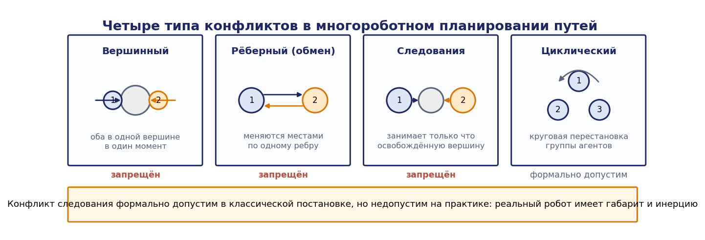
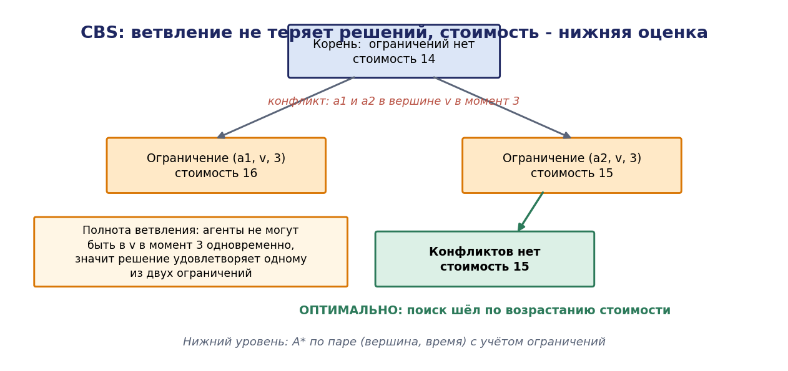
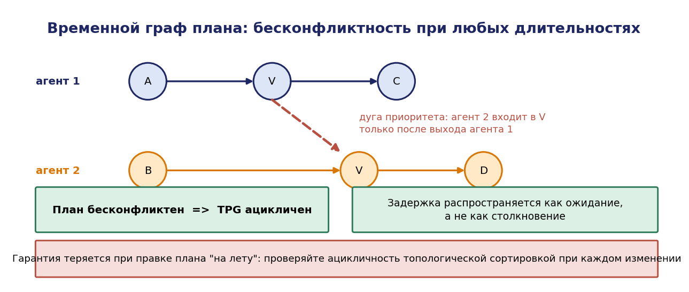
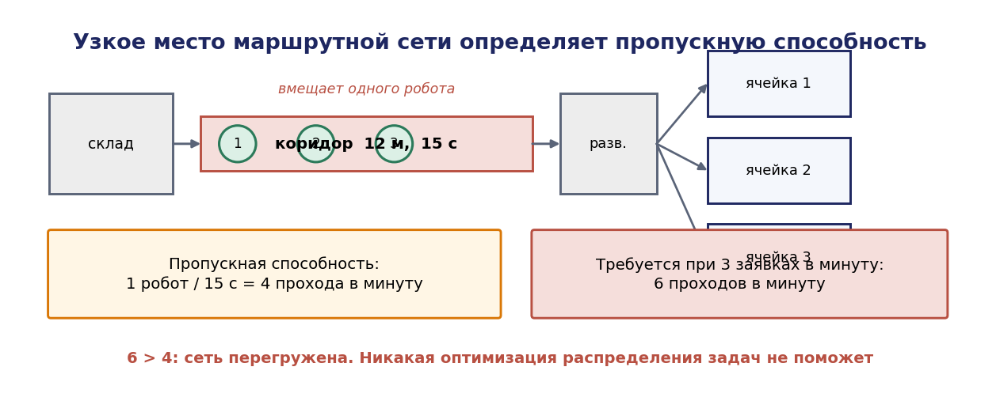

# Глава 13. Координация нескольких роботов в комплексе

## 13.1. Введение: две задачи координации

Комплекс, содержащий более одного активного робота, порождает две новые задачи, отсутствовавшие в предыдущих главах.

**Кто что делает** — задача распределения задач (task allocation). Имеется множество задач и множество роботов с разными возможностями и разным текущим положением. Требуется назначение, минимизирующее суммарное время, время завершения последней задачи или иной критерий.

**Как не мешать друг другу** — задача бесконфликтного движения. Роботы разделяют физическое пространство: коридоры, перекрёстки, зоны перегрузки. Индивидуально оптимальные маршруты приводят к столкновениям и заторам.

Эти задачи связаны: распределение, не учитывающее заторов, порождает планы, которые невозможно исполнить без задержек; маршрутизация, не учитывающая назначений, оптимизирует не то, что нужно. Практические системы решают их либо последовательно с обратной связью, либо совместно.

Предыдущие главы дали часть аппарата: глава 3 — синтез логики взаимного исключения, глава 4 — структурные условия отсутствия тупиков, глава 10 — планирование задач, глава 12 — решения при неопределённости. Настоящая глава добавляет специфические методы многороботных систем.

## 13.2. Таксономия задач распределения

### 13.2.1. Классификация Джерки и Матарич

Систематизация задач MRTA (Multi-Robot Task Allocation) строится по трём осям.

**По числу задач на робота:**
- **ST** (single-task): робот выполняет одну задачу одновременно;
- **MT** (multi-task): робот может выполнять несколько задач одновременно.

**По числу роботов на задачу:**
- **SR** (single-robot): задача выполняется одним роботом;
- **MR** (multi-robot): задача требует нескольких роботов (совместный перенос длинномера, сборка двумя манипуляторами).

**По горизонту планирования:**
- **IA** (instantaneous assignment): назначаются только текущие задачи, будущее не учитывается;
- **TA** (time-extended assignment): учитывается вся известная последовательность задач.

Восемь комбинаций различаются вычислительной сложностью радикально.

| Класс | Постановка | Сложность | Метод |
|---|---|---|---|
| ST-SR-IA | оптимальное назначение | полиномиальная, $O(n^3)$ | венгерский алгоритм |
| ST-MR-IA | разбиение множества (set partitioning) | NP-трудная | комбинаторные аукционы, эвристики |
| MT-SR-IA | покрытие множества | NP-трудная | жадные алгоритмы |
| ST-SR-TA | расписание с маршрутами | NP-трудная (обобщает VRP) | эвристики, аукционы с пакетами |
| MT-MR-TA | общий случай | NP-трудная | декомпозиция |

Первая строка — единственный случай, решаемый точно и быстро. Практический вывод: **сводите задачу к ST-SR-IA, если это возможно**. Часто достаточно решать задачу назначения повторно по мере поступления задач, вместо построения полного расписания.

### 13.2.2. Применение к сквозным примерам

**Пример А** с несколькими роботами-сборщиками: ST-SR-TA (каждый робот берёт по одному предмету, но последовательность важна) — задача типа маршрутизации транспорта.

**Пример Б**: два манипулятора обслуживают станок — ST-SR-IA с ограничениями по возможностям ($M_1$ обслуживает вход, $M_2$ выход); AMR доставляет паллеты — ST-SR-TA.

**Совместный перенос** длинной заготовки двумя манипуляторами — MR-задача, требующая не только назначения, но и синхронизации движений.

## 13.3. Централизованное распределение: задача о назначениях

### 13.3.1. Постановка

Даны $n$ роботов и $n$ задач; $c_{ij}$ — стоимость выполнения задачи $j$ роботом $i$ (время переезда плюс время выполнения). Требуется найти назначение (перестановку) $\sigma$, минимизирующее суммарную стоимость:

```math
\min \sum_{i=1}^{n} c_{i,\sigma(i)}
```

В форме линейного программирования:

$\min \sum_{i,j} c_{ij} x_{ij}$
при  $\sum_j x_{ij} = 1 \forall i, \quad \sum_i x_{ij} = 1 \forall j, \quad x_{ij} \ge 0$

**Утверждение 13.1.** Матрица ограничений задачи о назначениях вполне унимодулярна, поэтому оптимум линейной релаксации достигается в целочисленной точке, и решение ЛП автоматически даёт допустимое назначение.

Это объясняет, почему задача решается точно за полиномиальное время, тогда как близкие по виду задачи (набора, разбиения) NP-трудны.

### 13.3.2. Венгерский алгоритм

**Алгоритм 13.1 (Кун, Манкрес).**

```
1. Из каждой строки вычесть её минимум
2. Из каждого столбца вычесть его минимум
3. Покрыть все нули минимальным числом линий (строк и столбцов)
4. Если число линий = n — оптимальное назначение существует
   среди нулей; извлечь его (паросочетание в двудольном графе)
5. Иначе: найти минимальный непокрытый элемент m;
   вычесть m из всех непокрытых элементов,
   прибавить m к элементам, покрытым дважды;
   вернуться к шагу 3
```

**Теорема 13.1 (корректность).** Венгерский алгоритм находит назначение минимальной суммарной стоимости за $O(n^3)$ операций.

*Обоснование.* Вычитание константы из строки или столбца изменяет стоимость всякого допустимого назначения на одну и ту же величину, поэтому не меняет оптимального назначения (шаги 1, 2, 5 сохраняют множество оптимумов). После шагов 1–2 все элементы неотрицательны, и всякое назначение, целиком состоящее из нулей, имеет нулевую стоимость в преобразованной матрице, то есть оптимально. Существование такого назначения эквивалентно существованию совершенного паросочетания в двудольном графе нулей, что по теореме Кёнига эквивалентно тому, что минимальное вершинное покрытие имеет размер $n$ — это и проверяется на шаге 3. Шаг 5 создаёт новые нули, сохраняя допустимость двойственного решения; процесс конечен, поскольку сумма двойственных переменных строго возрастает. ∎

**Пример.** Три AMR и три задачи вывоза; матрица времён (с):

| | Задача 1 | Задача 2 | Задача 3 |
|---|---|---|---|
| AMR 1 | 40 | 62 | 55 |
| AMR 2 | 58 | 45 | 71 |
| AMR 3 | 66 | 53 | 48 |

Жадное назначение по строкам: AMR1 → З1 (40), AMR2 → З2 (45), AMR3 → З3 (48); сумма 133. В данном случае жадный ответ совпал с оптимальным, но так бывает не всегда.

Изменим матрицу: пусть $c_{11} = 40, c_{12} = 41, c_{13} = 90; c_{21} = 39, c_{22} = 80, c_{23} = 85; c_{31} = 70, c_{32} = 75, c_{33} = 60$. Жадный алгоритм по минимуму: AMR2→З1 (39), затем AMR1→З2 (41), затем AMR3→З3 (60); сумма 140. Венгерский алгоритм: проверим альтернативу AMR1→З1 (40), AMR2→? — З2 (80) или З3 (85): 40+80+60 = 180 хуже. Оптимум действительно 140. Однако при $c_{33} = 95$: жадный даёт 39+41+95 = 175; альтернатива AMR1→З2 (41), AMR2→З1 (39), AMR3→З3 (95) — та же; попробуем AMR3→З1 (70), AMR2→? Разбор показывает, что жадный алгоритм в общем случае может ошибаться сколь угодно сильно, и его применение оправдано лишь как быстрое приближение.

### 13.3.3. Обобщения

- **Прямоугольная матрица** (роботов больше задач или наоборот) — дополняется фиктивными строками/столбцами с нулевой стоимостью.
- **Несовместимые пары** (робот не может выполнить задачу) — стоимость $+\infty$.
- **Критерий минимакса** (минимизировать время завершения последней задачи, а не сумму) — задача о «бутылочном горлышке», решается бинарным поиском по порогу с проверкой существования паросочетания.

Различие критериев существенно: минимизация суммы даёт эффективное использование ресурсов, минимизация максимума — быстрое завершение всей партии. В производстве обычно важен второй.

## 13.4. Децентрализованное распределение: аукционы

### 13.4.1. Мотивация

Централизованное решение требует полной информации в одном узле и его отказоустойчивости. Для парка AMR, работающего в цеху с ненадёжной связью, это неприемлемо. Аукционные механизмы дают распределённое решение с малым обменом.

### 13.4.2. Аукцион одного предмета

```
1. Аукционист объявляет задачу
2. Каждый робот вычисляет свою ставку (обычно −стоимость выполнения)
3. Ставки собираются; задача достаётся роботу с лучшей ставкой
4. Победитель обновляет своё состояние
```

Обмен: $O(n)$ сообщений на задачу. Роль аукциониста может выполнять любой робот или сама задача (при широковещании).

### 13.4.3. Последовательный жадный аукцион

Задачи выставляются по одной; каждый робот учитывает уже выигранные им задачи при расчёте ставки (маржинальная стоимость).

**Теорема 13.2 (гарантия качества).** Для критерия минимизации суммарной стоимости при субмодулярной функции стоимости пакета последовательный жадный аукцион даёт решение, не хуже чем вдвое отличающееся от оптимального.

*Комментарий.* Субмодулярность («убывающая отдача»: добавление задачи к большему набору увеличивает стоимость не меньше, чем к меньшему) выполняется для многих естественных функций стоимости маршрута. Доказательство следует общей схеме анализа жадных алгоритмов для субмодулярных функций.

Для критерия минимакса гарантии слабее и в общем случае отсутствуют.

### 13.4.4. Комбинаторные аукционы

Роботы делают ставки на **пакеты** задач, что позволяет учесть синергию: «эти три задачи по пути, вместе они стоят меньше суммы по отдельности».

Задача выбора победителей (winner determination) есть задача о разбиении множества и NP-трудна. Практически применяется ограничение размера пакетов или эвристики.

### 13.4.5. Консенсусный алгоритм с пакетами (CBBA)

Наиболее употребительный распределённый алгоритм. Работает в две фазы, повторяющиеся до сходимости.

**Фаза 1 (построение пакета).** Каждый робот жадно добавляет к своему пакету задачу, дающую наибольший прирост полезности, пока не исчерпан лимит.

**Фаза 2 (консенсус).** Роботы обмениваются с соседями векторами «победитель задачи» и «выигрышная ставка» и разрешают конфликты по фиксированным правилам, основанным на сравнении ставок и меток времени.

**Теорема 13.3 (сходимость).** При субмодулярности функции полезности и связном графе связи алгоритм CBBA сходится за не более чем $\max(N_t, N_r\cdot L_t)$ итераций консенсуса ($N_t$ — число задач, $N_r$ — роботов, $L_t$ — размер пакета) и даёт решение с гарантией не менее 50 % от оптимума.

Практические свойства: не требует центрального узла, устойчив к задержкам связи и к появлению новых задач, естественно обрабатывает отказ робота (его задачи освобождаются и переторговываются).

### 13.4.6. Сравнение

| Критерий | Централизованное | Аукцион | CBBA |
|---|---|---|---|
| Оптимальность | точная (ST-SR-IA) | 2-приближение | $\ge 50 \text{%}$ |
| Требования к связи | все со всеми, через центр | звезда | связность соседства |
| Устойчивость к отказу | отказ центра критичен | отказ аукциониста критичен | нет единой точки отказа |
| Динамика | требует пересчёта | естественная | естественная |
| Вычислительная нагрузка | на центре | распределена | распределена |
| Прозрачность для оператора | высокая | средняя | низкая |

Последняя строка недооценивается в литературе, но существенна в производстве: диспетчер должен понимать, почему задача досталась именно этому роботу. Централизованное решение объяснимо, распределённое — существенно хуже.

**Практическая рекомендация для цеха:** централизованное распределение на уровне MES с периодом секунды-десятки секунд, распределённые механизмы — только для быстрого локального разрешения конфликтов и как резерв при отказе центра.

## 13.5. Многороботное планирование путей (MAPF)

### 13.5.1. Постановка

Дан граф $G = (V, E)$, моделирующий рабочее пространство (вершины — позиции, рёбра — допустимые переходы), и $k$ агентов с начальными вершинами $s_i$ и целевыми $g_i$. Время дискретно; на каждом шаге агент либо переходит по ребру, либо остаётся на месте.


Требуется найти набор путей без конфликтов. Типы конфликтов:

- **вершинный**: два агента в одной вершине в один момент времени;
- **рёберный (обмен)**: два агента меняются местами по одному ребру;
- **следования**: агент занимает вершину, только что освобождённую другим (недопустимо при инерции и погрешности исполнения);
- **циклический**: группа агентов совершает круговую перестановку (допустим в теории, труден при исполнении).

Критерии: **сумма стоимостей** (sum of costs) или **макспан** (время последнего прибытия).




### 13.5.2. Сложность

**Теорема 13.4 (Ю, Лавалль, 2013).** Задача оптимального MAPF (по любому из указанных критериев) NP-трудна.

При этом задача **существования** решения на графах определённого вида решается за полиномиальное время; практическая трудность — именно в оптимальности.

### 13.5.3. Приоритетное планирование

Простейший практический метод.

```
1. Упорядочить агентов по приоритету
2. Для каждого агента по порядку:
   спланировать путь, рассматривая пути уже спланированных агентов
   как динамические препятствия (занятость вершины во времени)
```

**Свойства:** быстро ($k$ вызовов планирования на графе с временным измерением), просто. **Неполно**: существуют задачи с решением, для которых приоритетное планирование его не находит.

**Классический контрпример.** Узкий коридор длины 1 (одна вершина ширины), два агента должны поменяться местами, находясь по разные стороны коридора, при наличии единственного кармана-разъезда. При неудачном порядке приоритетов первый агент занимает коридор, второй не имеет пути. Решение существует (первый заезжает в карман, пропускает второго), но приоритетный метод его не находит, так как первый агент планирует без учёта второго.

Улучшения: перебор порядков приоритетов, динамическое изменение приоритетов при конфликте.

### 13.5.4. Поиск по дереву конфликтов (CBS)

Полный и оптимальный алгоритм, ставший стандартом.


**Двухуровневая схема.**

**Верхний уровень** ведёт поиск по дереву ограничений. Каждый узел содержит множество ограничений вида «агент $a$ не может занимать вершину $v$ в момент $t$» и набор путей, удовлетворяющих этим ограничениям.

```
корень: пустое множество ограничений; пути — индивидуально оптимальные
повторять:
    выбрать узел с наименьшей стоимостью
    найти первый конфликт в его решении
    если конфликтов нет — вернуть решение (оптимально)
    иначе для конфликта ⟨a_i, a_j, v, t⟩ породить двух потомков:
        потомок 1: ограничение (a_i, v, t), перепланировать путь a_i
        потомок 2: ограничение (a_j, v, t), перепланировать путь a_j
```

**Нижний уровень** — планирование пути одного агента на графе с временным измерением (A\* по (вершина, время)) с учётом наложенных ограничений.

**Теорема 13.5 (полнота и оптимальность CBS).** CBS находит оптимальное решение, если оно существует, и сообщает о его отсутствии в противном случае.

*Доказательство (схема).* Обозначим через $N$ узел дерева с множеством ограничений $C(N)$. Ключевое наблюдение: множество всех допустимых решений задачи разбивается ветвлением без потерь — всякое бесконфликтное решение либо удовлетворяет ограничению $(a_i, v, t)$, либо ограничению $(a_j, v, t)$, поскольку оба агента не могут находиться в $v$ в момент $t$. Следовательно, если решение существует, оно принадлежит поддереву хотя бы одного из потомков (**свойство полноты ветвления**).

Стоимость узла есть сумма стоимостей путей, оптимальных при данных ограничениях; она является нижней оценкой стоимости любого решения в поддереве (добавление ограничений может только увеличить стоимость). Верхний уровень ведёт поиск по стоимости в порядке возрастания (best-first). Значит, первый найденный узел без конфликтов имеет стоимость, не превосходящую стоимости любого решения, то есть оптимален. ∎

**Практические усиления:** приоритизация конфликтов (разрешать сначала «кардинальные», гарантированно увеличивающие стоимость), метарассуждения, симметрия-разрушающие ограничения, разбиение на непересекающиеся группы (Meta-Agent CBS). С ними CBS решает задачи с сотнями агентов.




### 13.5.5. Сравнение методов

| Метод | Полнота | Оптимальность | Масштаб | Применение |
|---|---|---|---|---|
| Приоритетное планирование | нет | нет | сотни агентов | быстрое решение, простые топологии |
| CBS | да | да | десятки–сотни | плотные сцены, оптимизация |
| ECBS (ограниченно-субоптимальный) | да | $w$-приближение | сотни | компромисс |
| Push-and-Rotate, BIBOX | да | нет | сотни | гарантия решения на связных графах |
| Reservation table (роллинг) | нет | нет | тысячи | склады, непрерывный поток |

## 13.6. Исполнение планов и управление трафиком

### 13.6.1. Проблема исполнения

План MAPF предполагает синхронное дискретное время: все агенты делают шаг одновременно. Реальные роботы движутся с разной и переменной скоростью, задерживаются, тормозят перед людьми. Наивное исполнение плана «по расписанию» приводит к столкновениям: агент, задержавшийся на шаг, оказывается там, где по плану уже должен быть другой.

### 13.6.2. Временной граф плана (TPG)

Решение — преобразовать план в **граф приоритетов**, сохраняющий порядок прохождения вершин, но не абсолютное время.


**Определение 13.1.** Временным графом плана называется ациклический орграф, вершинами которого служат события «агент $i$ прибыл в вершину $v$», а дугами — два типа зависимостей:

- **дуги маршрута**: события одного агента в порядке его пути;
- **дуги приоритета**: если по плану агент $i$ занимает вершину $v$ раньше агента $j$, добавляется дуга «$i$ покинул $v$» → «$j$ прибыл в $v$».

**Теорема 13.6.** Если исходный план бесконфликтен, то TPG ацикличен, и любое исполнение, соблюдающее порядок дуг, бесконфликтно независимо от фактических длительностей движений.

*Доказательство.* Бесконфликтность плана означает, что для каждой вершины $v$ определён строгий порядок её занятия агентами; дуги приоритета отражают этот порядок. Цикл в TPG означал бы циклическую зависимость: агент $i$ ждёт j, j ждёт k, …, k ждёт $i$. Такая зависимость требовала бы, чтобы в исходном плане агент $i$ занимал вершину и раньше, и позже другого агента по цепочке, что противоречит линейности временной шкалы плана. Значит, TPG ацикличен, и существует топологический порядок исполнения. Соблюдение всех дуг гарантирует, что агент входит в вершину только после того, как предыдущий её покинул, — то есть конфликтов нет при любых длительностях. ∎

**Инженерное значение.** TPG превращает жёсткое расписание в **робастную дисциплину исполнения**: задержка одного робота не порождает столкновений, а лишь распространяется как ожидание. Это точный аналог перехода от фиксированного расписания к простой временной сети (глава 10).

**Риск.** Ацикличность TPG гарантируется только для корректного исходного плана. Если план правится «на лету» (робот объехал препятствие не по плану), в графе может появиться цикл — то есть **тупик**, ровно в смысле главы 4. Поэтому системы управления трафиком AGV обязаны проверять ацикличность при каждой правке плана.




### 13.6.3. Резервирование ресурсов

Альтернативный подход, распространённый в промышленных системах: рабочее пространство разбито на секции; робот, прежде чем въехать в секцию, запрашивает и получает её в эксклюзивное владение.

Это в точности схема разделяемых ресурсов из главы 4, со всеми её последствиями: возможны тупики, и предотвращаются они теми же методами — упорядочиванием ресурсов, банкирским алгоритмом или мониторами сифонов.

**Практическая схема для цеха:**

1. Разбить маршрутную сеть на секции; узкие места (перекрёстки, коридоры) — отдельные секции.
2. Определить порядок ресурсов, согласованный с преобладающим направлением потока.
3. Роботы захватывают секции в возрастающем порядке; при невозможности — ожидают в «кармане» (секции, не входящей в критические циклы).
4. Проверить структурно отсутствие тупиков методами главы 4.
5. Для встречного движения по односторонним участкам ввести управляющий монитор с явным разрешением направления.

Пункт 4 обязателен: интуитивно построенная схема резервирования почти всегда содержит тупиковые конфигурации, проявляющиеся при высокой загрузке.

### 13.6.4. Отказ робота

Отказ одного робота посреди маршрута — типичное событие, и система обязана его переживать.

**Немедленные действия:**
1. Отказавший робот освобождает ресурсы, которые может освободить, и сообщает о своём положении.
2. Секция, в которой он остановился, помечается как занятая постоянно (препятствие).
3. Маршрутная сеть перестраивается с учётом нового препятствия; при этом проверяется связность: если отказ разрезал сеть, часть задач становится недостижимой.
4. Задачи отказавшего робота возвращаются в пул и переторговываются.

**Проверка при проектировании.** Для каждой секции нужно ответить, сохраняет ли сеть связность при её блокировке. Секции, блокировка которых разрезает сеть, являются **критическими**, и их наличие должно быть отражено в анализе рисков (глава 16). Дублирование маршрутов — проектное решение, обосновываемое этим анализом.

## 13.7. Разбор: три AMR и общий коридор

**Постановка.** В цеху три AMR обслуживают ячейку примера Б. Маршрутная сеть: склад — коридор (односторонний, длина 12 м, время проезда 15 с) — развилка — три ячейки. Коридор вмещает только один робот.


**Задача 1: распределение.** Поступили три заявки на вывоз паллет из ячеек 1, 2, 3. Времена в секундах:

| | Ячейка 1 | Ячейка 2 | Ячейка 3 |
|---|---|---|---|
| AMR 1 (у склада) | 55 | 62 | 70 |
| AMR 2 (у ячейки 2) | 40 | 12 | 35 |
| AMR 3 (у ячейки 3) | 48 | 30 | 14 |

Венгерский алгоритм даёт: AMR1→Я1 (55), AMR2→Я2 (12), AMR3→Я3 (14); сумма 81 с, макспан 55 с.

Жадное назначение в порядке номеров ячеек: Я1 достаётся AMR2 (40), Я2 — AMR3 (30), Я3 — AMR1 (70); сумма 140 с, макспан 70 с. Разница существенна: 81 против 140.

**Задача 2: конфликт в коридоре.** Все три робота при выполнении задач должны пройти коридор. Время занятия — 15 с. Если два робота запросят коридор одновременно, один ждёт.

Оценка влияния: коридор является узким местом с пропускной способностью 1 робот / 15 с = 4 прохода в минуту. При потребности 6 проходов в минуту (по два на каждую заявку — туда и обратно, при трёх заявках в минуту) коридор перегружен: 6 > 4. Это выясняется арифметикой по утверждению 5.1 (граница по узкому месту) и означает, что **никакая оптимизация распределения не спасёт** — требуется второй коридор или сокращение времени проезда.

**Задача 3: тупик при встречном движении.** Пусть коридор сделан двусторонним для повышения пропускной способности. Тогда два робота, въехавшие с разных концов, блокируют друг друга — тупик, поскольку ни один не может сдать назад (узко, груз, отсутствие заднего обзора).

Структурно: коридор моделируется ресурсом, а секции внутри него — цепочкой ресурсов; встречное движение даёт захват в противоположных порядках, то есть в точности конфигурацию раздела 4.6.4. Устранение: коридор объявляется единым ресурсом (захватывается целиком) либо вводится монитор направления, разрешающий въезд только в текущем разрешённом направлении и меняющий его при отсутствии желающих.

Второй вариант эффективнее (позволяет колонне из нескольких роботов пройти в одном направлении), но требует защиты от голодания: если поток в одну сторону постоянен, встречные роботы не поедут никогда. Это в точности свойство живости, обнаруженное в разделе 7.9.2, и решается той же дисциплиной чередования.

**Задача 4: план MAPF.** При маршрутной сети из 12 вершин и трёх агентов CBS находит оптимальный план за миллисекунды. План преобразуется в TPG, и исполнение робастно к задержкам.

**Проверка при отказе.** Отказ робота в коридоре разрезает сеть: все три ячейки становятся недостижимыми. Коридор — критическая секция. Проектное следствие: либо предусмотреть обходной путь, либо процедуру эвакуации отказавшего робота с нормативным временем, либо принять риск полной остановки с обоснованием.

Обратим внимание, что все четыре задачи решались разными методами из разных глав, но привели к согласованному набору проектных решений. Это типичный ход работы над комплексом: одна физическая проблема (узкий коридор) требует одновременно анализа пропускной способности, структурного анализа тупиков, планирования путей и анализа отказов.




## 13.8. Выводы

1. Задачи координации распадаются на распределение задач и бесконфликтное движение; они взаимозависимы, и раздельное решение требует обратной связи.
2. Из восьми классов MRTA только ST-SR-IA решается точно за полиномиальное время венгерским алгоритмом; остальные NP-трудны, поэтому сведение задачи к этому классу — практически важный приём.
3. Аукционные механизмы дают распределённое решение с гарантиями (2-приближение для последовательного жадного, не менее 50 % для CBBA) и устойчивы к отказам, но существенно менее прозрачны для оператора.
4. Оптимальный MAPF NP-труден; приоритетное планирование быстро, но неполно; CBS полон и оптимален благодаря свойству полноты ветвления и монотонности стоимости узлов.
5. План MAPF нельзя исполнять по расписанию: преобразование во временной граф плана даёт бесконфликтность при любых фактических длительностях, но требует проверки ацикличности при каждой правке.
6. Схема резервирования секций эквивалентна задаче разделяемых ресурсов главы 4 и требует тех же средств предотвращения тупиков.
7. Узкое место маршрутной сети определяет пропускную способность независимо от качества алгоритмов распределения; проверка по границе узкого места должна выполняться до оптимизации.
8. Секции, блокировка которых разрезает маршрутную сеть, критичны и подлежат отдельному анализу рисков.

## 13.9. Контрольные вопросы

1. Приведите примеры задач классов ST-SR-IA, ST-MR-IA и ST-SR-TA из примеров А и Б.
2. Почему задача о назначениях решается точно за полиномиальное время, а задача разбиения множества NP-трудна?
3. Почему вычитание константы из строки матрицы стоимостей не меняет оптимального назначения?
4. В чём различие критериев минимизации суммы и минимакса? Какой уместнее в производстве?
5. Какие гарантии даёт последовательный жадный аукцион и при каком условии на функцию стоимости?
6. Почему прозрачность распределения для оператора является инженерным требованием?
7. Постройте контрпример, показывающий неполноту приоритетного планирования.
8. Докажите оптимальность CBS, указав, где используется монотонность стоимости узлов.
9. Почему TPG обеспечивает бесконфликтность при произвольных длительностях и когда эта гарантия теряется?
10. Как связана схема резервирования секций с материалом главы 4?

## 13.10. Задачи

**Задача 13.1.** Реализуйте венгерский алгоритм и решите задачу назначения $5\times 5$. Сравните с жадным назначением на 100 случайных матрицах: постройте распределение относительного проигрыша жадного метода.

**Задача 13.2.** Модифицируйте задачу под критерий минимакса (бинарный поиск по порогу + проверка паросочетания). Сравните решения по обоим критериям на одной матрице.

**Задача 13.3.** Реализуйте последовательный жадный аукцион для 4 роботов и 10 задач с маршрутной функцией стоимости. Сравните с централизованным решением.

**Задача 13.4.** Реализуйте CBBA для той же задачи. Проверьте сходимость и качество. Смоделируйте отказ одного робота и убедитесь в переторговке его задач.

**Задача 13.5.** Постройте пример MAPF на графе-сетке $5\times 5$ с 6 агентами, где приоритетное планирование терпит неудачу, а CBS находит решение.

**Задача 13.6.** Реализуйте CBS с A\* на нижнем уровне. Измерьте время решения как функцию числа агентов (2–12) на сетке $10\times 10$ с 20 % препятствий.

**Задача 13.7.** Постройте TPG для найденного плана. Смоделируйте задержку одного агента на 3 такта и убедитесь, что исполнение остаётся бесконфликтным.

**Задача 13.8.** Внесите в исполнение отклонение от плана (агент объехал по другой вершине). Проверьте TPG на ацикличность. Постройте пример, в котором цикл возникает.

**Задача 13.9.** Постройте сеть Петри для схемы резервирования секций маршрута из раздела 13.7 при двустороннем коридоре. Найдите сифон, соответствующий тупику, и постройте монитор направления.

**Задача 13.10.** В Webots реализуйте сценарий с тремя мобильными роботами и общим узким проходом. Реализуйте монитор направления с чередованием. Измерьте пропускную способность и проверьте отсутствие голодания при постоянном потоке в одну сторону.

## 13.11. Литература к главе

1. Gerkey B. P., Matarić M. J. A Formal Analysis and Taxonomy of Task Allocation in Multi-Robot Systems // International Journal of Robotics Research. — 2004. — Vol. 23, No. 9. — P. 939–954.
2. Korsah G. A., Stentz A., Dias M. B. A Comprehensive Taxonomy for Multi-Robot Task Allocation // IJRR. — 2013. — Vol. 32, No. 12. — P. 1495–1512.
3. Kuhn H. W. The Hungarian Method for the Assignment Problem // Naval Research Logistics Quarterly. — 1955. — Vol. 2. — P. 83–97.
4. Choi H.-L., Brunet L., How J. P. Consensus-Based Decentralized Auctions for Robust Task Allocation // IEEE Transactions on Robotics. — 2009. — Vol. 25, No. 4. — P. 912–926.
5. Dias M. B., Zlot R., Kalra N., Stentz A. Market-Based Multirobot Coordination: A Survey and Analysis // Proceedings of the IEEE. — 2006. — Vol. 94, No. 7. — P. 1257–1270.
6. Sharon G., Stern R., Felner A., Sturtevant N. R. Conflict-Based Search for Optimal Multi-Agent Pathfinding // Artificial Intelligence. — 2015. — Vol. 219. — P. 40–66.
7. Yu J., LaValle S. M. Structure and Intractability of Optimal Multi-Robot Path Planning on Graphs // Proc. AAAI, 2013. — P. 1443–1449.
8. Hönig W., Kumar T. K. S., Cohen L., Ma H., Xu H., Ayanian N., Koenig S. Multi-Agent Path Finding with Kinematic Constraints // Proc. ICAPS, 2016. — P. 477–485.
9. Ma H., Koenig S. AI Buzzwords Explained: Multi-Agent Path Finding // AI Matters. — 2017. — Vol. 3, No. 3. — P. 15–19.
10. Stern R. et al. Multi-Agent Pathfinding: Definitions, Variants, and Benchmarks // Proc. SoCS, 2019. — P. 151–158.
