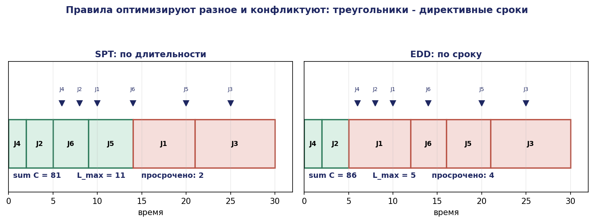
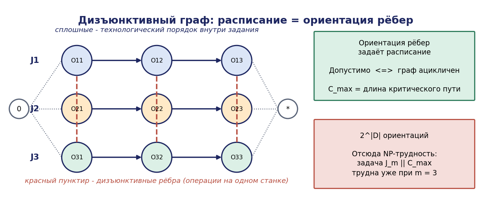
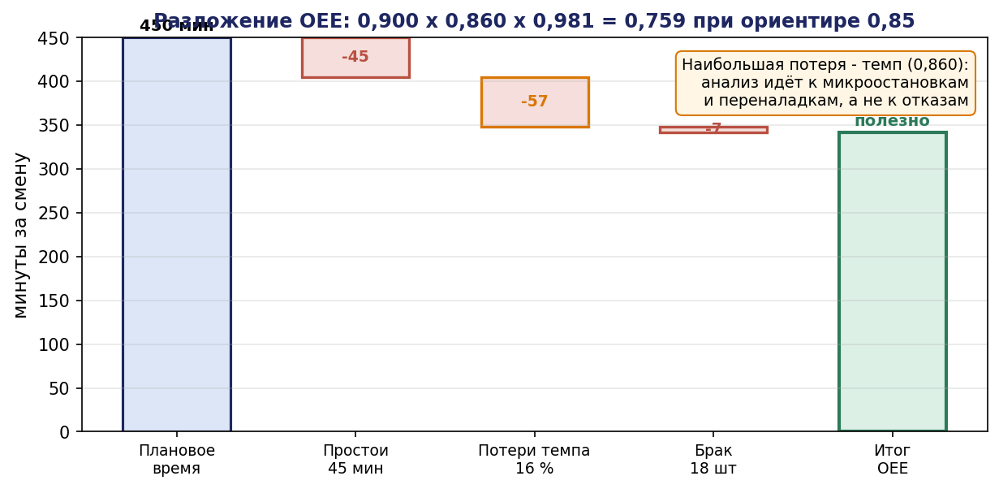
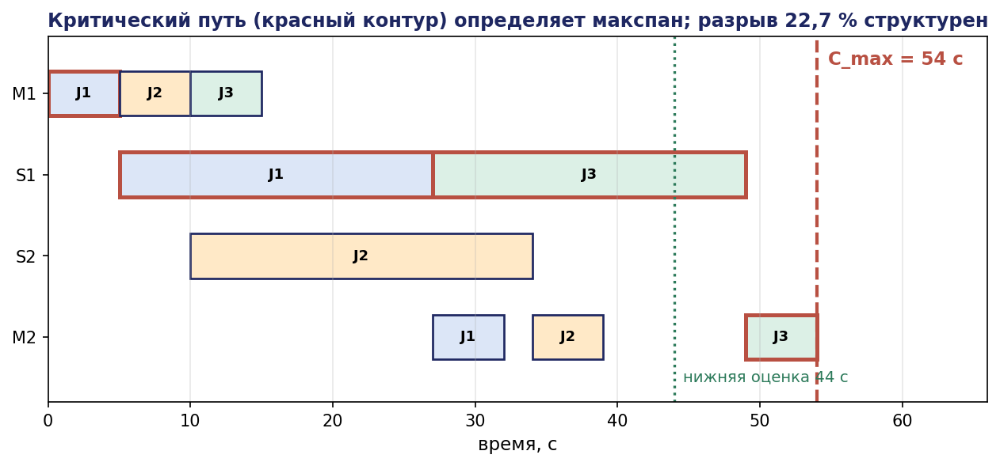

# Глава 14. Диспетчеризация и производственное расписание

## 14.1. Введение: третий вопрос заказчика

Заказчик комплекса задаёт три вопроса. Первый — «будет ли работать» — рассматривался в главах 3, 4, 7. Второй — «сколько даст» — в главе 5. Третий вопрос: **«в каком порядке выполнять работы, чтобы уложиться в сроки»**.

Это вопрос теории расписаний. Он возникает, как только комплекс обслуживает не однородный поток, а множество разнотипных заданий с разными маршрутами, сроками и приоритетами: партия из 40 деталей трёх наименований, каждое со своим набором операций, при двух станках и двух манипуляторах.

Различие с главой 5 существенно. Там мы оценивали **установившийся режим** однородного потока и получали пропускную способность. Здесь речь о **конкретном множестве заданий** с конкретными сроками, и ответом является расписание — назначение операций на ресурсы с указанием моментов начала.

Различие с главой 13 тоже существенно, хотя задачи родственны. Там распределялись задачи между роботами без внутренней структуры. Здесь задание состоит из последовательности операций с технологическими ограничениями порядка, что делает задачу существенно труднее.

Настоящая глава излагает классификацию задач теории расписаний, задачу цехового планирования (job shop) и её дизъюнктивную формулировку, нижние оценки, точные и эвристические методы, гибкий вариант задачи и связь с сетями Петри.

## 14.2. Классификация задач

### 14.2.1. Нотация Грэхема

Задача теории расписаний обозначается тройкой $\alpha \mid \beta \mid \gamma$:

- **$\alpha$** — структура станочной системы: 1 (один прибор), $P_m$ (параллельные идентичные), $Q_m$ (параллельные разной производительности), $F_m$ (flow shop — единый маршрут), $J_m$ (job shop — индивидуальные маршруты), $\mathrm{FJ}_m$ (flexible job shop — маршрут с выбором станка), $O_m$ (open shop — порядок произволен);
- **$\beta$** — дополнительные ограничения: $r_j$ (моменты поступления), $d_j$ (директивные сроки), prec (отношения предшествования), $s_{jk}$ (времена переналадки), pmtn (допустимость прерывания), brkdwn (отказы);
- **$\gamma$** — критерий: $C_{\max}$ (макспан), $\sum C_j$ (сумма моментов завершения), $\sum w_j C_j$ (взвешенная сумма), $L_{\max}$ (максимальное опоздание), $\sum U_j$ (число просроченных), $\sum T_j$ (сумма запаздываний).

Примеры:

| Обозначение | Смысл | Сложность |
|---|---|---|
| $1 \parallel \sum C_j$ | один прибор, минимум суммы завершений | O(n log n), правило SPT |
| $1 \parallel L_{\max}$ | один прибор, минимум максимального опоздания | O(n log n), правило EDD |
| $1 \parallel \sum U_j$ | минимум числа просроченных | O(n log n), алгоритм Мура |
| $1 \parallel \sum T_j$ | минимум суммы запаздываний | NP-трудна |
| $P_m \parallel C_{\max}$ | параллельные приборы, макспан | NP-трудна |
| $F_2 \parallel C_{\max}$ | два прибора, единый маршрут | O(n log n), правило Джонсона |
| $J_m \parallel C_{\max}$ | цеховое планирование | NP-трудна при $m \ge 3$ |
| $\mathrm{FJ}_m \parallel C_{\max}$ | гибкое цеховое планирование | NP-трудна |

Таблица показательна: граница между полиномиально разрешимыми и NP-трудными задачами проходит очень близко к тривиальным постановкам. Практически это означает, что для реального цеха точное решение недостижимо, и вся работа состоит в получении хороших приближений с оценкой их качества.

### 14.2.2. Полиномиально разрешимые случаи и их доказательства

Разберём три классических результата: они дают правила диспетчеризации, применяемые на практике, и иллюстрируют технику доказательства обменом (exchange argument).


**Теорема 14.1 (правило SPT).** Для задачи $1 \parallel \sum C_j$ оптимально упорядочение заданий по неубыванию длительностей $p_j (\mathrm{Shortest} \mathrm{Processing} \mathrm{Time} \mathit{first})$.

*Доказательство.* Рассмотрим оптимальное расписание и предположим, что в нём существует пара соседних заданий i, j (i выполняется непосредственно перед $j$) с $p_i > p_j$. Пусть $t$ — момент начала задания $i$. Вклад этой пары в сумму:

до обмена:  $(t + p_i) + (t + p_i + p_j) = 2t + 2p_i + p_j$
после обмена: $(t + p_j) + (t + p_j + p_i) = 2t + 2p_j + p_i$

Разность (до $-$ после) $= 2p_i + p_j - 2p_j - p_i = p_i - p_j > 0$.

Значит, обмен строго уменьшает сумму. Моменты завершения остальных заданий не изменяются, так как суммарная длительность пары та же. Противоречие с оптимальностью. Следовательно, в оптимальном расписании нет соседних пар с нарушением порядка SPT, то есть расписание упорядочено по неубыванию $p_j. \blacksquare$

**Теорема 14.2 (правило EDD, правило Джексона).** Для задачи $1 \parallel L_{\max}$ оптимально упорядочение по неубыванию директивных сроков $d_j (\mathrm{Earliest} \mathrm{Due} \mathrm{Date} \mathit{first})$.

*Доказательство.* Пусть в оптимальном расписании есть соседние i, j (i перед $j$) с $d_i > d_j$. Обозначим $t$ — момент начала пары. До обмена:

```math
L_i = t + p_i - d_i, \quad L_j = t + p_i + p_j - d_j
```

После обмена:

```math
L'_j = t + p_j - d_j, \quad L'_i = t + p_j + p_i - d_i
```

Сравним максимумы. Заметим: $L'_j = t + p_j - d_j \le t + p_i + p_j - d_j = L_j$, и $L'_i = t + p_i + p_j - d_i < t + p_i + p_j - d_j = L_j$ (так как $d_i > d_j$). Следовательно, $\max(L'_i, L'_j) \le L_j \le \max(L_i, L_j)$. Обмен не ухудшает критерий; опоздания остальных заданий не меняются. Последовательными обменами приводим расписание к порядку EDD, не ухудшая $L_{\max}. \blacksquare$

**Теорема 14.3 (правило Джонсона для $F_2 \parallel C_{\max}$).** Для задачи с двумя приборами и единым маршрутом оптимально расписание, построенное так: задания с $p_{1j} \le p_{2j}$ размещаются в начале в порядке неубывания $p_{1j}$; остальные — в конце в порядке невозрастания $p_{2j}$.

Эти результаты — не только теория. Правила SPT и EDD применяются в цеховых системах как правила диспетчеризации, и их оптимальность в частных случаях служит обоснованием их использования как эвристик в общем случае.

Существенное практическое замечание: **правила SPT и EDD оптимизируют разные вещи и конфликтуют**. SPT минимизирует среднее время прохождения (и, по закону Литтла, незавершённое производство), EDD минимизирует срыв сроков. Выбор между ними — управленческое решение, которое должно быть принято явно, а не унаследовано от предыдущей системы.




## 14.3. Задача цехового планирования

### 14.3.1. Постановка

Дано: $n$ заданий $J_1, \ldots, J_n; m$ станков $M_1, \ldots, M_m$. Задание $J_j$ состоит из последовательности операций $O_{j1}, \ldots, O_{j,n_j}$, операция $O_{jk}$ выполняется на предписанном станке $\mu_{jk}$ в течение $p_{jk}$.

Ограничения:

1. **технологический порядок**: операции задания выполняются последовательно;
2. **ресурсное ограничение**: станок выполняет не более одной операции одновременно;
3. **непрерываемость**: начатая операция выполняется до конца (в базовой постановке).

Требуется найти моменты начала $s_{jk}$, минимизирующие $C_{\max} = \max_j C_j$.

### 14.3.2. Дизъюнктивный граф

Классическое представление задачи (Рой и Сюсман, 1964).


**Определение 14.1.** Дизъюнктивным графом задачи цехового планирования называется граф $G = (V, C \cup D)$, где

- V — множество операций плюс фиктивные вершины «начало» и «конец»;
- C — **конъюнктивные дуги**: направленные, соединяют последовательные операции одного задания; вес дуги $(O_{jk} \to O_{j,k+1})$ равен $p_{jk}$;
- D — **дизъюнктивные рёбра**: ненаправленные, соединяют пары операций, выполняемых на одном станке.

**Расписание** соответствует **ориентации** дизъюнктивных рёбер: для каждой пары операций на одном станке выбирается, какая раньше.

**Теорема 14.4.** Ориентация дизъюнктивных рёбер задаёт допустимое расписание тогда и только тогда, когда полученный орграф ацикличен. При этом минимальный макспан для данной ориентации равен длине критического (наидлиннейшего) пути от «начала» до «конца».

*Доказательство.*

(⇒) Пусть расписание допустимо. Определим ориентацию по фактическому порядку. Цикл в графе означал бы цепочку операций, каждая из которых должна начаться после завершения следующей по кругу, что при положительных длительностях невозможно.

(⇐) Пусть орграф ацикличен. Определим $s(v)$ как длину наидлиннейшего пути от «начала» до $v$; величина корректно определена ввиду ацикличности (вычисляется динамическим программированием в топологическом порядке). Тогда $s$ удовлетворяет всем ограничениям предшествования: для дуги $(u \to v)$ веса $p_u$ имеем $s(v) \ge s(u) + p_u$. Технологический порядок и ресурсные ограничения выражены дугами, значит расписание допустимо. Момент завершения равен длине критического пути; меньшее значение невозможно, так как критический путь есть цепочка обязательно последовательных операций. ∎

Теорема 14.4 превращает задачу в комбинаторную: перебрать ориентации дизъюнктивных рёбер, минимизируя длину критического пути. Число ориентаций $2^{\lvert D\rvert}$, что и объясняет NP-трудность.

**Теорема 14.5 (Гэри, Джонсон, Сети, 1976).** Задача $J_m \parallel C_{\max} \mathrm{NP}$-трудна в сильном смысле при $m \ge 3$. Более того, задача $J_3 \parallel C_{\max} \mathrm{NP}$-трудна даже при трёх операциях в каждом задании.




### 14.3.3. Критический путь и окрестности

Критический путь даёт не только значение целевой функции, но и указание, что улучшать: **сокращение некритических операций не влияет на макспан**.

На этом основаны локальные эвристики: изменять порядок только на критическом пути. Классическая окрестность N1 (Ван Лаарховен): обмен местами двух соседних операций критического пути, выполняемых на одном станке.

**Утверждение 14.1.** Обмен двух соседних операций критического пути, выполняемых на одном станке, не порождает цикла (то есть даёт допустимое расписание).

Это утверждение делает окрестность безопасной: не требуется проверка на цикличность после каждого шага, что существенно для скорости локального поиска.

## 14.4. Нижние оценки

Хорошая нижняя оценка позволяет оценить качество найденного решения без знания оптимума и остановить поиск.

**Оценка 1 (по узкому месту).** Для каждого станка $M_i$ сумма длительностей операций, выполняемых на нём:

```math
\mathrm{LB}_1 = \max_i \Sigma_{O_{jk} : \mu_{jk} = i} p_{jk}
```

**Оценка 2 (по заданию).** Для каждого задания сумма его операций:

```math
\mathrm{LB}_2 = \max_j \sum_k p_{jk}
```

**Оценка 3 (уточнённая по станку, с «головой» и «хвостом»).** Для операции $O$ определим $r(O)$ — минимальный момент её начала (сумма предшествующих в задании) и $q(O)$ — минимальный «хвост» (сумма последующих). Тогда для каждого станка

```math
\mathrm{LB}_3 = \max_i [ \min_{O \in M_i} r(O) + \sum_{O \in M_i} p(O) + \min_{O \in M_i} q(O) ]
```

**Теорема 14.6.** $C^{*}_{\max} \ge \max(\mathrm{LB}_1, \mathrm{LB}_2, \mathrm{LB}_3)$.

*Доказательство.* $\mathrm{LB}_1$: станок работает не более одной операции одновременно, поэтому все его операции требуют суммарного времени, не меньшего их суммы. $\mathrm{LB}_2$: операции задания последовательны. $\mathrm{LB}_3$: любая операция на станке $i$ начинается не ранее момента $r(O) \ge \min r$; все операции станка требуют суммарного времени; после последней операции остаётся выполнить её хвост, не меньший min q. ∎

Оценка $\mathrm{LB}_3$ обычно существенно точнее двух первых и лежит в основе метода «сдвига узкого места» (shifting bottleneck), где на каждом шаге выбирается станок с наибольшей оценкой и для него решается задача одного прибора с головами и хвостами $(1 \mid r_j \mid L_{\max})$, решаемая точно алгоритмом Карлье.

## 14.5. Точные методы

### 14.5.1. Формулировка смешанного целочисленного программирования

Переменные: $s_{jk} \ge 0$ — момент начала операции; $z_{(jk),(j'k')} \in \lbrace 0{,}1 \rbrace$ — булева переменная порядка для операций на одном станке.

```
min  C_max

s.t. C_max ≥ s_{j,n_j} + p_{j,n_j}                        для всех j
     s_{j,k+1} ≥ s_{jk} + p_{jk}                          технологический порядок
     s_{jk} ≥ s_{j'k'} + p_{j'k'} − M·z                   дизъюнкция, вариант 1
     s_{j'k'} ≥ s_{jk} + p_{jk} − M·(1 − z)               дизъюнкция, вариант 2
     s_{jk} ≥ 0,  z ∈ {0,1}
```

Приём с «большим $M$» (big-M) стандартен: при $z = 0$ действует первое ограничение, при $z = 1$ — второе. Значение $M$ выбирается как верхняя оценка макспана (например, сумма всех длительностей); слишком большое $M$ ухудшает линейную релаксацию и замедляет решение.

Практический предел точного решения: задачи размера порядка 15 заданий × 15 станков. Знаменитая задача FT10 (10×10, Фишер и Томпсон, 1963) была решена точно лишь через 26 лет после публикации.

### 14.5.2. Программирование в ограничениях

Современный и существенно более эффективный подход для задач расписаний — программирование в ограничениях (CP) со специализированными глобальными ограничениями.

Основные конструкции (на примере интерфейса OR-Tools CP-SAT):

- **интервальная переменная** `NewIntervalVar(start, size, end, name)` — операция как объект;
- **`AddNoOverlap(intervals)`** — операции на одном станке не пересекаются; реализовано с мощным алгоритмом распространения ограничений (edge-finding, not-first/not-last);
- **`AddCumulative(intervals, demands, capacity)`** — ресурс ограниченной ёмкости (например, зона на два робота);
- **`AddNoOverlap2D`** — двумерные ресурсы (площадь склада).

```python
from ortools.sat.python import cp_model

def solve_jobshop(jobs, num_machines, horizon):
    """jobs[j] = [(machine, duration), ...] — маршрут задания j."""
    model = cp_model.CpModel()
    starts, ends, machine_intervals = {}, {}, [[] for _ in range(num_machines)]

    for j, route in enumerate(jobs):
        for k, (m, p) in enumerate(route):
            s = model.NewIntVar(0, horizon, f's_{j}_{k}')
            e = model.NewIntVar(0, horizon, f'e_{j}_{k}')
            iv = model.NewIntervalVar(s, p, e, f'iv_{j}_{k}')
            starts[j, k], ends[j, k] = s, e
            machine_intervals[m].append(iv)
            if k > 0:                                  # технологический порядок
                model.Add(s >= ends[j, k - 1])

    for m in range(num_machines):                      # ресурсное ограничение
        model.AddNoOverlap(machine_intervals[m])

    makespan = model.NewIntVar(0, horizon, 'makespan')
    model.AddMaxEquality(makespan, [ends[j, len(r) - 1] for j, r in enumerate(jobs)])
    model.Minimize(makespan)

    solver = cp_model.CpSolver()
    solver.parameters.max_time_in_seconds = 60.0
    solver.parameters.num_search_workers = 8
    status = solver.Solve(model)
    return solver, starts, ends, makespan, status
```

CP-SAT решает задачи размера $20\times 20$ за секунды и даёт **гарантированный разрыв оптимальности** (gap) — разность между найденным решением и нижней оценкой. Это принципиально важно для практики: инженер знает, что решение отличается от оптимального не более чем на указанную величину, и может принять решение о прекращении поиска обоснованно.

## 14.6. Эвристики

### 14.6.1. Правила диспетчеризации

Простейший класс: расписание строится последовательно, на каждом шаге из доступных операций выбирается одна по фиксированному правилу.

| Правило | Выбор | Хорош для |
|---|---|---|
| SPT | кратчайшая операция | среднее время прохождения, НЗП |
| LPT | длиннейшая операция | балансировка параллельных станков |
| EDD | ближайший срок | максимальное опоздание |
| MWKR | наибольшая оставшаяся работа | макспан |
| FIFO | первым поступил | справедливость, простота |
| CR (critical ratio) | (срок $-$ текущее время)/оставшаяся работа | комбинированный |
| ATC | взвешенное правило с экспонентой | сумма запаздываний |

Достоинства: вычисляются мгновенно, работают в реальном времени, естественно обрабатывают динамику (новые заказы, отказы). Недостаток: качество на 15–30 % хуже оптимума для макспана.

**Практическое применение.** Правила диспетчеризации — не альтернатива оптимизации, а **резервный уровень**: расписание строится оптимизатором на смену, а при отклонениях (отказ станка, срочный заказ) диспетчер работает по правилу до следующего пересчёта.

### 14.6.2. Метаэвристики

- **Поиск с запретами (tabu search)** — исторически наиболее успешный метод для job shop; окрестность N1 на критическом пути, список запретов предотвращает зацикливание.
- **Имитация отжига** — простая реализация, приемлемое качество.
- **Генетические алгоритмы** — представление расписания перестановкой операций; требуют аккуратного оператора скрещивания, сохраняющего допустимость.
- **Сдвиг узкого места (shifting bottleneck)** — итеративно выбирается наиболее нагруженный станок, для него решается точно подзадача одного прибора, порядок фиксируется, оценки пересчитываются.
- **Большая окрестность (LNS)** — часть расписания разрушается и перестраивается точным методом; в связке с CP-SAT даёт лучшие практические результаты.

## 14.7. Гибкое цеховое планирование

### 14.7.1. Постановка

В FJSP операция $O_{jk}$ может выполняться на любом станке из множества $M_{jk} \subseteq \lbrace M_1,\ldots,M_m \rbrace$, возможно с разной длительностью $p_{\mathrm{jkm}}$.

Задача распадается на две связанные подзадачи:

1. **маршрутизация**: выбор станка для каждой операции;
2. **упорядочение**: построение расписания при выбранных станках.

Это в точности структура задачи распределения из главы 13, где маршрутизация соответствует назначению задач роботам. Связь не поверхностная: FJSP с манипуляторами вместо станков есть задача MRTA класса ST-SR-TA.

### 14.7.2. Значение гибкости

Гибкость резко улучшает достижимый макспан и, что важнее, **робастность**: при отказе станка операции перенаправляются на альтернативные.

**Численная иллюстрация.** Пусть в ячейке примера Б обработка возможна на одном станке (жёсткий маршрут) или на двух взаимозаменяемых (гибкий). При 10 заданиях с длительностью обработки 22 с: жёсткий вариант даёт $\mathrm{LB}_1 = 220$ с; гибкий — $\mathrm{LB}_1 = 110$ с. При отказе станка: жёсткий — полная остановка; гибкий — возврат к 220 с, то есть деградация вдвое вместо отказа.

Количественная оценка выигрыша от гибкости — типичное содержание технико-экономического обоснования состава оборудования.

### 14.7.3. Переналадка

Практически важное расширение: время переналадки $s_{jk}$ при переходе станка с задания типа $j$ на тип $k$. При значительных переналадках задача приобретает черты задачи коммивояжёра, и оптимальный порядок группирует однотипные задания (батчинг).

Конфликт: группировка снижает переналадки, но увеличивает время ожидания отдельных заданий и, следовательно, срыв сроков. Компромисс количественно оценивается только расчётом.

## 14.8. Связь с сетями Петри

Расписание и временная сеть Петри описывают одну и ту же реальность в разных нотациях, и связь между ними полезно понимать.

**Развёртка сети как расписание.** Последовательность срабатываний временной сети Петри с фиксированным разрешением конфликтов есть в точности расписание. Обратно, расписание задаёт разрешение всех конфликтов сети.

**Ресурсные позиции как ограничения станков.** Позиция ресурса с ёмкостью 1 соответствует ограничению `NoOverlap`; с ёмкостью $k$ — ограничению `Cumulative` с capacity = k.

**Тупики.** Расписание, построенное оптимизатором, тупиков не содержит по построению — все ограничения выполнены. Однако при **исполнении** с отклонениями от плана тупик возможен, если система захватывает ресурсы динамически. Гарантию даёт не оптимизатор, а структурный механизм (мониторы сифонов, упорядочивание) из главы 4.

Это важное разделение ответственности, уже встречавшееся в главе 10: **оптимизатор отвечает за эффективность, структурный механизм — за безопасность**. Смешение ролей — источник систем, которые «обычно работают».

**$T$-инварианты и повторяющееся расписание.** Для установившегося циклического производства оптимальное расписание есть повторяющийся цикл, соответствующий $T$-инварианту сети, а его длительность вычисляется max-plus алгеброй (глава 5). Таким образом, для установившегося режима теория расписаний и max-plus дают согласованные ответы, а теория расписаний дополнительно решает задачу переходных режимов и конкретных партий.

## 14.9. Исполнение расписания и перепланирование

### 14.9.1. Робастность

Расписание, оптимальное по номинальным длительностям, при их разбросе исполняется хуже номинала. Два подхода к учёту:

**Робастное расписание** — оптимизируется наихудший случай или устойчивость к возмущениям; результат содержит временные резервы (buffers). Цена — ухудшение номинального макспана.

**Реактивное расписание** — планируется по номиналу, при отклонениях пересчитывается. Цена — вычислительная нагрузка и нестабильность плана.

Практика: комбинация — номинальное расписание с резервами в критических точках плюс правила диспетчеризации при мелких отклонениях и полный пересчёт при крупных.

### 14.9.2. Стратегии перепланирования

| Стратегия | Действие | Когда применима |
|---|---|---|
| Сдвиг вправо (right-shift) | все последующие операции сдвигаются на величину задержки | малая задержка, порядок сохраняется |
| Частичное перепланирование | пересчёт только затронутой части | локальное возмущение |
| Полный пересчёт | построение нового расписания | отказ станка, срочный заказ |
| Смена правила | переход на диспетчерское правило | нехватка времени на расчёт |

**Критерий выбора: стабильность плана.** Помимо качества нового расписания учитывается его отличие от прежнего: частая смена планов дезорганизует работу, персонал перестаёт доверять системе. Формально в целевую функцию добавляется штраф за отклонение от исходного расписания:

```math
\min [ \alpha \cdot C_{\max} + \beta \cdot \sum_j \lvert s_j^{\mathrm{new}} - s_j^{\mathrm{old}}\rvert]
```

Это тот же вывод, что в главе 10 применительно к плану робота: стабильность есть самостоятельное эксплуатационное требование.

## 14.10. Метрики производства

| Метрика | Определение | Смысл |
|---|---|---|
| Макспан $C_{\max}$ | момент завершения последней работы | длительность партии |
| Среднее время прохождения | $(1/n)\cdot \sum(C_j - r_j)$ | скорость реакции |
| Незавершённое производство (НЗП) | среднее число заданий в системе | связанный капитал |
| Загрузка станка | доля времени работы | эффективность использования |
| Число просроченных $\sum U_j$ | заданий, завершённых позже срока | выполнение обязательств |
| Суммарное запаздывание $\sum T_j$ | $\sum \max(0, C_j - d_j)$ | тяжесть срывов |
| OEE | доступность × производительность × качество | интегральный показатель |


**Закон Литтла в цеховом контексте.** НЗП = пропускная способность × среднее время прохождения. Отсюда следует важный вывод: **сократить НЗП можно только сокращением времени прохождения** (при неизменном выпуске). Попытки «просто запускать меньше» снижают выпуск, а не время прохождения.

**Числовой пример OEE.** Смена 480 мин; плановые перерывы 30 мин; простои по отказам 45 мин; номинальный такт 22 с; фактически изготовлено 950 деталей; брак 18 деталей.

- Доступность $= (480 - 30 - 45)/(480 - 30) = 405/450 = 0{,}900$
- Производительность $= (950 \cdot 22/60)/405 = 348{,}3/405 = 0{,}860$
- Качество $= (950 - 18)/950 = 0{,}981$
- **$\mathrm{OEE} = 0{,}900 \cdot 0{,}860 \cdot 0{,}981 = 0{,}759$**

Значение 0,76 при типовом ориентире 0,85 для автоматизированного производства указывает на резерв. Разложение показывает, где именно: наибольшая потеря — производительность (0,86), то есть фактический такт превышает номинальный на 16 %. Это направляет анализ к причинам замедления (переналадки, ожидание манипулятора, микроостановки), а не к сокращению отказов, которые дают меньшую потерю.

Такое разложение — стандартный первый шаг анализа действующего комплекса и обязательный элемент отчёта по приёмочным испытаниям (глава 17).




## 14.11. Разбор: расписание для примера Б

**Постановка.** Три задания, два станка $(S_1, S_2)$ и два манипулятора ($M_1$ — загрузка, $M_2$ — выгрузка). Маршрут каждого задания: загрузка ($M_1, 5$ с) → обработка ($S_1$ или $S_2$, время зависит от типа) → выгрузка ($M_2, 5$ с).


| Задание | Тип | Обработка на $S_1$, с | Обработка на $S_2$, с |
|---|---|---|---|
| $J_1$ | A | 22 | 26 |
| $J_2$ | B | 30 | 24 |
| $J_3$ | A | 22 | 26 |

Это задача FJSP: станок для обработки выбирается.

**Нижние оценки.**

LB по $M_1: 3 \cdot 5 = 15$ с. LB по $M_2: 15$ с.
LB по станкам: суммарная обработка при наилучшем назначении. Варианты: $\lbrace J_1,J_3 \rbrace\to S_1, \lbrace J_2 \rbrace\to S_2$ даёт нагрузки 44 и $24 \to \max 44; \lbrace J_1 \rbrace\to S_1, \lbrace J_2,J_3 \rbrace\to S_2$ даёт 22 и $50 \to \max 50; \lbrace J_1,J_2 \rbrace\to S_1, \lbrace J_3 \rbrace\to S_2$ даёт 52 и 26 → max 52. Лучший вариант — первый, $\mathrm{LB} = 44$ с.
LB по заданию: $J_2$ требует 5 + 24 + 5 = 34 с.

Итого $\mathrm{LB} = \max(15, 15, 44, 34) =$ **44 с**.

**Построение расписания.** Назначение: $J_1 \to S_1, J_3 \to S_1, J_2 \to S_2$.

```
t=0    M₁ загружает J₁            (0–5)
t=5    S₁ обрабатывает J₁         (5–27)
t=5    M₁ загружает J₂            (5–10)
t=10   S₂ обрабатывает J₂         (10–34)
t=10   M₁ загружает J₃            (10–15)  ← J₃ ждёт освобождения S₁
t=27   S₁ обрабатывает J₃         (27–49)
t=27   M₂ выгружает J₁            (27–32)
t=34   M₂ выгружает J₂            (34–39)
t=49   M₂ выгружает J₃            (49–54)
```

$C_{\max} =$ **54 с** при нижней оценке 44 с; разрыв 22,7 %.

**Анализ.** Критический путь: загрузка $J_1 (5) \to$ обработка $J_1$ на $S_1 (22) \to$ обработка $J_3$ на $S_1 (22) \to$ выгрузка $J_3 (5) = 54$ с. Узкое место — станок $S_1$, на который назначены два задания.

**Улучшение 1: перебалансировать назначение.** Отдать $J_3$ на $S_2: S_1$ загружен на 22 с, $S_2$ — на 24 + 26 = 50 с. Хуже.

**Улучшение $2: J_2$ на $S_1, J_1$ и $J_3$ распределить.** $J_1\to S_1 (22), J_2\to S_2 (24), J_3\to S_2 (26)$: $S_1 = 22, S_2 = 50$. Хуже.

Проверка всех назначений показывает, что вариант $\lbrace J_1, J_3 \rbrace\to S_1, \lbrace J_2 \rbrace\to S_2$ действительно даёт лучшую балансировку (44 против 50 и 52). Разрыв в 10 с между $C_{\max} = 54$ и $\mathrm{LB} = 44$ обусловлен структурой: $J_3$ не может начать обработку, пока $S_1$ занят $J_1$, и его выгрузка добавляет 5 с в хвост.

**Улучшение 3: изменить порядок на $S_1$.** Поставить $J_3$ первым: результат симметричен, $C_{\max}$ тот же.

**Улучшение 4: буфер.** Если $J_3$ можно загрузить в буфер и держать там, манипулятор $M_1$ освобождается раньше, но макспан не меняется, поскольку критический путь проходит через $S_1$, а не через $M_1$.

**Вывод.** $C_{\max} = 54$ с при данном составе оборудования близок к достижимому; дальнейшее улучшение требует третьего станка или сокращения времени обработки. Разрыв 22,7 % не является дефектом расписания — он структурен.

Проверка через CP-SAT на этой задаче подтверждает оптимальность 54 с (нижняя оценка $\mathrm{LB}_3$ с учётом голов и хвостов даёт как раз 54).

Такой разбор — типичный элемент проекта: он отвечает на вопрос «стоит ли покупать третий станок» количественно.




## 14.12. Инструменты

| Инструмент | Тип | Особенности |
|---|---|---|
| OR-Tools CP-SAT | CP/SAT | бесплатен, лучший в классе для расписаний, Python/C++ |
| Gurobi, CPLEX | MILP | коммерческие, сильны на MILP-формулировках |
| IBM CP Optimizer | CP | специализирован на расписаниях, интервальные переменные |
| OptaPlanner | метаэвристики | Java, промышленное планирование |
| SimPy | имитация | проверка расписания при разбросе длительностей |

**Рекомендуемая схема работы:** формулировка в CP-SAT → получение решения с оценкой разрыва → проверка робастности имитацией с разбросом длительностей → выбор между номинальным и робастным вариантом.

## 14.13. Выводы

1. Граница между полиномиально разрешимыми и NP-трудными задачами расписаний проходит очень близко к тривиальным постановкам; для реального цеха точное решение недостижимо, и работа состоит в получении приближений с оценкой качества.
2. Правила SPT и EDD оптимальны для однопроцессорных задач и доказываются обменом соседних элементов; они конфликтуют между собой, и выбор критерия — явное управленческое решение.
3. Дизъюнктивный граф сводит задачу цехового планирования к выбору ориентации рёбер; допустимость эквивалентна ацикличности, а макспан равен длине критического пути.
4. Нижние оценки (по станку, по заданию, с головами и хвостами) позволяют оценить качество решения без знания оптимума и обосновать прекращение поиска.
5. Программирование в ограничениях с глобальными ограничениями NoOverlap и Cumulative — наиболее эффективный современный подход; оно даёт гарантированный разрыв оптимальности.
6. Гибкость маршрутов улучшает не только макспан, но и робастность: при отказе станка система деградирует вместо остановки; выигрыш количественно оценивается и служит обоснованием состава оборудования.
7. Оптимизатор отвечает за эффективность, структурный механизм главы 4 — за отсутствие тупиков при исполнении; смешение ролей даёт системы, которые «обычно работают».
8. Стабильность расписания — самостоятельное эксплуатационное требование, включаемое в целевую функцию перепланирования.

## 14.14. Контрольные вопросы

1. Расшифруйте обозначения $1 \parallel \sum C_j, J_m \parallel C_{\max}, \mathrm{FJ}_m \mid s_{jk} \mid L_{\max}$.
2. Докажите оптимальность правила SPT для $1 \parallel \sum C_j$.
3. Докажите оптимальность правила EDD для $1 \parallel L_{\max}$. Почему в доказательстве достаточно рассмотреть соседние задания?
4. Почему правила SPT и EDD конфликтуют? Приведите пример.
5. Сформулируйте теорему о соответствии ориентации дизъюнктивного графа и расписания.
6. Почему сокращение некритических операций не улучшает макспан?
7. Выведите нижнюю оценку $\mathrm{LB}_3$ с головами и хвостами.
8. В чём преимущество CP-формулировки перед MILP для задач расписаний?
9. Как гибкость маршрутов влияет на поведение при отказе станка? Оцените количественно на примере раздела 14.7.2.
10. Почему оптимизатор не гарантирует отсутствия тупиков при исполнении расписания?

## 14.15. Задачи

**Задача 14.1.** Для 6 заданий с длительностями (7, 3, 9, 2, 5, 4) и сроками (10, 8, 25, 6, 20, 14) на одном приборе постройте расписания по SPT и EDD. Вычислите $\sum C_j, L_{\max}, \sum U_j$ для обоих. Объясните различие.

**Задача 14.2.** Постройте дизъюнктивный граф для задачи 3 задания × 3 станка. Выберите ориентацию и вычислите критический путь.

**Задача 14.3.** Для той же задачи вычислите $\mathrm{LB}_1, \mathrm{LB}_2, \mathrm{LB}_3$. Сравните с оптимумом, найденным перебором.

**Задача 14.4.** Реализуйте решение job shop в OR-Tools CP-SAT. Решите задачу $\mathrm{FT06} (6\times 6)$ и $\mathrm{FT10} (10\times 10)$. Сравните время решения и полученный разрыв.

**Задача 14.5.** Реализуйте правила SPT, MWKR, EDD как построители расписания и сравните их результаты с оптимумом CP-SAT на 20 случайных задачах $8\times 8$. Постройте распределение относительного проигрыша.

**Задача 14.6.** Расширьте модель до FJSP: обработка возможна на двух станках с разными длительностями. Сравните макспан с жёстким вариантом.

**Задача 14.7.** Смоделируйте отказ одного станка в момент $t = 30 \text{%}$ от макспана. Реализуйте три стратегии перепланирования (сдвиг вправо, частичное, полное) и сравните результирующий макспан и число изменённых моментов начала.

**Задача 14.8.** Добавьте времена переналадки при смене типа задания. Исследуйте, как оптимальное расписание группирует однотипные задания и как это влияет на $\sum T_j$.

**Задача 14.9.** Постройте расписание для примера Б из раздела 14.11 в CP-SAT и подтвердите оптимальность 54 с. Затем добавьте третий станок и найдите новый макспан. Оцените выигрыш.

**Задача 14.10.** Рассчитайте OEE для смены по данным: 480 мин, перерывы 40 мин, простои 60 мин, такт 18 с, изготовлено 1100, брак 25. Определите основной источник потерь и предложите направление улучшения.

**Задача 14.11.** Проверьте робастность найденного расписания: смоделируйте в SimPy исполнение при разбросе длительностей (нормальное распределение, коэффициент вариации 0,15), 50 прогонов. Постройте распределение фактического макспана и сравните с номинальным.

## 14.16. Литература к главе

1. Pinedo M. L. Scheduling: Theory, Algorithms, and Systems. 6th ed. — Springer, 2022.
2. Brucker P. Scheduling Algorithms. 5th ed. — Springer, 2007.
3. Graham R. L., Lawler E. L., Lenstra J. K., Rinnooy Kan A. H. G. Optimization and Approximation in Deterministic Sequencing and Scheduling // Annals of Discrete Mathematics. — 1979. — Vol. 5. — P. 287–326.
4. Garey M. R., Johnson D. S., Sethi R. The Complexity of Flowshop and Jobshop Scheduling // Mathematics of Operations Research. — 1976. — Vol. 1, No. 2. — P. 117–129.
5. Roy B., Sussmann B. Les problèmes d'ordonnancement avec contraintes disjonctives. — SEMA, 1964.
6. Adams J., Balas E., Zawack D. The Shifting Bottleneck Procedure for Job Shop Scheduling // Management Science. — 1988. — Vol. 34, No. 3. — P. 391–401.
7. Nowicki E., Smutnicki C. A Fast Taboo Search Algorithm for the Job Shop Problem // Management Science. — 1996. — Vol. 42, No. 6. — P. 797–813.
8. Baptiste P., Le Pape C., Nuijten W. Constraint-Based Scheduling. — Kluwer, 2001.
9. Perron L., Furnon V. OR-Tools: документация CP-SAT. — Google.
10. Nakajima S. Introduction to TPM: Total Productive Maintenance. — Productivity Press, 1988.
