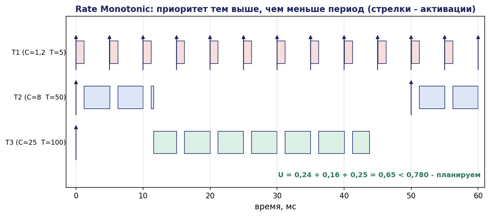
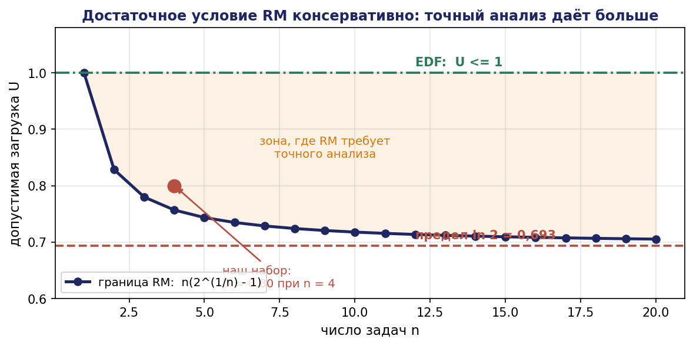
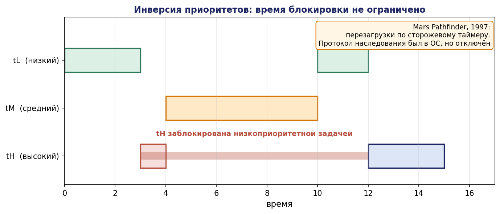
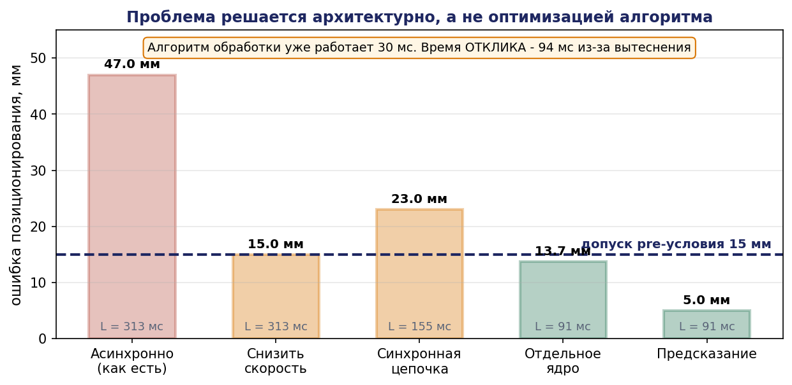

# Глава 15. Реальное время и вычислительная архитектура комплекса

## 15.1. Введение: реальное время — свойство системы, а не операционной системы

Распространённое заблуждение состоит в отождествлении реального времени с выбором операционной системы: «поставим RTOS — получим реальное время». Это неверно в обе стороны. Система с обычным Linux может удовлетворять жёстким временным требованиям, если они мягкие относительно её возможностей; система с сертифицированной RTOS может их нарушать, если задачи спроектированы неверно.

**Реальное время есть свойство системы: гарантия того, что результат будет получен не позднее заданного момента.** Гарантия либо доказывается анализом, либо не существует. Выбор операционной системы — одно из средств обеспечения гарантии, а не сама гарантия.

Различают:

- **жёсткое реальное время** (hard): пропуск дедлайна есть отказ системы с возможными последствиями для безопасности. Пример: контур аварийного останова, контур управления приводом.
- **твёрдое реальное время** (firm): результат, полученный после дедлайна, бесполезен, но не опасен. Пример: кадр изображения для визуального сервоуправления.
- **мягкое реальное время** (soft): просрочка снижает качество. Пример: обновление интерфейса оператора, планирование миссии.

Проектная ошибка, встречающаяся постоянно: **отнесение всех задач к жёсткому реальному времени**. Это приводит к переусложнению системы и, парадоксально, к снижению надёжности критических функций, поскольку ресурсы расходуются на гарантии там, где они не нужны. В комплексе к жёсткому реальному времени относится, как правило, менее 10 % функций.

Настоящая глава излагает аппарат, позволяющий доказывать временные гарантии: модель задач, планировщики и их анализ, влияние блокировок, оценку времени выполнения, сквозной бюджет задержки и распределение функций по вычислителям.

## 15.2. Модель периодических задач

### 15.2.1. Определения

**Определение 15.1.** Периодической задачей $\tau_i$ называется тройка $(C_i, T_i, D_i)$, где

- $C_i$ — наихудшее время выполнения одного задания (WCET);
- $T_i$ — период (минимальный интервал между активациями);
- $D_i$ — относительный дедлайн (время от активации, к которому задание должно завершиться).

Различают модели с **неявными дедлайнами** $(D_i = T_i)$, **ограниченными** $(D_i \le T_i)$ и **произвольными** ($D_i$ может превышать $T_i$).

**Коэффициентом загрузки** (utilization) задачи называется $U_i = C_i / T_i$; загрузка системы $U = \sum U_i$.

**Утверждение 15.1 (необходимое условие).** Для планируемости на одном процессоре необходимо $U \le 1$.

*Доказательство.* За время $L$, кратное всем периодам (гиперпериод), задача $\tau_i$ требует $L/T_i \cdot C_i$ единиц процессорного времени. Суммарное требование $L\cdot \Sigma(C_i/T_i) = L\cdot U$ не может превышать доступного времени L. ∎

Условие необходимо, но не достаточно: при статических приоритетах система может быть непланируема и при $U < 1$.

### 15.2.2. Апериодические и спорадические задачи

Реальные события (нажатие кнопки, обнаружение препятствия, отказ) не периодичны. Они моделируются **спорадическими** задачами, характеризуемыми минимальным интервалом между активациями $T_i^{\min}$. Для анализа спорадическая задача заменяется периодической с периодом $T_i^{\min}$ — это консервативная замена, дающая корректную оценку сверху.

Задачи без гарантированного минимального интервала (истинно апериодические) обслуживаются через **серверы** (polling server, deferrable server, sporadic server), ограничивающие их влияние на остальную систему заданным бюджетом.

## 15.3. Планирование со статическими приоритетами: RM

### 15.3.1. Правило

**Rate Monotonic (RM):** приоритет задачи тем выше, чем меньше её период. Приоритеты назначаются статически, планирование вытесняющее.


**Теорема 15.1 (оптимальность RM).** Среди всех алгоритмов со статическими приоритетами для задач с неявными дедлайнами RM оптимален: если набор задач планируем при некотором статическом назначении приоритетов, он планируем и при RM.

*Доказательство (обменом).* Пусть набор планируем при некотором назначении приоритетов, не совпадающем с RM. Тогда существуют две задачи $\tau_i, \tau_j$ соседних приоритетов ($\tau_i$ выше $\tau_j$) с $T_i > T_j$ — нарушение порядка RM. Покажем, что обмен их приоритетами сохраняет планируемость.

Обмен не влияет на задачи с приоритетом выше обеих (для них помеха неизменна) и на задачи с приоритетом ниже обеих (суммарная помеха от пары та же). Остаётся проверить сами $\tau_i$ и $\tau_j$.

После обмена $\tau_j$ получает более высокий приоритет: её время отклика не увеличивается, значит она по-прежнему укладывается в дедлайн. Для $\tau_i$: до обмена она имела приоритет выше $\tau_j$ и завершалась к моменту $D_i = T_i$. Так как $T_j < T_i$, в интервале длины $T_i$ задача $\tau_j$ активируется не менее $\lceil T_i/T_j\rceil \ge 2$ раз; в исходном расписании $\tau_j$ успевала завершить свои задания в пределах $T_j$ каждое. После обмена $\tau_i$ выполняется в промежутках, оставляемых $\tau_j$; можно показать, что суммарное свободное время в интервале $T_i$ не уменьшилось по сравнению с временем, которое $\tau_j$ оставляла для $\tau_i$... — точнее, применяется классическая техника: рассматривается критический момент и показывается, что при $T_j < T_i$ требование $\tau_i$ к процессору в интервале $[0, T_i]$ удовлетворяется, поскольку загрузка пары не изменилась, а число вытеснений не возросло. Последовательными обменами приводим назначение к RM без потери планируемости. ∎




### 15.3.2. Достаточное условие Лю и Лейланда

**Теорема 15.2 (Лю, Лейланд, 1973).** Набор из $n$ независимых периодических задач с неявными дедлайнами планируем при RM, если


```math
U = \sum_{i=1}^{n} C_i / T_i \quad \le \quad n \cdot(2^{1/n} - 1)
```

*Идея доказательства.* Вводится понятие **критического момента**: момент одновременной активации всех задач; показывается, что если задача укладывается в дедлайн при критическом моменте, она укладывается всегда. Далее ищется наименьшая загрузка, при которой набор становится непланируемым (наихудший случай), и находится её минимум по всем конфигурациям периодов и времён выполнения. Минимум достигается при определённом соотношении периодов и равен $n(2^{1/n} - 1). \blacksquare$

Значения границы:

| $n$ | Граница |
|---|---|
| 1 | 1,000 |
| 2 | 0,828 |
| 3 | 0,780 |
| 4 | 0,757 |
| 5 | 0,743 |
| 10 | 0,718 |
| $\infty$ | $\ln 2 \approx 0{,}693$ |

Итак, при большом числе задач RM гарантирует планируемость лишь при загрузке ниже 69,3 %. Треть процессорного времени резервируется под гарантию.

**Существенно:** условие достаточно, но не необходимо. Набор с $U = 0{,}95$ может быть планируем; для проверки нужен точный тест.




### 15.3.3. Точный анализ времени отклика

**Теорема 15.3 (Джозеф и Пандья, 1986).** Наихудшее время отклика задачи $\tau_i$ (при упорядочении задач по убыванию приоритета) есть наименьшая неподвижная точка уравнения

```math
R_i = C_i + \sum_{j < i} \lceil R_i / T_j \rceil \cdot C_j
```

Набор планируем тогда и только тогда, когда $R_i \le D_i$ для всех $i$.

*Доказательство.* Рассмотрим критический момент (одновременная активация). За время $R_i$ задача $\tau_j$ с более высоким приоритетом активируется $\lceil R_i/T_j\rceil$ раз, каждый раз требуя $C_j$. Задача $\tau_i$ завершается, когда суммарно выполнены её $C_i$ и все помехи. Это и даёт уравнение. Наименьшая неподвижная точка соответствует первому моменту завершения. ∎

**Итерационное вычисление:**

```math
R_i^{(0)} = C_i, \quad R_i^{(k+1)} = C_i + \sum_{j<i} \lceil R_i^{(k)} / T_j \rceil \cdot C_j
```

**Утверждение 15.2 (сходимость).** Последовательность $R_i^{(k)}$ монотонно не убывает; она сходится к наименьшей неподвижной точке за конечное число шагов, если $U < 1$, и неограниченно возрастает в противном случае. Останов: при $R_i^{(k+1)} = R_i^{(k)}$ (найдено) либо при $R_i^{(k+1)} > D_i$ (непланируема).

*Доказательство монотонности.* Правая часть — неубывающая функция $R_i$ (потолок неубывает). Индукцией: $R^{(1)} \ge R^{(0)} = C_i$, и из $R^{(k)} \ge R^{(k-1)}$ следует $R^{(k+1)} \ge R^{(k)}$. Ограниченность при $U < 1$ следует из того, что при больших $R$ правая часть растёт со скоростью $U < 1$, то есть медленнее левой. ∎

### 15.3.4. Числовой пример

Три задачи бортового вычислителя мобильного манипулятора:

| Задача | Назначение | C, мс | $T$, мс | D, мс |
|---|---|---|---|---|
| $\tau_1$ | контур приводов | 1,2 | 5 | 5 |
| $\tau_2$ | обработка лидара и локализация | 8 | 50 | 50 |
| $\tau_3$ | локальный планировщик траектории | 25 | 100 | 100 |

Загрузка: $U = 1{,}2/5 + 8/50 + 25/100 = 0{,}24 + 0{,}16 + 0{,}25 =$ **0,65**.

Граница Лю–Лейланда для $n = 3: 0{,}780$. Так как 0,65 < 0,780, набор **планируем** — достаточное условие выполнено, и точный анализ не требуется.

Добавим задачу восприятия $\tau_4: C = 30$ мс, $T = 200$ мс. $U = 0{,}65 + 0{,}15 = 0{,}80 > 0{,}757$ (граница для $n = 4$). Достаточное условие не выполнено; требуется точный анализ.

Порядок приоритетов по $\mathrm{RM}: \tau_1 (T=5), \tau_2 (T=50), \tau_3 (T=100), \tau_4 (T=200)$.

```math
R_1 = C_1 = 1{,}2 \le 5 \checkmark
```

```math
R_2: R^{(0)} = 8; R^{(1)} = 8 + \lceil 8/5\rceil \cdot 1{,}2 = 8 + 2\cdot 1{,}2 = 10{,}4; R^{(2)} = 8 + \lceil 10{,}4/5\rceil \cdot 1{,}2 = 8 + 3\cdot 1{,}2 = 11{,}6; R^{(3)} = 8 + \lceil 11{,}6/5\rceil \cdot 1{,}2 = 8 + 3\cdot 1{,}2 = 11{,}6 \text{ — } \text{ сходимость. } \boldsymbol{R_2 = 11{,}6 \le 50} \checkmark
```

```math
R_3: R^{(0)} = 25; R^{(1)} = 25 + \lceil 25/5\rceil \cdot 1{,}2 + \lceil 25/50\rceil \cdot 8 = 25 + 6 + 8 = 39; R^{(2)} = 25 + \lceil 39/5\rceil \cdot 1{,}2 + \lceil 39/50\rceil \cdot 8 = 25 + 8\cdot 1{,}2 + 8 = 25 + 9{,}6 + 8 = 42{,}6; R^{(3)} = 25 + \lceil 42{,}6/5\rceil \cdot 1{,}2 + 8 = 25 + 9\cdot 1{,}2 + 8 = 43{,}8; R^{(4)} = 25 + \lceil 43{,}8/5\rceil \cdot 1{,}2 + 8 = 25 + 9\cdot 1{,}2 + 8 = 43{,}8 \text{ — } \text{ сходимость. } \boldsymbol{R_3 = 43{,}8 \le 100} \checkmark
```

```math
R_4: R^{(0)} = 30; R^{(1)} = 30 + \lceil 30/5\rceil \cdot 1{,}2 + \lceil 30/50\rceil \cdot 8 + \lceil 30/100\rceil \cdot 25 = 30 + 7{,}2 + 8 + 25 = 70{,}2; R^{(2)} = 30 + \lceil 70{,}2/5\rceil \cdot 1{,}2 + \lceil 70{,}2/50\rceil \cdot 8 + \lceil 70{,}2/100\rceil \cdot 25 = 30 + 15\cdot 1{,}2 + 2\cdot 8 + 25 = 30 + 18 + 16 + 25 = 89; R^{(3)} = 30 + \lceil 89/5\rceil \cdot 1{,}2 + \lceil 89/50\rceil \cdot 8 + 25 = 30 + 18\cdot 1{,}2 + 16 + 25 = 30 + 21{,}6 + 16 + 25 = 92{,}6; R^{(4)} = 30 + \lceil 92{,}6/5\rceil \cdot 1{,}2 + 16 + 25 = 30 + 19\cdot 1{,}2 + 41 = 30 + 22{,}8 + 41 = 93{,}8; R^{(5)} = 30 + \lceil 93{,}8/5\rceil \cdot 1{,}2 + 41 = 30 + 19\cdot 1{,}2 + 41 = 93{,}8 \text{ — } \text{ сходимость. } \boldsymbol{R_4 = 93{,}8 \le 200} \checkmark
```

Все задачи укладываются: набор **планируем**, несмотря на то что достаточное условие не выполнялось. Точный анализ дал ответ, недоступный простой оценке загрузки.

Полезное наблюдение: $R_4 = 93{,}8$ мс при $C_4 = 30$ мс — время отклика в три раза больше времени выполнения. Это типично и объясняет, почему «алгоритм работает 30 мс» не означает «результат готов через 30 мс».

## 15.4. Планирование с динамическими приоритетами: EDF

**Earliest Deadline First (EDF):** в каждый момент выполняется задание с ближайшим абсолютным дедлайном.

**Теорема 15.4 (Лю, Лейланд; Дертузос).** Для задач с неявными дедлайнами на одном процессоре EDF планируем тогда и только тогда, когда $U \le 1$. Более того, EDF оптимален: если набор планируем каким-либо алгоритмом, он планируем и при EDF.

*Доказательство оптимальности (обменом).* Пусть существует допустимое расписание $S$. Если $S$ не соответствует EDF, найдётся момент $t$, в который выполняется задание A, тогда как существует готовое задание B с более ранним дедлайном. Переставим фрагменты: выполним в момент $t$ часть B, а освободившееся время для A возьмём из интервала, где выполнялось B. Так как $d_B < d_A$, перенос части A на более позднее время безопасен (A всё равно завершится до $d_A$, поскольку B завершается раньше и освобождает процессор), а B завершается не позже. Число нарушений порядка EDF уменьшается; последовательными перестановками получаем EDF-расписание, остающееся допустимым. ∎

*Доказательство достаточности $U \le 1$.* От противного: пусть при $U \le 1$ произошёл пропуск дедлайна в момент $t$. Рассмотрим наибольший момент $t_0 < t$, в который процессор простаивал или выполнялось задание с дедлайном позже $t$. В интервале $[t_0, t]$ процессор непрерывно занят заданиями с дедлайнами не позже $t$, активированными не ранее $t_0$. Их суммарное требование не превосходит $\Sigma \lfloor(t - t_0)/T_i\rfloor \cdot C_i \le(t - t_0)\cdot U \le t - t_0$, то есть они умещаются в интервал — противоречие с пропуском. ∎

**Сравнение RM и EDF:**

| Критерий | RM | EDF |
|---|---|---|
| Максимальная загрузка | 0,693…1,0 (зависит от периодов) | 1,0 |
| Приоритеты | статические | динамические |
| Накладные расходы планировщика | ниже | выше (сортировка по дедлайнам) |
| Поведение при перегрузке | предсказуемо (страдают низкоприоритетные) | **катастрофично** (эффект домино) |
| Реализация в промышленных RTOS | повсеместно | реже |
| Анализируемость | развитая теория | развитая теория |

Строка «поведение при перегрузке» решает вопрос выбора в пользу RM для критичных систем. При кратковременной перегрузке (задание выполнилось дольше WCET) RM гарантирует, что высокоприоритетные задачи не пострадают; EDF может привести к каскадному пропуску дедлайнов всеми задачами. Для системы, где важна деградация «по значимости», RM предпочтителен.

## 15.5. Разделяемые ресурсы и инверсия приоритетов

### 15.5.1. Проблема

Задачи разделяют ресурсы (структуры данных, шину, драйвер) через критические секции с мьютексами. Это порождает эффект, разрушающий все приведённые выше оценки.


**Инверсия приоритетов.** Низкоприоритетная задача $\tau_L$ захватывает мьютекс. Высокоприоритетная $\tau_H$ вытесняет её и запрашивает тот же мьютекс — блокируется. Пока $\tau_L$ не освободит мьютекс, $\tau_H$ ждёт. Если при этом появляется задача среднего приоритета $\tau_M$, не использующая мьютекс, она вытесняет $\tau_L$, и $\tau_H$ оказывается заблокирована **на неограниченное время** задачей более низкого приоритета.

**Исторический пример.** Марсоход Mars Pathfinder (1997) периодически перезагружался из-за срабатывания сторожевого таймера. Причина — инверсия приоритетов на шине данных VxWorks: высокоприоритетная задача управления шиной блокировалась низкоприоритетной задачей метеоданных, а между ними работала среднеприоритетная задача связи. Проблема была диагностирована по телеметрии и устранена включением протокола наследования приоритетов, уже имевшегося в ОС, но отключённого при конфигурировании.




### 15.5.2. Протоколы

**Наследование приоритетов (priority inheritance).** Задача, удерживающая ресурс, временно получает приоритет наивысшей из ожидающих его задач. Это не даёт задачам среднего приоритета вытеснить её.

**Утверждение 15.3.** При наследовании приоритетов время блокировки задачи $\tau_i$ ограничено суммой длительностей критических секций задач с более низким приоритетом, использующих ресурсы, к которым обращается $\tau_i$ или задачи более высокого приоритета. Однако **тупики не исключаются**, и возможна цепная блокировка.

**Протокол предельного приоритета (priority ceiling protocol, PCP).** Каждому ресурсу приписывается «потолок» — приоритет наивысшей задачи, которая может его запросить. Задача может захватить ресурс, только если её приоритет строго выше потолков всех ресурсов, захваченных другими задачами.

**Теорема 15.5 (Ша, Раджкумар, Лехоцки, 1990).** При протоколе предельного приоритета:
1. задача блокируется не более одного раза за активацию;
2. время блокировки не превосходит длительности наибольшей критической секции;
3. **тупики невозможны**.

*Идея доказательства пункта 3.* Тупик требует кругового ожидания. Правило PCP допускает захват ресурса только при приоритете выше всех текущих потолков; это индуцирует строгий порядок на удерживаемых ресурсах, аналогичный упорядочиванию ресурсов из главы 4 (утверждение 4.2), что исключает круговое ожидание. ∎

Обратим внимание на связь с главой 4: PCP есть, по существу, применение того же структурного приёма — установления порядка на ресурсах — но в контексте планирования задач. Это иллюстрирует, что задача о тупиках едина независимо от того, идёт ли речь о роботах в цеху или о задачах в процессоре.

### 15.5.3. Учёт блокировки в анализе

Уравнение времени отклика дополняется членом блокировки $B_i$:

```math
R_i = C_i + B_i + \sum_{j<i} \lceil R_i / T_j \rceil \cdot C_j
```

где $B_i$ — наихудшее время блокировки, ограниченное по теореме 15.5.

**Практический вывод.** Критические секции должны быть **короткими**. Длинная критическая секция низкоприоритетной задачи напрямую входит в время отклика самой приоритетной. Правило: в критической секции выполнять только операции с разделяемыми данными; вычисления, ввод-вывод и обращения к ядру выносить наружу.

## 15.6. Оценка времени выполнения (WCET)

### 15.6.1. Проблема

Все приведённые методы требуют $C_i$ — наихудшего времени выполнения. Его определение — самостоятельная и трудная задача.

**Измерение.** Многократный запуск с регистрацией максимума. Просто, но **не даёт гарантии**: измеренный максимум может быть меньше истинного, если наихудший путь не был выполнен. Практический приём — добавление запаса 20–50 %, что является инженерным соглашением, а не доказательством.

**Статический анализ.** Анализ структуры программы и модели процессора: строится граф потока управления, для каждого базового блока вычисляется время по модели конвейера и кэша, задача поиска наидлиннейшего пути решается методом IPET (Implicit Path Enumeration Technique) как задача целочисленного программирования. Даёт **гарантированную верхнюю оценку**, но требует модели процессора и обычно пессимистична.

**Гибридный подход.** Измерения на уровне базовых блоков плюс статическая композиция.

### 15.6.2. Факторы, разрушающие предсказуемость

| Фактор | Влияние | Мера |
|---|---|---|
| Кэш инструкций и данных | разброс в разы | блокировка кэша, разделение по разделам |
| Предсказание переходов | десятки процентов | учёт наихудшего случая |
| Динамическое выделение памяти | неограниченные задержки | статическое выделение, пулы |
| Сборка мусора | паузы в десятки мс | не применять управляемые среды в жёстких контурах |
| Виртуальная память, подкачка | непредсказуемые задержки | блокировка страниц (mlockall) |
| Прерывания | вытеснение вне модели | учёт как задач наивысшего приоритета |
| Разделяемый кэш L3 и память на многоядерных | межъядерная интерференция | разделение (cache partitioning), регулирование пропускной способности памяти |

Последняя строка — главная проблема современных многоядерных платформ: задачи на разных ядрах конкурируют за общий кэш и контроллер памяти, и время выполнения задачи зависит от того, что делают соседние ядра. Анализ WCET на многоядерных системах с разделяемыми ресурсами остаётся открытой инженерной проблемой; практическое решение — резервирование ядер под критические задачи и отключение соседних либо применение платформ с явным разделением ресурсов.

### 15.6.3. Практика для РТК

Реалистичная схема для комплекса:

- **жёсткие контуры** (управление приводом, аварийный останов) — выделенный контроллер или ядро, статический анализ или измерения с большим запасом, отсутствие динамической памяти;
- **твёрдые задачи** (обработка сенсоров, локализация) — измерения с запасом 30 %, мониторинг фактического времени в эксплуатации;
- **мягкие задачи** (планирование, интерфейс) — без анализа, но с ограничением по времени (timeout) и корректной обработкой превышения.

Мониторинг фактического времени выполнения в эксплуатации обязателен: он обнаруживает деградацию (рост объёма данных, фрагментация памяти) до того, как она приведёт к пропуску дедлайна.

## 15.7. Сквозная задержка контура

### 15.7.1. Постановка

Планируемость отдельных задач не гарантирует выполнения требований к контуру: цепочка «датчик → обработка → решение → привод» проходит через несколько задач, и её суммарная задержка складывается из времён отклика, периодов и задержек передачи.

Различают две метрики:

**Время реакции** (reaction time) — от появления входного воздействия до появления соответствующего выхода. Определяет, как быстро система отвечает на событие.

**Возраст данных** (data age) — от момента получения измерения до момента, когда основанное на нём воздействие ещё действует. Определяет, насколько устаревшие данные влияют на объект.

Обе метрики существенны и различны: первая важна для реакции на события, вторая — для устойчивости контуров управления.

### 15.7.2. Оценка для цепочки задач

Для цепочки задач $\tau_1 \to \tau_2 \to \ldots \to \tau_k$, связанных через разделяемые буферы без синхронизации (каждая читает последнее записанное значение), наихудшая сквозная задержка:

```math
L_{\mathrm{e2e}} \le \sum_{i=1}^{k} (T_i + R_i)
```

Слагаемое $T_i$ отражает наихудшее ожидание следующей активации (данные пришли сразу после начала выполнения), $R_i$ — время отклика самой задачи.

При **синхронной** передаче (задача активируется поступлением данных, а не по таймеру) слагаемые $T_i$ исчезают, и оценка становится $\sum R_i$. Это существенное преимущество событийной архитектуры, но она требует ограничения частоты событий, иначе теряется гарантия.

### 15.7.3. Разбор: бюджет контура для примера А

Вернёмся к контуру визуальной доводки захвата из главы 1, где арифметически было получено требование.


Цепочка: камера (30 Гц, $T = 33$ мс) → узел обработки изображения ($T = 50$ мс, $C = 30$ мс, $R = 93{,}8$ мс по расчёту раздела 15.3.4) → узел оценки позы ($T = 50$ мс, $C = 5$ мс) → планировщик движения манипулятора ($T = 20$ мс, $C = 8$ мс) → контур привода ($T = 5$ мс, $C = 1{,}2$ мс).

Оценка сверху при асинхронной передаче:

```math
L = (33 + 33) + (50 + 93{,}8) + (50 + 12) + (20 + 15) + (5 + 1{,}2) = 66 + 143{,}8 + 62 + 35 + 6{,}2 = \boldsymbol{313 \text{ мс }}
```

Ранее в главе 1 мы принимали суммарную задержку 205 мс и получили погрешность позиционирования 31 мм при скорости сближения 0,15 м/с. Точный анализ даёт 313 мс, то есть погрешность $0{,}15 \cdot 0{,}313 =$ **47 мм** — втрое больше допуска 15 мм.

**Проектные решения, вытекающие из расчёта:**

1. **Снизить скорость сближения** до 15 мм / 0,313 с = 0,048 м/с. Захват станет вчетверо медленнее — неприемлемо для производительности.

2. **Перейти на синхронную цепочку**: узлы активируются поступлением данных. Тогда $L \approx 33 + 93{,}8 + 12 + 15 + 1{,}2 = 155$ мс, погрешность 23 мм — всё ещё превышает допуск.

3. **Сократить $R_3$ (обработка изображения)**: главный вклад — 93,8 мс при $C = 30$ мс. Причина в вытеснении высокоприоритетными задачами. Вынести обработку на отдельное ядро: $R \approx C = 30$ мс. Тогда $L \approx 33 + 30 + 12 + 15 + 1{,}2 = 91$ мс, погрешность 13,7 мм — **укладывается**.

4. **Предсказание**: компенсировать известную задержку экстраполяцией. Требует модели движения, но снимает ограничение почти полностью.

Решение 3 — типичный результат анализа: проблема решается не оптимизацией алгоритма (30 мс — уже неплохо), а **архитектурным решением** о размещении задачи. Без формального анализа времени отклика такой вывод получить нельзя: измерение времени работы алгоритма (30 мс) создаёт ложное впечатление благополучия.




## 15.8. Распределение функций по вычислителям

### 15.8.1. Уровни

| Уровень | Типичная платформа | Что размещается | Требования |
|---|---|---|---|
| Привод | микроконтроллер, драйвер | токовый и скоростной контуры | жёсткое РВ, 1–10 кГц |
| Борт робота | промышленный компьютер, SoC | контур положения, локализация, локальное планирование, защитный фильтр | твёрдое РВ, 100–1000 Гц |
| Ячейка | промышленный ПК, ПЛК | супервизор, координация, интерфейсы оборудования | твёрдое РВ, 10–100 Гц |
| Цех | сервер | диспетчеризация, расписание, MES | мягкое РВ, 0,1–1 Гц |
| Предприятие | сервер / облако | ERP, аналитика, обучение моделей | без РВ |

### 15.8.2. Критерии размещения

**Правило 1: замкнутый контур не пересекает ненадёжную границу.** Контур управления не должен проходить через сеть, отказ которой возможен. Если контур замкнут через сеть, отказ связи означает потерю управления.

**Правило 2: защитные функции — максимально низко.** Аварийный останов реализуется аппаратно или на уровне привода, а не на цеховом сервере.

**Правило 3: чем выше уровень, тем больше горизонт и меньше частота.** Соответствует правилу разделения масштабов времени из главы 1.

**Правило 4: вычислительно тяжёлое и некритичное — выше.** Обучение моделей, оптимизация расписаний, аналитика — на сервере.

**Правило 5: данные обрабатываются как можно ближе к источнику.** Передача сырого видеопотока на сервер загружает сеть и добавляет задержку; передача результатов детекции — на порядки дешевле.

### 15.8.3. Сеть комплекса

**Детерминизм передачи.** Обычная коммутируемая Ethernet-сеть не даёт гарантий задержки: очереди в коммутаторах при коллизиях трафика порождают джиттер в десятки миллисекунд. Средства обеспечения детерминизма:

- **TSN (Time-Sensitive Networking, IEEE 802.1)** — набор стандартов: планирование трафика по расписанию (802.1Qbv), формирование потоков (802.1Qav), синхронизация времени (802.1AS), резервирование ресурсов. Даёт ограниченную задержку и джиттер.
- **EtherCAT, PROFINET IRT, POWERLINK** — промышленные протоколы реального времени поверх Ethernet.
- **Разделение сетей**: отдельная физическая сеть для критичного трафика.

**Политики QoS в DDS.** Для систем на ROS 2 существенны настройки:

| Политика | Варианты | Влияние |
|---|---|---|
| Reliability | $\mathrm{RELIABLE} / \mathrm{BEST}_{\mathrm{EFFORT}}$ | надёжность против задержки |
| Durability | $\mathrm{VOLATILE} / \mathrm{TRANSIENT}_{\mathrm{LOCAL}}$ | доступность данных новым подписчикам |
| History | $\mathrm{KEEP}_{\mathrm{LAST}}(n) / \mathrm{KEEP}_{\mathrm{ALL}}$ | глубина буфера, задержка |
| Deadline | период | обнаружение пропажи данных |
| Liveliness | автоматическая / ручная | обнаружение отказа узла |

Политики Deadline и Liveliness прямо реализуют мониторинг предположений из главы 9: они позволяют обнаружить, что источник данных перестал их публиковать, и породить событие для исполнительной логики. Это следует настраивать явно, а не оставлять по умолчанию.

**Практическое замечание о выборе Reliability.** Для потоков сенсорных данных высокой частоты (лидар, камера) уместен $\mathrm{BEST}_{\mathrm{EFFORT}}$: повторная передача устаревшего кадра бесполезна и лишь увеличивает задержку. Для команд и событий — RELIABLE. Использование RELIABLE для видеопотока — распространённая ошибка, приводящая к росту задержки при потерях.

### 15.8.4. Синхронизация времени

Комплекс, состоящий из нескольких вычислителей, требует единого времени: иначе невозможно ни объединить данные разных датчиков, ни восстановить последовательность событий при разборе инцидента.

- **NTP** — точность единицы–десятки миллисекунд; достаточно для журналирования, недостаточно для слияния данных.
- **PTP (IEEE 1588)** — точность единицы микросекунд при аппаратной поддержке меток времени; необходим для слияния данных лидара и камеры, для распределённого управления.

**Правило меток времени:** метка ставится **в момент измерения**, а не в момент публикации, и сопровождает данные по всей цепочке обработки. Нарушение этого правила — систематическая ошибка: слияние данных по времени публикации даёт неверный результат, поскольку разные датчики имеют разные задержки обработки.

## 15.9. Выводы

1. Реальное время есть доказанная гарантия своевременности, а не свойство операционной системы; отнесение всех задач к жёсткому реальному времени — проектная ошибка, снижающая надёжность критических функций.
2. Условие $U \le 1$ необходимо, но не достаточно; RM оптимален среди статических приоритетов и гарантирует планируемость при $U \le n(2^{1/n} - 1) \to \ln 2$.
3. Точный анализ времени отклика (уравнение Джозефа–Пандьи) даёт необходимое и достаточное условие; итерация монотонна и сходится при $U < 1$.
4. EDF оптимален и достигает $U = 1$, но катастрофически ведёт себя при перегрузке; для критичных систем предпочтителен RM с предсказуемой деградацией.
5. Инверсия приоритетов разрушает все временные гарантии; протокол предельного приоритета ограничивает блокировку одной критической секцией и исключает тупики, применяя тот же приём упорядочивания ресурсов, что и глава 4.
6. WCET определяется измерением (без гарантии) или статическим анализом (с гарантией, но пессимистично); многоядерные платформы с разделяемым кэшем и памятью существенно затрудняют оценку.
7. Сквозная задержка контура складывается из времён отклика и периодов; она может втрое превышать наивную оценку по временам выполнения алгоритмов, и её анализ приводит к архитектурным, а не алгоритмическим решениям.
8. Размещение функций по вычислителям подчиняется правилам: контур не пересекает ненадёжную границу, защита — максимально низко, обработка — ближе к источнику данных; метка времени ставится в момент измерения.

## 15.10. Контрольные вопросы

1. Почему выбор RTOS не является гарантией реального времени?
2. Классифицируйте по типу реального времени: контур тока привода, распознавание детали, обновление панели оператора, аварийный останов.
3. Докажите необходимость условия $U \le 1$.
4. Почему граница Лю–Лейланда убывает с ростом числа задач и к чему стремится?
5. Выведите уравнение времени отклика и объясните смысл функции потолка.
6. Почему EDF катастрофичен при перегрузке, а RM — нет?
7. Опишите механизм инверсии приоритетов и объясните случай Mars Pathfinder.
8. Как протокол предельного приоритета исключает тупики? С каким результатом главы 4 это связано?
9. Почему измеренное время выполнения алгоритма не равно времени отклика задачи? Приведите числовой пример.
10. Почему метка времени должна ставиться в момент измерения, а не публикации?

## 15.11. Задачи

**Задача 15.1.** Для набора задач (C, T): (2, 10), (3, 15), (5, 30), (8, 60) вычислите загрузку, проверьте достаточное условие RM и выполните точный анализ времени отклика.

**Задача 15.2.** Добавьте к набору задачу (10, 40). Планируем ли набор? Если нет, какое минимальное изменение периода новой задачи делает его планируемым?

**Задача 15.3.** Реализуйте на Python вычисление времени отклика итерацией и проверьте на задачах 15.1–15.2. Постройте график зависимости $R$ от загрузки при добавлении задач.

**Задача 15.4.** Для того же набора проверьте планируемость при EDF. При какой загрузке RM отказывает, а EDF — ещё нет?

**Задача 15.5.** Постройте пример инверсии приоритетов из трёх задач и одного мьютекса. Вычислите время блокировки без протокола, с наследованием приоритетов и с PCP.

**Задача 15.6.** Дополните анализ времени отклика членом блокировки и определите максимально допустимую длительность критической секции низкоприоритетной задачи в задаче 15.1.

**Задача 15.7.** Измерьте фактическое время выполнения узла обработки изображения в вашем проекте (1000 запусков). Постройте гистограмму. Каково отношение максимума к медиане? Какой запас следует принять?

**Задача 15.8.** Постройте бюджет сквозной задержки для контура объезда препятствия в примере А. Определите максимальную безопасную скорость движения.

**Задача 15.9.** Для того же контура сравните асинхронную и синхронную схемы передачи. Насколько сокращается задержка?

**Задача 15.10.** Настройте политики QoS в ROS 2 для трёх потоков: облако точек лидара, команды скорости, событие аварийного останова. Обоснуйте выбор Reliability, History и Deadline для каждого.

**Задача 15.11.** Измерьте джиттер публикации топика при загрузке системы посторонними вычислениями. Предложите и проверьте меры по его снижению (изоляция ядра, приоритет реального времени, блокировка страниц памяти).

## 15.12. Литература к главе

1. Liu C. L., Layland J. W. Scheduling Algorithms for Multiprogramming in a Hard-Real-Time Environment // Journal of the ACM. — 1973. — Vol. 20, No. 1. — P. 46–61.
2. Buttazzo G. C. Hard Real-Time Computing Systems. 3rd ed. — Springer, 2011.
3. Joseph M., Pandya P. Finding Response Times in a Real-Time System // The Computer Journal. — 1986. — Vol. 29, No. 5. — P. 390–395.
4. Sha L., Rajkumar R., Lehoczky J. P. Priority Inheritance Protocols: An Approach to Real-Time Synchronization // IEEE Transactions on Computers. — 1990. — Vol. 39, No. 9. — P. 1175–1185.
5. Reeves G. E. What Really Happened on Mars? — JPL, 1997.
6. Wilhelm R. et al. The Worst-Case Execution-Time Problem — Overview of Methods and Survey of Tools // ACM TECS. — 2008. — Vol. 7, No. 3.
7. Feiertag N., Richter K., Nordlander J., Jonsson J. A Compositional Framework for End-to-End Path Delay Calculation of Automotive Systems under Different Path Semantics // Proc. CRTS Workshop, 2008.
8. IEEE 802.1Q-2022. Bridges and Bridged Networks (включая TSN).
9. IEEE 1588-2019. Precision Clock Synchronization Protocol.
10. Casini D., Blaß T., Lütkebohle I., Brandenburg B. B. Response-Time Analysis of ROS 2 Processing Chains under Reservation-Based Scheduling // Proc. ECRTS, 2019.
