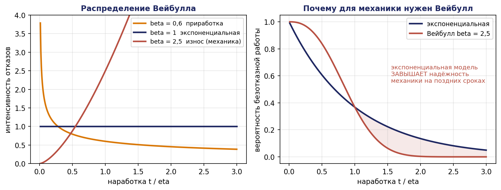
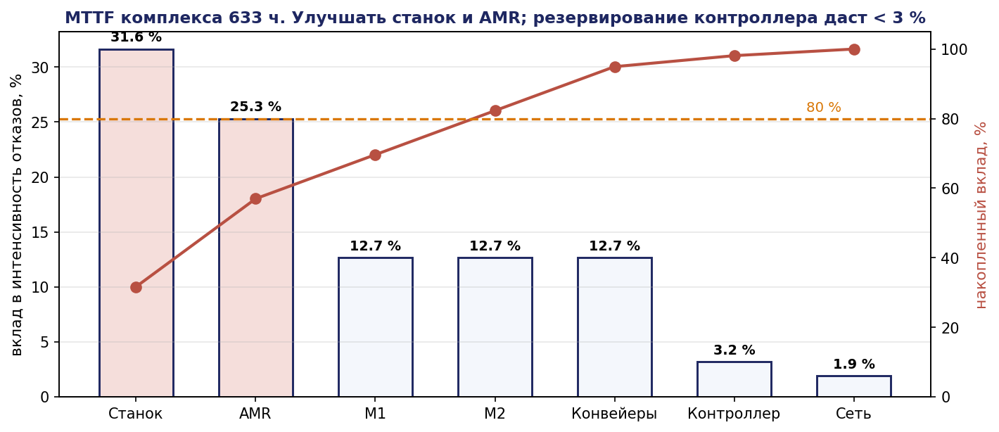
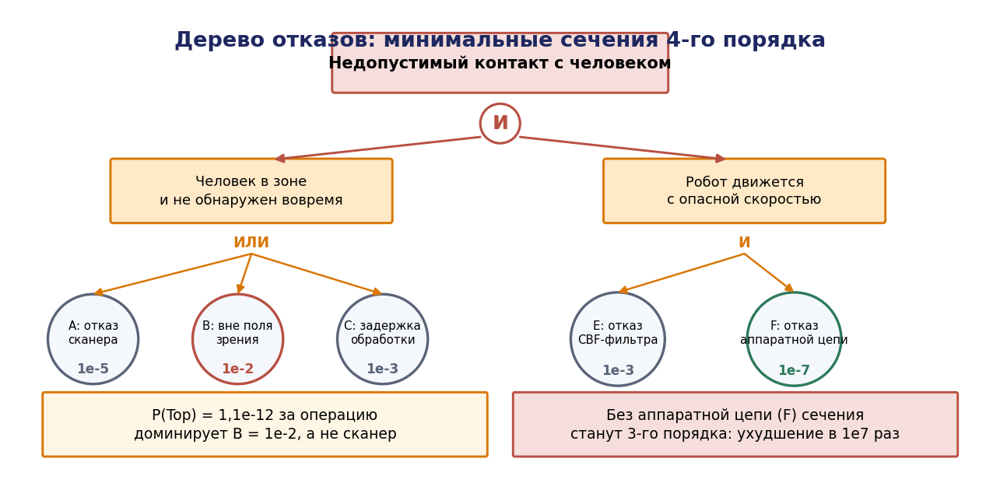
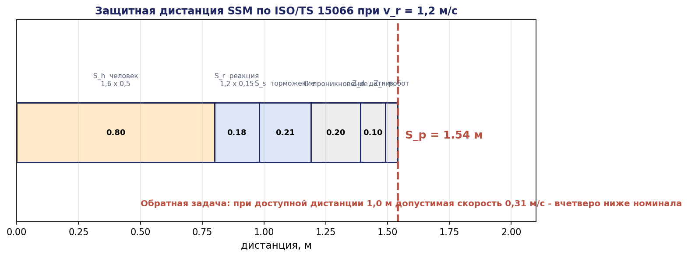

# Глава 16. Надёжность и функциональная безопасность

## 16.1. Введение: две разные задачи

Слова «надёжность» и «безопасность» часто употребляются как синонимы, что приводит к путанице в проектных требованиях. Различие принципиально.

**Надёжность** (reliability) отвечает на вопрос: как долго система выполняет свою функцию без отказа? Показатели — наработка на отказ, коэффициент готовности, вероятность безотказной работы. Целевая аудитория — эксплуатирующая организация, интересующаяся простоями и стоимостью владения.

**Функциональная безопасность** (functional safety) отвечает на вопрос: приведёт ли отказ к недопустимому вреду? Показатели — уровень производительности PL, уровень полноты безопасности SIL, вероятность опасного отказа в час PFH. Целевая аудитория — надзорные органы и служба охраны труда.

Эти свойства могут расходиться. Комплекс, останавливающийся раз в час по ложному срабатыванию защиты, ненадёжен, но безопасен. Комплекс, работающий месяцами без остановок, но не обнаруживающий отказ датчика присутствия, надёжен и опасен. Проект должен обеспечивать оба свойства, и их требования следует формулировать раздельно.

Настоящая глава излагает количественный аппарат надёжности, методы анализа отказов (FMEA, FTA), архитектуру обнаружения и восстановления (FDIR) и нормативную рамку функциональной безопасности робототехнических комплексов, включая коллаборативные операции.

## 16.2. Терминология

### 16.2.1. Цепочка «дефект — ошибка — отказ»

Классификация Авижениса и др.:

- **Дефект (fault)** — причина: физическое повреждение, ошибка проектирования, ошибка в программе, внешнее воздействие. Дефект может быть латентным (существовать, не проявляясь).
- **Ошибка (error)** — некорректное состояние системы, вызванное активацией дефекта.
- **Отказ (failure)** — событие, при котором предоставляемая услуга отклоняется от корректной, то есть ошибка вышла на границу системы.

Цепочка **дефект → ошибка → отказ** определяет три стратегии противодействия:

- **предотвращение дефектов** (fault prevention): методология разработки, формальные методы — главы 3, 4, 7, 8;
- **устранение дефектов** (fault removal): верификация, испытания — главы 7, 17;
- **терпимость к дефектам** (fault tolerance): обнаружение ошибок и восстановление до того, как они станут отказом, — настоящая глава;
- **прогнозирование** (fault forecasting): количественная оценка, чем и занимается теория надёжности.

Важное следствие: **не всякий дефект приводит к отказу**. Между ними — этап, на котором система может вмешаться. Проектирование терпимости к дефектам есть проектирование этого вмешательства.

### 16.2.2. Классификация отказов

| Признак | Классы |
|---|---|
| По области | аппаратные, программные, интерфейсные, человеческие |
| По времени | постоянные, перемежающиеся, транзиентные |
| По проявлению | явные (обнаруживаемые), скрытые (латентные) |
| По последствиям | безопасные (fail-safe), опасные (fail-dangerous) |
| По кратности | одиночные, множественные, отказы по общей причине |

Разделение на безопасные и опасные — основа функциональной безопасности: нормируется вероятность **опасного необнаруженного** отказа, а не отказа вообще.

Отказы по общей причине (common cause failures, CCF) заслуживают отдельного внимания: два резервированных канала, питаемых от одного источника или размещённых в одном корпусе, отказывают одновременно, и резервирование не работает. Учёт CCF — обязательная часть расчёта по ISO 13849.

## 16.3. Количественные показатели надёжности

### 16.3.1. Основные функции

**Вероятность безотказной работы:** $R(t) = P(T > t)$, где $T$ — время до отказа.

**Функция распределения отказов:** $F(t) = 1 - R(t)$.

**Интенсивность отказов:**

```math
\lambda(t) = f(t) / R(t) = -R'(t)/R(t)
```

откуда

```math
R(t) = \exp(-\int_0^t \lambda(u) du)
```

**Средняя наработка до отказа:** $\mathrm{MTTF} = \int_0^{\infty} R(t) dt$.

### 16.3.2. Экспоненциальная модель

При $\lambda(t) = \lambda = \mathit{const}$:


```math
R(t) = e^{-\lambda t}, \quad \mathrm{MTTF} = 1/\lambda
```

Постоянная интенсивность соответствует среднему участку «ванны» — периоду нормальной эксплуатации, между приработкой (убывающая $\lambda$) и износом (возрастающая $\lambda$). Для электроники это приближение приемлемо; для механики (подшипники, направляющие, редукторы) — нет, там применяется распределение Вейбулла:

```math
R(t) = \exp(-(t/\eta)^{\beta})
```

где $\beta < 1$ соответствует приработке, $\beta = 1$ — экспоненциальному случаю, $\beta > 1$ — износу. Для механических узлов робота типично $\beta = 2\ldots 3$.

Практический вывод: **применять экспоненциальную модель к механике некорректно** и приводит к недооценке отказов на поздних сроках службы. График плановых замен строится по Вейбуллу.




### 16.3.3. Системная надёжность

**Последовательная система** (отказ любого элемента — отказ системы):


$R_{\mathrm{sys}}(t) = \prod_i R_i(t)$;  при экспоненциальной модели $\lambda_{\mathrm{sys}} = \sum_i \lambda_i$

**Теорема 16.1.** Для последовательной системы из $n$ элементов с экспоненциальным распределением наработка на отказ системы

```math
\mathrm{MTTF}_{\mathrm{sys}} = 1 / \sum_i \lambda_i
```

*Доказательство.* $R_{\mathrm{sys}}(t) = \prod e^{-\lambda_i t} = e^{-(\Sigma \lambda_i)t}$, что есть экспоненциальное распределение с параметром $\Sigma \lambda_i$; отсюда $\mathrm{MTTF} = 1/\Sigma \lambda_i. \blacksquare$

**Параллельная система** (горячий резерв, отказ при отказе всех элементов):

```math
R_{\mathrm{sys}}(t) = 1 - \prod_i (1 - R_i(t))
```

Для двух одинаковых элементов: $R_{\mathrm{sys}} = 2e^{-\lambda t} - e^{-2\lambda t}, \mathrm{MTTF}_{\mathrm{sys}} = 2/\lambda - 1/(2\lambda) =$ **$1{,}5/\lambda$** — резервирование увеличивает наработку лишь в полтора раза, что часто оказывается неожиданностью.

**Числовой пример: комплекс примера Б.**

| Компонент | $\lambda$, ч⁻¹ | MTTF, ч |
|---|---|---|
| Манипулятор $M_1$ | $2{,}0\cdot 10^{-4}$ | 5 000 |
| Манипулятор $M_2$ | $2{,}0\cdot 10^{-4}$ | 5 000 |
| Станок $S$ | $5{,}0\cdot 10^{-4}$ | 2 000 |
| Конвейеры (2) | $1{,}0\cdot 10^{-4}$ | 10 000 |
| Управляющий контроллер | $5{,}0\cdot 10^{-5}$ | 20 000 |
| Сеть | $3{,}0\cdot 10^{-5}$ | 33 333 |
| AMR | $4{,}0\cdot 10^{-4}$ | 2 500 |

```math
\lambda_{\mathrm{sys}} = 2{,}0 + 2{,}0 + 5{,}0 + 2\cdot 1{,}0 + 0{,}5 + 0{,}3 + 4{,}0 (\text{ в единицах } 10^{-4}) = \boldsymbol{15{,}8\cdot 10^{-4} \text{ ч }^{-1}}
```

```math
\mathrm{MTTF}_{\mathrm{sys}} = 1/1{,}58\cdot 10^{-3} = \boldsymbol{633 \text{ часа }} \approx 79 \text{ смен по } 8 \text{ часов. }
```

То есть в среднем комплекс отказывает раз в четыре месяца при односменной работе — или раз в 3,3 недели при трёхсменной. Это цифра, которую эксплуатирующая организация должна знать до подписания контракта.

**Коэффициент готовности.** При среднем времени восстановления MTTR:

```math
A = \mathrm{MTTF} / (\mathrm{MTTF} + \mathrm{MTTR})
```

При $\mathrm{MTTR} = 4$ ч: $A = 633/637 =$ **0,9937**, то есть 0,63 % потерь времени, около 30 минут за 80-часовую рабочую неделю.

**Анализ вклада.** Доли в общей интенсивности отказов: станок 31,6 %, AMR 25,3 %, манипуляторы 25,3 % (два по 12,7 %), конвейеры 12,7 %, контроллер 3,2 %, сеть 1,9 %. Улучшать следует станок и AMR; резервирование контроллера даст менее 3 % улучшения и экономически не оправдано.

Такой анализ вклада — обязательный элемент проекта: он направляет ресурсы туда, где они дают эффект, а не туда, где улучшение технически проще.




## 16.4. Анализ видов и последствий отказов (FMEA)

### 16.4.1. Метод

FMEA — систематический индуктивный анализ «снизу вверх»: для каждого элемента перечисляются возможные виды отказов и прослеживаются их последствия.

Структура таблицы:

| Поле | Содержание |
|---|---|
| Элемент | компонент или функция |
| Вид отказа | как именно отказывает |
| Причина | физический механизм |
| Локальное последствие | что происходит в подсистеме |
| Системное последствие | что происходит с комплексом |
| Обнаружение | каким образом отказ становится известен |
| Тяжесть $S$ | 1–10 |
| Вероятность $O$ | 1–10 |
| Обнаруживаемость D | 1–10 (10 — не обнаруживается) |
| $\mathrm{RPN} = S\cdot O\cdot D$ | приоритет |
| Мера | что предпринимается |
| Остаточный риск | что остаётся после меры |

### 16.4.2. Критика приоритетного числа риска

Показатель $\mathrm{RPN} = S\cdot O\cdot D$ широко распространён и столь же широко критикуется. Основные возражения:

1. **Некорректность умножения порядковых шкал.** Значения S, O, D — ранги, а не измеримые величины; их произведение не имеет физического смысла. Разность между $S = 3$ и $S = 4$ не равна разности между $S = 8$ и $S = 9$.
2. **Одинаковый RPN при разной опасности.** Комбинации $(S=10, O=1, D=1)$ и $(S=1, O=10, D=1)$ дают $\mathrm{RPN} = 10$, но первая — катастрофический редкий отказ, вторая — частая мелочь. Управленчески это совершенно разные ситуации.
3. **Неравномерность шкалы:** из 1000 возможных значений RPN реализуется около 120 различных.

Стандарт AIAG/VDA (2019) заменил RPN на **приоритет действий** (Action Priority, AP) — таблицу, ставящую тяжесть на первое место. Практическая рекомендация: **использовать AP или матрицу «тяжесть × вероятность», а RPN — лишь как вспомогательный указатель**. Обязательное правило: при $S = 9-10$ мера принимается независимо от $O$ и D.

### 16.4.3. Фрагмент FMEA для примера А

| Элемент | Вид отказа | Системное последствие | Обнаружение | $S$ | $O$ | D | Мера | Остаточный риск |
|---|---|---|---|---|---|---|---|---|
| Захват | не удерживает объект | объект падает, возможно на человека | датчик наличия + монитор $M_2$ | 7 | 4 | 3 | контроль усилия, датчик наличия, ограничение зоны транспортировки | падение в момент между опросами |
| Камера | нет кадров | невозможно распознавание | QoS Deadline, таймаут | 4 | 3 | 2 | переход в режим ожидания | ложное срабатывание при кратковременной потере |
| Камера | ошибочная классификация | объект в неверном контейнере | сравнение с ожидаемым, порог доверия (гл. 12) | 5 | 5 | 6 | порог 0,94, повторное наблюдение | систематическая ошибка на новом типе объекта |
| Лидар | загрязнение окна | деградация локализации | оценка качества сопоставления | 6 | 5 | 5 | контроль ковариации, регламент чистки | постепенная деградация ниже порога |
| Локализация | расхождение оценки | робот едет не туда, возможен наезд | контроль ковариации, геозона | 8 | 3 | 4 | геозона в защитном слое (CBF), ограничение скорости | ошибка карты |
| Привод базы | отказ энкодера | неконтролируемое движение | контроль сходимости, сравнение с ИНС | 9 | 2 | 3 | останов категории 1 по аппаратной цепи | отказ самой цепи |
| Аккумулятор | ускоренный разряд | остановка в проходе | монитор напряжения, модель разряда | 4 | 4 | 2 | резерв 20 %, возврат на базу | ошибка модели остатка |
| Сеть Wi-Fi | потеря связи | потеря телеметрии и команд | Liveliness, таймаут | 5 | 6 | 2 | автономное завершение текущего навыка, останов | автономность недостаточна для сложного случая |
| Контроллер безопасности | отказ | защитные функции недоступны | самодиагностика, сторожевой таймер | 10 | 1 | 2 | сертифицированный контроллер PL d, диагностика | отказ по общей причине с диагностикой |

**Наблюдение.** Строки с $S = 9-10$ (отказ энкодера, отказ контроллера безопасности) требуют мер независимо от RPN. Строка «ошибочная классификация» с наибольшим D = 6 указывает на слабую обнаруживаемость — и именно она решается методами главы 12 (порог, выведенный из стоимостей), а не улучшением детектора.

## 16.5. Анализ дерева отказов (FTA)

### 16.5.1. Метод

FTA — дедуктивный анализ «сверху вниз»: задаётся нежелательное событие (top event), и строится логическая структура его причин через вентили И/ИЛИ.

FMEA и FTA дополняют друг друга: FMEA обнаруживает последствия известных отказов, FTA — все комбинации причин известного последствия. FMEA плохо обнаруживает множественные отказы; FTA — плохо обнаруживает неожиданные виды отказов.

### 16.5.2. Минимальные сечения

**Определение 16.1.** Сечением (cut set) называется множество базовых событий, одновременное наступление которых влечёт головное событие. Сечение **минимально**, если никакое его собственное подмножество не является сечением.

**Теорема 16.2 (представление через минимальные сечения).** Головное событие происходит тогда и только тогда, когда происходят все события хотя бы одного минимального сечения:

```math
\mathrm{Top} = \bigvee_{k} (\bigwedge_{e \in \mathrm{MCS}_k} e)
```

Вероятность головного события при независимости базовых событий вычисляется по формуле включений-исключений; при малых вероятностях применяется верхняя оценка (rare event approximation):

```math
P(\mathrm{Top}) \le \Sigma_k \prod_{e \in \mathrm{MCS}_k} P(e)
```

**Порядок сечения** (число элементов) — важнейший качественный показатель: сечение первого порядка означает, что **один** отказ приводит к катастрофе, то есть отсутствует резервирование. Обнаружение сечений первого порядка для критических событий — главная цель FTA.

### 16.5.3. Пример: наезд мобильного робота на человека

Головное событие: **робот движется и контактирует с человеком с недопустимым усилием**.


```
                    ТОП: недопустимый контакт
                              [И]
              ┌────────────────┴────────────────┐
      человек в зоне                    робот движется
    и не обнаружен вовремя           с опасной скоростью
              [ИЛИ]                          [И]
     ┌────────┼────────┐              ┌───────┴───────┐
  отказ    человек    задержка    команда       защитный слой
 сканера   вне поля   обработки   на движение   не сработал
   (A)     зрения(B)    (C)         (D)            [И]
                                              ┌─────┴─────┐
                                          отказ CBF   отказ аппаратной
                                          фильтра(E)   цепи (F)
```

**Минимальные сечения:** {A, D, E, F}, {B, D, E, F}, {C, D, E, F} — все четвёртого порядка.

Порядок 4 означает: для аварии необходимо одновременное совпадение четырёх независимых обстоятельств. Это хороший результат, свидетельствующий о глубокой защите.

**Численная оценка.** $P(A) = 10^{-5}$ за операцию, $P(B) = 10^{-2}, P(C) = 10^{-3}, P(D) = 1$ (робот движется — норма), $P(E) = 10^{-3}, P(F) = 10^{-7}$ (сертифицированная цепь PL d).

```math
P(\mathrm{Top}) \approx(10^{-5} + 10^{-2} + 10^{-3}) \cdot 1 \cdot 10^{-3} \cdot 10^{-7} \approx 1{,}1\cdot 10^{-2} \cdot 10^{-10} = \boldsymbol{1{,}1\cdot 10^{-12} \text{ за операцию }}
```

При $10^5$ операций в год: $1{,}1\cdot 10^{-7}$ в год — приемлемо для промышленного оборудования.

**Анализ чувствительности.** Доминирует $P(B) = 10^{-2}$ (человек вне поля зрения). Улучшение сканера (P(A)) бессмысленно — его вклад на три порядка меньше. Эффективно: расширение поля зрения, дополнительный сканер с другой стороны, организационные меры (разметка зон).

**Проверка на сечения первого порядка.** Если аппаратную цепь (F) убрать, полагаясь только на CBF-фильтр, сечения станут третьего порядка, и $P(\mathrm{Top}) \approx 1{,}1\cdot 10^{-5}$ за операцию — на семь порядков хуже. Это количественное обоснование требования независимой аппаратной цепи, сформулированного качественно в главах 1 и 9.




## 16.6. Обнаружение, локализация и восстановление (FDIR)

### 16.6.1. Этапы

**Обнаружение (Detection).** Установление факта отклонения. Методы:

- **предельный контроль**: величина вышла за допустимый диапазон;
- **аналитическая избыточность**: сравнение измерения с прогнозом модели (невязка, residual); отказ обнаруживается при превышении порога невязкой;
- **аппаратная избыточность**: сравнение показаний двух датчиков; при трёх — мажоритарное голосование;
- **контроль правдоподобия**: согласованность связанных величин (скорость и производная положения);
- **таймауты**: отсутствие ожидаемого события;
- **мониторы свойств** (глава 9): нарушение темпоральной спецификации.

**Локализация (Isolation).** Определение отказавшего компонента. Требует диагностируемости в смысле главы 2: если отказ не диагностируем, никакой алгоритм его не локализует. Для аналитической избыточности локализация достигается построением **структурированного набора невязок**, каждая из которых чувствительна к своему подмножеству отказов; матрица сигнатур отказов позволяет по картине сработавших невязок определить источник.

**Восстановление (Recovery).** Действие: повтор, переключение на резерв, деградация функций, безопасный останов, вызов оператора.

### 16.6.2. Порог обнаружения

Выбор порога невязки — компромисс между ложными тревогами и пропуском отказа. При гауссовом шуме невязки с $\sigma$ порог $3\sigma$ даёт вероятность ложной тревоги 0,27 % на проверку; при частоте 100 Гц это 16 ложных тревог в минуту — недопустимо. Практические меры: повышение порога (ценой пропуска малых отказов), требование подтверждения в течение $k$ последовательных проверок, фильтрация невязки.

**Оценка.** При требовании не более одной ложной тревоги в сутки при частоте проверок 100 Гц: допустимая вероятность на проверку $1/(100\cdot 86400) = 1{,}16\cdot 10^{-7}$, что соответствует порогу примерно $5{,}3\sigma$. Либо порог $3\sigma$ с подтверждением в 4 последовательных проверках: $(0{,}0027)^4 = 5{,}3\cdot 10^{-11}$ — с запасом, ценой задержки обнаружения 40 мс.

Второй вариант обычно предпочтителен: он сохраняет чувствительность к малым отказам ценой небольшой задержки. Величина задержки должна укладываться в бюджет времени реакции (глава 15).

### 16.6.3. Матрица режимов деградации

Ключевой проектный артефакт: для каждого отказа — в какой режим переходит комплекс.

| Отказ | Режим после отказа | Доступные функции | Условие возврата |
|---|---|---|---|
| Отказ манипулятора $M_2$ | деградация | производство через $M_1$ с удвоенным циклом | ремонт и проверка |
| Отказ камеры | ограниченный | работа с известными позициями, без распознавания | замена, калибровка |
| Потеря локализации | безопасный останов | телеуправление оператором | перелокализация |
| Отказ станка | останов линии | вывоз незавершённого производства | ремонт |
| Отказ контроллера безопасности | полный останов | нет | замена и проверка защитных функций |
| Потеря связи с MES | автономный | работа по последнему полученному заданию | восстановление связи |

Наличие такой матрицы отличает проект от прототипа. Каждая строка проверяется испытанием (глава 17): отказ вносится искусственно, и проверяется фактический переход в заявленный режим.

## 16.7. Функциональная безопасность: нормативная рамка

### 16.7.1. Оценка риска

Базовый стандарт ISO 12100 задаёт последовательность:

1. определение границ машины (пространственных, временных, по применению);
2. идентификация опасностей (механические, электрические, термические, шум, излучение, эргономические);
3. оценка риска: тяжесть вреда × вероятность (частота воздействия × вероятность события × возможность избежать);
4. оценка допустимости риска;
5. снижение риска в установленном порядке приоритетов;
6. повторная оценка (итеративно).

**Порядок снижения риска (обязательный):**

1. **Конструктивные меры** — устранение опасности: снизить массу подвижных частей, ограничить усилие механически, убрать острые кромки, исключить зоны защемления.
2. **Технические защитные меры** — ограждения, световые барьеры, сканеры, двуручное управление, блокировки.
3. **Информирование** — предупреждающие надписи, сигнализация, инструкции, обучение.

Порядок обязателен: нельзя заменять конструктивные меры табличкой. Это правило часто нарушается при быстрой разработке и является типовым замечанием при приёмке.

### 16.7.2. ISO 13849: уровень производительности

Стандарт ISO 13849-1 оценивает защитные функции (safety functions) по показателю **PL** (Performance Level) от $a$ (низший) до $e$ (высший).

**Требуемый уровень $\mathrm{PL}_r$** определяется по графику риска на основе трёх параметров:

- **$S$** — тяжесть травмы: S1 (лёгкая, обратимая), S2 (тяжёлая, необратимая или смерть);
- **$F$** — частота и длительность воздействия: F1 (редко), F2 (часто или постоянно);
- **$P$** — возможность избежать: P1 (возможно при определённых условиях), P2 (практически невозможно).

Комбинация даёт $\mathrm{PL}_r$ от $a$ до $e$. Для типичного промышленного робота с человеком, регулярно входящим в зону: $S_2, F_2, P_2 \to$ **$\mathrm{PL}_r = e$**; при редком входе: $S_2, F_1, P_2 \to \mathrm{PL}_r = d$.

**Достигнутый PL** определяется четырьмя факторами:

- **категория архитектуры** (B, 1, 2, 3, 4) — структура канала: одноканальная, одноканальная испытанная, с контролем, двухканальная, двухканальная с непрерывным контролем;
- **$\mathrm{MTTF}_d$** — средняя наработка до опасного отказа канала (низкая 3–10 лет, средняя 10–30, высокая 30–100);
- **DC** — диагностическое покрытие (доля обнаруживаемых опасных отказов): нет <60 %, низкое 60–90 %, среднее 90–99 %, высокое $\ge 99 \text{%}$;
- **CCF** — меры против отказов по общей причине (балльная оценка, требуется $\ge 65$ баллов).

Итоговый PL связан с вероятностью опасного отказа в час:

| PL | $\mathrm{PFH}_d$, ч⁻¹ | Типичное применение |
|---|---|---|
| $a$ | $10^{-5} \ldots 10^{-4}$ | минимальный риск |
| $b$ | $3\cdot 10^{-6} \ldots 10^{-5}$ | лёгкие травмы |
| $c$ | $10^{-6} \ldots 3\cdot 10^{-6}$ | средний риск |
| $d$ | $10^{-7} \ldots 10^{-6}$ | тяжёлые травмы, типично для роботов |
| $e$ | $10^{-8} \ldots 10^{-7}$ | высший уровень, опасность для жизни |

**Ключевое проектное следствие.** PL d практически недостижим одноканальной архитектурой: требуется категория 3 (два канала с взаимным контролем) при среднем $\mathrm{MTTF}_d$ и среднем DC. Это означает **два независимых датчика, два канала обработки, взаимная диагностика** — то есть архитектурное требование, определяющее стоимость и компоновку системы безопасности с самого начала проекта.

### 16.7.3. Что не засчитывается

Существенное и часто игнорируемое обстоятельство: в расчёт PL входят **только** компоненты, входящие в защитную функцию и удовлетворяющие требованиям стандарта к разработке, документации и диагностике.

Не засчитываются:

- обычный программируемый контроллер без сертификации по функциональной безопасности;
- алгоритмы восприятия на основе машинного обучения (нет возможности оценить систематические отказы);
- CBF-фильтр, реализованный в обычном программном обеспечении;
- мониторы темпоральных свойств;
- логика дерева поведения.

Все эти средства (главы 6, 9, 12) **повышают надёжность и качество**, но не заменяют сертифицированный контур. Проект, в котором безопасность обеспечивается только ими, не пройдёт приёмку.

Правильная формулировка в проектной документации: «защитная функция „останов при входе в зону" реализована сканером безопасности категории 3 PL d; дополнительно реализованы программные средства предупреждения (CBF-фильтр, монитор дистанции), не входящие в состав защитной функции и не учитываемые при оценке риска».

## 16.8. Коллаборативные операции: ISO/TS 15066

### 16.8.1. Четыре режима

Техническая спецификация ISO/TS 15066 (дополняющая ISO 10218) определяет четыре режима коллаборативной работы.

**1. Останов с контролем безопасности (Safety-rated monitored stop).** Робот останавливается при входе человека в рабочую зону, сохраняя питание приводов; движение возобновляется после выхода человека. Простейший и наиболее распространённый режим.

**2. Ручное направление (Hand guiding).** Оператор перемещает робота вручную через устройство с кнопкой разрешения; скорость ограничена.

**3. Контроль скорости и дистанции (Speed and Separation Monitoring, SSM).** Робот и человек работают одновременно; скорость робота регулируется так, чтобы защитная дистанция не нарушалась.

**4. Ограничение мощности и силы (Power and Force Limiting, PFL).** Допускается контакт, но усилие и давление ограничены значениями, не вызывающими травмы. Требует специальной конструкции робота (коботы) и таблиц предельных значений по частям тела.

### 16.8.2. Расчёт защитной дистанции для SSM

Защитная дистанция вычисляется по формуле:


```math
S_p(t_0) = S_h + S_r + S_s + C + Z_d + Z_r
```

где

- **$S_h$** — путь человека за время реакции и торможения робота: $S_h = \int v_h(t) dt$, при постоянной скорости $v_h\cdot(T_r + T_s)$; нормативное значение $v_h = 1{,}6$ м/с;
- **$S_r$** — путь робота за время реакции системы: $v_r \cdot T_r$;
- **$S_s$** — тормозной путь робота: $v_r \cdot T_s / 2$ при постоянном замедлении (либо по паспортным данным);
- **C** — глубина проникновения (для рук — 0,2 м);
- **$Z_d$** — погрешность датчика положения человека;
- **$Z_r$** — погрешность системы позиционирования робота.

**Числовой пример.** Мобильный манипулятор примера А: скорость базы $v_r = 1{,}2$ м/с; время реакции системы $T_r = 0{,}15$ с; время торможения $T_s = 0{,}35$ с; погрешности $Z_d = 0{,}10$ м, $Z_r = 0{,}05$ м; $C = 0{,}20$ м.

```math
\begin{gathered} S_h = 1{,}6 \cdot(0{,}15 + 0{,}35) = 0{,}80 \text{ м } \cr S_r = 1{,}2 \cdot 0{,}15 = 0{,}18 \text{ м } \cr S_s = 1{,}2 \cdot 0{,}35 / 2 = 0{,}21 \text{ м } \end{gathered}
```

```math
S_p = 0{,}80 + 0{,}18 + 0{,}21 + 0{,}20 + 0{,}10 + 0{,}05 = \boldsymbol{1{,}54 \text{ м }}
```

То есть робот обязан обнаруживать человека и начинать реакцию на расстоянии не менее 1,54 м. Если дальность сканера 4 м, запас достаточен.

**Обратная задача: допустимая скорость.** Пусть проход имеет ширину, позволяющую обеспечить дистанцию лишь 1,0 м. Найдём допустимую скорость:

```math
1{,}0 = 1{,}6\cdot(0{,}15 + T_s) + v_r\cdot 0{,}15 + v_r\cdot T_s/2 + 0{,}35
```

где $T_s$ зависит от скорости: при постоянном замедлении $a = 1{,}5$ м/с$^2, T_s = v_r/1{,}5$.

```math
\begin{gathered} 1{,}0 = 0{,}24 + 1{,}6\cdot v_r/1{,}5 + 0{,}15\cdot v_r + v_r^2/3 + 0{,}35 \cr 0{,}41 = 1{,}0667\cdot v_r + 0{,}15\cdot v_r + 0{,}3333\cdot v_r^2 \cr 0{,}3333\cdot v_r^2 + 1{,}2167\cdot v_r - 0{,}41 = 0 \cr v_r = [ -1{,}2167 + \sqrt{1{,}4804 + 0{,}5466} ] / 0{,}6667 = (-1{,}2167 + 1{,}4237) / 0{,}6667 = \boldsymbol{0{,}311 \text{ м }/\text{ с }} \end{gathered}
```

В узком проходе робот обязан двигаться не быстрее 0,31 м/с — вчетверо медленнее номинала. Это конкретное проектное ограничение, которое должно быть заложено в логику (режим SLOW гибридного автомата главы 9) и учтено при расчёте производительности (глава 5).

Обратим внимание, что здесь смыкаются четыре главы: норматив даёт формулу, формула даёт ограничение скорости, ограничение реализуется режимом гибридного автомата с гистерезисом и минимальным временем пребывания, а его влияние на производительность оценивается моделью пропускной способности. Это характерный пример того, как требование безопасности проходит через весь проект.




### 16.8.3. Категории останова (IEC 60204-1)

| Категория | Механизм | Применение |
|---|---|---|
| 0 | немедленное снятие питания с приводов | наибольшая опасность; риск неконтролируемого движения по инерции и падения груза |
| 1 | управляемый останов с последующим снятием питания | предпочтительна для роботов с грузом |
| 2 | управляемый останов с сохранением питания | останов с контролем безопасности в коллаборативных режимах |

Выбор категории — проектное решение с неочевидным компромиссом: категория 0 кажется самой безопасной, но снятие питания с манипулятора, удерживающего груз, приводит к падению груза и потере управления траекторией торможения. Для большинства РТК правильный выбор — категория 1.

## 16.9. Разбор: план обеспечения безопасности для примера А

**Шаг 1. Границы и опасности.** Робот работает в помещении, куда имеют доступ сотрудники. Опасности: наезд базой, удар манипулятором, защемление между роботом и препятствием, падение переносимого предмета, опрокидывание при резком манёвре.

**Шаг 2. Оценка риска (для наезда).** S2 (возможна тяжёлая травма при массе робота 80 кг и скорости 1,2 м/с), F2 (люди в помещении постоянно), P2 (робот может подъехать сзади) → **$\mathrm{PL}_r = e$**.

Полученный уровень $e$ требует крайне высокой надёжности защитной функции. Рассмотрим снижение риска по порядку приоритетов.

**Шаг 3. Конструктивные меры.** Снижение максимальной скорости до 0,8 м/с и массы за счёт компоновки; скругление обводов; амортизирующий бампер. Пересчёт: при $v = 0{,}8$ м/с и наличии бампера тяжесть травмы снижается до S1 → **$\mathrm{PL}_r = c$** для функции ограничения скорости, при сохранении $\mathrm{PL}_r = d$ для функции останова.

Это иллюстрирует главный принцип: **конструктивная мера снижает требуемый уровень защитной функции**, что дешевле, чем строить архитектуру категории 4.

**Шаг 4. Технические защитные меры.**

| Защитная функция | $\mathrm{PL}_r$ | Реализация | Категория |
|---|---|---|---|
| Останов при обнаружении человека вблизи | $d$ | сканер безопасности + контроллер безопасности | 3 |
| Ограничение скорости в зоне присутствия | $c$ | контроль скорости в контроллере безопасности | 2 |
| Аварийный останов | $d$ | кнопки, аппаратная цепь, категория останова 1 | 3 |
| Ограничение зоны движения | $c$ | геозона в контроллере безопасности | 2 |

**Шаг 5. Дополнительные (не засчитываемые) средства.** CBF-фильтр для плавного замедления, монитор дистанции, ограничение усилия захвата, дерево поведения с приоритетом безопасности. Эти средства снижают частоту срабатывания защитных функций и повышают производительность, но не входят в расчёт PL.

**Шаг 6. Проверка расчётом.** Для функции останова: категория $3, \mathrm{MTTF}_d = 40$ лет (высокая), $\mathrm{DC} = 95 \text{%}$ (среднее), $\mathrm{CCF} \ge 65$ баллов → по таблице ISO 13849-1 достигается **PL d**. Требование выполнено.

**Шаг 7. Матрица деградации и испытания.** Каждая защитная функция проверяется испытанием с внесением отказа: отключение сканера, обрыв цепи, отказ канала. Результаты — в протокол приёмки (глава 17).

**Шаг 8. Остаточные риски.** Документируются: человек, лежащий на полу (вне поля зрения сканера); отказ по общей причине двух каналов; ошибка карты, приводящая к движению в зону с людьми. Для каждого — организационная мера или принятие риска с обоснованием.

## 16.10. Выводы

1. Надёжность и функциональная безопасность — разные свойства с разными показателями и разными адресатами; они могут расходиться, и требования формулируются раздельно.
2. Цепочка «дефект — ошибка — отказ» содержит этап, на котором система может вмешаться; проектирование терпимости к дефектам есть проектирование этого вмешательства.
3. Экспоненциальная модель применима к электронике, но не к механике, для которой требуется распределение Вейбулла; горячее резервирование увеличивает наработку лишь в полтора раза.
4. Анализ вклада компонентов в общую интенсивность отказов направляет ресурсы туда, где они дают эффект.
5. Показатель RPN методологически некорректен; следует использовать приоритет действий или матрицу «тяжесть × вероятность», а при высокой тяжести принимать меры независимо от прочих факторов.
6. Минимальные сечения FTA дают качественный критерий: сечение первого порядка означает отсутствие резервирования; численная оценка указывает доминирующий вклад и направление улучшения.
7. Порог обнаружения отказа выбирается расчётом по допустимой частоте ложных тревог; подтверждение в нескольких последовательных проверках предпочтительнее повышения порога.
8. В расчёт уровня PL входят только сертифицированные компоненты; CBF-фильтры, мониторы и обучаемые модели повышают качество, но не заменяют защитный контур.
9. Формула защитной дистанции SSM даёт конкретное ограничение скорости, которое проходит через логику режимов, гибридный автомат и расчёт производительности.
10. Конструктивная мера, снижающая тяжесть последствий, снижает требуемый уровень защитной функции и обычно дешевле её усиления.

## 16.11. Контрольные вопросы

1. Приведите пример системы надёжной, но небезопасной, и наоборот.
2. Объясните различие дефекта, ошибки и отказа. Почему это различие проектно значимо?
3. Почему экспоненциальная модель неприменима к механическим узлам?
4. Выведите MTTF параллельной системы из двух одинаковых элементов. Почему выигрыш составляет лишь 1,5 раза?
5. Перечислите три возражения против RPN и назовите принятую замену.
6. Что означает минимальное сечение первого порядка и почему его наличие критично?
7. Как выбирается порог обнаружения отказа? Сравните два способа снижения частоты ложных тревог.
8. Какие компоненты не засчитываются при расчёте PL и почему?
9. Выведите допустимую скорость робота из формулы защитной дистанции при заданной ширине прохода.
10. Почему для робота, переносящего груз, категория останова 1 предпочтительнее категории 0?

## 16.12. Задачи

**Задача 16.1.** Рассчитайте MTTF и коэффициент готовности комплекса примера Б при $\mathrm{MTTR} = 2, 4$ и 8 часов. Постройте график зависимости потерь рабочего времени от MTTR.

**Задача 16.2.** Определите вклад каждого компонента и постройте диаграмму Парето. Какие два компонента следует улучшать в первую очередь?

**Задача 16.3.** Оцените выигрыш от резервирования управляющего контроллера и от снижения $\lambda$ станка вдвое. Сравните эффект.

**Задача 16.4.** Постройте распределение Вейбулла для механического узла с $\beta = 2{,}5$ и $\eta = 6000$ ч. Определите вероятность безотказной работы на 3000 ч и оптимальный интервал плановой замены при заданных стоимостях планового и аварийного ремонта.

**Задача 16.5.** Составьте FMEA для примера Б (не менее 15 строк) с оценкой по приоритету действий AP вместо RPN.

**Задача 16.6.** Постройте дерево отказов для события «деталь повреждена при обработке» в примере Б. Найдите минимальные сечения и вычислите вероятность головного события.

**Задача 16.7.** Постройте дерево отказов для события «робот покидает разрешённую зону» в примере А. Есть ли сечения первого порядка? Если да, предложите меру.

**Задача 16.8.** Постройте марковскую модель надёжности с ремонтом (исправен — деградация — отказ, с ремонтом из каждого состояния). Вычислите стационарный коэффициент готовности и сравните со стратегией «ремонт только после отказа».

**Задача 16.9.** Рассчитайте защитную дистанцию SSM для манипулятора со скоростью TCP 1,5 м/с, временем реакции 0,1 с и временем торможения 0,25 с. Определите допустимую скорость при доступной дистанции 0,7 м.

**Задача 16.10.** Проведите оценку риска по ISO 12100 для трёх опасностей примера А. Определите $\mathrm{PL}_r$ для каждой защитной функции и предложите архитектуру, обеспечивающую требуемый уровень.

**Задача 16.11.** Составьте матрицу режимов деградации для примера Б (не менее 8 отказов) и программу испытаний с внесением каждого отказа.

**Задача 16.12.** Реализуйте в Webots ограничение скорости по формуле SSM: при обнаружении человека скорость ограничивается так, чтобы защитная дистанция соблюдалась. Проверьте при разных дистанциях и постройте график $v(d)$.

## 16.13. Литература к главе

1. Avizienis A., Laprie J.-C., Randell B., Landwehr C. Basic Concepts and Taxonomy of Dependable and Secure Computing // IEEE Transactions on Dependable and Secure Computing. — 2004. — Vol. 1, No. 1. — P. 11–33.
2. ISO 12100:2010. Safety of machinery — General principles for design — Risk assessment and risk reduction.
3. ISO 13849-1:2023. Safety of machinery — Safety-related parts of control systems — Part 1: General principles for design.
4. IEC 62061:2021. Safety of machinery — Functional safety of safety-related control systems.
5. ISO 10218-1:2011, ISO 10218-2:2011. Robots and robotic devices — Safety requirements for industrial robots.
6. ISO/TS 15066:2016. Robots and robotic devices — Collaborative robots.
7. IEC 60204-1:2016. Safety of machinery — Electrical equipment of machines.
8. IEC 61025:2006. Fault tree analysis (FTA).
9. IEC 60812:2018. Failure modes and effects analysis (FMEA and FMECA).
10. AIAG & VDA FMEA Handbook. — 2019.
11. Ding S. X. Model-Based Fault Diagnosis Techniques. 2nd ed. — Springer, 2013.
12. Rausand M., Høyland A. System Reliability Theory: Models, Statistical Methods, and Applications. 2nd ed. — Wiley, 2004.
