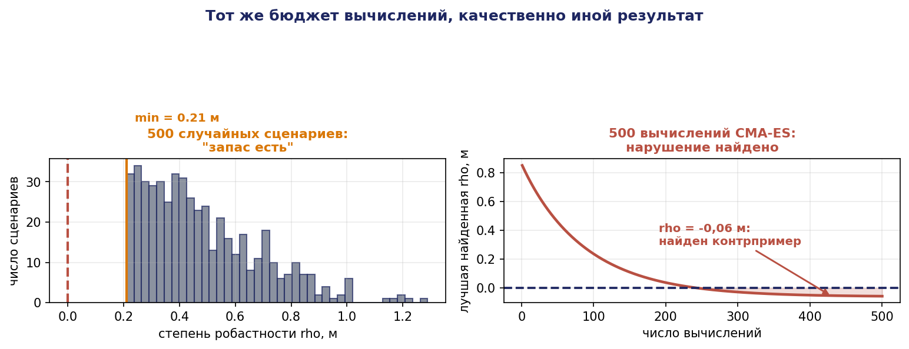
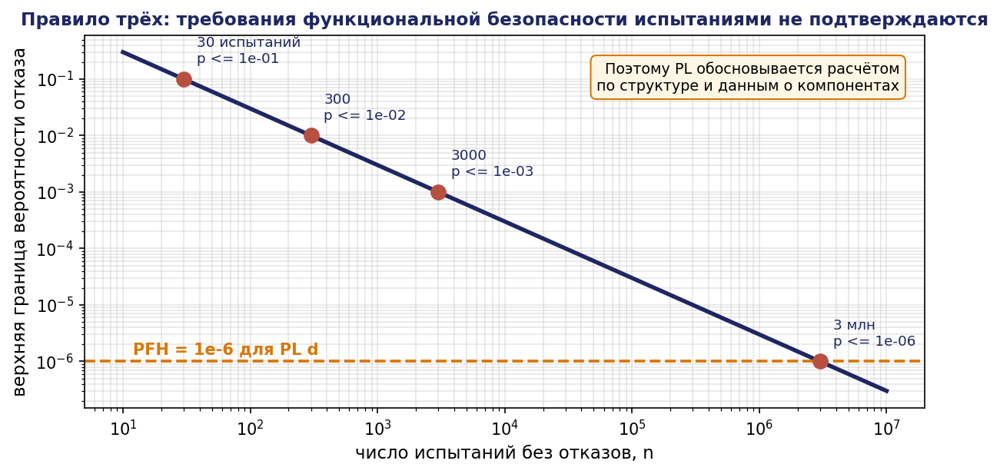
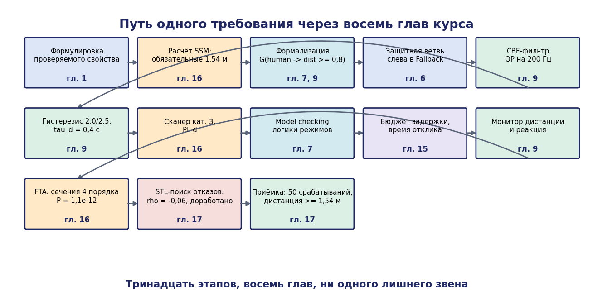

# Глава 17. Верификация, валидация и приёмка комплекса

## 17.1. Введение: два разных вопроса

Завершающая глава посвящена вопросу, которым проект заканчивается: **как доказать, что комплекс готов к сдаче**.

Различают два вопроса, часто смешиваемые.

**Верификация (verification)** — «построили ли мы систему правильно?» Соответствует ли реализация спецификации. Средства: проверка моделей (глава 7), анализ (главы 3, 4, 15, 16), модульные и интеграционные испытания.

**Валидация (validation)** — «построили ли мы правильную систему?» Решает ли она задачу заказчика в реальных условиях. Средства: испытания в условиях эксплуатации, оценка сценариев, обратная связь от пользователя.

Система может быть безупречно верифицирована и совершенно непригодна: если спецификация не отражала действительную задачу, корректная реализация неверной спецификации остаётся неверной. Обратно, система может решать задачу заказчика, содержа при этом дефекты, которые проявятся позже.

Классический источник провалов — комплекс, безукоризненно работающий по техническому заданию, но непригодный, потому что реальные заготовки поступают в паллетах с отклонениями, которых не было в спецификации, а оператор в действительности не имеет времени на предусмотренные регламентом действия.

Настоящая глава излагает: требования к цифровому двойнику, оценку разрыва между симуляцией и реальностью, структуру проверок, формальные методы поиска отказов на основе робастной семантики темпоральной логики, матрицу трассируемости, статистическое обоснование объёма испытаний и программу приёмки.

## 17.2. Цифровой двойник

### 17.2.1. Три уровня

Термин «цифровой двойник» употребляется в трёх существенно разных смыслах; их смешение приводит к завышенным ожиданиям.

**Цифровая модель.** Модель без автоматической связи с объектом. Используется на этапе проектирования: расчёты, симуляция, обучение операторов. Именно этот уровень реализуется в сквозном проекте курса.

**Цифровая тень.** Односторонняя автоматическая связь «объект → модель»: модель обновляется данными с оборудования. Позволяет наблюдать, диагностировать, накапливать статистику.

**Цифровой двойник.** Двусторонняя связь: модель не только отражает объект, но и воздействует на него (оптимизирует режимы, перепланирует, предупреждает отказы).

**Практическое замечание.** Большинство систем, называемых цифровыми двойниками, суть цифровые тени. Это не недостаток — цифровая тень уже даёт значительную ценность (мониторинг, диагностика, обучение моделей), — но проектные требования и стоимость различаются на порядок, и в техническом задании уровень должен быть указан явно.

### 17.2.2. Требование к точности

Модель не обязана быть точной во всём — она обязана быть **достаточно точной для тех выводов, которые на её основании делаются**. Это ключевой методический принцип, избавляющий от бесконечного уточнения.

| Вывод, ради которого строится модель | Что должно воспроизводиться точно | Что можно упростить |
|---|---|---|
| Проверка логики миссии | последовательности событий, условия переходов | динамика, контакты, шумы |
| Оценка производительности | длительности операций, ресурсные конфликты | геометрия захвата, трение |
| Проверка достижимости и коллизий | геометрия, кинематика | динамика, шумы датчиков |
| Отработка захвата | контактная динамика, трение, податливость | производительность линии |
| Проверка алгоритмов восприятия | модель камеры, освещение, текстуры | динамика приводов |
| Проверка временных требований | задержки, периодичность, загрузка | физика |

Из таблицы следует практический вывод: **одной модели для всех целей не бывает**, и попытка построить универсальный «полный» двойник экономически несостоятельна. Строится набор моделей разного уровня детализации, каждая — под свой класс выводов.

## 17.3. Разрыв между симуляцией и реальностью

### 17.3.1. Источники расхождения

| Источник | Проявление | Мера |
|---|---|---|
| Контактная динамика | захват держит в симуляции, срывается в реальности | измерение трения, податливые модели, запас усилия |
| Трение и люфты в приводах | иное время отработки, статическая ошибка | идентификация параметров по реальным данным |
| Шум и артефакты датчиков | восприятие работает в симуляции, не работает в реальности | внесение реалистичного шума, запись реальных данных |
| Задержки вычислений и сети | контур устойчив в симуляции, колеблется в реальности | моделирование задержек, анализ по главе 15 |
| Освещение и текстуры | детектор не переносится | рандомизация условий, дообучение на реальных данных |
| Погрешности сборки и калибровки | систематическое смещение | калибровка, внесение погрешности в модель |
| Износ и загрязнение | деградация со временем | испытания на ресурс, мониторинг |

### 17.3.2. Измерение разрыва

Разрыв следует не просто признавать, а **измерять**. Процедура:

1. Выбрать набор наблюдаемых величин: время выполнения операции, конечная погрешность позиционирования, доля успешных захватов, потребляемый ток, длина пройденного пути.
2. Провести серию одинаковых сценариев в симуляции и на реальном оборудовании (не менее 20 прогонов каждого).
3. Для каждой величины вычислить смещение (разность средних) и различие разбросов.
4. Проверить статистическую значимость различий.
5. Для величин со значимым расхождением — либо уточнить модель, либо явно зафиксировать поправочный коэффициент.

**Пример.** Симуляция даёт время цикла $52{,}3 \pm 1{,}1$ с; реальная ячейка — $58{,}7 \pm 3{,}4$ с. Смещение 6,4 с (12 %), разброс втрое больше. Вывод: симуляция систематически оптимистична; для планирования применять поправку +12 % и закладывать резерв по разбросу. Одновременно расхождение указывает на неучтённый фактор (вероятнее всего — время ожидания синхронизации или переналадки), который следует найти и внести в модель.

Зафиксированный и измеренный разрыв — приемлемый инженерный результат; неизмеренный разрыв — источник срыва пусконаладки.

### 17.3.3. Методы сокращения разрыва

**Идентификация системы.** Параметры модели (массы, трение, постоянные времени приводов) определяются по данным реального оборудования решением задачи наименьших квадратов, а не берутся из каталога.

**Рандомизация области (domain randomization).** Параметры модели при каждом прогоне случайно варьируются в широком диапазоне. Алгоритм, работающий при всех вариантах, с высокой вероятностью работает и в реальности. Применяется преимущественно для обучаемых компонентов.

**Обучение с адаптацией к реальности.** Небольшой объём реальных данных используется для коррекции модели или дообучения.

**Проектирование с запасом.** Наиболее надёжный и наименее модный подход: если требуется точность 15 мм, обеспечивать 5 мм; если требуется усилие 30 Н, проверять при 45 Н. Запас — единственная защита от неучтённых факторов, и правило «двойного запаса» из главы 11 применимо повсеместно.

## 17.4. Пирамида проверок

| Уровень | Объект | Метод | Частота |
|---|---|---|---|
| 1. Модульный | функция, класс, узел-действие | автоматические тесты | при каждом изменении |
| 2. Компонентный | подсистема (восприятие, навигация, супервизор) | тесты с записанными данными, стенд | ежедневно |
| 3. Интеграционный | взаимодействие подсистем | симуляция, проверка интерфейсов | еженедельно |
| 4. Сценарный | комплекс в сценариях | симуляция + стенд | перед этапами |
| 5. Приёмочный | комплекс в условиях эксплуатации | реальное оборудование по программе | однократно + периодически |

**Принцип: дефект должен обнаруживаться на минимально возможном уровне.** Стоимость обнаружения и исправления растёт на порядок с каждым уровнем. Дефект, выявленный модульным тестом, стоит минуты; тот же дефект, выявленный на приёмке, — недели.

**Практическое замечание о формальных методах.** Проверка моделей (глава 7) и синтез (главы 3, 8) относятся к «уровню 0» — они действуют раньше кодирования и предотвращают целые классы дефектов. Их стоимость — время на построение модели; их выигрыш — отсутствие дефектов, которые тестами на любом уровне обнаруживаются лишь случайно.

## 17.5. Сценарное тестирование и поиск отказов

### 17.5.1. Проблема комбинаторного взрыва

Пространство сценариев огромно: положения объектов, типы, освещение, поведение человека, отказы, порядок событий. Полный перебор невозможен.

**Комбинаторное покрытие.** Практическое наблюдение: большинство дефектов вызывается взаимодействием не более двух-трёх факторов. Отсюда метод **попарного покрытия** (pairwise, 2-wise): строится минимальный набор тестов, в котором каждая пара значений каждой пары факторов встречается хотя бы раз.

**Пример.** Факторы: тип предмета (4 значения), освещённость (3), положение на столе (5), наличие соседнего предмета (2), состояние захвата (2). Полный перебор: $4\cdot 3\cdot 5\cdot 2\cdot 2 = 240$ сценариев. Попарное покрытие: около 20 сценариев — на порядок меньше при сохранении обнаружения парных взаимодействий.

Инструменты: PICT (Microsoft), ACTS (NIST), allpairspy (Python).

### 17.5.2. Робастная семантика темпоральной логики

Обычная проверка сценария даёт двоичный ответ: спецификация выполнена или нет. Это расточительно: сценарий, в котором дистанция до человека составила 0,81 м при требуемых 0,80 м, формально успешен, но фактически находится на грани. Такая информация должна использоваться.

**Signal Temporal Logic (STL)** расширяет LTL на непрерывные сигналы и вводит **степень робастности** — числовую меру запаса.

Синтаксис STL: атомарные предикаты вида $\mu(x) \ge 0$ (где $\mu$ — вещественная функция сигнала), булевы связки и темпоральные операторы с интервалами: $F_{[a,b]}, G_{[a,b]}, U_{[a,b]}$.

**Определение 17.1 (робастность).** Степень робастности $\rho(\varphi, x, t)$ сигнала $x$ относительно формулы $\varphi$ в момент $t$ определяется рекурсивно:

```math
\begin{gathered} \rho(\mu \ge 0, x, t) = \mu(x(t)) \cr \rho(\neg \varphi, x, t) = -\rho(\varphi, x, t) \cr \rho(\varphi \wedge \psi, x, t) = \min(\rho(\varphi,x,t), \rho(\psi,x,t)) \cr \rho(\varphi \vee \psi, x, t) = \max(\rho(\varphi,x,t), \rho(\psi,x,t)) \cr \rho(G_{[a,b]} \varphi, x, t) = \min_{\tau \in [t+a, t+b]} \rho(\varphi, x, \tau) \cr \rho(F_{[a,b]} \varphi, x, t) = \max_{\tau \in [t+a, t+b]} \rho(\varphi, x, \tau) \end{gathered}
```

**Теорема 17.1 (корректность робастной семантики).** Если $\rho(\varphi, x, 0) > 0$, то сигнал $x$ удовлетворяет $\varphi$; если $\rho(\varphi, x, 0) < 0$, то не удовлетворяет.

*Доказательство (индукция по структуре формулы).*

База: для атомарного предиката $\mu(x) \ge 0$ робастность равна $\mu(x(t))$; её положительность есть в точности выполнение предиката.

Шаг для конъюнкции: $\rho(\varphi \wedge \psi) = \min(\rho(\varphi), \rho(\psi)) > 0 \iff$ обе робастности положительны $\iff$ (по предположению индукции) обе формулы выполняются $\iff$ конъюнкция выполняется. Аналогично для дизъюнкции с max и для отрицания со сменой знака.

Шаг для $G_{[a,b]}: \rho = \min$ по интервалу; положительность минимума эквивалентна положительности во всех точках интервала, что по предположению индукции эквивалентно выполнению $\varphi$ во всех точках, то есть выполнению $G_{[a,b]}\varphi$. Аналогично для $F$ с max. ∎

**Теорема 17.2 (свойство запаса).** Если $\rho(\varphi, x, 0) = r > 0$, то всякий сигнал $x'$ с $\lVert x' - x\rVert_\infty < r$ также удовлетворяет $\varphi$.

Эта теорема придаёт робастности прямой инженерный смысл: **$r$ есть величина возмущения, которое сценарий выдержит**. Результат испытания перестаёт быть двоичным и становится измеримым запасом.

### 17.5.3. Поиск отказов оптимизацией

Робастность превращает поиск нарушающего сценария в задачу **минимизации**: параметры сценария (положения объектов, моменты появления человека, длительности) варьируются с целью минимизировать $\rho$. Отрицательное значение означает найденный контрпример; малое положительное — сценарий, близкий к нарушению.


```
Вход: параметризованный сценарий S(θ), θ ∈ Θ; формула φ
1. θ* ← arg min_{θ ∈ Θ} ρ(φ, x_{S(θ)}, 0)
   (оптимизация: имитация отжига, CMA-ES, байесовская оптимизация)
2. если ρ(θ*) < 0 — найден контрпример S(θ*)
3. иначе — минимальный запас ρ(θ*) есть мера безопасности проекта
```

Это принципиально эффективнее случайного перебора: оптимизация **целенаправленно движется** к нарушению, а не ждёт, пока оно встретится.

**Пример для примера А.** Спецификация: $G_{[0,T]} (\text{human_detected} \to(\mathit{dist} \ge 0{,}8))$. Параметры сценария: момент появления человека $t_h \in [0, 60]$ с, его скорость $v_h \in [0{,}5; 1{,}6]$ м/с, направление подхода $\alpha \in [0, 2\pi)$, положение робота в момент появления.

Случайный перебор 500 сценариев даёт $\min \rho = 0{,}21$ м — «запас есть». Оптимизация (CMA-ES, 500 вычислений) находит $\theta^{*}$ с $\rho = -0{,}06$ м: человек, появляющийся сбоку в момент, когда робот выполняет разворот, а сканер имеет минимальное покрытие в этом секторе.

**Тот же бюджет вычислений, качественно иной результат.** Это главный практический аргумент за оптимизационный поиск отказов.

Инструменты: S-TaLiRo, Breach (MATLAB), psy-taliro, RTAMT (Python).




### 17.5.4. Место метода

Поиск отказов оптимизацией не заменяет ни проверку моделей (она даёт исчерпывающий ответ для дискретной модели), ни приёмочные испытания (они проверяют реальную систему). Он занимает нишу между ними: **исчерпывающий анализ непрерывных сценариев невозможен, случайное тестирование неэффективно, оптимизационный поиск даёт лучшее из достижимого**.

## 17.6. Матрица трассируемости

Центральный документ приёмки. Каждое требование прослеживается до подтверждающего артефакта.

| ID | Требование | Класс | Формализация | Проверка | Артефакт | Результат | Остаточный риск |
|---|---|---|---|---|---|---|---|
| R1 | Манипулятор не движется при движении базы | безопасность | $G \neg(\mathit{base}_{mv} \wedge \mathit{arm}_{mv})$ | model checking + монитор $M_3$ | отчёт NuSMV, лог 50 циклов | выполнено | одновременность в пределах такта 20 мс |
| R2 | Предмет не теряется до укладки | целостность | G(held → held U placed) | монитор $M_2 + 200$ циклов | лог, 3 срыва, все восстановлены | выполнено | срыв при массе > 0,5 кг не проверялся |
| R3 | Каждый предмет уложен или помечен недоступным | живость | $G(\det \to F(pl \vee \mathit{unr}))$ | сценарные испытания, 30 прогонов | протокол | выполнено | при более чем 12 предметах не проверялось |
| R4 | Миссия за 15 мин | производительность | $G(\mathit{start} \to F_{\le 900\text{ с }} \mathit{done})$ | 20 прогонов | статистика: $11{,}4 \pm 1{,}8$ мин | выполнено | верхняя граница 95 %: 15,1 мин — на грани |
| R5 | Останов за 0,5 с | безопасность | $G(\mathit{estop} \to F_{\le 0{,}5\text{ с }} \mathit{stop})$ | измерение, 50 срабатываний | max 0,38 с | выполнено | при полной загрузке не проверялось |
| R6 | Дистанция до человека $\ge 0{,}8$ м | безопасность | $G(\mathit{hum} \to \mathit{dist} \ge 0{,}8)$ | STL-поиск + натурные | $\min \rho = 0{,}11$ м после доработки | выполнено | человек лежащий не обнаруживается |
| R7 | Отсутствие тупиков при двух роботах | безопасность | анализ сифонов | структурный анализ + 100 циклов | отчёт анализа | выполнено | при трёх роботах требуется повторный анализ |

Строка R4 показательна: среднее значение 11,4 мин выглядит хорошо, но верхняя граница доверительного интервала 15,1 мин превышает требование. **Требование по существу не выполнено с необходимой уверенностью**, и это должно быть отражено, а не скрыто за средним значением. Правильные действия: увеличить число прогонов для сужения интервала, либо доработать систему, либо согласовать с заказчиком вероятностную формулировку требования («в 95 % случаев»).

## 17.7. Статистическое обоснование объёма испытаний

### 17.7.1. Правило трёх

Типичный вопрос приёмки: проведено $n$ испытаний без отказов; что можно утверждать о вероятности отказа?


**Утверждение 17.1 (правило трёх).** Если в $n$ независимых испытаниях не наблюдалось ни одного отказа, то верхняя граница 95-процентного доверительного интервала для вероятности отказа приближённо равна 3/n.

*Доказательство.* При вероятности отказа $p$ вероятность не наблюдать отказов в $n$ испытаниях равна $(1 - p)^n$. Верхняя граница $p_{\max}$ определяется из условия $(1 - p_{\max})^n = 0{,}05$. Логарифмируя: $n\cdot \ln(1 - p_{\max}) = \ln 0{,}05 \approx -2{,}996$. При малых $p_{\max}: \ln(1 - p_{\max}) \approx -p_{\max}$, откуда $n\cdot p_{\max} \approx 3$, то есть $p_{\max} \approx 3/n. \blacksquare$

**Практические следствия.**

| $n$ испытаний без отказов | Верхняя граница вероятности отказа |
|---|---|
| 10 | 0,30 |
| 30 | 0,10 |
| 100 | 0,03 |
| 300 | 0,01 |
| 3 000 | 0,001 |
| 3 000 000 | $10^{-6}$ |

Последняя строка отрезвляет: **требование $\mathrm{PFH} = 10^{-6}$ ч⁻¹ невозможно подтвердить испытаниями** — потребовалось бы три миллиона часов наблюдения. Именно поэтому функциональная безопасность (глава 16) обосновывается **расчётом по структуре и данным о компонентах**, а не испытаниями. Испытания подтверждают правильность реализации, а не численное значение вероятности.




### 17.7.2. Планирование объёма испытаний

Обратная задача: сколько испытаний нужно для подтверждения требуемой доли успеха?

Для подтверждения $p_{\mathrm{success}} \ge 0{,}95$ с доверием 95 % при отсутствии отказов: $n \ge 3/0{,}05 = 60$ испытаний.
Для $p_{\mathrm{success}} \ge 0{,}99: n \ge 300$.
Для $p_{\mathrm{success}} \ge 0{,}999: n \ge 3000$.

При допущении $k$ отказов требуемое $n$ растёт; точный расчёт — по биномиальному распределению (интервал Клоппера–Пирсона).

**Числовой пример.** Требование: доля успешных захватов не менее 0,95. Проведено 100 испытаний, 3 отказа. Точечная оценка 0,97. Нижняя граница 95-процентного одностороннего интервала Клоппера–Пирсона для 97 успехов из 100 составляет приблизительно 0,927 < 0,95. **Требование не подтверждено**, несмотря на «хорошую» точечную оценку. Требуется около 250 испытаний при той же доле отказов.

Этот расчёт — обязательная часть планирования приёмки. Его отсутствие приводит к спорам на этапе сдачи, когда объём испытаний оказывается недостаточным для формального подтверждения.

## 17.8. Программа приёмочных испытаний

### 17.8.1. Структура

1. **Объект и конфигурация испытаний.** Точный состав оборудования, версии программного обеспечения, параметры настройки. Всякое отклонение делает результаты неприменимыми.
2. **Условия.** Освещённость, температура, номенклатура заготовок, квалификация оператора.
3. **Штатные сценарии.** Основной технологический процесс, все типы изделий, полный цикл смены.
4. **Отказные сценарии.** Внесение каждого отказа из матрицы деградации (глава 16) с проверкой заявленного поведения.
5. **Граничные сценарии.** Максимальная загрузка, минимальные допуски, предельные положения.
6. **Проверка защитных функций.** Каждая функция безопасности проверяется отдельно, включая внесение отказа в канал.
7. **Ресурсные испытания.** Непрерывная работа в течение заданного времени (обычно 8–72 ч) с регистрацией отказов и деградации.
8. **Критерии приёмки.** Численные, с указанием метода измерения и статистического обоснования.

### 17.8.2. Метрики приёмки

| Метрика | Метод измерения | Типичное требование |
|---|---|---|
| Производительность | подсчёт за смену | $\ge 90 \text{%}$ расчётной |
| Время цикла | среднее и 95-й процентиль | $\le$ заданного |
| Доля успешных операций | подсчёт с довер. интервалом | $\ge 0{,}95$ (нижняя граница) |
| Коэффициент готовности | наработка / (наработка + простой) | $\ge 0{,}95$ |
| OEE | по формуле главы 14 | $\ge 0{,}80$ |
| Точность позиционирования | измерение по эталону | $\le$ допуска |
| Время реакции защиты | осциллограмма | $\le$ норматива |
| Защитная дистанция | измерение по методике ISO/TS 15066 | $\ge$ расчётной |
| Восстановление после отказа | секундомер, по каждому сценарию | $\le$ заданного |

### 17.8.3. Разбор: программа испытаний для примера А

**Штатные сценарии (по 20 прогонов каждый):**

| № | Сценарий | Проверяемые требования | Критерий |
|---|---|---|---|
| Ш1 | 6 предметов, 2 стола, штатное освещение | R3, R4 | все уложены, $\le 15$ мин (по верхней границе) |
| Ш2 | 12 предметов, 3 стола | R3, R4 | все уложены, время по расчёту |
| Ш3 | смешанная номенклатура, 3 типа | R3, точность классификации | $\le 1$ ошибка на 100 укладок |
| Ш4 | предметы вплотную (требуется перестановка) | TAMP, R3 | задача решена, $\le 2$ перестановок на предмет |

**Отказные сценарии (по 10 прогонов):**

| № | Внесение отказа | Ожидаемое поведение | Критерий |
|---|---|---|---|
| О1 | предмет недостижим | помечен недоступным, миссия продолжена | R3 выполнено |
| О2 | срыв захвата | 2 повтора, затем пометка | без потери предмета вне контейнера |
| О3 | отключение камеры | режим ожидания, оповещение | $\le 2$ с до останова |
| О4 | потеря локализации | безопасный останов | $\le 1$ с, положение зафиксировано |
| О5 | разряд аккумулятора до 15 % | возврат на базу с грузом или без | достигает базы |
| О6 | потеря связи | автономное завершение навыка, останов | $\le 5$ с |
| О7 | отказ канала сканера | переход на второй канал, диагностика | защитная функция сохранена |

**Проверка защитных функций (по 50 срабатываний):**

| № | Функция | Метод | Критерий |
|---|---|---|---|
| Б1 | аварийный останов | нажатие в разных фазах | $\le 0{,}5$ с, категория 1 |
| Б2 | останов при обнаружении человека | манекен на разных дистанциях и скоростях | дистанция $\ge 1{,}54$ м расчётной |
| Б3 | ограничение скорости в зоне | измерение скорости | $\le 0{,}25$ м/с |
| Б4 | геозона | попытка выхода за границу | не пересекает, $\le 0{,}05$ м запас |
| Б5 | ограничение усилия захвата | динамометр | $\le 30$ Н, отклонение $\le 10 \text{%}$ |

**Ресурсные испытания:** 24 часа непрерывной работы, регистрация всех событий, подсчёт наработки на отказ, контроль деградации (рост времени цикла, дрейф калибровки).

**Статистическое обоснование.** Для подтверждения доли успешных захватов $\ge 0{,}95$ с доверием 95 % при допуске 3 отказов требуется $\ge 250$ попыток; при 20 прогонах по 6 предметов получается 120 попыток в сценарии Ш1 плюс 240 в Ш2 — суммарно достаточно.

## 17.9. Эксплуатация и повторная верификация

### 17.9.1. Изменение конфигурации

Комплекс не остаётся неизменным: меняется номенклатура, добавляется оборудование, обновляется программное обеспечение, изменяется планировка. Всякое изменение потенциально нарушает доказанные свойства.

**Правило: изменение требует повторной проверки затронутых свойств.** Матрица трассируемости позволяет определить объём: изменение затрагивает компонент → находим требования, проверявшиеся через этот компонент → повторяем соответствующие проверки.

**Классификация изменений:**

| Тип изменения | Объём повторной проверки |
|---|---|
| Параметры (пороги, скорости) | проверки, чувствительные к параметру; пересчёт защитной дистанции |
| Новая номенклатура | сценарные испытания с новыми изделиями, перепроверка захватов |
| Новое оборудование в ячейке | полный структурный анализ (сифоны, супервизор), перепланирование, часть приёмки |
| Обновление ПО | регрессионные тесты уровней 1–4, выборочно 5 |
| Изменение планировки | пересчёт SSM, MAPF, повторная оценка риска |
| Изменение защитной функции | полная повторная оценка риска и подтверждение PL |

Третья и последняя строки существенны: добавление одного робота в ячейку требует **повторного структурного анализа**, поскольку новые ресурсные конфликты могут породить сифоны, отсутствовавшие ранее (глава 4). Практика «добавили робота, всё вроде работает» — источник аварий, проявляющихся через недели.

### 17.9.2. Мониторинг в эксплуатации

Свойства, доказанные при приёмке, должны наблюдаться в эксплуатации:

- **мониторы свойств безопасности** (глава 9) работают постоянно, нарушения фиксируются;
- **метрики производительности** (время цикла, OEE) отслеживаются с контрольными пределами; выход за пределы инициирует расследование;
- **времена выполнения задач** (глава 15) контролируются на предмет деградации;
- **интенсивность отказов** сравнивается с расчётной (глава 16); значимое расхождение означает ошибку в модели надёжности.

Накопленные данные эксплуатации — основной источник уточнения моделей для следующего проекта. Это замыкает цикл: модель → проект → испытания → эксплуатация → уточнённая модель.

## 17.10. Сводка: путь одного требования через курс

Проиллюстрируем связность курса, проследив одно требование от постановки до приёмки.


**Требование R6:** «Дистанция до человека при движении не менее 0,8 м».

| Этап | Глава | Что делается |
|---|---|---|
| Формулировка как проверяемого свойства | 1 | наблюдаемая величина, условия, критерий, последствие нарушения |
| Определение обязательного значения | 16 | расчёт по формуле SSM ISO/TS 15066: 1,54 м с учётом скоростей и погрешностей |
| Формализация | 7, 9 | $G(\mathit{human} \to \mathit{dist} \ge 0{,}8); \mathrm{STL}$ с робастностью |
| Реализация в дискретной логике | 6 | защитная ветвь дерева поведения, левейшая в Fallback |
| Реализация в непрерывном контуре | 9 | CBF-фильтр $h = \lVert p - p_h\rVert^2 - d_{\min}^2, \mathrm{QP}$ на 200 Гц |
| Реализация режимов | 9 | гибридный автомат с гистерезисом 2,0/2,5 м, $\tau_d = 0{,}4$ с |
| Обеспечение сертифицированной функции | 16 | сканер безопасности категории 3, PL d |
| Проверка на модели | 7 | model checking логики режимов |
| Проверка временных требований | 15 | бюджет задержки контура, $R$ для задачи обнаружения |
| Мониторинг во время исполнения | 9 | монитор дистанции, реакция при нарушении |
| Анализ отказов | 16 | FTA: минимальные сечения 4-го порядка, $P = 1{,}1\cdot 10^{-12}$ |
| Поиск отказов | 17 | STL-оптимизация: найден сценарий $\rho = -0{,}06$, доработано |
| Приёмочное испытание | 17 | Б2: 50 срабатываний, манекен, дистанция $\ge 1{,}54$ м |
| Мониторинг в эксплуатации | 17 | журнал срабатываний, контроль запаса |

Тринадцать этапов, восемь глав, ни одного лишнего звена. Это и есть содержание инженерного проектирования комплекса: одно требование проходит через весь аппарат курса и на каждом шаге получает конкретное техническое воплощение.




## 17.11. Выводы

1. Верификация отвечает на вопрос о соответствии спецификации, валидация — о пригодности для задачи; корректная реализация неверной спецификации остаётся неверной.
2. Термин «цифровой двойник» покрывает три разных уровня; большинство реальных систем суть цифровые тени, и уровень должен быть указан в техническом задании явно.
3. Модель должна быть точна ровно настолько, насколько требуют делаемые на её основании выводы; универсального двойника не бывает, строится набор моделей под классы выводов.
4. Разрыв между симуляцией и реальностью следует измерять статистически и фиксировать поправки; неизмеренный разрыв — источник срыва пусконаладки.
5. Дефект должен обнаруживаться на минимально возможном уровне пирамиды проверок; формальные методы действуют раньше кодирования и предотвращают целые классы дефектов.
6. Робастная семантика STL превращает результат испытания из двоичного в измеримый запас; оптимизационный поиск отказов при том же бюджете вычислений находит нарушения, недоступные случайному перебору.
7. Правило трёх показывает, что требования уровня $10^{-6}$ ч⁻¹ принципиально не подтверждаются испытаниями и обосновываются расчётом по структуре.
8. Объём испытаний планируется статистически; хорошая точечная оценка при недостаточном объёме не подтверждает требования.
9. Матрица трассируемости — центральный документ приёмки; она же определяет объём повторной проверки при изменениях.
10. Добавление оборудования в работающую ячейку требует повторного структурного анализа: новые ресурсные конфликты порождают тупики, отсутствовавшие ранее.

## 17.12. Контрольные вопросы

1. Приведите пример системы, прошедшей верификацию, но не прошедшей валидацию.
2. Чем цифровая тень отличается от цифрового двойника? Почему различие важно для технического задания?
3. Почему невозможен универсальный цифровой двойник комплекса?
4. Как измерить разрыв между симуляцией и реальностью? Какие действия следуют из обнаруженного смещения?
5. Почему стоимость обнаружения дефекта растёт с уровнем пирамиды на порядок?
6. Что даёт попарное покрытие и на каком эмпирическом наблюдении оно основано?
7. Сформулируйте и докажите теорему о корректности робастной семантики STL.
8. Каков инженерный смысл степени робастности? Как она используется для поиска отказов?
9. Выведите правило трёх. Какой вывод из него следует для подтверждения требований функциональной безопасности?
10. Почему хорошая точечная оценка доли успеха может не подтверждать требования?
11. Какие проверки требуется повторить при добавлении второго манипулятора в работающую ячейку?

## 17.13. Задачи

**Задача 17.1.** Для вашего проекта определите три уровня моделей и укажите, какие выводы делаются на каждом и какая точность для этого нужна.

**Задача 17.2.** Проведите измерение разрыва: 20 прогонов одного сценария в Webots и 20 на стенде (или на упрощённом физическом макете). Вычислите смещение и разброс, проверьте значимость различия, предложите поправку.

**Задача 17.3.** Постройте набор сценариев с попарным покрытием для 5 факторов из раздела 17.5.1. Сравните с полным перебором по числу тестов.

**Задача 17.4.** Реализуйте вычисление робастности STL для формулы $G_{[0{,}60]}(\mathit{human} \to \mathit{dist} \ge 0{,}8)$ по записанной траектории. Проверьте на нескольких прогонах.

**Задача 17.5.** Реализуйте оптимизационный поиск отказов: параметризуйте сценарий (момент появления человека, его скорость, направление), минимизируйте робастность методом CMA-ES или имитацией отжига. Сравните с 500 случайными прогонами по найденному минимуму.

**Задача 17.6.** Заполните матрицу трассируемости для 10 требований вашего проекта, включая столбцы «результат» и «остаточный риск».

**Задача 17.7.** Рассчитайте необходимое число испытаний для подтверждения доли успешных захватов $\ge 0{,}97$ с доверием 95 % при допуске 2 отказов. Используйте интервал Клоппера–Пирсона.

**Задача 17.8.** Проведите 100 испытаний захвата в симуляции, постройте доверительный интервал и определите, подтверждается ли требование 0,95.

**Задача 17.9.** Составьте полную программу приёмочных испытаний для вашего проекта: штатные, отказные и граничные сценарии, проверка защитных функций, критерии и статистическое обоснование объёма.

**Задача 17.10.** Проведите испытания по составленной программе и оформите протокол с результатами, доверительными интервалами и перечнем остаточных рисков.

**Задача 17.11.** Внесите изменение в проект (добавьте второй робот). Определите по матрице трассируемости объём повторной проверки и выполните её. Обнаружились ли новые дефекты?

**Задача 17.12.** Проведите 8-часовые ресурсные испытания в симуляции с регистрацией времени цикла. Постройте контрольную карту и проверьте наличие деградации.

## 17.14. Литература к главе

1. Fujimoto R. M. Parallel and Distributed Simulation Systems. — Wiley, 2000.
2. Donzé A., Maler O. Robust Satisfaction of Temporal Logic over Real-Valued Signals // Proc. FORMATS, 2010. — P. 92–106.
3. Fainekos G. E., Pappas G. J. Robustness of Temporal Logic Specifications for Continuous-Time Signals // Theoretical Computer Science. — 2009. — Vol. 410, No. 42. — P. 4262–4291.
4. Maler O., Nickovic D. Monitoring Temporal Properties of Continuous Signals // Proc. FORMATS/FTRTFT, 2004. — P. 152–166.
5. Annpureddy Y., Liu C., Fainekos G., Sankaranarayanan S. S-TaLiRo: A Tool for Temporal Logic Falsification for Hybrid Systems // Proc. TACAS, 2011. — P. 254–257.
6. Kuhn D. R., Kacker R. N., Lei Y. Introduction to Combinatorial Testing. — CRC Press, 2013.
7. Hanley J. A., Lippman-Hand A. If Nothing Goes Wrong, Is Everything All Right? // JAMA. — 1983. — Vol. 249, No. 13. — P. 1743–1745.
8. Clopper C. J., Pearson E. S. The Use of Confidence or Fiducial Limits Illustrated in the Case of the Binomial // Biometrika. — 1934. — Vol. 26. — P. 404–413.
9. Tobin J., Fong R., Ray A., Schneider J., Zaremba W., Abbeel P. Domain Randomization for Transferring Deep Neural Networks from Simulation to the Real World // Proc. IROS, 2017. — P. 23–30.
10. Grieves M., Vickers J. Digital Twin: Mitigating Unpredictable, Undesirable Emergent Behavior in Complex Systems // Transdisciplinary Perspectives on Complex Systems. — Springer, 2017. — P. 85–113.
11. ISO 9283:1998. Manipulating industrial robots — Performance criteria and related test methods.
