# Пример отчёта по ДЗ. Этапы 1–2: постановка, ДЭС-модель, супервизор, проверка в Webots

**Вариант А.** Мобильный манипулятор youBot берёт предмет со стола, отвозит его в контейнер и возвращается на базу. Препятствия на пути он объезжает, при промахе захвата повторяет попытку, выпавший предмет помечает недоступным.

<p align="center">
  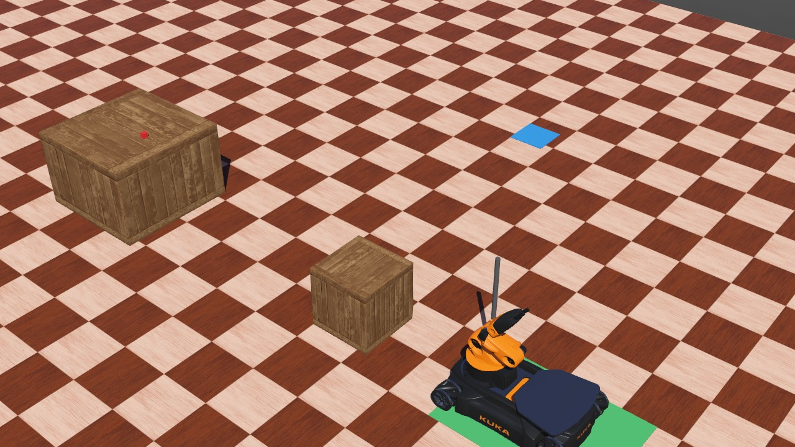
  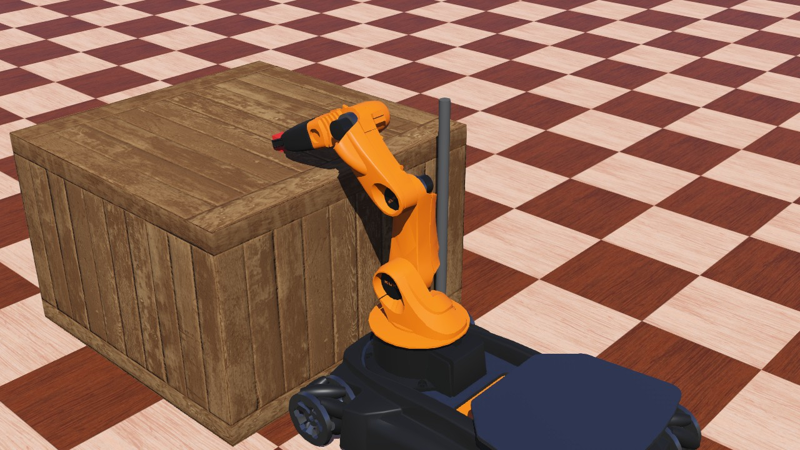
</p>

> **Как читать этот пример.** В основе — студенческие работы по той же задаче (youBot или платформа с манипулятором в CoppeliaSim, захват предмета, машина состояний). Те отчёты описывали, *что* сделано. Здесь та же задача доведена до требований курса: каждое проектное решение выведено по шагам лекций 1–3, логика запретов вычислена синтезом, а работа проверена серией прогонов в Webots с журналами.
>
> - Разделы 1–5 — проектирование; раздел 6 — реализация и испытания.
> - Числа разделов 3–5 выдаёт скрипт [`des_youbot.py`](пример_отчёта/des_youbot.py), числа раздела 6 взяты из журналов прогонов в [`webots/logs`](пример_отчёта/webots/logs). Повторный запуск даёт те же значения (приложение А).
> - Значения задержек в разделе 2.6 — проектные оценки, они так и помечены.
>
> Нумерация разделов совпадает с шагами методики: проверяющий идёт по отчёту и по списку шагов одновременно.

## Материалы к отчёту

| Материал | Где лежит |
|---|---|
| Сцена Webots | [`webots/worlds/youbot_mission.wbt`](пример_отчёта/webots/worlds/youbot_mission.wbt) |
| Контроллер миссии | [`webots/controllers/youbot_mission/youbot_mission.py`](пример_отчёта/webots/controllers/youbot_mission/youbot_mission.py) |
| ДЭС-модель, синтез, наблюдатель | [`des_youbot.py`](пример_отчёта/des_youbot.py), вывод — [`des_youbot_вывод.txt`](пример_отчёта/des_youbot_вывод.txt) |
| Таблица супервизора и исполнитель | [`supervisor_youbot.json`](пример_отчёта/supervisor_youbot.json), [`supervisor_runtime.py`](пример_отчёта/supervisor_runtime.py) |
| Прогоны испытаний и сводка | [`webots/run_trials.py`](пример_отчёта/webots/run_trials.py), журналы — [`webots/logs`](пример_отчёта/webots/logs) |
| **Видеозапись миссии** | [`webots/logs/video_obstacle.mp4`](пример_отчёта/webots/logs/video_obstacle.mp4) |
| Иллюстрации и их генератор | [`figures`](пример_отчёта/figures), [`figures/gen_figs.py`](пример_отчёта/figures/gen_figs.py) |
| Как запустить сцену | [`webots/README.md`](пример_отчёта/webots/README.md) |

## Чем этот отчёт отличается от типичного отчёта прошлых лет

| Типичный отчёт | Что требуется сейчас | Раздел |
|---|---|---|
| «Робот должен найти предмет и схватить его» | миссия с измеримым результатом, сроком и исходом при неудаче | 2.1 |
| перечень элементов сцены | границы системы и интерфейсы с пятью полями | 2.2 |
| состояния FIND, NAVIGATE, GRIP | навыки с контрактами из семи полей | 2.4 |
| требований нет | семь проверяемых требований, классифицированных и формализованных | 2.5 |
| скорость подобрана | скорость выведена из бюджета задержки | 2.6 |
| один автомат на всё поведение | пять автоматов компонентов, композиция вычислена | 3 |
| переходы машины состояний написаны вручную | запреты вычислены синтезом, машина состояний их только исполняет | 4 |
| отказы не рассматривались | промах, выпадение, препятствие — в модели и в испытаниях | 3.6, 6 |
| «задачи выполнены», одно видео | 41 прогон по 8 сценариям, журналы, независимая проверка R1 по физике сцены | 6 |
| — | что не проверено и почему | 8 |

---

## 1. Исходные данные

**Сцена** — Webots R2025a, шаг моделирования 16 мс. Основа — штатная сцена youBot из поставки Webots, где захват предмета со стола уже откалиброван.

| Элемент | Параметры |
|---|---|
| youBot | меканум-платформа, манипулятор 5 степеней подвижности, двухпальцевый захват (раскрытие до 71 мм), датчики положения всех звеньев и пальцев |
| Предмет | кубик 25 мм, алюминий (как `KukaBox` штатной сцены), на столе высотой 0,4 м |
| Контейнер | площадка 0,2 × 0,2 м на полу |
| База | площадка у стартовой позиции робота |
| Препятствие | ящик 0,3 м на прямом пути от базы к столу (только в сценарии «препятствие») |
| Камера | 640×480, узел `Recognition`, на мачте 0,42 м над корпусом, в правом переднем углу |
| Датчики расстояния | `ds_left`, `ds_right` на переднем бампере, таблица `lookupTable` на 1 м |
| Локализация | GPS и инерциальный блок |

Два параметра сцены выведены при проектировании, а не взяты по умолчанию. Дальность датчиков — из бюджета задержки (раздел 2.6). Высота мачты — из первого прогона: камера на уровне корпуса не видит предмет из-за края стола (раздел 6.3).

**Программное обеспечение.** Контроллер на Python, стандартная библиотека и модуль `controller` Webots. Расчёты модели — Python 3.7+ без внешних зависимостей. Иллюстрации — matplotlib.

<p align="center"></p>
<p align="center"><i>Рис. 1. Сцена: робот на базе (зелёная площадка), ящик-препятствие, стол с предметом, контейнер (синяя площадка)</i></p>

---

## 2. Постановка задачи (этап 1; лекция 1, раздел 1.9 пособия)

### 2.1. Шаг 1. Миссия

> За время не более 300 с взять предмет со стола, положить его в контейнер и вернуться на базу. Если предмет выпал, пометить его недоступным, вернуться на базу и сообщить об этом.

Измеримый результат — предмет в контейнере, робот на базе. Срок — 300 с. Исход при неудаче определён: «предмет недоступен». Без последнего предложения задача при отказе не имеет завершения, и в разделе 3.8 это проявится как блокировка модели.

### 2.2. Шаг 2. Границы системы и интерфейсы

| Внутри системы | Вне системы |
|---|---|
| платформа, манипулятор, захват, камера, датчики расстояния, GPS и инерциальный блок, контроллер, супервизор | стол, предмет, контейнер, препятствия, оператор |

| Интерфейс | Источник → приёмник | Данные и единицы | Частота, допустимая задержка | Поведение при отсутствии данных |
|---|---|---|---|---|
| команда пуска | оператор → контроллер | событие | однократно | миссия не начинается |
| аварийный останов | оператор → приводы | событие | ≤ 0,5 с до остановки | останов по сторожевому таймеру через 0,2 с |
| распознавание | камера → контроллер | список объектов с моделью `target` | 15,6 Гц (64 мс), ≤ 100 мс | через 5 с у стола без предмета — миссия прекращается с исходом «не найден» |
| расстояние | `ds_left`, `ds_right` → контроллер | м, 0–1 | 62,5 Гц, ≤ 16 мс | через 0,1 с без данных — останов платформы |
| положение звеньев и пальцев | датчики youBot → контроллер | рад, м | 62,5 Гц, ≤ 16 мс | поза не достигнута за 8 с — отказ `arm_timeout` |
| отчёт | контроллер → оператор | журнал событий CSV, итог JSON | по завершении | — |

### 2.3. Шаг 3. Декомпозиция миссии на задачи

1. Распознать предмет и доехать до стола.
2. Выдвинуть манипулятор над столом и взять предмет.
3. Сложить манипулятор с предметом над задней площадкой, доехать до контейнера.
4. Выдвинуть манипулятор над контейнером, отпустить предмет, сложить манипулятор.
5. Вернуться на базу, записать журнал.

Обработка отказов:
- **промах захвата** — сложить манипулятор, уточнить позицию у стола, повторить (до 2 раз);
- **выпадение предмета** — пометить недоступным, перейти к задаче 5;
- **препятствие** — остановиться, перепланировать объезд.

### 2.4. Шаг 4. Навыки и контракты

Навыки: `NavigateTo`, `Detect`, `Reach`, `Grasp`, `Place`, `Stow`. Контракты трёх наиболее нагруженных безопасностью:

```
skill NavigateTo(target ∈ {table, box, home})
  params:   поза цели (x, y, курс) в системе координат сцены
  pre:      манипулятор в транспортном положении (arm_state == STOW),
            аварийный останов не активен
  inv:      скорость платформы ≤ 0,3 м/с (раздел 2.6),
            манипулятор неподвижен (скорость звеньев < 0,05 рад/с)
  post:     ошибка позиции ≤ 0,01 м, ошибка курса ≤ 0,02 рад, платформа стоит
  timeout:  2·L/v + 10 с, L - длина маршрута
  cancel:   остановить колёса, вернуть FAILED
  recovery: при препятствии ближе 0,35 м по ходу движения - объезд (1 раз),
            затем FAILED «путь заблокирован»
```

```
skill Grasp(target)
  params:   поза предмета, подход сверху (поза манипулятора «над столом»)
  pre:      платформа у стола (base_state == AT_TABLE),
            манипулятор выдвинут и неподвижен (arm_state == EXTENDED),
            предмет распознан (vision == FOUND), захват открыт
  inv:      платформа неподвижна
  post:     сумма положений пальцев > 0,3 мм - предмет в захвате
            (пустой захват смыкается до 0,0 мм, с кубиком 25 мм - 0,8 мм)
  timeout:  1,5 с на смыкание
  cancel:   раскрыть захват, вернуть FAILED
  recovery: при промахе - сложить манипулятор, уточнить позицию у стола,
            повторить (до 2 раз); затем исход «не взят»
```

```
skill Place(container)
  params:   поза манипулятора «над контейнером»
  pre:      платформа у контейнера (base_state == AT_BOX),
            манипулятор выдвинут, предмет в захвате
  inv:      платформа неподвижна
  post:     захват раскрыт, предмет зарегистрирован как «в контейнере»
  timeout:  8 с на выход манипулятора, 1 с на раскрытие
  cancel:   сложить манипулятор, не раскрывая захвата; вернуть FAILED
  recovery: нет - повтор укладки без изменения условий не имеет смысла
```

Каждое условие `pre` и `post` — переменная контроллера и одновременно состояние автомата раздела 3. Порог 0,3 мм в `post` у `Grasp` — не предположение, а измерение калибровочного прогона.

### 2.5. Шаг 5. Требования как проверяемые свойства

| ID | Требование | Класс | Формализация | Проверка |
|---|---|---|---|---|
| R1 | Манипулятор не движется при движении платформы | безопасность | $\mathbf{G} \neg(\text{base_moving} \wedge \text{arm_moving})$ | синтез (E1), монитор физики в каждом прогоне |
| R2 | Предмет в захвате не теряется до укладки | безопасность | $\mathbf{G}(\text{held} \to \text{held} \mathbf{U} \text{placed})$ | в этой форме нереализуемо (раздел 4.6) |
| R3 | Предмет либо уложен, либо помечен недоступным | живость | $\mathbf{G}(\text{detected} \to \mathbf{F}(\text{placed} \vee \text{unreachable}))$ | неблокируемость модели (3.8) + испытания |
| R4 | Миссия завершается за 300 с | безопасность с таймером | $\mathbf{G}(\text{start} \to \mathbf{F}_{\le 300} \text{done})$ | испытания |
| R5 | Платформа трогается только со сложенным манипулятором | безопасность | $\mathbf{G}(\text{base_start} \to \text{arm_stowed})$ | синтез (E2) |
| R6 | Захват закрывается только на видимом предмете при выдвинутом манипуляторе | безопасность | $\mathbf{G}(\text{close} \to \text{found} \wedge \text{extended})$ | синтез (E3, E5) |
| R7 | Отчёт о миссии совпадает с фактическим положением предмета | безопасность | $\mathbf{G}(\text{reported_placed} \to \text{in_box})$ | испытания: сравнение модели с истиной сцены |

**Полная форма R1.** *Наблюдаемая величина:* скорость звеньев 1–4 манипулятора и скорость платформы по GPS. *Условия:* весь прогон, включая отказные сценарии. *Процедура:* на каждом шаге 16 мс монитор вычисляет обе скорости по датчикам сцены, независимо от модели. *Критерий:* нет ни одного шага, где скорость звена > 0,05 рад/с и скорость платформы > 0,02 м/с одновременно. *Последствие нарушения:* предмет раскачивается при разгоне и может выпасть, манипулятор может задеть стол.

R7 появилось после испытаний (раздел 6.4): робот может «успешно» завершить миссию, не довезя предмет. Среди требований одно свойство живости — R3. Мониторингом его не проверить, поэтому оно проверяется по модели.

### 2.6. Шаг 6. Бюджет задержки и проектные ограничения

**Контур объезда препятствия** (оценки, уточняются на этапе 8):

| Составляющая | Значение | Откуда |
|---|---|---|
| $T_{\mathrm{sens}}$ — опрос датчика расстояния | 16 мс | шаг моделирования |
| $T_{\mathrm{comm}}$ — передача | 16 мс | шаг драйвера при работе через ROS 2 |
| $T_{\mathrm{proc}}$ — обработка | 2 мс | оценка |
| $T_{\mathrm{dec}}$ — решение в цикле логики 10 Гц | до 100 мс | период цикла |
| $T_{\mathrm{act}}$ — отработка команды приводом | 16 мс | шаг моделирования |
| **итого** $T_{\mathrm{total}}$ | **150 мс** | |

Максимальная скорость находится из условия $T_{\max}(v) = T_{\mathrm{total}}$:

```math
\frac{d_{\mathrm{detect}} - d_{\mathrm{safe}}}{v} - \frac{v}{2 a_{\max}} = T_{\mathrm{total}}
```

При $d_{\mathrm{safe}} = 0{,}05$ м и $a_{\max} = 1$ м/с²:

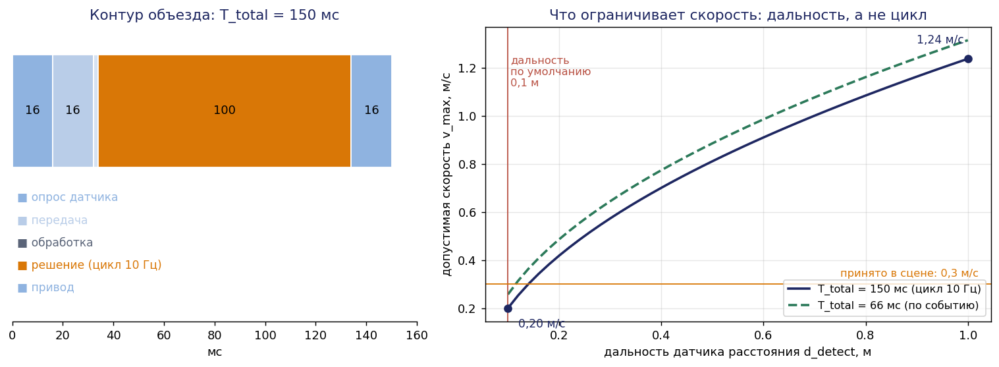
*Рис. 2. Бюджет задержки и допустимая скорость как функция дальности датчика*

| Дальность датчика | Цикл решения | $T_{\mathrm{total}}$ | $v_{\max}$ |
|---|---|---|---|
| 0,1 м (таблица по умолчанию) | 10 Гц | 150 мс | **0,20 м/с** |
| 0,1 м | по событию | 66 мс | 0,26 м/с |
| 1,0 м (таблица задана) | 10 Гц | 150 мс | 1,24 м/с |

**Вывод.** Узкое место — дальность датчиков, а не цикл логики: ускорение цикла в 6 раз даёт +28 % скорости, настройка таблицы на 1 м — в 6 раз больше. Решение: таблица на 1 м. Скорость ограничена 0,3 м/с: на ней откалиброван захват штатной сцены, запас по объезду четырёхкратный.

**Контур доводки захвата.** $T_{\mathrm{total}} = 16 + 30 + 16 + 100 + 16 = 178$ мс. Ошибка позиционирования $\Delta = v_{\text{сближения}} \cdot T_{\mathrm{total}}$: при 0,05 м/с — 8,9 мм, при 0,08 м/с — 14,2 мм, при 0,15 м/с — 26,7 мм. Допуск захвата — 15 мм, отсюда $v_{\text{сближения}} \le 0{,}08$ м/с. В реализации захват выполняется позой манипулятора после полной остановки платформы, поэтому сближения в движении нет вовсе. Это сильнее ограничения, и именно так закрыт контур в контракте `Grasp` (`inv: платформа неподвижна`).

### 2.7. Оценка пространства состояний

Автоматы раздела 3 содержат 9, 4, 3, 2 и 5 состояний. Верхняя оценка — $9 \cdot 4 \cdot 3 \cdot 2 \cdot 5 = 1080$ состояний, это 11 бит. Перебрать такое вручную невозможно, поэтому логика запретов в разделе 4 вычисляется.

### 2.8. Итог этапа 1: проектные решения

1. Таблица датчиков расстояния — 1 м; скорость платформы — не более 0,3 м/с (2.6).
2. Захват только при неподвижной платформе (2.6).
3. У отказа «предмет выпал» есть исход — пометка «недоступен» (2.1).
4. Признак «предмет в захвате» — сумма положений пальцев > 0,3 мм (2.4).

---

## 3. ДЭС-модель комплекса (этап 2а; лекция 2, раздел 2.9 пособия)

Разделы 3.1–3.8 соответствуют восьми правилам построения модели.

### 3.1. Правило 1. Один компонент — один автомат

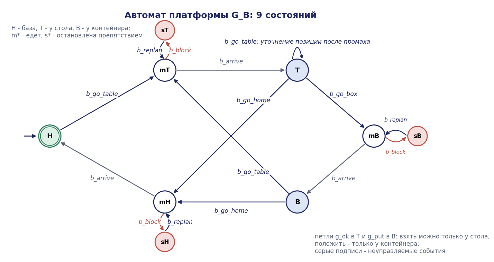
*Рис. 3. Автомат платформы*

Петли `g_ok` в `T` и `g_put` в `B` выражают физическую связь: взять предмет можно только у стола, положить — только у контейнера. Такие ограничения записываются в модель объекта, а не в спецификацию.

Переход `T —b_go_table→ mT` («уточнить позицию у стола») в первой версии модели отсутствовал. Его потребовал контракт `Grasp`: восстановление после промаха — «сложить манипулятор, уточнить позицию, повторить». Без перехода супервизор запретил бы эту команду, а миссия после первого промаха заблокировалась бы. Расхождение нашлось при сверке контрактов с автоматом, ещё до испытаний.

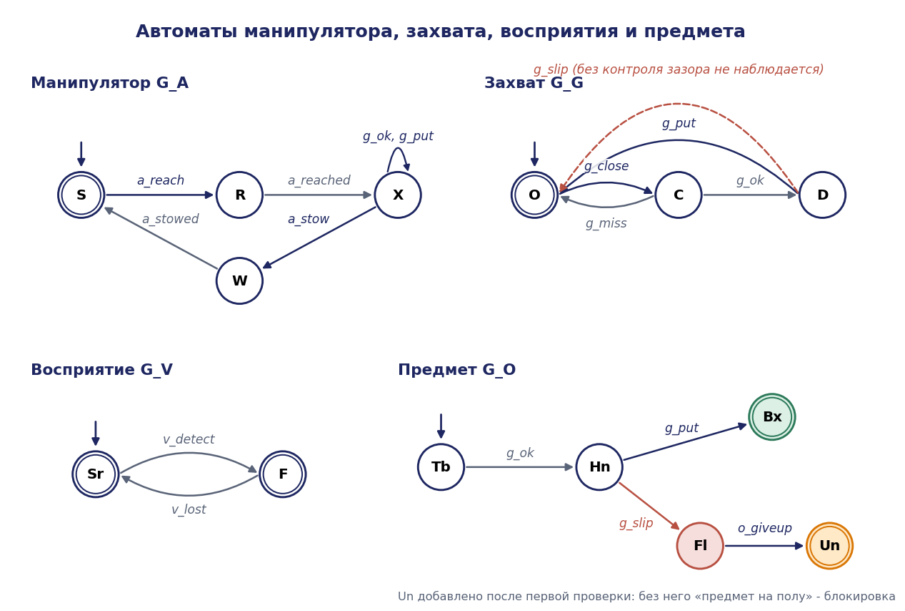
*Рис. 4. Автоматы манипулятора, захвата, восприятия и предмета*

| Автомат | Состояния |
|---|---|
| манипулятор $G_A$ | `S` транспортное положение, `R` выдвигается, `X` выдвинут, `W` складывается |
| захват $G_G$ | `O` открыт, `C` закрывается, `D` держит |
| восприятие $G_V$ | `Sr` поиск, `F` предмет виден (оба маркированы) |
| предмет $G_O$ | `Tb` на столе, `Hn` в захвате, `Fl` на полу, `Bx` в контейнере, `Un` недоступен (маркированы `Bx`, `Un`) |

### 3.2. Правило 2. События — переходы, а не состояния

У каждой продолжительной операции есть команда начала (управляемое событие) и подтверждения завершения (неуправляемые). Правило проверяется так: можно ли выразить прерывание операции посередине? Можно — препятствие `b_block` прерывает движение.

| Событие | $\Sigma_c$ / $\Sigma_{uc}$ | Механизм предотвращения | $\Sigma_o$ / $\Sigma_{uo}$ | Источник сигнала в контроллере |
|---|---|---|---|---|
| `b_go_table`, `b_go_box`, `b_go_home` | управляемое | не выдать цель навигации | набл. | команда |
| `b_arrive` | неуправляемое | — | набл. | ошибка позы ≤ 0,01 м и курса ≤ 0,02 рад |
| `b_block` | неуправляемое | — | набл. | `ds_*` < 0,35 м при движении вперёд |
| `b_replan` | управляемое | не запускать объезд | набл. | команда |
| `a_reach`, `a_stow` | управляемое | не выдать позу манипулятору | набл. | команда |
| `a_reached`, `a_stowed` | неуправляемое | — | набл. | ошибка всех звеньев < 0,03 рад **и** скорость < 0,02 рад/с в течение 0,3 с |
| `g_close`, `g_put` | управляемое | не выдать команду пальцам | набл. | команда |
| `g_ok`, `g_miss` | неуправляемое | — | набл. | сумма положений пальцев через 1,5 с: > 0,3 мм / ≤ 0,3 мм |
| `g_slip` | неуправляемое | — | **зависит от контроля** | сумма положений пальцев падает ниже 0,3 мм при перевозке (раздел 5) |
| `v_detect`, `v_lost` | неуправляемое | — | набл. | `Recognition`: есть объект модели `target` |
| `o_giveup` | управляемое | не помечать предмет | набл. | решение логики |

Условие «и скорость < 0,02 рад/с в течение 0,3 с» у `a_reached`/`a_stowed` добавлено после отладочного прогона: без него монитор зафиксировал нарушение R1 (раздел 6.3).

**Самопроверка по трём типовым ошибкам.** Отказы (`g_miss`, `g_slip`, `b_block`) не объявлены управляемыми. Завершения операций не объявлены управляемыми. Действий оператора в этапах 1–2 нет.

### 3.3. Правило 3. Взаимодействие только через общие события

| Общее событие | Автоматы | Что синхронизирует |
|---|---|---|
| `g_ok` | платформа, манипулятор, захват, предмет | взять можно только у стола выдвинутым манипулятором; предмет переходит в захват |
| `g_put` | платформа, манипулятор, захват, предмет | положить можно только у контейнера выдвинутым манипулятором |
| `g_slip` | захват, предмет | выпадение меняет состояние обоих |

Восприятие не имеет общих событий с объектом: связь «брать только видимый предмет» не физическая, а проектная, она войдёт в спецификацию E3.

### 3.4. Правило 4. Ресурс моделируется явно

Разделяемый ресурс варианта А — «право на движение» платформы и манипулятора (R1). Физически одновременное движение возможно, поэтому ресурс записан не в модель объекта, а в **спецификацию** E1 с состояниями `Free`, `Base`, `Arm` (раздел 4.3).

### 3.5. Правило 5. Маркированные состояния — завершение задачи

Задача завершена, когда платформа на базе (`H`), манипулятор сложен (`S`), захват открыт (`O`), а предмет уложен (`Bx`) или помечен недоступным (`Un`); восприятие — любое.

### 3.6. Правило 6. Отказы включены с самого начала

Отказов в модели три: `g_miss` — промах захвата, `g_slip` — выпадение, `b_block` — препятствие. В первой версии у выпадения не было исхода, и раздел 3.8 показывает, что композиция это нашла.

### 3.7. Правило 7. Наблюдаемость фиксируется явно

Отдельного датчика наличия предмета нет. Первая версия контроллера проверяла пальцы только в момент захвата, а во время перевозки — нет, поэтому `g_slip` объявлен **ненаблюдаемым**. Раздел 5 проверяет, диагностируем ли этот отказ, и находит решение без нового оборудования.

### 3.8. Правило 8. Композиция и неблокируемость

**Первая версия — без события `o_giveup`.**

| Величина | Значение |
|---|---|
| верхняя оценка $\lvert X \rvert$ | $9 \cdot 4 \cdot 3 \cdot 2 \cdot 4 = 864$ |
| достижимых состояний | 504 |
| переходов | 2356 |
| неблокирующая | **нет**, блокирующих состояний 144 |

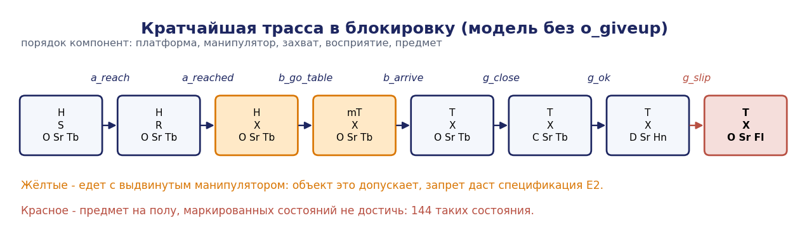
*Рис. 5. Кратчайшая трасса в блокировку, найденная поиском в ширину*

Во всех 144 блокирующих состояниях предмет на полу. Сценарий: робот взял предмет, предмет выпал, задачу завершить нечем. В трассе манипулятор выдвинут ещё до поездки к столу: модель объекта это допускает, запрет даст спецификация E2.

**Исправление.** Событие `o_giveup: Fl → Un` — ровно тот исход, который записан в миссии и в R3. Результат: 648 достижимых состояний, 3172 перехода, модель **неблокирующая**. Отношение верхней оценки 1080 к достижимой части — 1,7.

---

## 4. Синтез супервизора (этап 2б; лекция 3, раздел 3.10 пособия)

### 4.1–4.2. Шаги 1–2. Модели и классификация событий

Модель — раздел 3, версия с `o_giveup`. Неуправляемых событий девять: `b_arrive`, `b_block`, `a_reached`, `a_stowed`, `g_ok`, `g_miss`, `g_slip`, `v_detect`, `v_lost`.

### 4.3. Шаг 3. Спецификации

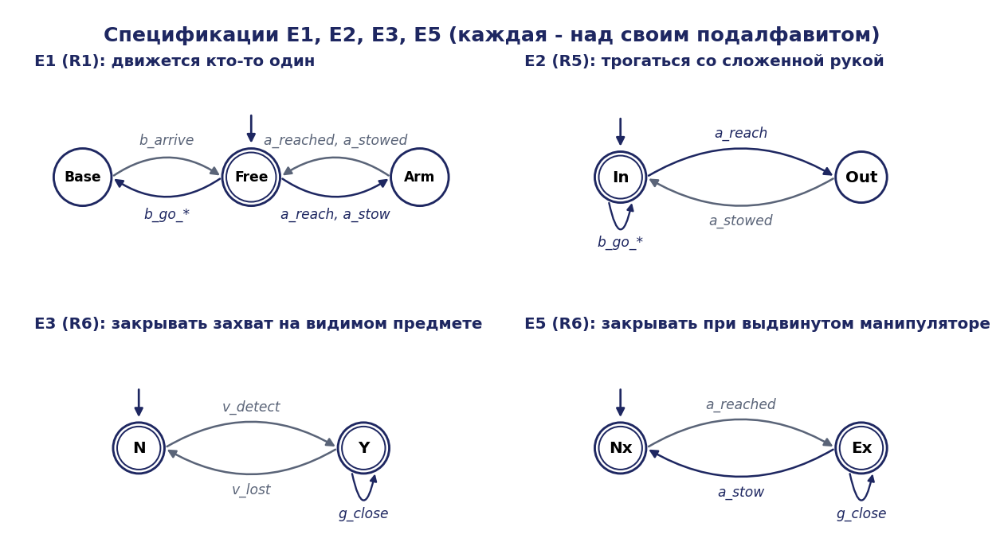
*Рис. 6. Спецификации: каждая над минимальным подалфавитом*

E5 появилась не сразу. Первый синтез выполнялся по E1–E3, и проверка разрешений готового супервизора показала, что `g_close` разрешён при невыдвинутом манипуляторе в 60 состояниях. Пример трассы:

```
b_go_table  b_arrive  b_go_box  b_arrive  a_reach  v_detect  g_close
```

Захват закрывается в воздухе, пока манипулятор ещё выдвигается. После добавления E5 таких разрешений 0. **Урок:** супервизор делает ровно то, что записано в спецификациях. Проверять нужно разрешения синтезированного автомата, а не только его неблокируемость.

### 4.4. Шаг 4. Модульный синтез

| Супервизор | Состояний |
|---|---|
| по E1 | 432 |
| по E2 | 648 |
| по E3 | 648 |
| по E5 | 648 |
| монолитный по E1, E2, E3, E5 | 324 (1078 переходов) |

Ни в одном синтезе не удалено состояний по управляемости: все четыре требования выполнимы запретом управляемых событий. Обратного распространения здесь нет — оно появится в разделе 4.6.

### 4.5. Шаг 5. Неконфликтность

Совместная работа четырёх модульных супервизоров над объектом: 324 достижимых состояния, блокирующих 0. Супервизоры неконфликтны, поведение совпадает с монолитным.

### 4.6. Шаг 6. Реализуемость: требование R2 в жёсткой форме

R2 «предмет не теряется» записано спецификацией E4 без перехода по `g_slip`.

| Итерация | Удалено по управляемости | Удалено по блокировке | Что удалено |
|---|---|---|---|
| 1 | 36 | 144 | все состояния «захват держит, предмет в захвате» |
| итог | | | **супервизор пуст** |

Цепочка рассуждения алгоритма:
1. В состоянии «держит» объект может породить `g_slip`. Событие неуправляемо, а спецификация его запрещает — все 36 таких состояний плохие.
2. Без них предмет нельзя взять, и недостижимы ни `Bx`, ни `Un`.
3. После Trim не остаётся ничего, включая начальное состояние.

Классификация здесь верна — выпадение действительно неуправляемо. Противоречие в самом требовании: логика не может запретить физический отказ.

**Ослабленное требование** E4′: «не выпадает во время движения платформы». Супервизор непуст (224 состояния), но в нём **0 маркированных состояний с доставкой**. Единственный найденный способ исключить выпадение при движении — не ездить с предметом.

### 4.7. Шаг 7. Ограничительность и переформулировка R2

Запреты итогового супервизора — в скольких состояниях событие физически возможно, но запрещено:

| Событие | Запрещено в состояниях | Каким требованием |
|---|---|---|
| `b_go_table` | 162 | R1, R5 |
| `g_close` | 132 | R6 |
| `a_reach` | 108 | R1 |
| `b_go_home` | 108 | R1, R5 |
| `b_go_box` | 54 | R1, R5 |

Полезные сценарии не потеряны. Кратчайшая успешная миссия под надзором — 18 событий:

```
b_go_table b_arrive a_reach a_reached v_detect g_close g_ok a_stow a_stowed
b_go_box b_arrive a_reach a_reached g_put a_stow a_stowed b_go_home b_arrive
```

R2 обеспечивают конструкция и восприятие, логика этого сделать не может. Требование разделено:
- **R2а** (конструкция): предмет перевозится над корпусом, а не на вытянутом манипуляторе; усилие удержания проверяется испытаниями;
- **R2б** (логика): выпадение обнаруживается и приводит к исходу «недоступен». Для этого `g_slip` должен стать наблюдаемым — раздел 5.

### 4.8. Шаг 8. Реализация

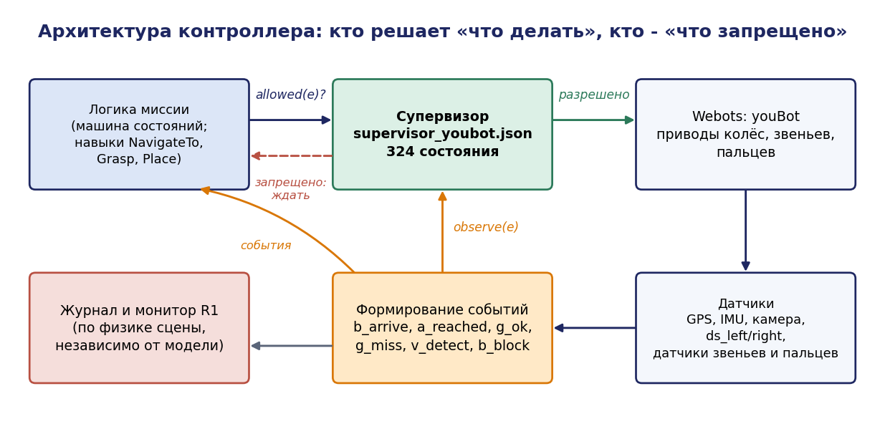
*Рис. 7. Архитектура контроллера*

Супервизор экспортирован в таблицу [`supervisor_youbot.json`](пример_отчёта/supervisor_youbot.json): 324 состояния, для каждого — переходы и разрешённые управляемые события. В контроллере весь надзор — две функции:

```python
def command(e, action, info=''):
    """Управляемое событие: действие выполняется, только если супервизор разрешает."""
    if USE_SUP and not sup.allowed(e):
        ...                      # в журнал: denied
        return False
    action()
    sup.observe(e)               # команда выдана - событие произошло
    return True


def event(e, info=''):
    """Событие от датчиков (неуправляемое либо подтверждение)."""
    sup.observe(e)               # невозможное событие -> SupervisorViolation
```

Навык выдаёт команду через `issue(e, action)`. Если команда запрещена, навык ждёт и продолжает опрашивать датчики: иначе событие, снимающее запрет, никогда не наступит. **Запретов сверх таблицы в контроллере нет** — ни одного `if arm_extended: не ехать`.

| Состояние логики миссии | Навык | Команды | Ожидаемые события |
|---|---|---|---|
| старт | `Detect` | — | `v_detect` |
| к столу | `NavigateTo` | `b_go_table`, `b_replan` | `b_block`, `b_arrive` |
| захват | `Reach`, `Grasp` | `a_reach`, `g_close` | `a_reached`, `g_ok`, `g_miss` |
| перевозка | `Stow`, `NavigateTo` | `a_stow`, `b_go_box` | `a_stowed`, `b_arrive`, `g_slip` |
| укладка | `Reach`, `Place`, `Stow` | `a_reach`, `g_put`, `a_stow` | `a_reached`, `a_stowed` |
| отказ «выпал» | — | `o_giveup` | — |
| на базу | `NavigateTo` | `b_go_home` | `b_arrive` |

---

## 5. Наблюдаемость и диагностируемость отказа

Наблюдатель построен для поведения под итоговым супервизором при $\Sigma_{uo} = \lbrace \text{g_slip} \rbrace$: 324 состояния, из них 36 с неопределённостью «предмет в захвате или на полу». После наблюдаемой трассы

```
v_detect b_go_table b_arrive a_reach a_reached g_close g_ok a_stow a_stowed b_go_box b_arrive
```

оценка состояния: предмет ∈ {`Hn`, `Fl`}, захват ∈ {`D`, `O`}. Робот у контейнера не знает, везёт ли он предмет. Различить ветви могут только `g_put` и `o_giveup`, но это команды, и выбрать между ними контроллер должен, не зная ответа. Супервизор разрешает поездки «база → стол → база» и с предметом в захвате, и с предметом на полу, то есть в наблюдателе есть неопределённый цикл. По теореме 2.4 отказ **не диагностируем**.

**Минимальное изменение.** Отдельный датчик не нужен: датчики пальцев уже различают «держит» (0,8 мм) и «пусто» (0,0 мм). Пальцы остаются под командой «закрыть», и при выпадении они смыкаются. Не хватало не датчика, а **события**: контроль зазора надо выполнять на всём пути перевозки, а не только в момент захвата. После этого `g_slip` наблюдаемо, и логика получает исход `o_giveup`.

Испытания подтверждают вывод количественно (рис. 8, раздел 6.4): без контроля — 5 ложных успехов из 5, с контролем — 5 правильных исходов «недоступен» из 5, задержка обнаружения 176–192 мс.

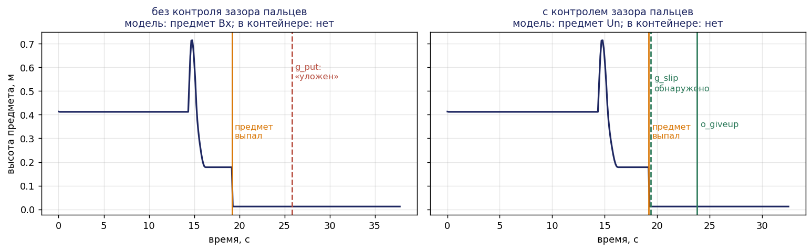
*Рис. 8. Высота предмета при выпадении: без контроля зазора модель считает предмет уложенным, с контролем выпадение обнаружено за 0,18 с*

Для реального захвата вывод переносится не полностью: зазор 0,8 мм сопоставим с люфтом пальцев. Там понадобится датчик усилия (раздел 8).

---

## 6. Реализация в Webots и испытания

### 6.1. Как выглядит миссия

<p align="center">
  
  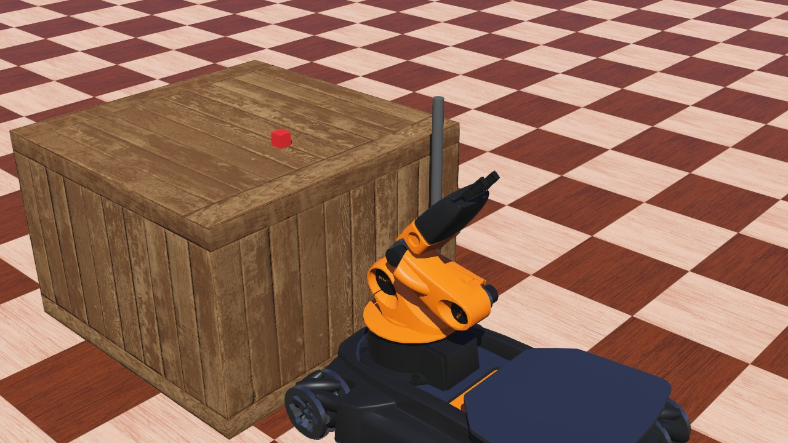
  
</p>
<p align="center">
  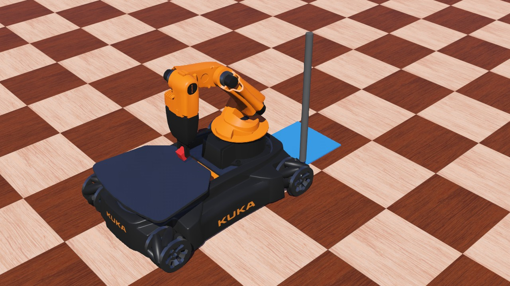
  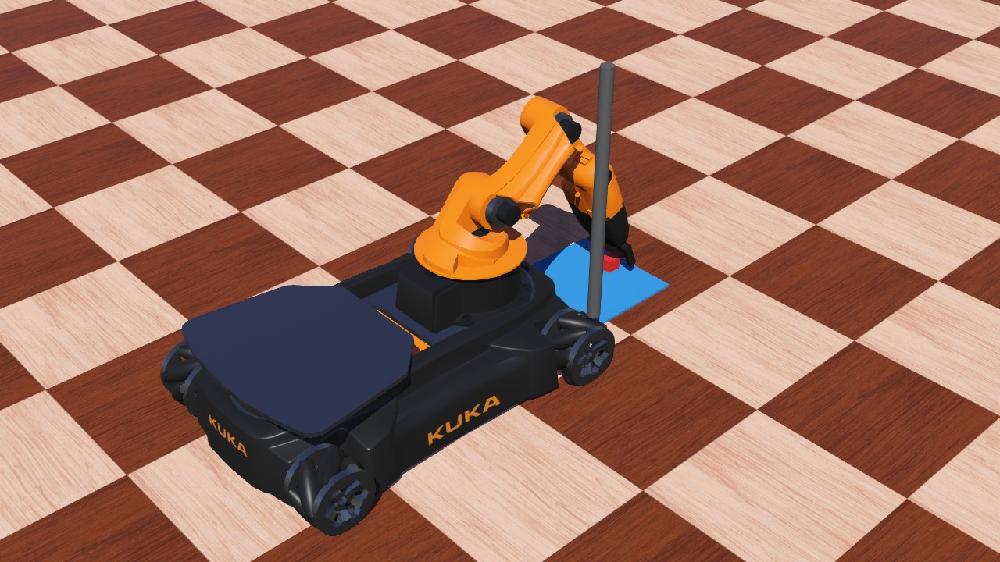
  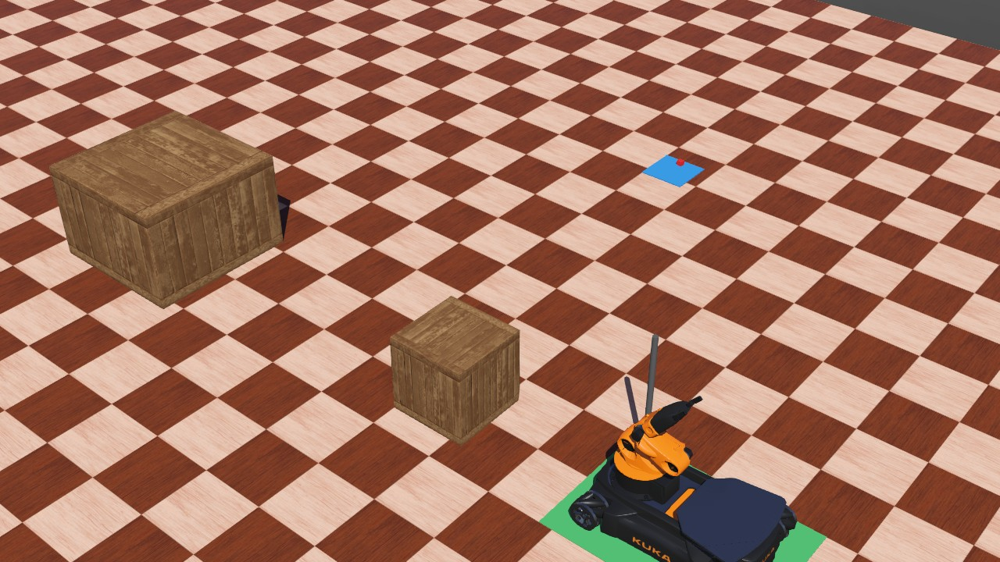
</p>
<p align="center"><i>Рис. 9. Кадры прогона: остановка перед препятствием, подъезд к столу, захват, прибытие к контейнеру, укладка, возврат на базу</i></p>

**Видеозапись этого прогона:** [`video_obstacle.mp4`](пример_отчёта/webots/logs/video_obstacle.mp4) (41,6 с моделирования).

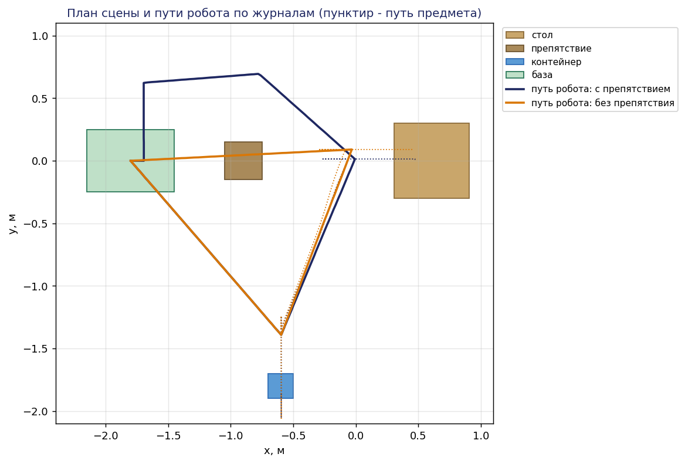
*Рис. 10. Пути робота по журналам GPS: штатный прогон и прогон с объездом*

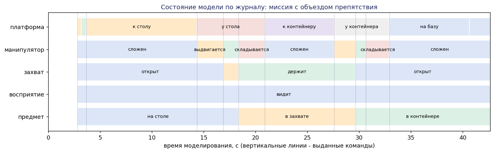
*Рис. 11. Состояние модели во времени по журналу прогона с препятствием*

Фрагмент журнала [`video_obstacle.csv`](пример_отчёта/webots/logs/video_obstacle.csv):

```
t,kind,name,model_state,info
2.816,event,v_detect,H/S/O/F/Tb,предмет распознан камерой
2.816,cmd,b_go_table,mT/S/O/F/Tb,"к (0.00, 0.01)"
3.168,event,b_block,sT/S/O/F/Tb,препятствие в 0.35 м
3.68,cmd,b_replan,mT/S/O/F/Tb,"объезд через (-1.70, 0.70)"
14.32,event,b_arrive,T/S/O/F/Tb,ошибка позы 0.010 м
```

### 6.2. Программа испытаний

Все прогоны выполняются в Webots без отрисовки командой `python run_trials.py trials`. Предмет на столе случайно смещается (±30 мм вдоль, ±120 мм поперёк стола; зерно `seed` = номер прогона). По каждому прогону программа проверяет:
- **R1** — монитором физики на каждом шаге, независимо от модели;
- **R4** — временем миссии;
- **R7** — сравнением состояния предмета в модели с его фактическим положением в сцене.

| № | Сценарий | Что вносится | Прогонов |
|---|---|---|---|
| 1 | штатный | — | 10 |
| 2 | препятствие | ящик на пути к столу | 5 |
| 3 | промах захвата | предмет смещается на 60 мм после подъезда | 5 |
| 4 | смещение 35 мм | предмет смещается на 35 мм после подъезда | 5 |
| 5 | выпадение без контроля зазора | предмет выпадает при перевозке | 5 |
| 6 | выпадение с контролем зазора | то же, `monitor=1` | 5 |
| 7 | поспешная логика + супервизор | команда «ехать» сразу после команды «сложить манипулятор» | 3 |
| 8 | поспешная логика без супервизора | то же, супервизор отключён | 3 |

### 6.3. Что нашли отладочные прогоны

До серии испытаний контроллер отлаживался на штатном сценарии. Четыре найденные проблемы стоит перечислить: каждую обнаружили журнал или монитор, а не просмотр видео.

| Наблюдение в журнале | Причина | Исправление |
|---|---|---|
| `g_close` запрещён, миссия ждёт до таймаута | камера на уровне корпуса не видит предмет за краем стола: нет `v_detect`, спецификация E3 запрещает захват | камера на мачте 0,42 м; повторное распознавание у стола |
| `fault arm_timeout`: звено 4 не доходит на 0,52 рад | выбранная поза перевозки прижимает предмет к столешнице | перевозка над задней площадкой (штатная поза youBot) |
| `R1 нарушение` на одном шаге сразу после `a_stowed` | подтверждение позы по ошибке положения, звенья ещё качаются | событие требует и малой скорости звеньев 0,3 с |
| `b_block` на выезде от стола без препятствия | передние датчики видят сам стол | препятствие учитывается только при движении вперёд |

Первая строка показывает, что супервизор делает свою работу: захват «вслепую» не состоялся, хотя логика миссии его требовала.

### 6.4. Результаты

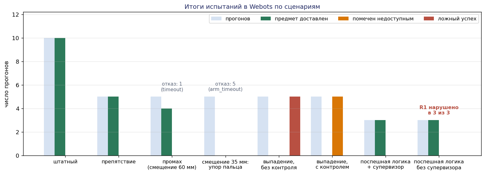
*Рис. 12. Итоги испытаний по сценариям*

| Сценарий | n | Доставлено | Помечено недоступным | Ложный успех (R7) | Нарушения R1 | Отказы | Время, с (мин / ср / макс) |
|---|---|---|---|---|---|---|---|
| штатный | 10 | 10 | 0 | 0 | 0 | 0 | 37,3 / 37,7 / 38,1 |
| препятствие | 5 | 5 | 0 | 0 | 0 | 0 | 41,4 / 41,6 / 41,8 |
| промах захвата (60 мм) | 5 | 4 | 0 | 0 | 0 | 1 таймаут | 45,4 / 45,8 / 46,1 |
| смещение 35 мм | 5 | 0 | 0 | 0 | 0 | 5 `arm_timeout` | — |
| выпадение, без контроля | 5 | 5* | 0 | **5** | 0 | 0 | 37,3 / 37,7 / 38,1 |
| выпадение, с контролем | 5 | 0 | **5** | 0 | 0 | 0 | 32,0 / 32,4 / 32,8 |
| поспешная логика + супервизор | 3 | 3 | 0 | 0 | **0** | 0 | 37,6 / 37,8 / 38,1 |
| поспешная логика без супервизора | 3 | 3 | 0 | 0 | **3 из 3** | 0 | 35,4 / 35,6 / 35,9 |

\* Логика миссии отчиталась о доставке, но предмета в контейнере нет.

**Выводы по сценариям.**

1. **Штатный сценарий и препятствие** — 15 из 15 доставок, нарушений R1 нет. Объезд добавляет 3,9 с.
2. **Промах захвата.** В 4 прогонах восстановление сработало ровно по модели: `g_miss` → `a_stow` → `b_go_table` (уточнение у стола) → повторный захват. Цена промаха — 8,1 с. Прогон 2 закончился таймаутом, и это находка. Предмет лежал у края стола; на развороте к контейнеру передние датчики приняли угол стола за препятствие; объезд ушёл в сторону стола, и робот застрял. R4 нарушено. Исправление — объезд в сторону от известных неподвижных объектов — не внесено: оно оставлено для этапа 6, где появится карта (раздел 8).
3. **Смещение 35 мм** даёт не промах, а упор пальца в кубик. Звено 4 не доходит до позы, и миссия корректно останавливается отказом, 5 из 5. Такого исхода нет в модели захвата: у `a_reach` нет неуправляемой альтернативы `a_blocked`. Модель описывает «попал / промахнулся», а физика даёт третье. Это кандидат на расширение модели (раздел 8).
4. **Выпадение без контроля зазора** — 5 ложных успехов из 5: модель в состоянии `Bx`, предмет на полу. Это прямое экспериментальное подтверждение недиагностируемости (раздел 5) и основание для требования R7.
5. **Выпадение с контролем** — 5 из 5 правильных исходов «недоступен», обнаружение через 176–192 мс.
6. **Поспешная логика.** Логика выдаёт «ехать к контейнеру» сразу после «сложить манипулятор». Без супервизора платформа трогается при движущемся манипуляторе: R1 нарушено в 3 прогонах из 3, по 131 шагу (2,1 с) одновременного движения. С супервизором команда отклоняется один раз (`denied b_go_box`) и выполняется через 2,5 с, после `a_stowed`: нарушений 0, цена — 2,2 с времени миссии. Супервизор исправил дефект логики, которого не видит тот, кто её писал.

---

## 7. Матрица трассируемости (после этапа 2)

| ID | Требование | Класс | Формализация | Проверка | Артефакт | Остаточный риск |
|---|---|---|---|---|---|---|
| R1 | нет одновременного движения | безоп. | E1 | синтез + монитор физики | 38 прогонов с супервизором — 0 нарушений; без супервизора — 3 из 3 | супервизор не видит движения без команды (ошибка регулятора) |
| R2а | удержание при перевозке | безоп. | конструкция | испытания | 25 прогонов с перевозкой без внесённого выпадения — самопроизвольных выпадений 0 | выпадение вносилось искусственно, физический срыв не моделировался |
| R2б | выпадение обнаруживается | живость | диагностируемость | наблюдатель + испытания | разд. 5; 5 из 5, 176–192 мс | в реальном захвате зазор сопоставим с люфтом |
| R3 | уложен или помечен | живость | неблокируемость | композиция + испытания | разд. 3.8; все исходы определены, кроме двух отказов | упор пальца (35 мм) не имеет исхода в модели |
| R4 | миссия за 300 с | безоп. с таймером | $\mathbf{F}_{\le 300}$ | испытания | 1 таймаут из 36 миссий без отказа позы | ложное препятствие у края стола |
| R5 | трогаться со сложенным манипулятором | безоп. | E2 | синтез | разд. 4.3 | — |
| R6 | закрывать на видимом предмете при выдвинутом манипуляторе | безоп. | E3, E5 | синтез + проверка разрешений | разд. 4.3; отладка 6.3 | распознавание в сцене идеальное |
| R7 | отчёт совпадает с фактом | безоп. | — | испытания | без контроля — 5 нарушений, с контролем — 0 | — |

---

## 8. Остаточные риски

1. **Идеальное распознавание.** Позу предмета контроллер берёт из истины сцены, камера даёт только факт «виден». Ошибки распознавания — на этапе 6 (POMDP, порог уверенности).
2. **Упор пальца в предмет** (смещение 35 мм): исход вне модели, миссия останавливается отказом позы. Решение — событие `a_blocked` в автомате манипулятора с исходом «отвести, уточнить, повторить».
3. **Ложное препятствие у края стола**: 1 таймаут из 5 в сценарии промаха. Решение — учитывать известные неподвижные объекты при объезде (этап 6, карта).
4. **Движение без команды.** Супервизор фильтрует команды и не видит исполнения. Нарушение R1 из-за ошибки регулятора обнаружит монитор, но не предотвратит.
5. **Контроль зазора пальцев** надёжен в симуляции (0,8 мм против 0,0 мм). На реальном захвате нужен датчик усилия.
6. **Бесконечное перепланирование.** Цикл `b_block` → `b_replan` не является блокировкой в смысле языков, но нарушает R4. В контроллере стоит ограничение «один объезд»; в модели его нет (этап 5, временной автомат).
7. **Один предмет.** С $k$ предметами автомат предмета становится произведением $k$ автоматов, и число состояний растёт в $5^k$ раз.

---

## 9. Выводы

1. Постановка задачи до всякой логики дала четыре проектных решения. Главное — дальность датчиков ограничивает скорость в 6 раз сильнее, чем частота цикла логики.
2. Композиция пяти автоматов нашла блокировку «предмет выпал — задачу не завершить». Её закрыл исход «недоступен», заложенный в миссию. Сверка контрактов с моделью добавила переход «уточнить позицию у стола», без которого не работало бы восстановление после промаха.
3. Синтез по четырём спецификациям дал супервизор на 324 состояния. Проверка разрешений нашла пропущенное требование — закрытие захвата в воздухе.
4. Требование «предмет не теряется» нереализуемо логикой: супервизор пуст. Оно разделено на конструктивное и логическое, а для логической части найдено решение без нового оборудования — контроль зазора пальцев при перевозке.
5. 41 прогон в Webots подтвердил модель там, где она полна: 15 из 15 штатных миссий, восстановление после промаха, 0 нарушений R1 под надзором против 3 из 3 без него, 5 из 5 правильных исходов при выпадении. Там, где модель неполна, испытания нашли два исхода вне модели — упор пальца и ложное препятствие. Оба перенесены в остаточные риски с планом устранения.

---

## Приложение А. Как воспроизвести

**Расчёты модели и таблица супервизора** (Python 3.7+):

```bash
cd 05_ДЗ/пример_отчёта
python des_youbot.py
python supervisor_runtime.py
```

**Иллюстрации** (нужен matplotlib):

```bash
cd 05_ДЗ/пример_отчёта/figures
python gen_figs.py
python gen_figs.py logs
```

**Испытания в Webots** (R2025a; путь без кириллицы — см. [`webots/README.md`](пример_отчёта/webots/README.md)):

```bash
cd webots
python run_trials.py trials
python run_trials.py video
```

## Приложение Б. Самопроверка перед сдачей

**Этап 1**

- [ ] Миссия: одна фраза, измеримый результат, срок, исход при неудаче.
- [ ] Каждый интерфейс: пять полей, включая поведение при отсутствии данных.
- [ ] Не менее трёх контрактов по семи полям; пороги в `pre`/`post` измерены, а не придуманы.
- [ ] Не менее семи требований с пятью элементами; хотя бы одно — живость.
- [ ] Бюджет задержки посчитан; из него выведено ограничение скорости, и оно применено в сцене.
- [ ] Пространство состояний оценено.

**Этап 2а: ДЭС-модель**

- [ ] Автомат на каждый компонент; физические связи — петлями в модели объекта.
- [ ] Контракты навыков сверены с автоматами: каждое восстановление из `recovery` возможно в модели.
- [ ] Таблица классификации: все события, механизм предотвращения, **правило формирования события из сигналов датчиков**.
- [ ] Отказы в модели; у каждого отказа есть исход.
- [ ] Композиция вычислена программой; блокировка найдена, трасса и исправление приведены.

**Этап 2б: супервизор**

- [ ] Каждая спецификация — отдельный автомат над минимальным подалфавитом.
- [ ] Модульные супервизоры и проверка неконфликтности.
- [ ] Проверены разрешения итогового супервизора.
- [ ] Показан случай удаления по управляемости и описана цепочка неуправляемых событий.
- [ ] Таблица запретов и кратчайшая успешная миссия.
- [ ] Для одного ненаблюдаемого отказа — наблюдатель и вывод, что нужно для диагностируемости.

**Реализация и испытания**

- [ ] Контроллер вызывает `allowed` и `observe` и не содержит запретов сверх таблицы.
- [ ] Монитор безопасности работает по физике сцены, независимо от модели.
- [ ] Серия прогонов по сценариям с внесением отказов; итог каждого прогона сравнивается с истиной сцены.
- [ ] Сценарий «без супервизора» для сравнения.
- [ ] Журналы, снимки и видео приложены; расхождения модели и физики перенесены в остаточные риски.
